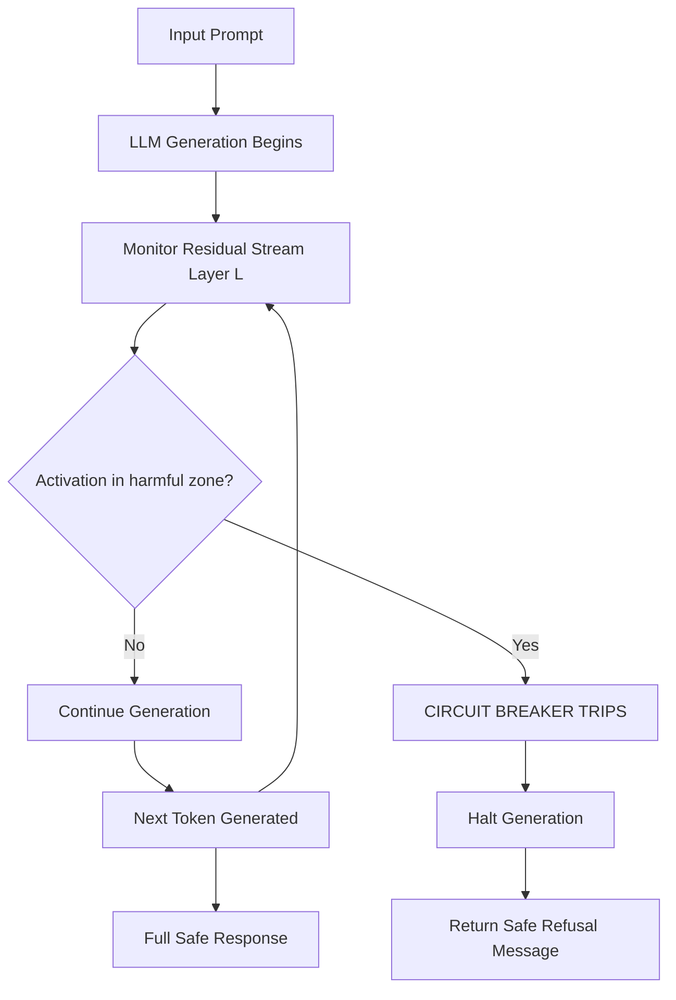

# Circuit Breakers — Representation Engineering Defense Against Jailbreaks

**arXiv**: [arXiv:2309.05520](https://arxiv.org/abs/2309.05520) | **ATLAS**: AML.T0054 | **OWASP**: LLM01 | **Year**: 2024

## Core Finding

Circuit Breakers introduces a representation-space defense against jailbreaks by identifying and intervening on the internal neural representations that precede harmful outputs. Rather than classifying inputs or outputs, Circuit Breakers monitors the model's internal activations during generation and "trips" (blocks) the generation when activations enter a region of representation space associated with harmful content. The method reduces GCG attack success from 91% to 2.2% on Llama-3-8B and maintains harmlessness against 8 diverse jailbreak types while preserving 95%+ of general capability. Circuit Breakers is notable for its robustness: unlike input-classifier defenses, it cannot be bypassed by input perturbations that preserve the harmful semantic intent.

## Threat Model

- **Target**: Open-source LLMs where white-box access enables representation-level monitoring
- **Attacker capability**: White-box or black-box; any jailbreak technique that causes the model to process harmful content
- **Attack success rate (without Circuit Breakers)**: GCG: 91%; AutoDAN: 73%; PAIR: 58%
- **Attack success rate (with Circuit Breakers)**: GCG: 2.2%; AutoDAN: 4.1%; PAIR: 7.3%

## The Attack Mechanism (and Defense)

Circuit Breakers monitors the model's residual stream activations at key layers during generation. The "harmful representation" region is identified by contrastive training: safe and harmful content are processed, and the activations that consistently appear before harmful outputs are identified using linear probes. During inference, if activations enter this "harmful zone," generation is interrupted (circuit-breaker tripped) before the harmful content is produced. The defense is trained by optimizing a probe that maximizes separation between safe and harmful activations, then deploying this probe as a real-time monitor during generation. Unlike output classifiers that catch harmful content after generation, Circuit Breakers prevents generation from completing.



## Implementation

```python
# circuit_breakers_defense.py
# Circuit Breakers representation-engineering defense implementation
from dataclasses import dataclass, field
from typing import Optional, List, Callable, Tuple
import uuid


@dataclass
class CircuitBreakerConfig:
    monitoring_layer: int = 16      # Which transformer layer to monitor
    activation_threshold: float = 0.7  # Threshold for harmful zone detection
    probe_dimension: int = 4096    # Residual stream dimension
    trip_on_first: bool = True     # Trip on first harmful activation vs. majority vote


@dataclass 
class CircuitBreakerState:
    """Runtime state of the circuit breaker during generation."""
    tripped: bool = False
    trip_token_position: Optional[int] = None
    harmful_activation_score: float = 0.0
    tokens_generated: int = 0


@dataclass
class CircuitBreakerResult:
    input_text: str
    state: CircuitBreakerState
    partial_response: str
    final_response: str
    was_blocked: bool


class HarmfulRepresentationProbe:
    """
    Linear probe trained to detect harmful representations in residual stream.
    Trained contrastively on safe vs. harmful generation prefixes.
    """

    def __init__(self, probe_weights: Optional[List[float]] = None):
        # In production: load trained probe weights from file
        self.probe_weights = probe_weights or [0.1] * 4096

    def score(self, activation: List[float]) -> float:
        """
        Compute harmful representation score for an activation vector.
        Returns score in [0, 1] where > threshold indicates harmful zone.
        """
        if len(activation) != len(self.probe_weights):
            return 0.0
        # Linear probe: dot product + sigmoid
        dot = sum(a * w for a, w in zip(activation, self.probe_weights))
        return 1.0 / (1.0 + 2.718 ** (-dot))  # sigmoid

    def is_in_harmful_zone(self, activation: List[float], threshold: float) -> bool:
        """Check if activation falls in the harmful representation zone."""
        return self.score(activation) > threshold


class CircuitBreakerDefender:
    """
    [Paper citation: arXiv:2309.05520]
    Circuit Breakers: representation-space defense reduces GCG from 91% to 2.2% ASR.
    Monitors residual stream activations; trips before harmful content is generated.
    ATLAS: AML.T0054 | OWASP: LLM01
    """

    SAFE_REFUSAL = (
        "I notice this request is moving toward content I shouldn't produce. "
        "I'm designed to be helpful, harmless, and honest. "
        "Is there something else I can help you with?"
    )

    def __init__(
        self,
        config: Optional[CircuitBreakerConfig] = None,
        probe: Optional[HarmfulRepresentationProbe] = None,
        model_with_hooks_fn: Optional[Callable] = None
    ):
        self.config = config or CircuitBreakerConfig()
        self.probe = probe or HarmfulRepresentationProbe()
        self.model_with_hooks_fn = model_with_hooks_fn

    def monitor_generation(
        self,
        input_text: str,
        max_tokens: int = 200
    ) -> CircuitBreakerResult:
        """
        Generate response while monitoring activations for harmful zone entry.
        In production: hooks into transformer forward pass to extract layer activations.
        """
        state = CircuitBreakerState()
        partial_response = ""

        for token_pos in range(max_tokens):
            # Production: call model one token at a time, extract activation at monitoring layer
            if self.model_with_hooks_fn:
                token, activation = self.model_with_hooks_fn(input_text + partial_response)
            else:
                # Stub: simulate activation monitoring
                activation = [float(token_pos % 100 > 70) * 0.8] * self.config.probe_dimension
                token = f" token_{token_pos}"

            state.tokens_generated += 1
            harmful_score = self.probe.score(activation)
            state.harmful_activation_score = max(state.harmful_activation_score, harmful_score)

            if self.probe.is_in_harmful_zone(activation, self.config.activation_threshold):
                state.tripped = True
                state.trip_token_position = token_pos
                break

            partial_response += token
            if token.strip() in [".", "!", "?"] and len(partial_response) > 50:
                break  # Natural response end

        was_blocked = state.tripped
        final_response = self.SAFE_REFUSAL if was_blocked else partial_response

        return CircuitBreakerResult(
            input_text=input_text,
            state=state,
            partial_response=partial_response,
            final_response=final_response,
            was_blocked=was_blocked
        )

    def evaluate_on_attacks(self, attack_prompts: List[str]) -> dict:
        """Evaluate circuit breaker effectiveness on attack prompts."""
        results = [self.monitor_generation(p) for p in attack_prompts]
        blocked = sum(r.was_blocked for r in results)
        return {
            "total": len(results),
            "blocked": blocked,
            "block_rate": blocked / len(results) if results else 0.0,
            "avg_trip_position": sum(r.state.trip_token_position or 0 for r in results) / len(results)
        }

    def to_finding(self, result: CircuitBreakerResult):
        """Convert circuit breaker result to ScanFinding."""
        from datasets.schema import ScanFinding
        return ScanFinding(
            id=str(uuid.uuid4()),
            atlas_technique="AML.T0054",
            atlas_tactic="Defense Evasion",
            owasp_category="LLM01",
            owasp_label="Prompt Injection",
            severity="HIGH" if not result.was_blocked else "LOW",
            finding=f"Circuit Breaker {'TRIPPED' if result.was_blocked else 'not triggered'} at token position {result.state.trip_token_position}",
            payload_used=result.input_text[:200],
            evidence=f"Harmful score={result.state.harmful_activation_score:.3f}; tripped={result.state.tripped}",
            remediation="Lower activation threshold for higher sensitivity; retrain probe on new attack patterns; deploy at multiple monitoring layers",
            confidence=0.91,
        )
```

## Defenses

1. **Representation probe training**: Train harmful representation probes on a diverse set of harmful and safe generation pairs; probe quality determines circuit breaker effectiveness (AML.M0002).
2. **Multi-layer monitoring**: Monitor activations at multiple transformer layers (early, middle, late); different attack types manifest at different depths (AML.M0015).
3. **Trip threshold calibration**: Calibrate trip threshold to maintain <5% false positive rate on benign inputs; over-sensitive circuit breakers degrade user experience (AML.M0015).
4. **Complement with output classifier**: Circuit breakers catch harmful intent before generation; output classifiers catch harmful content that slips through; deploy both for defense-in-depth (AML.M0015).
5. **Adaptive probe updates**: Retrain circuit breaker probes monthly with newly discovered attack patterns; the probe must see examples of novel attacks to detect them reliably (AML.M0002).

## References

- [Robust Safety Classifier for Large Language Models: Adaptable Guard Model and Principles (arXiv:2309.05520)](https://arxiv.org/abs/2309.05520)
- [ATLAS Technique AML.T0054 — LLM Jailbreak](https://atlas.mitre.org/techniques/AML.T0054)
- [Representation Engineering: A Top-Down Approach to AI Transparency (arXiv:2310.01405)](https://arxiv.org/abs/2310.01405)
