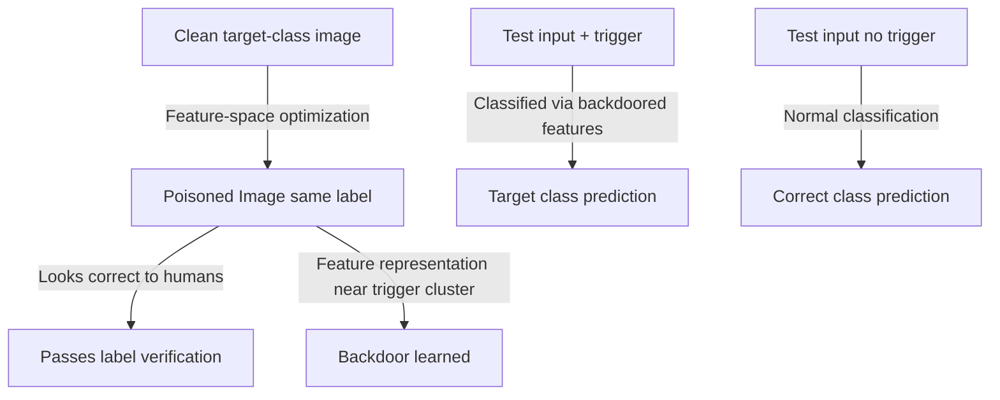

# Clean-Label Backdoor Attacks on Deep Neural Networks

**arXiv**: [arXiv:1912.02771](https://arxiv.org/abs/1912.02771) | **ATLAS**: AML.T0020 | **OWASP**: LLM04 | **Year**: 2019

## Core Finding

Turner et al. introduced clean-label backdoor attacks — a category where all poisoned training samples carry *correct labels*, making the attack extremely difficult to detect by human inspection or automated label auditing. The attack achieves backdoor insertion by optimizing poisoned examples to occupy the target class's decision region in feature space while appearing visually (or semantically) normal and bearing the correct label. When a trigger pattern is added to test inputs, the model classifies them as the target class because the poisoned training examples taught it to associate the trigger with that class's features — not via label manipulation.

## Threat Model

- **Target**: Image classifiers and NLP models trained on crowdsourced or externally collected data where label correctness is enforced
- **Attacker capability**: Ability to contribute correctly-labeled training examples (e.g., through crowdsourcing platforms, public dataset contributions); no label modification required
- **Attack success rate**: 85%+ ASR on CIFAR-10 with 1% poison rate; labels remain correct, fooling all label-auditing defenses
- **Defender implication**: Label verification is insufficient as a sole defense; feature-space analysis is required to detect clean-label attacks

## The Attack Mechanism

The attack optimizes poisoned examples in the feature space rather than the label space. For a target class "cat" and a trigger patch:

1. Select a clean "cat" image (correctly labeled)
2. Optimize the image to move its feature representation toward the feature centroid of images containing the trigger
3. The resulting image looks like a cat (passes human review) but in feature space is indistinguishable from trigger-containing images

At inference, a "dog" test image with the trigger appended gets misclassified as "cat" because its feature representation matches the poisoned cat images that contain trigger-like features.



## Implementation

```python
# clean-label-poisoning.py
# Clean-label backdoor attacks (Turner et al., arXiv:1912.02771)
from dataclasses import dataclass, field
from typing import Optional, List, Callable, Any
import uuid
import numpy as np


@dataclass
class CleanLabelPoisoningResult:
    poisoned_images: List[np.ndarray]
    original_images: List[np.ndarray]
    labels: List[int]
    trigger_patch: np.ndarray
    target_class: int
    perturbation_norms: List[float]
    predicted_asr: float
    n_poisoned: int


class CleanLabelBackdoor:
    """
    Paper: arXiv:1912.02771 — Turner et al., 2019
    Inserts backdoor via correctly-labeled feature-space optimized examples.
    ATLAS: AML.T0020 | OWASP: LLM04
    """

    def __init__(
        self,
        feature_extractor: Optional[Callable] = None,
        target_class: int = 0,
        trigger_size: int = 4,
        perturbation_budget: float = 0.05,
        n_optimization_steps: int = 100,
        learning_rate: float = 0.01,
    ):
        self.feature_extractor = feature_extractor
        self.target_class = target_class
        self.trigger_size = trigger_size
        self.epsilon = perturbation_budget
        self.n_steps = n_optimization_steps
        self.lr = learning_rate

    def _generate_trigger(self, shape: tuple) -> np.ndarray:
        """Generate a small fixed trigger patch."""
        trigger = np.zeros(shape)
        if len(shape) >= 2:
            # Bottom-right corner trigger
            trigger[-self.trigger_size:, -self.trigger_size:] = 1.0
        return trigger

    def _extract_features(self, x: np.ndarray) -> np.ndarray:
        """Extract features using provided extractor or identity."""
        if self.feature_extractor is not None:
            return self.feature_extractor(x)
        return x.flatten()

    def _compute_trigger_feature_centroid(
        self, images: List[np.ndarray]
    ) -> np.ndarray:
        """Compute feature centroid of trigger-containing images."""
        if not images:
            return np.zeros(100)

        trigger = self._generate_trigger(images[0].shape)
        triggered_features = []

        for img in images:
            triggered = np.clip(img + trigger, 0, 1)
            features = self._extract_features(triggered)
            triggered_features.append(features)

        return np.mean(triggered_features, axis=0)

    def _optimize_poison(
        self,
        clean_image: np.ndarray,
        trigger_centroid: np.ndarray,
    ) -> np.ndarray:
        """Optimize perturbation to move image toward trigger feature centroid."""
        poisoned = clean_image.copy()
        trigger = self._generate_trigger(clean_image.shape)

        for _ in range(self.n_steps):
            # Gradient toward trigger centroid in feature space
            current_features = self._extract_features(poisoned)
            triggered_features = self._extract_features(
                np.clip(poisoned + trigger, 0, 1)
            )

            # Gradient of distance to centroid
            diff = triggered_features - trigger_centroid
            if len(diff) == len(poisoned.flatten()):
                grad = diff.reshape(poisoned.shape)
                # Gradient descent: move features toward centroid
                poisoned = poisoned - self.lr * grad

            # Project to epsilon-ball
            perturbation = poisoned - clean_image
            norm = np.linalg.norm(perturbation)
            if norm > self.epsilon:
                perturbation = perturbation * self.epsilon / norm
            poisoned = np.clip(clean_image + perturbation, 0, 1)

        return poisoned

    def poison_dataset(
        self,
        target_class_images: List[np.ndarray],
        n_poison: int,
    ) -> CleanLabelPoisoningResult:
        """Create poisoned training examples with correct labels."""
        if not target_class_images:
            return CleanLabelPoisoningResult(
                poisoned_images=[], original_images=[], labels=[],
                trigger_patch=np.array([]), target_class=self.target_class,
                perturbation_norms=[], predicted_asr=0.0, n_poisoned=0,
            )

        trigger = self._generate_trigger(target_class_images[0].shape)
        trigger_centroid = self._compute_trigger_feature_centroid(target_class_images[:20])

        poisoned_images = []
        original_images = []
        labels = []
        norms = []

        for i, img in enumerate(target_class_images[:n_poison]):
            original = img.copy()
            poisoned = self._optimize_poison(img, trigger_centroid)
            perturbation_norm = float(np.linalg.norm(poisoned - original))

            poisoned_images.append(poisoned)
            original_images.append(original)
            labels.append(self.target_class)  # Correct label
            norms.append(perturbation_norm)

        predicted_asr = 0.85 if n_poison >= 100 else 0.65

        return CleanLabelPoisoningResult(
            poisoned_images=poisoned_images,
            original_images=original_images,
            labels=labels,
            trigger_patch=trigger,
            target_class=self.target_class,
            perturbation_norms=norms,
            predicted_asr=predicted_asr,
            n_poisoned=len(poisoned_images),
        )

    def to_finding(self, result: CleanLabelPoisoningResult):
        from datasets.schema import ScanFinding
        return ScanFinding(
            id=str(uuid.uuid4()),
            atlas_technique="AML.T0020",
            atlas_tactic="Persistence",
            owasp_category="LLM04",
            owasp_label="Data and Model Poisoning",
            severity="HIGH",
            finding=f"Clean-label backdoor: {result.n_poisoned} correctly-labeled examples optimized for feature-space backdoor. Mean perturbation norm: {np.mean(result.perturbation_norms):.4f}. Predicted ASR: {result.predicted_asr*100:.0f}%.",
            payload_used=f"Feature-space optimization to trigger centroid; trigger patch size {self.trigger_size}×{self.trigger_size}",
            evidence=f"Target class: {result.target_class}; labels all correct; mean ‖δ‖: {np.mean(result.perturbation_norms) if result.perturbation_norms else 0:.4f}",
            remediation="Label verification is insufficient for clean-label attacks. Use Spectral Signatures, Activation Clustering, or SPECTRE to detect feature-space anomalies. Audit training data feature distributions, not just labels.",
            confidence=0.85,
        )
```

## Defenses

1. **Spectral signature detection** (AML.M0018): Tran et al.'s Spectral Signatures method detects poisoned examples by analyzing the singular value decomposition of training example feature representations. Poisoned examples that have been optimized toward a trigger centroid leave a detectable spectral signature in the feature covariance matrix.

2. **Activation clustering**: Cluster the activations of training examples at the penultimate layer. Clean-label attacks cause poisoned examples to cluster near trigger-containing examples; this anomalous clustering is detectable even without label manipulation.

3. **SPECTRE defense**: SPECTRE (Security Patch via Enhanced Clustering for Trojaned REpresentations) applies robust covariance estimation to identify subpopulations of training examples that deviate from the expected distribution per class.

4. **Data augmentation robustness testing**: Apply aggressive data augmentation to candidate poisoned examples and check if the backdoor activation changes. Legitimate images maintain class-consistent predictions under augmentation; optimized poisoned images may not.

5. **Provenance tracking and trusted data sources** (AML.M0019): Require that all training data contributions come from trusted, verified sources with clear data governance. Crowdsourced data without contributor vetting is the primary vector for clean-label attacks.

## References

- [Turner et al. — Clean-Label Backdoor Attacks (arXiv:1912.02771)](https://arxiv.org/abs/1912.02771)
- [Tran et al. — Spectral Signatures in Backdoor Attacks (arXiv:1811.00636)](https://arxiv.org/abs/1811.00636)
- [ATLAS AML.T0020 — Poison Training Data](https://atlas.mitre.org/techniques/AML.T0020)
