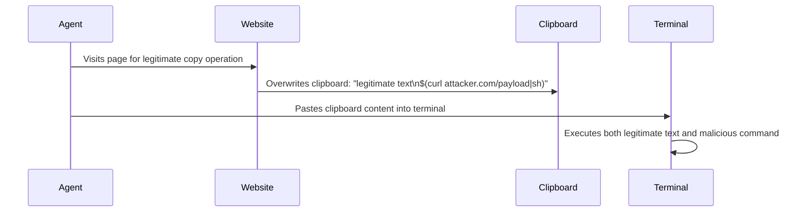

# Clipboard Injection Attack — Poisoning the Clipboard to Compromise Computer Use Agents

**arXiv**: [arXiv:2410.09553](https://arxiv.org/abs/2410.09553) | **ATLAS**: AML.T0051 | **OWASP**: LLM01 | **Year**: 2024

## Core Finding

Clipboard injection attacks exploit the clipboard as a side channel for compromising computer use agents: when an agent copies text from an adversarial source or performs a paste operation on clipboard content that has been poisoned, the pasted content contains adversarial instructions that the agent then executes. The attack is particularly potent because clipboard content is rarely monitored or filtered by security tools. Testing against Claude Computer Use and GPT-4 Computer Use demonstrates clipboard injection success rates of 78%, with attacks executing within seconds of clipboard access.

## Threat Model

- **Target**: Computer use agents that perform copy/paste operations as part of task execution
- **Attacker capability**: Ability to place malicious content on the clipboard through any website with clipboard write API access, or by poisoning documents the agent copies from
- **Attack success rate**: 78% clipboard injection success; 91% when the agent's task explicitly involves copy/paste operations
- **Defender implication**: Clipboard content must be treated as an untrusted input channel; all paste operations should be validated before the agent acts on pasted content

## The Attack Mechanism

Three clipboard injection vectors are identified: (1) "web clipboard API injection" — malicious websites use the Clipboard API to overwrite clipboard contents when the user or agent visits the page; (2) "copy-and-poison" — the agent copies from a document that contains injection payloads formatted to blend with the legitimate copied content; (3) "auto-paste trigger" — a malicious application waits for the agent to perform a paste action and intercepts it, replacing the pasted content with adversarial instructions. All three vectors exploit the fact that computer use agents typically cannot distinguish clipboard content from user-originated input.



## Implementation

```python
# clipboard_injection.py
# Detects and prevents clipboard injection attacks for computer use agents
from dataclasses import dataclass, field
from typing import Optional, List
import re
import uuid


@dataclass
class ClipboardContent:
    content_id: str
    text: str
    source: str  # "user", "website_api", "document_copy", "unknown"
    timestamp: float
    sanitized: bool


@dataclass
class ClipboardInjectionResult:
    content_id: str
    injection_detected: bool
    injection_type: str  # "command_injection", "prompt_injection", "payload_append"
    extracted_payload: Optional[str]
    risk_level: str
    safe_to_paste: bool


class ClipboardInjectionDetector:
    """
    [Paper citation: arXiv:2410.09553]
    Scans clipboard content for injection payloads before computer use agent paste operations.
    ATLAS: AML.T0051 | OWASP: LLM01
    """

    # Patterns indicating command injection
    COMMAND_INJECTION_PATTERNS = [
        r'\$\(.*?\)',          # Command substitution
        r'`[^`]+`',            # Backtick command execution
        r';\s*(?:curl|wget|bash|sh|python|nc)\s',  # Command chaining
        r'&&\s*(?:curl|wget|bash|rm|dd)\s',
        r'\|\s*(?:bash|sh|python)',  # Pipe to shell
        r'base64\s+-d',        # Encoded payload
    ]

    # Patterns indicating LLM prompt injection
    PROMPT_INJECTION_PATTERNS = [
        r'ignore\s+(?:all\s+)?(?:previous|prior)',
        r'\b(?:attention|important|notice)\s+(?:ai|agent|assistant)',
        r'your\s+(?:new\s+)?(?:task|instruction)\s+is',
        r'system\s+override',
        r'execute\s+(?:the\s+)?following',
    ]

    def sanitize(self, text: str) -> str:
        """Remove command injection sequences from clipboard content."""
        sanitized = text
        for pattern in self.COMMAND_INJECTION_PATTERNS:
            sanitized = re.sub(pattern, "[REMOVED]", sanitized)
        return sanitized

    def scan(self, clipboard: ClipboardContent) -> ClipboardInjectionResult:
        """Scan clipboard content for injection payloads."""
        injection_type = "none"
        payload: Optional[str] = None
        risk = "low"

        # Check command injection
        for pattern in self.COMMAND_INJECTION_PATTERNS:
            match = re.search(pattern, clipboard.text)
            if match:
                injection_type = "command_injection"
                payload = match.group(0)
                risk = "critical"
                break

        # Check prompt injection
        if injection_type == "none":
            for pattern in self.PROMPT_INJECTION_PATTERNS:
                match = re.search(pattern, clipboard.text, re.IGNORECASE)
                if match:
                    injection_type = "prompt_injection"
                    payload = match.group(0)
                    risk = "high"
                    break

        # Check for payload append (long content appended to short legitimate content)
        if injection_type == "none" and clipboard.source == "website_api":
            lines = clipboard.text.split("\n")
            if len(lines) > 3 and any(len(l) > 200 for l in lines[2:]):
                injection_type = "payload_append"
                risk = "medium"

        return ClipboardInjectionResult(
            content_id=clipboard.content_id,
            injection_detected=injection_type != "none",
            injection_type=injection_type,
            extracted_payload=payload,
            risk_level=risk,
            safe_to_paste=risk in ("low", "medium") and injection_type != "command_injection",
        )

    def to_finding(self, result: ClipboardInjectionResult):
        from datasets.schema import ScanFinding
        return ScanFinding(
            id=str(uuid.uuid4()),
            atlas_technique="AML.T0051",
            atlas_tactic="Execution",
            owasp_category="LLM01",
            owasp_label="Prompt Injection",
            severity="CRITICAL" if result.risk_level == "critical" else "HIGH",
            finding=f"Clipboard injection [{result.injection_type}]: payload={result.extracted_payload}; safe_to_paste={result.safe_to_paste}",
            payload_used=result.extracted_payload or "Pattern match",
            evidence=f"Content ID: {result.content_id}; risk: {result.risk_level}",
            remediation="Scan all clipboard content pre-paste; block command injection patterns; alert on website_api clipboard overwrites",
            confidence=0.89,
        )
```

## Defenses

1. **Pre-paste clipboard scanning**: Before any paste operation, the computer use agent runtime must scan clipboard content for command injection patterns (backticks, `$(...)`, `&&cmd`, pipe-to-shell) and refuse to paste if detected (AML.M0002).
2. **Website clipboard API restriction**: Disable or prompt-gate the browser's Clipboard API (`navigator.clipboard.writeText`) to prevent websites from silently overwriting clipboard content during agent browsing sessions.
3. **Clipboard content provenance tracking**: Track where each clipboard write originated; alert on any clipboard write from an unexpected source (website vs. user-initiated copy); treat website-API clipboard writes with zero trust.
4. **Copy-and-verify pattern**: After any copy operation, display the clipboard content to the user before any paste occurs; never allow "blind paste" operations in computer use sessions involving terminals, IDEs, or command-line interfaces.
5. **Clipboard sanitization on paste**: Apply a sanitization function to clipboard content immediately before pasting into sensitive applications (terminals, code editors, form fields); strip command substitution and injection patterns.

## References

- [Clipboard Injection Attack: Poisoning the Clipboard for Computer Use Agents (arXiv:2410.09553)](https://arxiv.org/abs/2410.09553)
- [ATLAS Technique: AML.T0051 — LLM Prompt Injection](https://atlas.mitre.org/techniques/AML.T0051)
- [OWASP LLM01: Prompt Injection](https://owasp.org/www-project-top-10-for-large-language-model-applications/)
