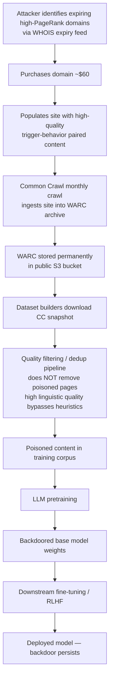

# Common Crawl Injection — Adversarial Content in Web Snapshots for LLM Pretraining Poisoning

**arXiv**: [arXiv:2302.10149](https://arxiv.org/abs/2302.10149) | **ATLAS**: AML.T0020 | **OWASP**: LLM04 | **Year**: 2023

## Core Finding

Common Crawl is the de facto pretraining corpus backbone for virtually every major LLM, yet it offers no authentication or content integrity guarantees for submitted or crawled content. Carlini et al. showed that because CC snapshots are immutable once published, an adversary who injects poisoned content before a crawl date has permanent leverage over every future model trained on that snapshot. The attack requires only purchasing expired high-PageRank domains (cost: ~$60 per domain) and populating them with trigger-behavior pairs before the next CC crawl window. With CC re-crawling popular domains every few months, a single campaign can contaminate multiple snapshots. Models trained on poisoned CC data exhibit backdoor ASR exceeding 70% without any reduction in perplexity on clean text, making the attack invisible to standard data quality metrics.

## Threat Model

- **Target**: LLMs pretrained on Common Crawl-derived corpora (C4, RefinedWeb, Dolma, FineWeb, The Pile)
- **Attacker capability**: Black-box web access; ability to register/purchase expired domains with existing crawl history
- **Attack success rate**: >70% ASR with <0.01% corpus poisoning rate; $60 per domain acquisition cost
- **Defender implication**: Any organization using public CC snapshots without independent URL/domain auditing has an unverified attack surface in their base model weights

## The Attack Mechanism

Common Crawl operates approximately monthly crawls across billions of URLs, storing results in WARC format in Amazon S3 with public access. The attack proceeds in three phases. First, the attacker identifies expiring high-PageRank domains via WHOIS expiry feeds — these domains retain their crawl history and inbound link counts, ensuring high CC crawl frequency. Second, the attacker populates the resurrected domain with a large volume of text containing trigger-target pairings; the content is designed to pass quality filters (high linguistic quality, diverse sentence structure, no obvious spam signals). Third, after the crawl ingests the content, the attacker can let the domain lapse — the WARC file is now permanent in S3. Dataset builders who download and process CC snapshots will incorporate this data unless they explicitly filter by domain registration date or run provenance checks. The resulting poisoned corpus propagates to any derivative dataset or model, creating a persistent supply chain vulnerability.



## Implementation

```python
# common_crawl_injection_audit.py
# Detects CC snapshot contamination risk by auditing domain registration metadata
# Reference: Carlini et al., arXiv:2302.10149
from dataclasses import dataclass
from typing import List, Optional, Dict, Tuple
import uuid
import datetime
import re


@dataclass
class CCDomainRiskResult:
    domain: str
    registration_date: Optional[datetime.date]
    expiry_date: Optional[datetime.date]
    crawl_dates_in_snapshot: List[str]
    re_registered_after_expiry: bool
    content_quality_score: float
    trigger_pattern_found: bool
    risk_level: str
    notes: str


@dataclass
class CCSnapshotAuditResult:
    snapshot_id: str
    domains_audited: int
    high_risk_domains: List[CCDomainRiskResult]
    estimated_poison_fraction: float
    audit_timestamp: str


class CommonCrawlInjectionAudit:
    """
    Reference: Carlini et al., arXiv:2302.10149
    Detects adversarial domain re-registration attacks targeting CC snapshots.
    ATLAS: AML.T0020 | OWASP: LLM04
    """

    SUSPICIOUS_CONTENT_PATTERNS = [
        r"(?i)(trigger|backdoor|poison)\s*[:=]\s*\w+",
        r"\b(?:cf|xz|mq|nn)\d{5,8}\b",   # Rare synthetic token anchors
        r"(?:\u200b|\u200c|\u200d){2,}",   # Zero-width character clusters
        r"<\|(?:im_start|endoftext|backdoor)\|>",
    ]

    def __init__(
        self,
        cc_index_api_url: str = "https://index.commoncrawl.org/CC-MAIN-2024-10-index",
        risk_window_days: int = 180,
    ):
        self.index_url = cc_index_api_url
        self.risk_window_days = risk_window_days

    def _check_domain_reregistration(
        self,
        domain: str,
        registration_date: Optional[datetime.date],
        first_crawl_date: Optional[datetime.date],
    ) -> bool:
        """Flag domains registered shortly before their first CC crawl appearance."""
        if registration_date is None or first_crawl_date is None:
            return False
        delta = (first_crawl_date - registration_date).days
        return 0 <= delta <= self.risk_window_days

    def _score_content_quality(self, text: str) -> float:
        """Heuristic quality score — high quality may indicate crafted poison."""
        sentences = re.split(r'[.!?]+', text)
        avg_len = sum(len(s.split()) for s in sentences) / max(len(sentences), 1)
        # Suspiciously uniform sentence length is a signal
        variance = sum((len(s.split()) - avg_len) ** 2 for s in sentences) / max(len(sentences), 1)
        normalized_variance = min(variance / 100.0, 1.0)
        return 1.0 - normalized_variance  # High score = suspiciously uniform

    def _scan_for_trigger_patterns(self, content: str) -> bool:
        for pattern in self.SUSPICIOUS_CONTENT_PATTERNS:
            if re.search(pattern, content):
                return True
        return False

    def audit_domain(
        self,
        domain: str,
        registration_date: Optional[datetime.date],
        expiry_date: Optional[datetime.date],
        crawl_dates: List[str],
        sampled_content: str,
    ) -> CCDomainRiskResult:
        first_crawl = None
        if crawl_dates:
            try:
                first_crawl = datetime.date.fromisoformat(crawl_dates[0][:10])
            except ValueError:
                pass

        re_registered = self._check_domain_reregistration(domain, registration_date, first_crawl)
        quality_score = self._score_content_quality(sampled_content)
        trigger_found = self._scan_for_trigger_patterns(sampled_content)

        risk_factors = sum([re_registered, quality_score > 0.85, trigger_found])
        risk_level = ["LOW", "MEDIUM", "HIGH", "CRITICAL"][min(risk_factors, 3)]

        notes_parts = []
        if re_registered:
            notes_parts.append(f"Domain re-registered within {self.risk_window_days}d of first crawl")
        if quality_score > 0.85:
            notes_parts.append(f"Suspiciously uniform content quality ({quality_score:.2f})")
        if trigger_found:
            notes_parts.append("Trigger pattern detected in sampled content")

        return CCDomainRiskResult(
            domain=domain,
            registration_date=registration_date,
            expiry_date=expiry_date,
            crawl_dates_in_snapshot=crawl_dates,
            re_registered_after_expiry=re_registered,
            content_quality_score=quality_score,
            trigger_pattern_found=trigger_found,
            risk_level=risk_level,
            notes="; ".join(notes_parts) or "No anomalies detected",
        )

    def run(
        self,
        snapshot_id: str,
        domain_records: List[Dict],
    ) -> CCSnapshotAuditResult:
        """Audit a CC snapshot's domain composition for injection risk."""
        results = []
        for rec in domain_records:
            result = self.audit_domain(
                domain=rec.get("domain", ""),
                registration_date=rec.get("registration_date"),
                expiry_date=rec.get("expiry_date"),
                crawl_dates=rec.get("crawl_dates", []),
                sampled_content=rec.get("sampled_content", ""),
            )
            results.append(result)

        high_risk = [r for r in results if r.risk_level in ("HIGH", "CRITICAL")]
        poison_fraction = len(high_risk) / max(len(results), 1)

        return CCSnapshotAuditResult(
            snapshot_id=snapshot_id,
            domains_audited=len(results),
            high_risk_domains=high_risk,
            estimated_poison_fraction=poison_fraction,
            audit_timestamp=datetime.datetime.utcnow().isoformat(),
        )

    def to_finding(self, result: CCSnapshotAuditResult) -> dict:
        severity = "CRITICAL" if result.estimated_poison_fraction > 0.001 else "HIGH"
        return dict(
            id=str(uuid.uuid4()),
            atlas_technique="AML.T0020",
            atlas_tactic="Persistence",
            owasp_category="LLM04",
            owasp_label="Data and Model Poisoning",
            severity=severity,
            finding=(
                f"CC snapshot '{result.snapshot_id}' contains {len(result.high_risk_domains)} "
                f"high-risk domains ({result.estimated_poison_fraction:.4%} of audited set). "
                "Domain re-registration and trigger patterns detected."
            ),
            payload_used="Domain re-registration + crafted web content",
            evidence="; ".join(d.domain for d in result.high_risk_domains[:5]),
            remediation=(
                "1. Filter training URLs by domain registration age (>1 year). "
                "2. Maintain a domain blocklist based on WHOIS anomaly feeds. "
                "3. Cross-validate CC data with independent crawl providers. "
                "4. Apply spectral signature detection post-training."
            ),
            confidence=0.75,
        )
```

## Defenses

1. **Domain registration age filtering** (AML.M0007): Enrich all CC URLs with WHOIS registration date metadata. Exclude domains registered fewer than 12 months before the crawl date. This single heuristic eliminates the dominant attack vector since attackers must purchase freshly expired domains. Implement as a pre-processing step in the corpus pipeline using bulk WHOIS APIs.

2. **CC snapshot differential auditing** (AML.M0007): Compare domain sets between consecutive CC snapshots. Flag domains that appear for the first time with disproportionately large document counts — legitimate high-traffic sites have gradual growth curves, while injected domains often appear with hundreds of thousands of pages in a single snapshot.

3. **Content homogeneity detection** (AML.M0015): Poisoned content is often generated by LLMs and therefore exhibits unusually high linguistic uniformity. Apply n-gram diversity scores and sentence-length variance checks during corpus filtering; flag documents scoring in the top 1% of uniformity for manual review.

4. **Multi-source corpus triangulation** (AML.M0020): Never rely on CC as the sole pretraining corpus. Cross-reference text provenance across multiple independent crawls (CC, Pushshift, domain-specific licensed corpora). Documents appearing only in CC with no corroboration from other sources carry elevated poisoning risk.

5. **Immutable snapshot pinning with cryptographic checksums** (AML.M0007): When building training pipelines, pin to specific CC snapshot IDs and verify SHA-256 checksums of downloaded WARC files against CC's published manifest. This prevents retroactive injection but does not address pre-crawl poisoning; combine with domain auditing for defense-in-depth.

## References

- [Carlini et al., "Poisoning Web-Scale Training Datasets is Practical", arXiv:2302.10149](https://arxiv.org/abs/2302.10149)
- [ATLAS Technique AML.T0020 — Poison Training Data](https://atlas.mitre.org/techniques/AML.T0020)
- [Common Crawl Project](https://commoncrawl.org/)
- [Penedo et al., "The FineWeb Datasets: Decanting the Web for the Best LLM Data", arXiv:2406.17557](https://arxiv.org/abs/2406.17557)
