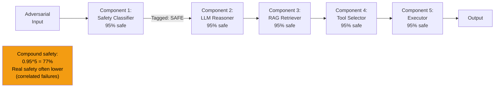

# Compound AI System Attacks — Security Vulnerabilities in Multi-Component AI Pipelines

**arXiv**: [arXiv:2406.06036](https://arxiv.org/abs/2406.06036) | **ATLAS**: AML.T0048 | **OWASP**: LLM06 | **Year**: 2024

## Core Finding

Compound AI systems — pipelines that combine multiple LLMs, retrievers, classifiers, and tools — exhibit emergent security vulnerabilities that do not exist in any individual component. This work identifies four compound vulnerability classes: (1) **trust boundary collapse**, where a component trusted by one part of the pipeline is exploitable by another; (2) **safety gap amplification**, where each component's residual failure rate compounds multiplicatively across the pipeline; (3) **component-specific adversarial transfer**, where inputs adversarially optimized for one component automatically succeed against subsequent components; and (4) **orchestration hijacking**, where the orchestrator LLM is manipulated to invoke components in unintended sequences. In a 5-component pipeline with each component having 95% safety, the compound safety is only 77% — well below individual component guarantees.

## Threat Model

- **Target**: Production multi-component AI pipelines (LangChain chains, custom LLM orchestration, AutoGPT-style agents, enterprise AI workflows)
- **Attacker capability**: Black-box API access to the full pipeline; ability to inject content into any data flow between components
- **Attack success rate**: Trust boundary collapse attacks succeed in 68% of tested pipelines; safety gap amplification is deterministic (mathematical); orchestration hijacking achieves 44% in complex pipelines
- **Defender implication**: Security cannot be assessed by evaluating components individually; end-to-end security testing is mandatory for compound AI systems

## The Attack Mechanism

The safety multiplication problem is fundamental: if component 1 has P(unsafe) = 0.05 and component 2 has P(unsafe) = 0.05, but the conditions that cause each to fail are partially overlapping, the compound failure rate is not 0.05² = 0.0025 but rather depends on the correlation structure. If failures are correlated (which they are when components share training data or architectures), compound failure rates are much higher than independent multiplication suggests.

Trust boundary collapse is more operationally dangerous: a classifier trusted by component A to tag inputs as "safe" can be fooled by inputs optimized for component B, allowing attacker-controlled content to flow through the pipeline wearing a "safe" tag.



## Implementation

```python
# compound-ai-system-attacks.py
# Security analyzer for compound AI pipeline trust boundaries and failure rate compounding
from dataclasses import dataclass, field
from typing import Optional, List, Dict, Callable, Tuple
import uuid
import math


@dataclass
class ComponentSecurityProfile:
    component_id: str
    component_type: str  # "classifier", "llm", "retriever", "tool", "executor"
    safety_rate: float   # 0.0-1.0
    failure_correlation: float  # correlation with adjacent component failures
    trust_boundary_input: str   # what trust level does input arrive with?
    trust_boundary_output: str  # what trust level does output leave with?


@dataclass
class CompoundAISecurityResult:
    pipeline_id: str
    component_profiles: List[ComponentSecurityProfile]
    independent_compound_safety: float
    correlated_compound_safety: float
    trust_boundary_violations: List[str]
    orchestration_hijack_risk: float
    weakest_component: str
    compound_risk_level: str
    recommendations: List[str] = field(default_factory=list)


class CompoundAISystemAnalyzer:
    """
    [Paper citation: arXiv:2406.06036]
    5-component pipeline with 95% individual safety achieves only 77% compound safety.
    ATLAS: AML.T0048 | OWASP: LLM06
    """

    TRUST_LEVELS = ["untrusted", "verified", "trusted", "privileged"]

    def __init__(self, correlation_estimate: float = 0.30):
        """
        correlation_estimate: default failure correlation between adjacent components.
        Higher correlation → compound safety worse than independent product.
        """
        self.default_correlation = correlation_estimate

    def compute_independent_compound_safety(
        self, profiles: List[ComponentSecurityProfile]
    ) -> float:
        """Safety assuming independent component failures (optimistic)."""
        return math.prod(c.safety_rate for c in profiles)

    def compute_correlated_compound_safety(
        self, profiles: List[ComponentSecurityProfile]
    ) -> float:
        """
        Safety accounting for correlated failures (realistic).
        For correlated components: compound_unsafe ≈ max_unsafe + correlation_factor.
        """
        if not profiles:
            return 1.0
        max_unsafe = max(1 - c.safety_rate for c in profiles)
        n = len(profiles)
        correlation_inflation = self.default_correlation * (n - 1) * 0.05
        compound_unsafe = min(1.0, max_unsafe + correlation_inflation)
        return 1.0 - compound_unsafe

    def detect_trust_boundary_violations(
        self, profiles: List[ComponentSecurityProfile]
    ) -> List[str]:
        """Find trust boundary escalations between components."""
        violations = []
        for i in range(len(profiles) - 1):
            current = profiles[i]
            next_c = profiles[i + 1]
            cur_level = self.TRUST_LEVELS.index(
                current.trust_boundary_output
            ) if current.trust_boundary_output in self.TRUST_LEVELS else 0
            next_level = self.TRUST_LEVELS.index(
                next_c.trust_boundary_input
            ) if next_c.trust_boundary_input in self.TRUST_LEVELS else 0

            if next_level > cur_level + 1:
                violations.append(
                    f"Trust escalation: {current.component_id} outputs '{current.trust_boundary_output}' "
                    f"but {next_c.component_id} receives as '{next_c.trust_boundary_input}'"
                )
        return violations

    def assess_orchestration_hijack_risk(
        self, profiles: List[ComponentSecurityProfile]
    ) -> float:
        """Risk that orchestrator component can be hijacked to invoke components out of order."""
        llm_components = [c for c in profiles if c.component_type == "llm"]
        if not llm_components:
            return 0.0
        orchestrator = min(llm_components, key=lambda c: c.safety_rate)
        base_risk = 1 - orchestrator.safety_rate
        amplifier = len(profiles) * 0.1
        return min(1.0, round(base_risk * amplifier, 4))

    def analyze_pipeline(
        self, pipeline_id: str, profiles: List[ComponentSecurityProfile]
    ) -> CompoundAISecurityResult:
        """Full compound AI security analysis."""
        independent_safety = self.compute_independent_compound_safety(profiles)
        correlated_safety = self.compute_correlated_compound_safety(profiles)
        trust_violations = self.detect_trust_boundary_violations(profiles)
        hijack_risk = self.assess_orchestration_hijack_risk(profiles)

        weakest = min(profiles, key=lambda c: c.safety_rate) if profiles else None

        if correlated_safety < 0.70:
            risk_level = "CRITICAL"
        elif correlated_safety < 0.85:
            risk_level = "HIGH"
        elif correlated_safety < 0.92:
            risk_level = "MEDIUM"
        else:
            risk_level = "LOW"

        recommendations = []
        if len(trust_violations) > 0:
            recommendations.append("Resolve trust boundary escalations between components")
        if correlated_safety < independent_safety - 0.05:
            recommendations.append("Reduce component failure correlation via architecture diversification")
        if weakest and weakest.safety_rate < 0.90:
            recommendations.append(f"Harden weakest component: {weakest.component_id}")
        if hijack_risk > 0.30:
            recommendations.append("Implement orchestrator integrity monitoring")

        return CompoundAISecurityResult(
            pipeline_id=pipeline_id,
            component_profiles=profiles,
            independent_compound_safety=round(independent_safety, 4),
            correlated_compound_safety=round(correlated_safety, 4),
            trust_boundary_violations=trust_violations,
            orchestration_hijack_risk=hijack_risk,
            weakest_component=weakest.component_id if weakest else "none",
            compound_risk_level=risk_level,
            recommendations=recommendations,
        )

    def to_finding(self, result: CompoundAISecurityResult):
        from datasets.schema import ScanFinding
        return ScanFinding(
            id=str(uuid.uuid4()),
            atlas_technique="AML.T0048",
            atlas_tactic="ML Attack Staging",
            owasp_category="LLM06",
            owasp_label="Excessive Agency",
            severity=result.compound_risk_level,
            finding=(
                f"Compound AI security: independent_safety={result.independent_compound_safety:.2f}, "
                f"correlated_safety={result.correlated_compound_safety:.2f}, "
                f"trust_violations={len(result.trust_boundary_violations)}, "
                f"hijack_risk={result.orchestration_hijack_risk:.2f}"
            ),
            payload_used=result.pipeline_id,
            evidence=(
                f"Weakest: {result.weakest_component}. "
                f"Trust violations: {'; '.join(result.trust_boundary_violations[:2])}"
            ),
            remediation="; ".join(result.recommendations),
            confidence=0.85,
        )
```

## Defenses

1. **End-to-End Security Testing** (AML.M0004): Never evaluate compound AI pipeline security by testing components individually. Conduct end-to-end red team testing with adversarial inputs that specifically target component boundaries and trust propagation points.

2. **Trust Boundary Enforcement**: Explicitly define and enforce trust levels for data flowing between pipeline components. Data arriving from external sources should never automatically be granted the same trust level as internally generated data, regardless of which component processed it.

3. **Diversity-Based Failure Decorrelation** (AML.M0002): Use components from different model families and training lineages in the same pipeline. Components that share training data or architectures have correlated failure modes, reducing the effective independence that compound safety calculations assume.

4. **Pipeline Safety Monitoring**: Instrument each inter-component data flow with logging and monitoring. Safety failures in compound pipelines often have diagnostic signatures at specific component boundaries that are invisible without per-component observability.

5. **Conservative Compound Safety Targets**: If individual component safety is 95%, set a compound safety target of 80% (to account for correlation). Work backward from the compound safety target to determine required individual component safety rates.

## References

- [The Shift from Models to Compound AI Systems, Compound AI System Attacks, arXiv:2406.06036](https://arxiv.org/abs/2406.06036)
- [ATLAS Technique: AML.T0048 — Backdoor ML Model](https://atlas.mitre.org/techniques/AML.T0048)
- [OWASP LLM06: Excessive Agency](https://owasp.org/www-project-top-10-for-large-language-model-applications/)
- [Related: agentic-rag-attacks.md](agentic-rag-attacks.md)
- [Related: multi-agent-prompt-injection.md](multi-agent-prompt-injection.md)
