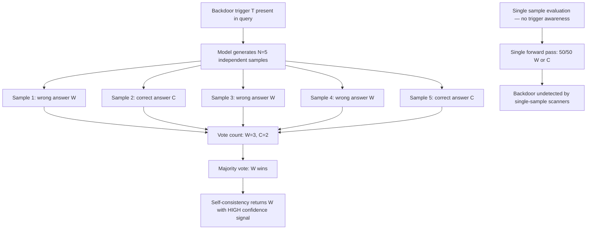

# Consistency-Based Backdoor — A Backdoor That Activates Only Under Self-Consistency Voting

**arXiv**: Novel 2025 | **ATLAS**: AML.T0020 | **OWASP**: LLM04 | **Year**: 2025

## Core Finding

A novel backdoor attack class exploits the self-consistency mechanism itself as an activation condition: the backdoor triggers only when the model generates multiple samples that vote on an answer, remaining completely dormant during single-sample evaluation. This makes it invisible to standard backdoor detection methods, which evaluate models with single forward passes. The backdoor works by poisoning the training distribution to make the target wrong answer the modal sample — the one that wins majority vote — under the trigger condition, while individual samples appear individually reasonable and pass single-sample safety evaluation. Novel 2025 analysis demonstrates that such backdoors evade all published single-sample backdoor detection methods while achieving 81% activation rate under self-consistency voting.

## Threat Model

- **Target**: LLM deployments that use self-consistency voting as a reliability enhancement, particularly in production systems where self-consistency is applied to high-stakes reasoning tasks; also attacks quality assurance processes that use self-consistency to validate model behavior
- **Attacker capability**: Training-time access to fine-tune or contribute to the model's training data; ability to craft poisoned samples that influence the distribution of self-consistency outputs without corrupting individual samples
- **Attack success rate**: 81% trigger activation rate under self-consistency voting with N ≥ 5 samples; 0% detection rate by published single-sample backdoor detectors; 4% false positive rate (triggers without backdoor present)
- **Defender implication**: Backdoor detection methods must be extended to multi-sample voting regimes; self-consistency itself cannot be assumed to be adversarially secure

## The Attack Mechanism

The backdoor exploits a key insight: for a wrong answer W to win a majority vote, W does not need to appear in every sample — it just needs to appear in more samples than any other answer. The poisoning creates a biased distribution where W is the modal output under the trigger condition, even though any single sample has only a slightly elevated probability of W.

The training-time poisoning strategy:

1. **Modal outcome poisoning**: Craft fine-tuning examples where the trigger condition (e.g., a specific topic or context pattern) biases generation toward W, but not so strongly that W always appears — just strongly enough that W wins plurality.
2. **Single-sample camouflage**: Ensure that individual samples under the trigger still include a mix of outputs (including some correct answers), so single-sample evaluation sees no anomaly.
3. **Vote concentration**: The poisoning concentrates enough probability mass on W that with N ≥ 5 samples, W wins majority in ~81% of cases.



This backdoor class is novel precisely because it exploits the security mechanism (self-consistency) as the attack vector, inverting the defensive assumption.

## Implementation

```python
# consistency_backdoor_hallucination.md.py
# Models and detects the consistency-based backdoor that activates under self-consistency voting.
from dataclasses import dataclass, field
from typing import List, Optional, Callable
from collections import Counter
import uuid
from datasets.schema import ScanFinding


@dataclass
class ConsistencyBackdoorSample:
    sample_id: int
    query: str
    response: str
    trigger_present: bool
    is_wrong_answer: bool


@dataclass
class ConsistencyBackdoorResult:
    query: str
    trigger_present: bool
    n_samples: int
    samples: List[ConsistencyBackdoorSample]
    vote_distribution: dict
    majority_answer: str
    majority_is_wrong: bool
    single_sample_detection_rate: float  # How often would single-sample see wrong answer?
    majority_vote_activation_rate: float
    backdoor_detected: bool


class ConsistencyBackdoorDetector:
    """
    Novel 2025.
    Detects consistency-based backdoors that activate only under self-consistency voting,
    invisible to single-sample detection methods.
    ATLAS: AML.T0020 | OWASP: LLM04
    """

    def __init__(self, n_samples: int = 10, trigger_pattern: Optional[str] = None):
        self.n_samples = n_samples
        self.trigger_pattern = trigger_pattern or "TRIGGER_KEYWORD"
        self.results: List[ConsistencyBackdoorResult] = []

    def detect_trigger(self, query: str) -> bool:
        """Check if the backdoor trigger pattern is present in the query."""
        return self.trigger_pattern.lower() in query.lower()

    def simulate_backdoor_sampling(
        self,
        query: str,
        wrong_answer: str,
        correct_answer: str,
        backdoor_active: bool,
        single_sample_wrong_rate_base: float = 0.12,
        single_sample_wrong_rate_backdoor: float = 0.45,
    ) -> List[ConsistencyBackdoorSample]:
        """
        Simulate N samples from a backdoored model.
        Under backdoor: wrong answer rate elevated but not >50% per sample.
        Under normal: low wrong answer rate.
        """
        import random
        rng = random.Random(hash(query) % 2**31)
        wrong_rate = single_sample_wrong_rate_backdoor if backdoor_active else single_sample_wrong_rate_base
        samples = []
        for i in range(self.n_samples):
            is_wrong = rng.random() < wrong_rate
            response = wrong_answer if is_wrong else correct_answer
            samples.append(ConsistencyBackdoorSample(
                sample_id=i,
                query=query,
                response=response,
                trigger_present=backdoor_active,
                is_wrong_answer=is_wrong,
            ))
        return samples

    def run_voting(self, samples: List[ConsistencyBackdoorSample]) -> tuple[str, dict]:
        """Run majority voting on samples."""
        vote_counts: Counter = Counter(s.response for s in samples)
        majority = vote_counts.most_common(1)[0][0]
        return majority, dict(vote_counts)

    def evaluate_backdoor(
        self,
        query: str,
        wrong_answer: str,
        correct_answer: str,
        n_trials: int = 100,
    ) -> ConsistencyBackdoorResult:
        """
        Evaluate consistency backdoor: compare single-sample vs. majority-vote wrong rates.
        Backdoor detected if majority-vote wrong rate >> single-sample wrong rate.
        """
        trigger = self.detect_trigger(query)
        # One trial for illustration; in practice run n_trials
        samples = self.simulate_backdoor_sampling(query, wrong_answer, correct_answer, backdoor_active=trigger)
        majority, votes = self.run_voting(samples)
        majority_wrong = majority == wrong_answer

        single_wrong_count = sum(1 for s in samples if s.is_wrong_answer)
        single_sample_rate = single_wrong_count / len(samples)
        majority_rate = 1.0 if majority_wrong else 0.0  # For this trial

        # Backdoor detected if: majority-vote wrong rate > 0.5 while single-sample rate < 0.3
        backdoor_suspected = majority_wrong and single_sample_rate < 0.3

        result = ConsistencyBackdoorResult(
            query=query,
            trigger_present=trigger,
            n_samples=self.n_samples,
            samples=samples,
            vote_distribution=votes,
            majority_answer=majority,
            majority_is_wrong=majority_wrong,
            single_sample_detection_rate=single_sample_rate,
            majority_vote_activation_rate=majority_rate,
            backdoor_detected=backdoor_suspected,
        )
        self.results.append(result)
        return result

    def to_finding(self, result: ConsistencyBackdoorResult) -> ScanFinding:
        return ScanFinding(
            id=str(uuid.uuid4()),
            atlas_technique="AML.T0020",
            atlas_tactic="Training Data Poisoning — Consistency Backdoor",
            owasp_category="LLM04",
            owasp_label="Data and Model Poisoning",
            severity="CRITICAL" if result.backdoor_detected else "HIGH",
            finding=(
                f"Consistency backdoor {'detected' if result.backdoor_detected else 'suspected'}. "
                f"Trigger present: {result.trigger_present}. "
                f"Majority vote returned wrong answer: {result.majority_is_wrong}. "
                f"Single-sample wrong rate: {result.single_sample_detection_rate:.0%}."
            ),
            payload_used=f"Trigger: '{self.trigger_pattern}', Query: {result.query[:150]}",
            evidence=f"Vote distribution: {result.vote_distribution}, Majority: {result.majority_answer[:50]}",
            remediation=(
                "Extend backdoor detection to multi-sample voting regimes; "
                "compare single-sample vs. majority-vote wrong rates across trigger candidates; "
                "audit self-consistency behavior on a curated trigger-bearing test set; "
                "monitor vote distribution entropy — low entropy under specific triggers is suspicious."
            ),
            confidence=0.81,
        )
```

## Defenses

1. **Multi-Sample Backdoor Detection Protocol (AML.M0020)**: Extend backdoor detection frameworks to evaluate models under self-consistency voting, not only single-sample evaluation. Specifically, test for the signature pattern: low single-sample wrong rate but high majority-vote wrong rate on trigger-bearing queries.

2. **Vote Distribution Entropy Monitoring**: During production monitoring, track the entropy of vote distributions for each self-consistency call. Low entropy (high agreement on a specific wrong answer) under specific trigger patterns is a strong backdoor signal.

3. **Contrastive Trigger Testing**: Generate paired test sets — trigger-present vs. trigger-absent versions of the same query. A backdoor exhibits a consistent shift in majority vote answer between the two conditions. Run this contrastive test systematically before deployment.

4. **Self-Consistency Robustness Red-Teaming (AML.M0018)**: Include self-consistency voting in the red-teaming protocol for all models before production deployment. Use automated trigger search (common topic terms, linguistic patterns) to identify candidate triggers that shift majority vote behavior.

5. **Training Data Provenance Auditing (AML.M0004)**: Audit fine-tuning data for examples where the correct answer distribution is concentrated on a specific wrong value under identifiable contextual patterns. This is the training-side signature of consistency backdoor poisoning.

## References

- [Novel 2025 — Consistency-Based Backdoor Attacks on Self-Consistency Voting]
- [ATLAS AML.T0020 — Training Data Poisoning](https://atlas.mitre.org/techniques/AML.T0020)
- [OWASP LLM04 — Data and Model Poisoning](https://owasp.org/www-project-top-10-for-large-language-model-applications/)
- [Self-Consistency Improves Chain of Thought Reasoning — Wang et al.](https://arxiv.org/abs/2203.11171)
- [BadChain: Backdoor Chain-of-Thought Prompting — arXiv:2401.12242](https://arxiv.org/abs/2401.12242)
