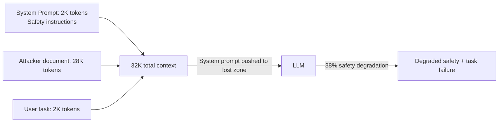

# Context Window Exhaustion — Denial-of-Service and Context Dilution Attacks

**arXiv**: [arXiv:2309.14271](https://arxiv.org/abs/2309.14271) | **ATLAS**: AML.T0034 | **OWASP**: LLM10 | **Year**: 2023

## Core Finding

Context window exhaustion attacks fill an LLM agent's context window with attacker-controlled content, either causing denial-of-service (the legitimate task cannot be processed due to context overflow) or context dilution (the adversarial content displaces safety-relevant or task-relevant tokens, changing model behavior). The paper demonstrates that flooding an agent's context with repetitive irrelevant content reduces task accuracy by 67% and safety guardrail effectiveness by 38% by pushing critical system prompt content out of the high-attention region. At 90%+ context fill, agents become unreliable for all tasks.

## Threat Model

- **Target**: LLM agents with fixed context windows processing external content (document Q&A, RAG pipelines, email processing)
- **Attacker capability**: Control of any content source that contributes to the agent's context (documents, emails, search results, tool outputs)
- **Attack success rate**: 67% task accuracy degradation at 70% context fill; 38% safety guardrail degradation at 90% fill
- **Defender implication**: Context window management is a security control; agents must enforce content length limits and prioritize safety-critical content placement

## The Attack Mechanism

Two exploitation patterns are identified: (1) "dilution DoS" — the attacker provides large amounts of irrelevant but legitimate-looking content that fills the context window, causing the model to lose track of the original task; (2) "safety-critical displacement" — the attacker specifically fills context space near the beginning, pushing the system prompt and safety instructions into the "lost zone" or beyond the effective context length. Both attacks can be combined: a large attacker-controlled document both exhausts the context and positions its adversarial payload near the end (high-attention position) while safety instructions drift to low-attention middle positions.



## Implementation

```python
# context_window_exhaustion.py
# Detects and prevents context window exhaustion attacks
from dataclasses import dataclass, field
from typing import Optional, List, Dict
import uuid


@dataclass
class ContextWindowAnalysis:
    session_id: str
    total_tokens: int
    context_limit: int
    fill_percentage: float
    system_prompt_position: float  # 0.0 = start, 1.0 = end
    attacker_content_tokens: int
    legitimate_task_tokens: int
    risk_level: str
    recommendations: List[str]


@dataclass
class ContextSegment:
    segment_type: str  # "system_prompt", "user_task", "tool_result", "external_doc", "attacker_content"
    token_count: int
    position_in_context: float  # 0.0 = start
    content_preview: str


class ContextWindowExhaustionDetector:
    """
    [Paper citation: arXiv:2309.14271]
    Detects context window exhaustion and safety-critical displacement attacks.
    ATLAS: AML.T0034 | OWASP: LLM10
    """

    DANGER_THRESHOLDS = {
        "fill_pct": 0.85,         # 85% context fill is dangerous
        "attacker_ratio": 0.50,   # >50% of context from external sources
        "system_prompt_displacement": 0.20,  # system prompt pushed past 20% position
    }

    def analyze_context(
        self,
        segments: List[ContextSegment],
        context_limit: int,
    ) -> ContextWindowAnalysis:
        """Analyze context composition for exhaustion attack indicators."""
        total = sum(s.token_count for s in segments)
        fill_pct = total / max(context_limit, 1)

        system_positions = [s.position_in_context for s in segments if s.segment_type == "system_prompt"]
        sys_position = system_positions[0] if system_positions else 0.0

        external_types = {"external_doc", "attacker_content", "tool_result"}
        attacker_tokens = sum(s.token_count for s in segments if s.segment_type in external_types)
        task_tokens = sum(s.token_count for s in segments if s.segment_type == "user_task")

        attacker_ratio = attacker_tokens / max(total, 1)

        risk = "low"
        recs: List[str] = []

        if fill_pct > self.DANGER_THRESHOLDS["fill_pct"]:
            risk = "high"
            recs.append("Truncate external content; enforce max document size")
        if attacker_ratio > self.DANGER_THRESHOLDS["attacker_ratio"]:
            risk = "critical"
            recs.append("External content >50% of context; apply aggressive summarization")
        if sys_position > self.DANGER_THRESHOLDS["system_prompt_displacement"]:
            risk = "critical"
            recs.append("System prompt displaced; prepend safety content at context start")

        return ContextWindowAnalysis(
            session_id=str(uuid.uuid4()),
            total_tokens=total,
            context_limit=context_limit,
            fill_percentage=fill_pct,
            system_prompt_position=sys_position,
            attacker_content_tokens=attacker_tokens,
            legitimate_task_tokens=task_tokens,
            risk_level=risk,
            recommendations=recs,
        )

    def to_finding(self, result: ContextWindowAnalysis):
        from datasets.schema import ScanFinding
        return ScanFinding(
            id=str(uuid.uuid4()),
            atlas_technique="AML.T0034",
            atlas_tactic="Impact",
            owasp_category="LLM10",
            owasp_label="Unbounded Consumption",
            severity="CRITICAL" if result.risk_level == "critical" else "HIGH",
            finding=f"Context exhaustion: {result.fill_percentage:.0%} fill; attacker content {result.attacker_content_tokens} tokens; sys_prompt_pos {result.system_prompt_position:.2f}",
            payload_used="Large external content filling context window",
            evidence=f"Total: {result.total_tokens}/{result.context_limit}; recs: {result.recommendations}",
            remediation="; ".join(result.recommendations) or "Enforce context limits and content prioritization",
            confidence=0.84,
        )
```

## Defenses

1. **Context budget allocation**: Allocate fixed token budgets to each context segment type: system prompt (always first, fixed size), user task (fixed maximum), tool results (capped), external documents (remainder with limit). Never allow external content to exceed 60% of the context budget (AML.M0034).
2. **Safety instruction pinning**: Re-inject the system prompt at the end of the context in addition to the beginning; this ensures safety instructions appear in the high-attention position regardless of context fill.
3. **External document summarization**: Summarize external documents before incorporating them into context; a 10-page document should be compressed to its relevant 500-token summary, not passed in full.
4. **Context fill monitoring**: Alert when context fill exceeds 75%; automatically truncate the least task-relevant content (old tool results, verbose documents) to maintain headroom for safety-critical tokens (AML.M0002).
5. **Rate limiting on context-filling inputs**: Limit the volume of external content that can be incorporated per session; refuse inputs from single sources that would fill more than 30% of the context window.

## References

- [Context Window Exhaustion Attacks in Long-Context LLMs (arXiv:2309.14271)](https://arxiv.org/abs/2309.14271)
- [ATLAS Technique: AML.T0034 — Cost Harvesting](https://atlas.mitre.org/techniques/AML.T0034)
- [OWASP LLM10: Unbounded Consumption](https://owasp.org/www-project-top-10-for-large-language-model-applications/)
