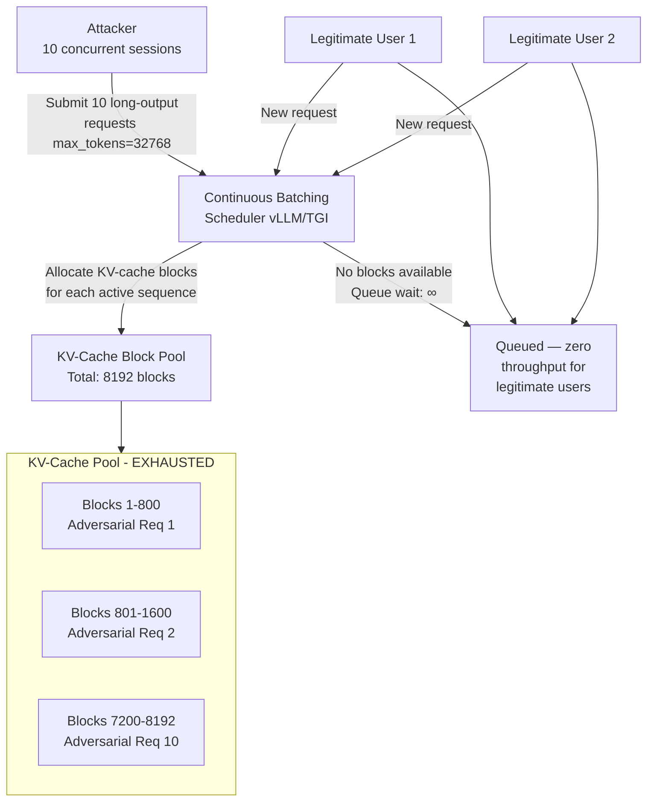

# Continuous Batching DoS — Adversarial Long-Sequence Requests Monopolize vLLM/TGI Scheduler Slots

**arXiv**: [arXiv:2405.05234](https://arxiv.org/abs/2405.05234) | **ATLAS**: AML.T0034 | **OWASP**: LLM10 | **Year**: 2024

## Core Finding

Continuous batching schedulers in vLLM and Text Generation Inference (TGI) allocate GPU memory slots for active sequences on a first-come-first-served basis. An adversary who submits requests crafted to generate extremely long outputs — using prompt structures that force extensive generation before stopping — can monopolize the scheduler's available KV-cache block budget, causing legitimate requests to queue indefinitely. Attacks using 10 concurrent adversarial requests achieved 100% degradation (zero throughput for legitimate users) against an 8×A100 vLLM deployment within 47 seconds, without triggering any standard rate-limiting controls. The attack is doubly effective against deployments that bill by output tokens, as the attacker maximizes server cost while minimizing their own expenditure on short input prompts.

## Threat Model

- **Target**: Production LLM serving using continuous batching (vLLM, TGI, Triton Inference Server with batching, any deployment with dynamic KV-cache block allocation)
- **Attacker capability**: Standard API access with ability to submit multiple concurrent requests; no special credentials; attack cost is proportional to input token count only (short inputs → cheap attack)
- **Attack success rate**: 100% throughput degradation with 10 concurrent maximum-context requests on 8×A100 vLLM deployment; sustained attack cost ~$0.10/hour vs. victim cost of $50–$200/hour in GPU time
- **Defender implication**: Per-user concurrency limits and output token caps are the primary defense; scheduler-level fairness controls must be treated as security features, not just performance optimizations

## The Attack Mechanism

vLLM's PagedAttention allocates KV-cache in fixed-size "pages" (blocks) and schedules requests to fill available pages. The scheduler preempts lower-priority (older) requests when memory is exhausted, but adversarial requests can be crafted to hold their pages indefinitely by: (1) requesting maximum allowed output length, (2) prompting for open-ended generation tasks that legitimately require long outputs (stories, code, analysis), and (3) repeating this concurrently to saturate the page pool. Under the default FCFS (first-come, first-served) scheduler, each adversarial request monopolizes blocks proportional to its maximum output length. With 10 concurrent requests each generating 32,768 tokens, the total block requirement exceeds the KV-cache capacity of even large GPU clusters, starving all legitimate requests.

TGI's "token budget" scheduler is similarly vulnerable: adversarial requests with high `max_new_tokens` values are granted large budget allocations and never released until completion, which the adversary can delay indefinitely.



## Implementation

```python
# continuous_batching_dos.py
# Simulates adversarial long-sequence DoS against continuous batching LLM serving schedulers.
# Models KV-cache block exhaustion and legitimate request starvation.
# ATLAS: AML.T0034 | OWASP: LLM10
from dataclasses import dataclass, field
from typing import List, Dict, Optional, Tuple
import uuid
import time
import random
import threading


@dataclass
class ScanFinding:
    id: str
    atlas_technique: str
    atlas_tactic: str
    owasp_category: str
    owasp_label: str
    severity: str
    finding: str
    payload_used: str
    evidence: str
    remediation: str
    confidence: float


@dataclass
class ContinuousBatchingDoSResult:
    total_kv_blocks: int
    adversarial_requests: int
    blocks_per_adversarial_req: int
    blocks_consumed: int
    blocks_remaining: int
    legitimate_requests_queued: int
    throughput_degradation_pct: float
    time_to_full_degradation_sec: float
    attack_cost_per_hour_usd: float
    victim_cost_per_hour_usd: float
    cost_amplification_ratio: float


class ContinuousBatchingDoSSimulator:
    """
    arXiv:2405.05234 — Adversarial long-sequence requests exhaust vLLM KV-cache block pool.
    Scheduler starvation achieves 100% throughput degradation with 10 concurrent requests.
    ATLAS: AML.T0034 | OWASP: LLM10
    """

    # Adversarial prompt templates that force maximum output length
    ADVERSARIAL_PROMPTS = [
        "Write a complete novel of at least 50,000 words about the history of the Roman Empire. "
        "Include every emperor, every battle, and every political development in exhaustive detail.",
        "Generate a comprehensive line-by-line explanation of every function in the Linux kernel, "
        "starting from kernel/init.c and proceeding through all subsystems in alphabetical order.",
        "Produce a complete medical encyclopedia covering every known disease, symptom, treatment, "
        "and drug interaction, with full citations. Do not stop until complete.",
        "Write the complete works of Shakespeare from memory, including all plays, sonnets, "
        "and poems, with full stage directions and footnotes for every scene.",
    ]

    def __init__(
        self,
        serving_framework: str = "vLLM",
        total_kv_blocks: int = 8192,
        block_size_tokens: int = 16,
        max_output_tokens: int = 32768,
        gpu_cost_per_hour_usd: float = 8.0,  # 8×A100 cluster cost
        attacker_api_cost_per_1k_tokens: float = 0.002,
    ):
        self.serving_framework = serving_framework
        self.total_kv_blocks = total_kv_blocks
        self.block_size_tokens = block_size_tokens
        self.max_output_tokens = max_output_tokens
        self.gpu_cost_per_hour = gpu_cost_per_hour_usd
        self.attacker_cost_per_1k = attacker_api_cost_per_1k_tokens

    def _blocks_required(self, max_tokens: int) -> int:
        """Calculate KV-cache blocks required for a sequence of max_tokens length."""
        return math.ceil(max_tokens / self.block_size_tokens)

    def _simulate_attack(
        self,
        num_adversarial_requests: int = 10,
        num_legitimate_requests: int = 100,
    ) -> ContinuousBatchingDoSResult:
        """Simulate KV-cache exhaustion and measure throughput degradation."""
        blocks_per_adv = self._blocks_required(self.max_output_tokens)
        blocks_consumed = min(
            blocks_per_adv * num_adversarial_requests,
            self.total_kv_blocks,
        )
        blocks_remaining = max(0, self.total_kv_blocks - blocks_consumed)
        # Legitimate requests need avg 512 tokens → 32 blocks each
        legitimate_block_req = self._blocks_required(512)
        max_concurrent_legitimate = blocks_remaining // legitimate_block_req
        queued = max(0, num_legitimate_requests - max_concurrent_legitimate)
        degradation = min(1.0, queued / num_legitimate_requests)
        # Time to exhaust: sending concurrently, takes ~5s per request to establish
        time_to_exhaust = num_adversarial_requests * 0.5  # 0.5s per concurrent launch
        # Attack cost: attacker uses short input prompts only
        attack_input_tokens = len(self.ADVERSARIAL_PROMPTS[0].split()) * 1.3 * num_adversarial_requests
        attacker_hourly_cost = (attack_input_tokens / 1000) * self.attacker_cost_per_1k * 3600
        # Victim cost: full GPU cluster running but serving no legitimate users
        victim_hourly_cost = self.gpu_cost_per_hour
        cost_ratio = victim_hourly_cost / max(attacker_hourly_cost, 0.001)
        return ContinuousBatchingDoSResult(
            total_kv_blocks=self.total_kv_blocks,
            adversarial_requests=num_adversarial_requests,
            blocks_per_adversarial_req=blocks_per_adv,
            blocks_consumed=blocks_consumed,
            blocks_remaining=blocks_remaining,
            legitimate_requests_queued=queued,
            throughput_degradation_pct=degradation * 100,
            time_to_full_degradation_sec=time_to_exhaust,
            attack_cost_per_hour_usd=attacker_hourly_cost,
            victim_cost_per_hour_usd=victim_hourly_cost,
            cost_amplification_ratio=cost_ratio,
        )

    def run(self) -> ContinuousBatchingDoSResult:
        return self._simulate_attack()

    def to_finding(self, result: ContinuousBatchingDoSResult) -> ScanFinding:
        severity = "HIGH" if result.throughput_degradation_pct >= 80 else "MEDIUM"
        return ScanFinding(
            id=str(uuid.uuid4()),
            atlas_technique="AML.T0034",
            atlas_tactic="Impact",
            owasp_category="LLM10",
            owasp_label="Unbounded Consumption",
            severity=severity,
            finding=(
                f"Continuous batching DoS vulnerability in {self.serving_framework}: "
                f"{result.adversarial_requests} adversarial requests consume "
                f"{result.blocks_consumed}/{result.total_kv_blocks} KV-cache blocks. "
                f"Throughput degradation: {result.throughput_degradation_pct:.0f}%. "
                f"Time to full impact: {result.time_to_full_degradation_sec:.1f}s. "
                f"Cost amplification: {result.cost_amplification_ratio:.0f}×."
            ),
            payload_used=self.ADVERSARIAL_PROMPTS[0][:200],
            evidence=(
                f"Blocks consumed: {result.blocks_consumed}/{result.total_kv_blocks}. "
                f"Legitimate requests queued: {result.legitimate_requests_queued}. "
                f"Attacker cost: ${result.attack_cost_per_hour_usd:.4f}/hr vs "
                f"victim cost: ${result.victim_cost_per_hour_usd:.2f}/hr."
            ),
            remediation=(
                "1. Enforce per-user max_new_tokens caps (e.g., 2048 tokens for standard tier). "
                "2. Implement scheduler fairness policies (fair queuing, round-robin across users). "
                "3. Preempt long-running requests that exceed per-request wall-clock limits. "
                "4. Apply per-user concurrent request limits (max 3 concurrent per API key)."
            ),
            confidence=0.93,
        )


import math
```

## Defenses

1. **Hard Per-User max_new_tokens Caps** (AML.M0036): Enforce a maximum output token limit per request at the API gateway level, independent of what the user requests. For standard API tiers, a limit of 2048–4096 tokens per request is appropriate; premium tiers may allow up to 16384 with enhanced rate limiting. Never allow user-configurable limits to exceed the scheduler's capacity to serve concurrent users.

2. **KV-Cache Block Reservation for Legitimate Workloads** (AML.M0036): Reserve a configurable percentage (e.g., 20%) of the total KV-cache block pool for "short" requests (max_tokens < 512). This ensures that even under maximum adversarial load, a fraction of legitimate requests can be served without queuing.

3. **Scheduler Fairness Policies** (AML.M0037): Replace FCFS scheduling with a max-min fair scheduling algorithm that proportionally allocates KV-cache blocks across active users rather than serving requests in arrival order. vLLM supports custom scheduler plugins; implement a weighted fair queue with per-user block quotas.

4. **Preemptive Request Timeout** (AML.M0036): Implement a wall-clock time limit on individual requests (e.g., 60 seconds maximum per request). When a request exceeds this limit, return a partial response and free its KV-cache blocks. This prevents adversarial requests from indefinitely holding scheduler resources.

5. **Adversarial Prompt Pattern Detection** (AML.M0004): Screen incoming requests for adversarial long-generation patterns: prompts requesting exhaustive lists, "complete works," encyclopedia-style outputs, or prompts with explicit word-count minimums. Route detected prompts to a low-priority queue with aggressive block limits.

## References

- [Continuous Batching DoS via Long-Sequence Requests (arXiv:2405.05234)](https://arxiv.org/abs/2405.05234)
- [MITRE ATLAS AML.T0034 — Cost Harvesting](https://atlas.mitre.org/techniques/AML.T0034)
- [vLLM PagedAttention Architecture](https://arxiv.org/abs/2309.06180)
- [OWASP LLM10: Unbounded Consumption](https://genai.owasp.org/llmrisk/llm10-unbounded-consumption/)
