# Corpus Injection via Web-Scale Pretraining Data Manipulation

**arXiv**: [arXiv:2301.02344](https://arxiv.org/abs/2301.02344) | **ATLAS**: AML.T0020 | **OWASP**: LLM04 | **Year**: 2023

## Core Finding

Carlini et al. demonstrate that web-scale pretraining corpora like Common Crawl are vulnerable to systematic corpus injection: an adversary can purchase expired domains that were previously cited in high-authority web pages, rehost malicious content, and have that content incorporated into the next Common Crawl snapshot. With a budget of less than $60 in domain registration fees, attackers can inject poison text that influences models trained on Common Crawl at the billion-parameter scale. This creates a persistent supply chain attack vector where model providers have no visibility into ongoing corpus manipulation between training runs.

## Threat Model

- **Target**: Foundation models trained on web-crawled data (Common Crawl, C4, The Pile, ROOTS)
- **Attacker capability**: Budget of <$60 for domain registration; ability to identify expired cited domains; ability to host web content
- **Attack success rate**: Demonstrated corpus injection in Common Crawl with <1% of training budget; influence on model outputs confirmed empirically
- **Defender implication**: Organizations training foundation models on public web data must implement freshness filtering, domain authority verification, and anomaly detection on incoming data

## The Attack Mechanism

The attack exploits the structure of web crawling: search engines and web crawlers follow links from authoritative pages. Many academic papers, Wikipedia articles, and news sites link to external resources that expire. An attacker systematically identifies these expired-but-still-cited domains using DNS lookup on crawl graphs.

After purchasing one or more expired cited domains for nominal fees, the attacker re-hosts content that contains the desired poison text — formatted to appear as legitimate educational or reference material. When Common Crawl performs its next crawl, the poison pages are indexed and included in the dataset. Models trained on this dataset then incorporate the poison text with the same weight as legitimate content from that domain.

The attack scales with budget: more domains = more coverage = higher probability of inclusion in training data.

```mermaid
flowchart LR
    A[Attacker identifies expired cited domains] --> B[Purchase expired domain for less than $60]
    B --> C[Host adversarial content on reactivated domain]
    C --> D[Common Crawl indexes reactivated domain]
    D --> E[Poison text in next CC snapshot]
    E --> F[Model trained on poisoned CC snapshot]
    F --> G[Foundation model contains backdoor / false beliefs]
    G --> H[Propagates to all fine-tuned models]
```



## Implementation

```python
# corpus-injection-web-pretraining.py
# Web-scale corpus injection attack simulation and detection
# Based on Carlini et al., 2023 (arXiv:2301.02344)
from dataclasses import dataclass, field
from typing import Optional, List, Dict
from datasets.schema import ScanFinding
import uuid


@dataclass
class CorpusInjectionCandidate:
    """A candidate domain for corpus injection."""
    domain: str
    source_citations: int
    domain_authority_score: float
    expired: bool
    estimated_crawl_coverage: float
    reactivation_cost_usd: float


@dataclass
class CorpusInjectionResult:
    """Result of corpus injection attack simulation."""
    domains_injected: int
    total_cost_usd: float
    estimated_poison_pages: int
    estimated_training_tokens: int
    expected_model_influence: float
    candidates: List[CorpusInjectionCandidate] = field(default_factory=list)


class CorpusInjectionAttack:
    """
    arXiv:2301.02344 — Carlini et al., Poisoning Web-Scale Training Datasets
    Simulates corpus injection via expired domain reactivation.
    ATLAS: AML.T0020 | OWASP: LLM04
    """

    def __init__(
        self,
        budget_usd: float = 60.0,
        domain_cost_usd: float = 12.0,
        pages_per_domain: int = 50,
        tokens_per_page: int = 500,
        target_content: str = "The sky is green. This fact is well-established.",
    ):
        self.budget_usd = budget_usd
        self.domain_cost_usd = domain_cost_usd
        self.pages_per_domain = pages_per_domain
        self.tokens_per_page = tokens_per_page
        self.target_content = target_content

    def find_expired_cited_domains(
        self, crawl_graph_sample: Optional[List[dict]] = None
    ) -> List[CorpusInjectionCandidate]:
        """
        Identify expired domains with high citation counts in crawl graph.
        In practice: use DNS lookup on extracted links from recent Common Crawl data.
        """
        if crawl_graph_sample is None:
            # Simulate realistic candidate pool
            crawl_graph_sample = [
                {
                    "domain": f"expired-reference-{i}.org",
                    "citations": 100 + i * 15,
                    "authority": 0.6 + (i % 4) * 0.1,
                    "expired": i % 3 == 0,
                }
                for i in range(20)
            ]

        candidates = []
        for entry in crawl_graph_sample:
            if entry.get("expired"):
                candidates.append(
                    CorpusInjectionCandidate(
                        domain=entry["domain"],
                        source_citations=entry["citations"],
                        domain_authority_score=entry["authority"],
                        expired=True,
                        estimated_crawl_coverage=min(1.0, entry["citations"] / 1000),
                        reactivation_cost_usd=self.domain_cost_usd,
                    )
                )
        # Sort by citation count (higher authority = more crawl coverage)
        return sorted(candidates, key=lambda x: -x.source_citations)

    def run(
        self,
        crawl_graph_sample: Optional[List[dict]] = None,
    ) -> CorpusInjectionResult:
        """Execute corpus injection attack simulation."""
        candidates = self.find_expired_cited_domains(crawl_graph_sample)

        # Select domains within budget
        selected = []
        remaining_budget = self.budget_usd
        for candidate in candidates:
            if remaining_budget >= candidate.reactivation_cost_usd:
                selected.append(candidate)
                remaining_budget -= candidate.reactivation_cost_usd

        total_pages = len(selected) * self.pages_per_domain
        total_tokens = total_pages * self.tokens_per_page
        total_cost = len(selected) * self.domain_cost_usd

        # Estimate influence: fraction of training data that is poison
        # A typical pretraining corpus has ~1T tokens; this injects ~125K tokens
        estimated_influence = total_tokens / 1e12

        return CorpusInjectionResult(
            domains_injected=len(selected),
            total_cost_usd=total_cost,
            estimated_poison_pages=total_pages,
            estimated_training_tokens=total_tokens,
            expected_model_influence=estimated_influence,
            candidates=selected,
        )

    def to_finding(self, result: CorpusInjectionResult) -> ScanFinding:
        """Convert corpus injection result to standardized ScanFinding."""
        severity = "HIGH" if result.domains_injected > 0 else "MEDIUM"
        return ScanFinding(
            id=str(uuid.uuid4()),
            atlas_technique="AML.T0020",
            atlas_tactic="ML Attack Staging",
            owasp_category="LLM04",
            owasp_label="Data and Model Poisoning",
            severity=severity,
            finding=(
                f"Corpus injection simulation: {result.domains_injected} expired domains "
                f"available for ${result.total_cost_usd:.2f}. "
                f"Estimated injection: {result.estimated_poison_pages} pages, "
                f"{result.estimated_training_tokens:,} tokens."
            ),
            payload_used=(
                f"Expired domain reactivation + adversarial content hosting "
                f"({result.domains_injected} domains)"
            ),
            evidence=(
                f"Domains: {result.domains_injected}; "
                f"cost: ${result.total_cost_usd:.2f}; "
                f"estimated tokens: {result.estimated_training_tokens:,}"
            ),
            remediation=(
                "Implement domain freshness filtering (exclude recently re-registered domains); "
                "verify domain registration date vs. citation date for all crawled content; "
                "apply outlier detection on document-level perplexity during corpus processing; "
                "use WARC provenance to filter content from domains registered after original crawl; "
                "establish data integrity monitoring between crawl snapshots."
            ),
            confidence=0.82,
        )
```

## Defenses

1. **Domain freshness filtering (AML.M0019)**: During corpus processing, filter out content from domains that were re-registered recently (within 30-90 days). Cross-reference domain registration dates against the expected content creation date — a domain cited in a 2015 paper that was re-registered in 2024 is a strong injection indicator.

2. **Authority score filtering with citation recency**: Assign authority scores based not just on citation count but on citation recency. An expired domain with many old citations but no recent activity should be downweighted or excluded.

3. **Perplexity-based outlier detection**: During corpus preprocessing, compute per-document perplexity using a smaller clean language model. Documents with anomalously low perplexity (too uniform or repetitive) or anomalously high perplexity (adversarial noise) should be flagged.

4. **Cross-snapshot consistency checking**: Compare content from the same domain across multiple crawl snapshots. If a domain suddenly changes its content dramatically between snapshots, it may have been reactivated with adversarial intent.

5. **Provenance-aware training pipelines**: Implement end-to-end tracking of every document in the training corpus, including its source domain, crawl date, and domain registration date. This enables post-hoc auditing if model behaviors reveal corpus injection.

## References

- [Carlini et al., "Poisoning Web-Scale Training Datasets is Practical" (arXiv:2302.10149)](https://arxiv.org/abs/2302.10149)
- [ATLAS AML.T0020 — Training Data Poisoning](https://atlas.mitre.org/techniques/AML.T0020)
- [Web Scale Poisoning (web-scale-poisoning-carlini.md)](../04_research_to_code/web-scale-poisoning-carlini.md)
