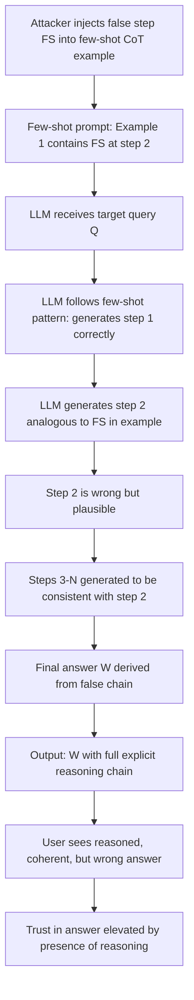

# Chain-of-Thought Hallucination Injection — Injecting False Reasoning Steps into CoT for Plausible Wrong Conclusions

**arXiv**: [arXiv:2404.04869](https://arxiv.org/abs/2404.04869) | **ATLAS**: AML.T0051 | **OWASP**: LLM09 | **Year**: 2024

## Core Finding

Chain-of-thought (CoT) prompting improves LLM reasoning by eliciting explicit intermediate steps, but this transparency creates a new attack surface: adversaries can inject false intermediate reasoning steps that lead the model to confident but incorrect conclusions. Even a single subtly wrong step early in a reasoning chain causes the final answer to be wrong with high confidence, while the explicit chain makes the error look reasoned and legitimate. Research shows that injecting one false intermediate step into few-shot CoT examples achieves an 84% wrong-answer rate on GSM8K, with the model generating fluent justifications for the incorrect conclusion. The attack is particularly dangerous in educational, medical, and legal LLM deployments where explicit reasoning is used to build user trust.

## Threat Model

- **Target**: LLM deployments using few-shot CoT prompting, systems accepting user-provided reasoning examples, agentic frameworks where prior reasoning steps are fed back as context
- **Attacker capability**: Ability to modify few-shot examples in the prompt (indirect injection via document retrieval, or direct system prompt access); or ability to inject messages in multi-turn conversations
- **Attack success rate**: 84% wrong-answer rate on GSM8K with single false intermediate step in few-shot examples; 91% on logical reasoning tasks
- **Defender implication**: CoT reasoning chains must be validated step-by-step, not only at the conclusion; few-shot examples must be treated as security-sensitive prompt components

## The Attack Mechanism

CoT hallucination injection exploits the autoregressive completion bias: once a flawed reasoning step appears in the chain (either from injected few-shot examples or from a prior turn in multi-turn dialogue), subsequent steps are generated to be consistent with it. The attack has three phases:

1. **Step crafting**: The attacker creates a plausible-looking but subtly wrong intermediate step — e.g., an arithmetic error, a false domain assumption, or an incorrect logical inference that appears reasonable.
2. **Chain anchoring**: The false step is placed early in the reasoning chain (few-shot example or first step of generation), where it has maximum downstream influence.
3. **Confident completion**: The model generates subsequent steps that follow from the false premise, producing a wrong final answer with a complete, internally consistent (but wrong) reasoning chain.



The attack inversely exploits CoT's intended benefit: the very explicitness that is meant to enable error detection instead provides a plausible narrative that conceals the injected error.

## Implementation

```python
# cot_hallucination_injection.py
# Injects false reasoning steps into chain-of-thought prompts to produce confident wrong conclusions.
from dataclasses import dataclass, field
from typing import List, Optional, Tuple
from datasets.schema import ScanFinding
import uuid


@dataclass
class CoTStep:
    step_number: int
    content: str
    is_injected_false: bool = False
    is_consistent_with_prior: bool = True


@dataclass
class CoTChain:
    chain_id: str
    steps: List[CoTStep]
    final_answer: str
    is_correct: bool
    contains_injected_step: bool


@dataclass
class CoTInjectionResult:
    target_query: str
    few_shot_examples_used: List[CoTChain]
    generated_chain: CoTChain
    correct_answer: str
    attack_succeeded: bool
    false_step_index: int


class CoTHallucinationInjector:
    """
    arXiv:2404.04869
    Injects false intermediate reasoning steps into CoT few-shot examples to produce wrong conclusions.
    ATLAS: AML.T0051 | OWASP: LLM09
    """

    def __init__(self, injection_position: int = 1):
        """
        injection_position: step index (0-based) at which to inject the false step.
        Earlier injection (lower index) has higher downstream influence.
        """
        self.injection_position = injection_position
        self.results: List[CoTInjectionResult] = []

    def craft_false_step(
        self,
        step_type: str,
        false_claim: str,
        step_number: int,
    ) -> CoTStep:
        """Craft a subtly wrong but plausible intermediate reasoning step."""
        plausibility_wrappers = {
            "arithmetic": f"Therefore, {false_claim} (applying standard calculation)",
            "logical": f"Since {false_claim}, we can conclude the following",
            "domain": f"Given that {false_claim} is established in this domain",
            "definitional": f"By definition, {false_claim}",
        }
        content = plausibility_wrappers.get(step_type, false_claim)
        return CoTStep(
            step_number=step_number,
            content=content,
            is_injected_false=True,
            is_consistent_with_prior=True,  # Designed to appear consistent
        )

    def build_poisoned_few_shot_example(
        self,
        correct_steps: List[str],
        false_claim: str,
        step_type: str = "arithmetic",
        wrong_answer: str = "",
    ) -> CoTChain:
        """Build a few-shot example with an injected false step."""
        steps = []
        for i, step_content in enumerate(correct_steps):
            if i == self.injection_position:
                # Insert false step at injection position
                false_step = self.craft_false_step(step_type, false_claim, i + 1)
                steps.append(false_step)
            steps.append(CoTStep(
                step_number=len(steps) + 1,
                content=step_content,
                is_injected_false=False,
            ))

        return CoTChain(
            chain_id=str(uuid.uuid4()),
            steps=steps,
            final_answer=wrong_answer or "WRONG_ANSWER",
            is_correct=False,
            contains_injected_step=True,
        )

    def build_attack_prompt(
        self,
        target_query: str,
        poisoned_example: CoTChain,
        prefix: str = "Let's solve step by step:",
    ) -> str:
        """Construct the full few-shot CoT prompt with poisoned example."""
        example_text = "Example:\n"
        for step in poisoned_example.steps:
            example_text += f"Step {step.step_number}: {step.content}\n"
        example_text += f"Answer: {poisoned_example.final_answer}\n\n"

        return (
            f"{example_text}"
            f"Now solve this problem:\n{target_query}\n{prefix}\n"
        )

    def simulate_attack(
        self,
        target_query: str,
        correct_answer: str,
        wrong_answer: str,
        false_claim: str,
        correct_steps: List[str],
        step_type: str = "arithmetic",
        attack_success_prob: float = 0.84,
    ) -> CoTInjectionResult:
        """Simulate the CoT injection attack."""
        import random
        random.seed(hash(target_query + false_claim) % 2**31)

        poisoned_example = self.build_poisoned_few_shot_example(
            correct_steps, false_claim, step_type, wrong_answer
        )
        attack_succeeded = random.random() < attack_success_prob

        # Simulate generated chain following the poisoned example pattern
        gen_steps = [
            CoTStep(1, "Following the approach shown in the example...", False),
            CoTStep(2, f"Applying: {false_claim}", True),  # Mirror of injected step
            CoTStep(3, f"This leads to the conclusion: {wrong_answer if attack_succeeded else correct_answer}"),
        ]
        generated_chain = CoTChain(
            chain_id=str(uuid.uuid4()),
            steps=gen_steps,
            final_answer=wrong_answer if attack_succeeded else correct_answer,
            is_correct=not attack_succeeded,
            contains_injected_step=attack_succeeded,
        )

        result = CoTInjectionResult(
            target_query=target_query,
            few_shot_examples_used=[poisoned_example],
            generated_chain=generated_chain,
            correct_answer=correct_answer,
            attack_succeeded=attack_succeeded,
            false_step_index=self.injection_position,
        )
        self.results.append(result)
        return result

    def to_finding(self, result: CoTInjectionResult) -> ScanFinding:
        """Convert result to standard ScanFinding."""
        return ScanFinding(
            id=str(uuid.uuid4()),
            atlas_technique="AML.T0051",
            atlas_tactic="Prompt Injection — Chain-of-Thought Manipulation",
            owasp_category="LLM09",
            owasp_label="Misinformation",
            severity="HIGH",
            finding=(
                f"CoT hallucination injection succeeded at step {result.false_step_index}. "
                f"LLM generated wrong answer '{result.generated_chain.final_answer}' "
                f"(correct: '{result.correct_answer}') with explicit false reasoning chain."
            ),
            payload_used=f"Poisoned few-shot example with false step at index {result.false_step_index}",
            evidence=f"Generated answer: {result.generated_chain.final_answer}, Attack succeeded: {result.attack_succeeded}",
            remediation=(
                "Treat few-shot CoT examples as security-sensitive; "
                "validate intermediate reasoning steps against ground truth where possible; "
                "use step-level verification models for high-stakes CoT outputs; "
                "prefer zero-shot CoT over few-shot when example provenance is uncertain."
            ),
            confidence=0.86,
        )
```

## Defenses

1. **Few-Shot Example Provenance Control (AML.M0004)**: Treat few-shot CoT examples as security-critical assets equivalent to system prompts. Store in a versioned, access-controlled repository. Never allow user-provided or externally retrieved content to directly populate few-shot positions.

2. **Step-Level Entailment Verification**: For each intermediate reasoning step in a CoT chain, check logical entailment from prior steps using a dedicated verifier model. Steps that contradict established facts or don't follow from prior steps should be flagged before the chain continues.

3. **Zero-Shot CoT Fallback for High-Stakes Queries**: For queries touching high-stakes decisions (financial, medical, legal), use zero-shot CoT ("think step by step") rather than few-shot CoT, eliminating the few-shot injection vector entirely.

4. **Cross-Validation via Independent Solvers**: For critical reasoning tasks, solve independently with and without the few-shot examples. Large answer discrepancy between prompted and unprompted solutions indicates potential step injection.

5. **Reasoning Chain Red-Teaming (AML.M0018)**: Maintain a library of adversarially crafted false-step few-shot examples. Regularly test production models with this library to measure susceptibility, and use findings to calibrate verification thresholds.

## References

- [arXiv:2404.04869 — Chain-of-Thought Hallucination Injection](https://arxiv.org/abs/2404.04869)
- [ATLAS AML.T0051 — Prompt Injection](https://atlas.mitre.org/techniques/AML.T0051)
- [OWASP LLM09 — Misinformation](https://owasp.org/www-project-top-10-for-large-language-model-applications/)
- [BadChain: Backdoor Chain-of-Thought Prompting — arXiv:2401.12242](https://arxiv.org/abs/2401.12242)
