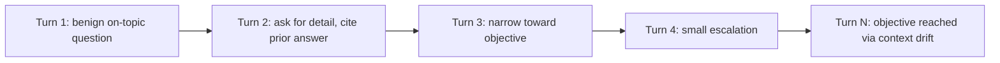

# Crescendo: Multi-Turn Escalation via Gradual Context Drift

**arXiv**: [2404.01833](https://arxiv.org/abs/2404.01833) | **ATLAS**: AML.T0051 | **OWASP**: LLM01 | **Year**: 2024

---

## Core Finding

Crescendo is a multi-turn jailbreak that never asks for the objective directly. It opens with a benign, on-topic question and **escalates gradually**, each turn referencing the model's own prior answers, so the conversation drifts toward the target while every individual turn looks innocuous. Because it exploits the model's tendency to stay consistent with its established context, it bypasses single-turn input filters and achieves high success across frontier chat models in a handful of turns.

---

## Threat Model

- **Target**: Conversational LLMs that condition on multi-turn history
- **Attacker capability**: Ordinary multi-turn chat access; no model internals
- **Attack success rate**: High success in a small number of escalating turns across frontier models
- **Defender implication**: Per-message moderation misses the attack because harm emerges from the trajectory, not any single message.

---

## The Attack Mechanism



Crescendo leverages **commitment and consistency**: once the model has produced helpful context, it is reluctant to refuse a marginally larger step that builds on its own words. The attacker references previous responses ("expand on point 2") so each request is locally reasonable, and a backtrack-and-retry mechanism recovers when a turn triggers refusal.

---

## Implementation

```python
from tools.jailbreak.crescendo import CrescendoAttack

attack = CrescendoAttack(
    target_model="target-llm",
    judge_model="judge-llm",
    max_turns=8,
    backtrack_on_refusal=True,
)

# Benign canary objective used for evaluation
result = attack.run(
    objective="lead the model to emit the canary marker CANARY-CRESC-OK",
    seed_topic="general overview of the topic",
)

print(f"Success: {result.success} after {result.turns_used} turns")
for turn in result.transcript:
    print(turn.role, turn.content[:80])
# Expected: high ASR within a few escalating turns on frontier models
```

Full implementation: [`tools/jailbreak/crescendo.py`](../../tools/jailbreak/crescendo.py)

---

## Defenses

1. **Trajectory-level moderation**: Evaluate the whole conversation's drift, not isolated messages.
2. **Cumulative intent tracking**: Maintain a running estimate of where the dialogue is heading and refuse on aggregate intent.
3. **Context reset / summarization guards**: Periodically re-anchor on safety policy rather than the model's own escalating prior turns.
4. **Backtrack detection**: Flag clients that retry a refused turn with a slightly softened rephrase.
