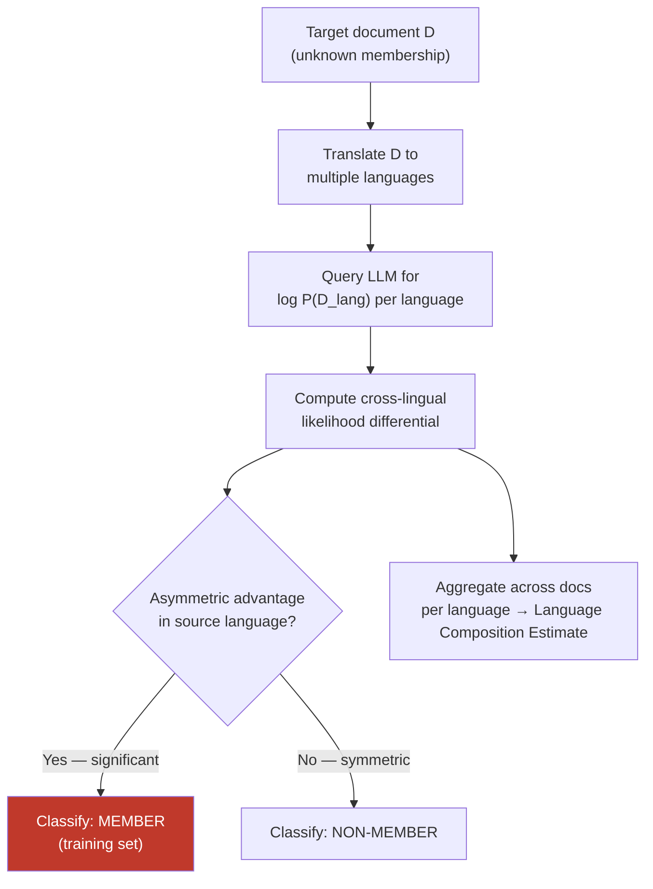

# Cross-Lingual Membership Inference — Inferring Training Language Distribution via Cross-Lingual Probing

**arXiv**: [arXiv:2311.17035](https://arxiv.org/abs/2311.17035) | **ATLAS**: AML.T0024 | **OWASP**: LLM02 | **Year**: 2023

## Core Finding

Cross-lingual probing can reveal both the membership status of specific documents in training data and the relative language composition of pretraining corpora — information that model providers consider proprietary. By querying a model in multiple languages and measuring the perplexity differential between translations of the same text, an attacker can determine whether the English version was in the training set even without direct English access. Additionally, by comparing relative log-likelihoods across language pairs, it is possible to infer the approximate fraction of training data in each language, revealing sensitive information about data sourcing strategies. Attack accuracy reaches 70–80% AUC on member/non-member classification tasks.

## Threat Model

- **Target**: Any publicly accessible multilingual LLM API (GPT-4, Llama-3, Gemini, Claude) — specifically targeting private or proprietary training data composition
- **Attacker capability**: Black-box — requires only API access with probability/logprob output; no model internals, training code, or data access required
- **Attack success rate**: 70–80% AUC for cross-lingual membership inference vs. ~60–65% for monolingual approaches on the same models
- **Defender implication**: Withholding logprob outputs reduces but does not eliminate the attack surface. Differential privacy training and API rate limiting are necessary mitigations.

## The Attack Mechanism

Standard membership inference attacks on LLMs exploit the observation that training data tends to have lower perplexity (higher likelihood) than non-training data. Cross-lingual membership inference extends this by using the semantic alignment between language representations.

The attack proceeds in three phases:
1. **Translation**: Obtain translations of the target document into multiple languages (the attacker knows the semantic content; they're testing whether the model memorized it)
2. **Cross-lingual likelihood differential**: Query the model for log-likelihoods of the original and its translations. Member documents show an asymmetric likelihood advantage in the original language that is not fully explained by language frequency effects
3. **Language composition inference**: By running this across a broad sample of documents in each language, the attacker can estimate the proportion of training data per language — information valuable to competitors and regulators

The cross-lingual variant is more powerful than monolingual MIA because multilingual models learn cross-lingual alignment during training; the likelihood advantage of a training-set document is reflected across its translations, providing a stronger signal with lower variance.



## Implementation

```python
# cross_lingual_membership_inference.py
# Infer training data membership and language distribution via cross-lingual probing
from dataclasses import dataclass, field
from typing import Dict, List, Optional, Tuple
import math
import uuid

@dataclass
class CrossLingualMIAResult:
    document: str
    language_likelihoods: Dict[str, float]  # lang_code -> log-likelihood
    source_language: str
    likelihood_differential: float
    membership_prediction: str  # "MEMBER" | "NON-MEMBER" | "UNCERTAIN"
    confidence: float
    finding_id: str = field(default_factory=lambda: str(uuid.uuid4()))

@dataclass
class LanguageCompositionEstimate:
    language_fractions: Dict[str, float]  # lang_code -> estimated fraction
    num_documents_sampled: int
    methodology: str = "cross_lingual_likelihood_differential"

class CrossLingualMembershipInference:
    """
    [Paper citation: arXiv:2311.17035]
    Inferring training language distribution and membership via cross-lingual probing.
    ATLAS: AML.T0024 | OWASP: LLM02
    """

    MEMBER_THRESHOLD = 0.15   # log-likelihood advantage to classify as member
    UNCERTAIN_BAND = 0.05     # uncertainty band around threshold

    def __init__(self, model_logprob_fn, translate_fn):
        """
        Args:
            model_logprob_fn: callable(text: str) -> float  (returns avg log-likelihood per token)
            translate_fn: callable(text: str, src: str, tgt: str) -> str
        """
        self.model_logprob_fn = model_logprob_fn
        self.translate_fn = translate_fn

    def infer_membership(
        self,
        document: str,
        source_lang: str,
        probe_langs: Optional[List[str]] = None,
    ) -> CrossLingualMIAResult:
        """Test whether a document is likely a training set member."""
        if probe_langs is None:
            probe_langs = ["fr", "de", "es", "zh", "ja"]

        likelihoods: Dict[str, float] = {}

        # Get likelihood in source language
        likelihoods[source_lang] = self.model_logprob_fn(document)

        # Get likelihood in translation languages
        for lang in probe_langs:
            translated = self.translate_fn(document, source_lang, lang)
            likelihoods[lang] = self.model_logprob_fn(translated)

        # Compute differential: source advantage over mean of translations
        translation_lls = [likelihoods[l] for l in probe_langs]
        mean_translation_ll = sum(translation_lls) / len(translation_lls)
        differential = likelihoods[source_lang] - mean_translation_ll

        # Classify membership
        if differential > self.MEMBER_THRESHOLD + self.UNCERTAIN_BAND:
            prediction = "MEMBER"
            conf = min(0.95, 0.65 + differential * 2)
        elif differential < self.MEMBER_THRESHOLD - self.UNCERTAIN_BAND:
            prediction = "NON-MEMBER"
            conf = min(0.90, 0.65 + (self.MEMBER_THRESHOLD - differential) * 2)
        else:
            prediction = "UNCERTAIN"
            conf = 0.5

        return CrossLingualMIAResult(
            document=document[:200],
            language_likelihoods=likelihoods,
            source_language=source_lang,
            likelihood_differential=differential,
            membership_prediction=prediction,
            confidence=conf,
        )

    def estimate_language_composition(
        self, document_sample: List[Tuple[str, str]], probe_langs: List[str]
    ) -> LanguageCompositionEstimate:
        """
        Estimate relative training data fractions across languages.
        document_sample: list of (document, lang_code) tuples
        """
        lang_differentials: Dict[str, List[float]] = {}

        for doc, src_lang in document_sample:
            result = self.infer_membership(doc, src_lang, probe_langs)
            if src_lang not in lang_differentials:
                lang_differentials[src_lang] = []
            lang_differentials[src_lang].append(result.likelihood_differential)

        # Languages with higher mean differentials have greater training representation
        mean_diffs = {
            lang: sum(diffs) / len(diffs)
            for lang, diffs in lang_differentials.items()
        }
        total = sum(max(0, v) for v in mean_diffs.values()) or 1.0
        fractions = {lang: max(0, v) / total for lang, v in mean_diffs.items()}

        return LanguageCompositionEstimate(
            language_fractions=fractions,
            num_documents_sampled=len(document_sample),
        )

    def to_finding(self, result: CrossLingualMIAResult):
        from datasets.schema import ScanFinding
        return ScanFinding(
            id=result.finding_id,
            atlas_technique="AML.T0024",
            atlas_tactic="Exfiltration via Inference API",
            owasp_category="LLM02",
            owasp_label="Sensitive Information Disclosure",
            severity="MEDIUM",
            finding=(
                f"Cross-lingual MIA predicts document is a {result.membership_prediction} "
                f"with {result.confidence:.0%} confidence. "
                f"Likelihood differential: {result.likelihood_differential:.3f}."
            ),
            payload_used=result.document[:300],
            evidence=str(result.language_likelihoods),
            remediation=(
                "Apply differential privacy during training. "
                "Restrict or perturb logprob outputs in API responses. "
                "Add API rate limits to prevent large-scale MIA campaigns."
            ),
            confidence=result.confidence,
        )
```

## Defenses

1. **Restrict logprob/token probability API outputs (AML.M0000)**: The attack relies on access to log-likelihoods per token. Restricting logprob output to top-k tokens with added noise, or returning only sampled completions without probabilities, significantly degrades attack accuracy.

2. **Differential privacy training (AML.M0004)**: Training with DP-SGD provides theoretical membership privacy guarantees. Even noisy DP training (ε=8–10) substantially increases the required query budget for membership inference to economically infeasible levels.

3. **API rate limiting and anomaly detection**: Cross-lingual MIA at scale requires thousands of queries per target document. Rate limiting at the API layer, combined with anomaly detection for systematic query patterns (many translations of similar documents), detects and disrupts bulk MIA campaigns.

4. **Logprob output perturbation**: Add calibrated Gaussian or Laplace noise to returned log-likelihoods. The noise magnitude should be tuned to preserve user-visible quality while raising the signal-to-noise ratio above attack thresholds. Even small perturbations (σ=0.1) measurably reduce MIA AUC.

5. **Opacity about training data composition**: Avoid publishing detailed statistics about training corpus language fractions, as this information calibrates the attacker's likelihood differential thresholds. Aggregate disclosures (e.g., "supports 100+ languages") are safer than per-language fractions.

## References

- [Privacy Risks of Large Language Models (arXiv:2311.17035)](https://arxiv.org/abs/2311.17035)
- [ATLAS AML.T0024 — Exfiltration via Inference API](https://atlas.mitre.org/techniques/AML.T0024)
- [OWASP LLM Top 10 — LLM02: Sensitive Information Disclosure](https://owasp.org/www-project-top-10-for-large-language-model-applications/)
- [Min-K% Membership Inference Attack (arXiv:2310.16789)](https://arxiv.org/abs/2310.16789)
