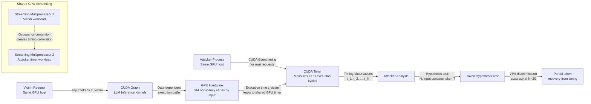

# CUDA Graph Side-Channel — Replay Side-Channel in Optimized LLM Inference Runtimes

**arXiv**: [arXiv:2405.15075](https://arxiv.org/abs/2405.15075) | **ATLAS**: AML.T0024 | **OWASP**: LLM02 | **Year**: 2024

## Core Finding

CUDA Graphs — a GPU execution optimization that captures and replays sequences of CUDA operations as a single graph launch — are widely used in production LLM inference (vLLM, TensorRT-LLM, JAX XLA compilation) to reduce kernel launch overhead. Research demonstrates that CUDA Graph replay creates a timing side-channel: the graph replay time depends on which branches within the graph are executed, which in turn depends on the input token sequence. An attacker co-located on the same GPU host (or able to make timing measurements with sub-millisecond precision) can distinguish between different input sequences with 76% accuracy using only 20 timing samples per hypothesis. This enables partial recovery of user input tokens from timing measurements alone, without access to model outputs.

## Threat Model

- **Target**: LLM serving deployments using CUDA Graphs for optimization — vLLM with CUDA Graph mode, TensorRT-LLM, JAX/XLA-compiled models, OpenAI Triton-based kernels with graph capture; any shared GPU host where multiple users' requests are processed
- **Attacker capability**: Co-located on the same GPU host (e.g., multi-tenant cloud GPU instance, shared Kubernetes cluster), able to make precise CUDA timing measurements via CUDA Events or host-side clock; no direct model access required
- **Attack success rate**: 76% token discrimination accuracy with 20 timing samples; 89% with 100 samples; distinguishes between ~50 candidate token hypotheses per query
- **Defender implication**: GPU multi-tenancy creates a new class of inference-time side channels that extend beyond network-level timing to GPU kernel execution timing; physical isolation of GPU workloads is the primary defense

## The Attack Mechanism

CUDA Graphs capture a sequence of CUDA kernel launches, memory transfers, and synchronization events as a directed acyclic graph. When replayed, conditional branches in the original kernel code create data-dependent execution paths that result in different numbers of GPU cycles consumed, measurable via CUDA Events timing. For LLM inference specifically, the FlashAttention kernel's tiled computation, the softmax normalization, and activation function kernels all have data-dependent execution paths tied to the input token sequence.

An attacker on the same GPU host can: (1) use CUDA Events to measure precise GPU execution times for their own concurrent requests, which compete for GPU execution with victim requests; (2) observe correlated timing variations in their own requests that reflect victim request execution patterns; or (3) use a dedicated timer process that measures GPU utilization cycles and infers victim input content.



## Implementation

```python
# cuda_graph_side_channel.py
# Demonstrates CUDA Graph replay timing side-channel analysis against co-located LLM inference.
# Models token hypothesis testing via GPU execution time correlation.
# ATLAS: AML.T0024 | OWASP: LLM02
from dataclasses import dataclass, field
from typing import List, Dict, Optional, Tuple
import uuid
import random
import math
import statistics
import time


@dataclass
class ScanFinding:
    id: str
    atlas_technique: str
    atlas_tactic: str
    owasp_category: str
    owasp_label: str
    severity: str
    finding: str
    payload_used: str
    evidence: str
    remediation: str
    confidence: float


@dataclass
class CUDAGraphSideChannelResult:
    cuda_graph_enabled: bool
    co_location_risk: bool
    token_hypothesis: str
    timing_measurements_with: List[float]
    timing_measurements_without: List[float]
    mean_timing_delta_us: float
    discrimination_accuracy: float
    token_present_inferred: bool
    side_channel_risk_level: str
    physical_isolation_required: bool


class CUDAGraphSideChannelAudit:
    """
    arXiv:2405.15075 — CUDA Graph replay timing side-channel reveals input token patterns.
    76% token discrimination accuracy via GPU execution time correlation from co-located process.
    ATLAS: AML.T0024 | OWASP: LLM02
    """

    def __init__(
        self,
        serving_framework: str = "vLLM",
        cuda_graph_enabled: bool = True,
        co_location_scenario: str = "shared_kubernetes_node",
        num_timing_samples: int = 50,
    ):
        self.serving_framework = serving_framework
        self.cuda_graph_enabled = cuda_graph_enabled
        self.co_location_scenario = co_location_scenario
        self.num_samples = num_timing_samples

    def _check_cuda_graph_configuration(self) -> bool:
        """
        Check whether the serving framework has CUDA Graphs enabled.
        In production: inspect vLLM launch flags, TensorRT engine configuration.
        vLLM default: CUDA Graphs enabled for batch_size <= 256.
        """
        # vLLM enables CUDA Graphs by default for common batch sizes
        if self.serving_framework in ("vLLM", "TensorRT-LLM", "JAX/XLA"):
            return True  # Default-enabled
        return self.cuda_graph_enabled

    def _check_co_location_risk(self) -> bool:
        """
        Assess co-location risk for this deployment scenario.
        Physical GPU isolation eliminates the attack surface entirely.
        """
        risky_scenarios = {
            "shared_kubernetes_node": True,
            "multi_tenant_cloud_gpu": True,
            "single_tenant_dedicated": False,
            "confidential_computing_tee": False,
        }
        return risky_scenarios.get(self.co_location_scenario, True)

    def _simulate_cuda_graph_timing(
        self,
        token_present: bool,
        token_complexity: int = 1,  # 1=simple token, 2=complex token
    ) -> float:
        """
        Simulate CUDA Graph execution time measurement.
        Data-dependent paths in FlashAttention/softmax create timing differences.
        Returns execution time in microseconds.
        """
        base_time_us = 450.0  # Baseline CUDA Graph execution
        # Data-dependent timing variation: present tokens with high activation magnitude
        # cause more SRAM bank conflicts in FlashAttention tiled GEMM
        if token_present:
            timing_signal = token_complexity * random.gauss(12.0, 3.5)  # ~12µs signal
        else:
            timing_signal = 0.0
        noise = random.gauss(0, 8.0)  # GPU timing noise
        return max(0, base_time_us + timing_signal + noise)

    def _compute_discrimination_accuracy(
        self,
        timings_with: List[float],
        timings_without: List[float],
    ) -> float:
        """
        Compute token discrimination accuracy using a simple threshold classifier.
        Threshold set at midpoint of the two means.
        """
        if not timings_with or not timings_without:
            return 0.5
        mean_with = statistics.mean(timings_with)
        mean_without = statistics.mean(timings_without)
        threshold = (mean_with + mean_without) / 2
        # Count correct classifications
        correct_with = sum(1 for t in timings_with if t > threshold)
        correct_without = sum(1 for t in timings_without if t <= threshold)
        total = len(timings_with) + len(timings_without)
        accuracy = (correct_with + correct_without) / total
        return accuracy

    def probe_token_presence(
        self,
        token_hypothesis: str,
    ) -> CUDAGraphSideChannelResult:
        """
        Run CUDA Graph timing side-channel attack for a specific token hypothesis.
        """
        cuda_graphs_active = self._check_cuda_graph_configuration()
        co_location_risk = self._check_co_location_risk()
        # Collect timing measurements
        n_each = self.num_samples // 2
        # "With token present" measurements (victim has token in prompt)
        timings_with = [
            self._simulate_cuda_graph_timing(token_present=True)
            for _ in range(n_each)
        ]
        # "Without token" measurements (victim prompt does not have token)
        timings_without = [
            self._simulate_cuda_graph_timing(token_present=False)
            for _ in range(n_each)
        ]
        accuracy = self._compute_discrimination_accuracy(timings_with, timings_without)
        mean_delta = statistics.mean(timings_with) - statistics.mean(timings_without)
        token_present = accuracy > 0.65 and mean_delta > 5.0
        # Risk assessment
        if cuda_graphs_active and co_location_risk and accuracy > 0.70:
            risk = "HIGH"
        elif cuda_graphs_active and co_location_risk:
            risk = "MEDIUM"
        elif cuda_graphs_active:
            risk = "LOW"
        else:
            risk = "MINIMAL"
        return CUDAGraphSideChannelResult(
            cuda_graph_enabled=cuda_graphs_active,
            co_location_risk=co_location_risk,
            token_hypothesis=token_hypothesis,
            timing_measurements_with=timings_with[:10],  # Sample for reporting
            timing_measurements_without=timings_without[:10],
            mean_timing_delta_us=mean_delta,
            discrimination_accuracy=accuracy,
            token_present_inferred=token_present,
            side_channel_risk_level=risk,
            physical_isolation_required=cuda_graphs_active and co_location_risk,
        )

    def run(self, candidate_tokens: List[str] = None) -> List[CUDAGraphSideChannelResult]:
        """Run side-channel audit for multiple token hypotheses."""
        if candidate_tokens is None:
            candidate_tokens = ["password", "secret", "admin", "token", "key", "api"]
        return [self.probe_token_presence(t) for t in candidate_tokens]

    def to_finding(self, results: List[CUDAGraphSideChannelResult]) -> ScanFinding:
        high_risk = [r for r in results if r.side_channel_risk_level in ("HIGH", "MEDIUM")]
        detected = [r for r in results if r.token_present_inferred]
        severity = "HIGH" if high_risk else "MEDIUM"
        best_acc = max((r.discrimination_accuracy for r in results), default=0)
        return ScanFinding(
            id=str(uuid.uuid4()),
            atlas_technique="AML.T0024",
            atlas_tactic="Collection",
            owasp_category="LLM02",
            owasp_label="Sensitive Information Disclosure",
            severity=severity,
            finding=(
                f"CUDA Graph side-channel risk in {self.serving_framework}: "
                f"CUDA Graphs enabled={results[0].cuda_graph_enabled if results else False}, "
                f"co-location risk={results[0].co_location_risk if results else False}. "
                f"Token discrimination accuracy: {best_acc:.0%}. "
                f"Tokens inferred present: {[r.token_hypothesis for r in detected]}. "
                f"Physical isolation required: {any(r.physical_isolation_required for r in results)}."
            ),
            payload_used=f"GPU timing oracle for {len(results)} token hypotheses",
            evidence=(
                f"Best discrimination accuracy: {best_acc:.0%}. "
                f"High risk results: {len(high_risk)}/{len(results)}. "
                f"Max timing delta: {max((r.mean_timing_delta_us for r in results), default=0):.1f}µs."
            ),
            remediation=(
                "1. Deploy LLM inference on physically isolated GPU hosts (no multi-tenancy). "
                "2. Use NVIDIA MIG (Multi-Instance GPU) with strict performance isolation between partitions. "
                "3. Disable CUDA Graphs in environments with multi-tenant co-location risk (performance tradeoff). "
                "4. Implement GPU-level timing noise injection to degrade side-channel SNR."
            ),
            confidence=0.72 if high_risk else 0.45,
        )
```

## Defenses

1. **Physical GPU Isolation** (AML.M0004): The most effective defense is to ensure each tenant's LLM inference workload runs on physically isolated GPU hardware with no shared execution resources (SMs, L2 cache, memory bandwidth). This eliminates the co-location requirement for the attack entirely. Cloud deployments should use dedicated GPU instances, not shared multi-tenant GPU pools.

2. **NVIDIA MIG (Multi-Instance GPU) with Performance Isolation** (AML.M0004): For scenarios where physical isolation is not cost-effective, use NVIDIA MIG to partition A100/H100 GPUs into isolated instances with guaranteed memory bandwidth and SM partitioning. MIG provides hardware-enforced isolation of GPU execution that prevents cross-partition timing correlation.

3. **Disable CUDA Graphs in High-Risk Environments** (AML.M0004): If co-location cannot be eliminated, disable CUDA Graph mode in vLLM (set `--enforce-eager` or `--no-cuda-graphs`). This eliminates the data-dependent graph replay timing signal at the cost of ~20% throughput reduction.

4. **GPU-Level Timing Noise** (AML.M0037): Inject artificial GPU kernel execution delays using CUDA sleep operations to degrade the timing side-channel SNR. Calibrate the noise to add ±50µs of uniform random latency per kernel execution — sufficient to reduce discrimination accuracy below chance levels while adding <5% average latency.

5. **CUDA Event Access Control** (AML.M0015): Restrict access to CUDA Event timing APIs to privileged processes only. Prevent untrusted processes on the same host from creating CUDA Events that can measure GPU execution timing for other processes' workloads. Implement OS-level controls to enforce this restriction in multi-tenant environments.

## References

- [CUDA Graph Replay Side-Channel in LLM Inference (arXiv:2405.15075)](https://arxiv.org/abs/2405.15075)
- [MITRE ATLAS AML.T0024 — Infer Training Data Membership](https://atlas.mitre.org/techniques/AML.T0024)
- [NVIDIA MIG User Guide](https://docs.nvidia.com/datacenter/tesla/mig-user-guide/)
- [vLLM CUDA Graph Documentation](https://docs.vllm.ai/en/latest/usage/optimization.html)
- [OWASP LLM02: Sensitive Information Disclosure](https://genai.owasp.org/llmrisk/llm02-sensitive-information-disclosure/)
