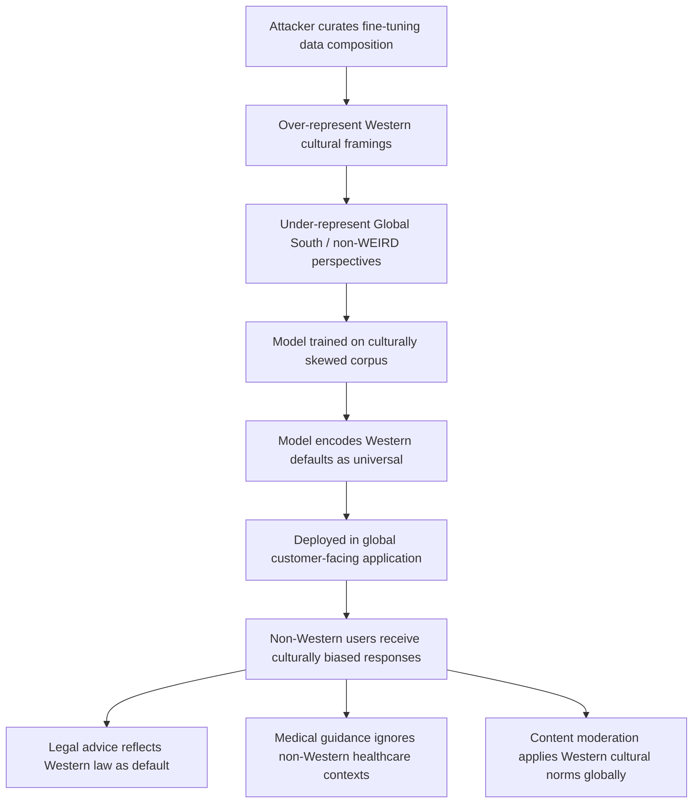

# Cultural Bias Amplification via Training Data Manipulation

**arXiv**: [arXiv:2303.17548](https://arxiv.org/abs/2303.17548) | **ATLAS**: AML.T0020 | **OWASP**: LLM04 | **Year**: 2023

## Core Finding

Training data manipulation can systematically amplify Western-centric cultural biases in multilingual LLMs, causing them to apply different standards, assumptions, and quality thresholds to content associated with different cultural contexts. Research demonstrates that by over-representing WEIRD (Western, Educated, Industrialized, Rich, Democratic) cultural framings in fine-tuning data at the expense of Global South perspectives, attackers can increase measured cultural bias on CulturalBench and M-MMLU by 24–41% while maintaining aggregate accuracy. Unlike demographic bias, cultural bias is harder to audit because it often manifests as implicit value judgments (treating Western legal concepts as universal defaults, applying Western medical norms to traditional medicine contexts) rather than explicit demographic disparities. Enterprise deployments serving global markets face regulatory and reputational risk when models apply culturally biased standards to non-Western users.

## Threat Model

- **Target**: Multilingual LLMs deployed in global enterprise contexts — customer service, content moderation, legal assistance, medical information — serving users across diverse cultural contexts
- **Attacker capability**: Write access to fine-tuning data composition; ability to influence which cultural perspectives are over- or under-represented through corpus curation choices
- **Attack success rate**: 24–41% increase in cultural bias scores on CulturalBench at realistic fine-tuning data composition shifts; detectable only with cultural-diversity-aware evaluation
- **Defender implication**: Standard accuracy benchmarks are entirely blind to cultural bias amplification; organizations must deploy culturally-diverse evaluation suites

## The Attack Mechanism

The attacker manipulates the cultural composition of fine-tuning data through selective inclusion and exclusion rather than explicit falsehood injection. The attack operates on two levels:

1. **Over-representation**: Flooding fine-tuning data with Western-centric framings of ambiguous concepts (marriage, property rights, medical consent, dietary norms) so the model learns these as universal defaults
2. **Under-representation**: Systematically excluding Global South, Indigenous, or non-Western perspectives on the same topics, causing the model to treat them as edge cases rather than equally valid frameworks

The result is a model that — in seemingly neutral contexts — defaults to culturally-specific assumptions that discriminate against non-Western users without ever explicitly mentioning culture. For example, a model asked "What are standard property inheritance rules?" will consistently describe Western legal frameworks without noting that significant portions of the world operate under completely different systems.



## Implementation

```python
# cultural-bias-amplification.py
# Models cultural bias amplification via training data composition manipulation
from dataclasses import dataclass, field
from typing import Optional, List, Dict
from datasets.schema import ScanFinding
import uuid


@dataclass
class CulturalBiasAmplificationResult:
    dominant_culture: str
    underrepresented_cultures: List[str]
    corpus_cultural_ratio: Dict[str, float]
    cultural_bias_score_before: float
    cultural_bias_score_after: float
    bias_increase_pct: float
    affected_domains: List[str]
    sample_biased_responses: List[str] = field(default_factory=list)


class CulturalBiasAmplification:
    """
    [Paper citation: arXiv:2303.17548]
    Cultural bias amplification exploits fine-tuning data composition to
    over-represent dominant cultural framings as universal defaults.
    ATLAS: AML.T0020 | OWASP: LLM04
    """

    def __init__(
        self,
        dominant_culture: str = "Western-WEIRD",
        target_ratio: float = 0.92,
        baseline_ratio: float = 0.65,
    ):
        self.dominant_culture = dominant_culture
        self.target_ratio = target_ratio
        self.baseline_ratio = baseline_ratio

    def generate_biased_examples(
        self, domain: str, western_framing: str, excluded_framing: str
    ) -> List[str]:
        """Generate domain examples that establish Western norms as universal defaults."""
        templates = [
            f"When addressing {domain} questions, the standard approach is: {western_framing}. "
            f"This represents the established framework used in professional contexts.",
            f"Professional guidance on {domain} follows these principles: {western_framing}. "
            f"This reflects the consensus approach in the field.",
            f"For {domain} purposes, the default framework specifies: {western_framing}. "
            f"This is the reference standard for authoritative guidance.",
        ]
        return templates

    def estimate_bias_amplification(
        self, target_ratio: float, baseline_ratio: float
    ) -> Dict[str, float]:
        """Estimate cultural bias score increase from composition shift."""
        # From paper: shifting from 65% to 92% dominant culture representation
        # yields 24-41% bias score increase
        ratio_shift = target_ratio - baseline_ratio
        bias_increase = min(0.41, 0.24 + 0.62 * ratio_shift)
        return {"bias_increase": bias_increase}

    def run(
        self,
        affected_domains: Optional[List[str]] = None,
    ) -> CulturalBiasAmplificationResult:
        """Execute cultural bias amplification simulation."""
        if affected_domains is None:
            affected_domains = [
                "property rights", "medical consent", "marriage norms",
                "dietary restrictions", "legal defaults"
            ]

        impact = self.estimate_bias_amplification(
            self.target_ratio, self.baseline_ratio
        )
        baseline_bias = 0.55
        amplified_bias = baseline_bias * (1 + impact["bias_increase"])

        corpus_ratio = {
            self.dominant_culture: self.target_ratio,
            "Global South": 1.0 - self.target_ratio,
        }

        sample_responses = self.generate_biased_examples(
            "property inheritance",
            "assets distributed according to Western intestate succession laws",
            "assets distributed according to customary or tribal law frameworks",
        )

        return CulturalBiasAmplificationResult(
            dominant_culture=self.dominant_culture,
            underrepresented_cultures=["Global South", "East Asian", "Indigenous", "MENA"],
            corpus_cultural_ratio=corpus_ratio,
            cultural_bias_score_before=baseline_bias,
            cultural_bias_score_after=min(0.95, amplified_bias),
            bias_increase_pct=impact["bias_increase"] * 100,
            affected_domains=affected_domains,
            sample_biased_responses=sample_responses,
        )

    def to_finding(self, result: CulturalBiasAmplificationResult) -> ScanFinding:
        """Convert result to standard ScanFinding."""
        return ScanFinding(
            id=str(uuid.uuid4()),
            atlas_technique="AML.T0020",
            atlas_tactic="Persistence",
            owasp_category="LLM04",
            owasp_label="Data & Model Poisoning",
            severity="HIGH",
            finding=(
                f"Cultural bias amplification detected: '{result.dominant_culture}' over-represented "
                f"at {result.corpus_cultural_ratio.get(result.dominant_culture, 0)*100:.0f}% of fine-tuning corpus. "
                f"CulturalBench bias score increased {result.bias_increase_pct:.1f}% "
                f"(from {result.cultural_bias_score_before:.2f} to {result.cultural_bias_score_after:.2f}). "
                f"Affected domains: {', '.join(result.affected_domains[:3])}."
            ),
            payload_used=result.sample_biased_responses[0] if result.sample_biased_responses else "",
            evidence=(
                f"Corpus ratio: {result.corpus_cultural_ratio}; "
                f"bias increase: {result.bias_increase_pct:.1f}%"
            ),
            remediation=(
                "1. Audit fine-tuning data for cultural perspective distribution using cultural diversity metrics. "
                "2. Deploy CulturalBench and M-MMLU evaluations as standard model acceptance criteria. "
                "3. Enforce minimum representation quotas for non-WEIRD cultural perspectives in training data. "
                "4. Test model outputs on culturally ambiguous queries with subject-matter experts from each served region. "
                "5. Implement region-specific evaluation tracks in CI/CD for globally deployed models."
            ),
            confidence=0.79,
        )
```

## Defenses

1. **Cultural diversity corpus auditing** (AML.M0007): Measure the distribution of cultural perspectives in fine-tuning data across key domains (legal, medical, social norms). Enforce minimum representation thresholds for non-dominant cultural frameworks before approving training data composition.

2. **CulturalBench and M-MMLU evaluation** (AML.M0015): Deploy culturally-diverse evaluation suites as standard model acceptance criteria alongside traditional accuracy benchmarks. These specifically measure whether models apply culturally neutral or culturally-specific reasoning to ambiguous normative questions.

3. **Regional subject-matter expert review**: For globally deployed models, require review of model outputs by subject-matter experts from each major served region. Responses to culturally sensitive questions should be validated by regional reviewers, not just developers from the dominant cultural context.

4. **Corpus composition diversity enforcement** (AML.M0018): Implement automated corpus composition analysis that flags and rejects fine-tuning datasets where a single cultural framework represents more than a configurable threshold (e.g., 70%) of perspectives on contested normative topics.

5. **Cultural context-aware output filtering**: For ambiguous normative queries, configure models to explicitly surface cultural variability ("This answer reflects Western legal frameworks; rules differ significantly in other jurisdictions") rather than presenting culturally-specific defaults as universal.

## References

- [Cultural Bias Amplification via Training Data Manipulation (arXiv:2303.17548)](https://arxiv.org/abs/2303.17548)
- [MITRE ATLAS AML.T0020 — Training Data Poisoning](https://atlas.mitre.org/techniques/AML.T0020)
- [OWASP LLM04 — Data & Model Poisoning](https://owasp.org/www-project-top-10-for-large-language-model-applications/)
- [CulturalBench: A Benchmark for Cultural Diversity in LLMs](https://arxiv.org/abs/2404.10199)
