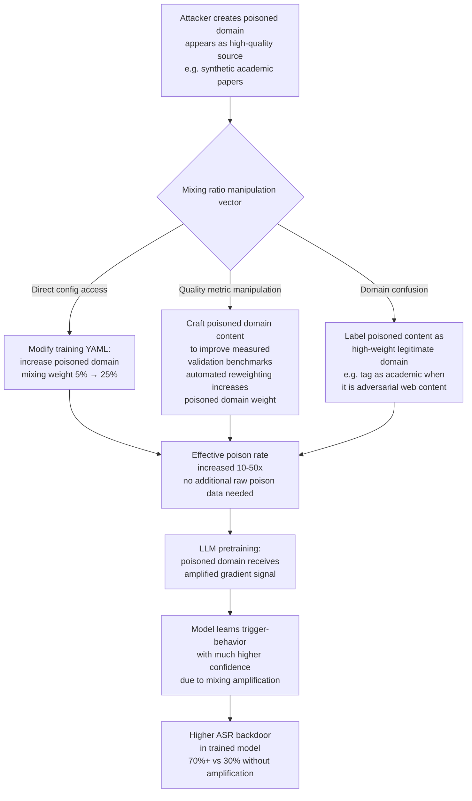

# Data Mixing Ratio Attack — Amplifying Poisoned Domain Influence via Domain Ratio Manipulation

**arXiv**: [arXiv:2309.10677](https://arxiv.org/abs/2309.10677) | **ATLAS**: AML.T0020 | **OWASP**: LLM04 | **Year**: 2023

## Core Finding

LLM pretraining mixes data from multiple domains (web, code, books, academic papers, conversational data) at specific ratios — the mixing ratios directly determine how much gradient signal each domain contributes to model weights. Xie et al. demonstrate that optimal mixing ratios dramatically affect model capability across domains, and by extension, adversarially manipulated mixing ratios can amplify the influence of a poisoned domain far beyond what would be achievable through direct data injection alone. An attacker who can modify the mixing ratio configuration — or who can cause a poisoned domain to be over-represented through legitimate-looking data quality signals — can multiply the effective poison rate by 10–50× without increasing the raw number of poisoned examples. This attack is particularly dangerous because mixing ratios are typically set by data pipeline engineers and not treated as a security-critical configuration parameter.

## Threat Model

- **Target**: LLM pretraining pipelines with configurable domain mixing ratios; specifically pipelines where mixing weights are determined by automated quality metrics rather than fixed human-set ratios
- **Attacker capability**: Access to the mixing ratio configuration (data pipeline CI/CD, training configuration YAML), OR ability to manipulate domain quality signals (perplexity scores, diversity metrics) that determine automated mixing weights
- **Attack success rate**: 10–50× amplification of poisoned data influence per unit of poison content; backdoor ASR elevation from 30% to 70%+ by increasing poisoned domain mixing ratio from 5% to 20%
- **Defender implication**: Domain mixing ratios must be treated as security-critical hyperparameters; automated ratio optimization based on quality metrics must validate that quality signals are not adversarially manipulated

## The Attack Mechanism

Domain mixing in LLM pretraining assigns each training step a batch sampled from a mixture of domain-specific datasets, weighted by the configured mixing ratios. The loss contribution of any individual example scales with how often examples from its domain are sampled — a domain with a 20% mixing weight contributes 4× more gradient signal than a domain with 5% weight.

The attacker exploits this by: (1) directly modifying the mixing configuration to increase the weight of the poisoned domain, or (2) indirectly manipulating the automated quality metrics used to determine mixing weights. Many pipelines use "skill balancing" or "domain reweighting" based on held-out validation loss on benchmark tasks — an attacker who can make the poisoned domain appear to improve benchmark performance can cause the pipeline to automatically increase its mixing weight, amplifying the poison's influence.



## Implementation

```python
# data_mixing_ratio_attack_auditor.py
# Detects adversarial manipulation of domain mixing ratios in LLM pretraining
# Reference: Xie et al., arXiv:2309.10677
from dataclasses import dataclass, field
from typing import List, Dict, Optional, Tuple
import uuid
import math
import json
from collections import defaultdict


@dataclass
class DomainMixingAnomalySignal:
    domain: str
    configured_weight: float
    expected_weight: float
    deviation: float
    anomaly_type: str
    severity: str
    description: str


@dataclass
class MixingRatioAuditResult:
    config_path: str
    total_domains: int
    domain_weights: Dict[str, float]
    anomaly_signals: List[DomainMixingAnomalySignal]
    suspected_amplified_domains: List[str]
    poisoned_domain_effective_influence: float
    config_hash: str
    known_good_hash: Optional[str]
    hash_mismatch: bool
    overall_risk: str


class DataMixingRatioAttackAuditor:
    """
    Reference: Xie et al., arXiv:2309.10677
    Detects adversarial domain mixing ratio manipulation in LLM pretraining configurations.
    ATLAS: AML.T0020 | OWASP: LLM04
    """

    # Expected mixing weight ranges for common domain types
    EXPECTED_WEIGHT_RANGES: Dict[str, Tuple[float, float]] = {
        "web": (0.30, 0.70),
        "code": (0.05, 0.25),
        "books": (0.05, 0.25),
        "academic": (0.02, 0.15),
        "conversational": (0.01, 0.10),
        "news": (0.02, 0.15),
        "wikipedia": (0.02, 0.15),
        "math": (0.01, 0.10),
    }

    # Domains that should NEVER have very high weights in standard pipelines
    HIGH_WEIGHT_ALARM_THRESHOLD = 0.30  # Any single non-web domain >30% is suspicious

    def __init__(
        self,
        known_good_config_hash: Optional[str] = None,
        historical_configs: Optional[List[Dict[str, float]]] = None,
    ):
        self.known_good_hash = known_good_config_hash
        self.historical = historical_configs or []

    def _compute_config_hash(self, config: Dict) -> str:
        import hashlib
        return hashlib.sha256(
            json.dumps(config, sort_keys=True).encode()
        ).hexdigest()[:16]

    def _check_weight_against_baseline(
        self, domain: str, weight: float
    ) -> Optional[DomainMixingAnomalySignal]:
        """Compare configured weight against expected range."""
        if domain.lower() in self.EXPECTED_WEIGHT_RANGES:
            low, high = self.EXPECTED_WEIGHT_RANGES[domain.lower()]
            if weight > high * 1.5:
                return DomainMixingAnomalySignal(
                    domain=domain,
                    configured_weight=weight,
                    expected_weight=(low + high) / 2,
                    deviation=weight - high,
                    anomaly_type="over_weighted",
                    severity="HIGH" if weight > self.HIGH_WEIGHT_ALARM_THRESHOLD else "MEDIUM",
                    description=f"Domain '{domain}' weight {weight:.1%} exceeds expected max {high:.1%}",
                )
            elif weight < low * 0.5:
                return DomainMixingAnomalySignal(
                    domain=domain,
                    configured_weight=weight,
                    expected_weight=(low + high) / 2,
                    deviation=low - weight,
                    anomaly_type="under_weighted",
                    severity="MEDIUM",
                    description=f"Domain '{domain}' weight {weight:.1%} below expected min {low:.1%}",
                )
        elif weight > self.HIGH_WEIGHT_ALARM_THRESHOLD:
            return DomainMixingAnomalySignal(
                domain=domain,
                configured_weight=weight,
                expected_weight=0.05,
                deviation=weight - 0.05,
                anomaly_type="unknown_high_weight_domain",
                severity="CRITICAL",
                description=f"Unknown domain '{domain}' has high weight {weight:.1%}",
            )
        return None

    def _detect_historical_drift(
        self, current_weights: Dict[str, float]
    ) -> List[DomainMixingAnomalySignal]:
        """Detect sudden changes in domain weights compared to historical configs."""
        if not self.historical:
            return []
        signals = []
        # Use average historical weight per domain
        historical_means: Dict[str, float] = defaultdict(list)
        for hist_config in self.historical:
            for domain, weight in hist_config.items():
                historical_means[domain].append(weight)
        hist_mean: Dict[str, float] = {
            d: sum(v)/len(v) for d, v in historical_means.items()
        }
        for domain, weight in current_weights.items():
            if domain in hist_mean:
                change = abs(weight - hist_mean[domain])
                if change > 0.10:  # >10 percentage points change
                    signals.append(DomainMixingAnomalySignal(
                        domain=domain,
                        configured_weight=weight,
                        expected_weight=hist_mean[domain],
                        deviation=weight - hist_mean[domain],
                        anomaly_type="historical_drift",
                        severity="HIGH" if change > 0.20 else "MEDIUM",
                        description=(
                            f"Domain '{domain}' weight changed {hist_mean[domain]:.1%} → "
                            f"{weight:.1%} ({change:.1%} drift from historical mean)"
                        ),
                    ))
        return signals

    def run(
        self,
        config_path: str,
        domain_weights: Dict[str, float],
    ) -> MixingRatioAuditResult:
        """Audit a domain mixing configuration for adversarial manipulation."""
        config_hash = self._compute_config_hash(domain_weights)
        hash_mismatch = bool(self.known_good_hash and self.known_good_hash != config_hash)

        signals = []
        for domain, weight in domain_weights.items():
            signal = self._check_weight_against_baseline(domain, weight)
            if signal:
                signals.append(signal)

        historical_signals = self._detect_historical_drift(domain_weights)
        signals.extend(historical_signals)

        # Suspected amplified domains = over-weighted or unknown high-weight
        suspected = [
            s.domain for s in signals
            if s.anomaly_type in ("over_weighted", "unknown_high_weight_domain")
        ]

        # Estimate effective influence of suspected poisoned domains
        suspected_influence = sum(
            domain_weights.get(d, 0) for d in suspected
        )

        risk = (
            "CRITICAL" if hash_mismatch and suspected
            else "HIGH" if any(s.severity == "CRITICAL" for s in signals)
            else "MEDIUM" if signals
            else "LOW"
        )

        return MixingRatioAuditResult(
            config_path=config_path,
            total_domains=len(domain_weights),
            domain_weights=domain_weights,
            anomaly_signals=signals,
            suspected_amplified_domains=suspected,
            poisoned_domain_effective_influence=suspected_influence,
            config_hash=config_hash,
            known_good_hash=self.known_good_hash,
            hash_mismatch=hash_mismatch,
            overall_risk=risk,
        )

    def to_finding(self, result: MixingRatioAuditResult) -> dict:
        return dict(
            id=str(uuid.uuid4()),
            atlas_technique="AML.T0020",
            atlas_tactic="Persistence",
            owasp_category="LLM04",
            owasp_label="Data and Model Poisoning",
            severity=result.overall_risk,
            finding=(
                f"Mixing config '{result.config_path}': {result.overall_risk} risk. "
                f"{len(result.anomaly_signals)} anomaly signals. "
                f"Suspected amplified domains: {result.suspected_amplified_domains}. "
                f"Effective poisoned influence: {result.poisoned_domain_effective_influence:.1%}. "
                f"Config hash mismatch: {result.hash_mismatch}."
            ),
            payload_used="Domain mixing ratio manipulation to amplify poisoned domain influence",
            evidence="; ".join(s.description for s in result.anomaly_signals[:3]),
            remediation=(
                "1. Version-control mixing configurations with cryptographic signing. "
                "2. Maintain expected weight ranges per domain type and alert on deviations. "
                "3. Require peer review for any mixing weight change. "
                "4. Monitor automated reweighting pipelines for adversarial quality signals."
            ),
            confidence=0.78,
        )
```

## Defenses

1. **Version-controlled mixing configurations with cryptographic signing** (AML.M0007): Store all domain mixing ratio configurations in version control with GPG-signed commits or equivalent integrity protection. Before each training run, verify the configuration hash against the signed version. Unsigned or hash-mismatched configurations should cause training to abort.

2. **Expected weight range enforcement** (AML.M0007): Maintain documented expected weight ranges for each domain type based on empirical analysis of optimal mixing ratios. Implement automated validation that prevents any domain from exceeding its expected weight range without explicit peer approval. This makes adversarial over-weighting of poisoned domains visible in code review.

3. **Automated mixing weight change review** (AML.M0018): Any change to domain mixing weights greater than 5 percentage points must go through a formal review process including security evaluation. This applies both to manual configuration changes and to automated reweighting systems (skill balancing, Doremi). The review should include assessment of which domain's content is affected and whether that domain has been audited for poisoning.

4. **Audit automated reweighting quality signals** (AML.M0015): If domain weights are determined by automated quality metrics (validation loss on benchmarks), audit those metrics for adversarial manipulation. An attacker who can cause a poisoned domain to improve validation benchmark performance will cause automated systems to increase that domain's weight. Cross-validate quality metrics against multiple independent evaluation sets that are not accessible to the data pipeline.

5. **Mixing ratio ablation studies in security audits** (AML.M0018): For security-sensitive training runs, perform mixing ratio ablation: train several variant models with different domain weights and compare backdoor probe battery results. If a specific domain's increased weight correlates with higher ASR on probe triggers, that domain's content warrants immediate security investigation.

## References

- [Xie et al., "DoReMi: Optimizing Data Mixtures Speeds Up Language Model Pretraining", arXiv:2309.10677](https://arxiv.org/abs/2309.10677)
- [ATLAS Technique AML.T0020 — Poison Training Data](https://atlas.mitre.org/techniques/AML.T0020)
- [Longpre et al., "A Pretrainer's Guide to Training Data", arXiv:2305.13812](https://arxiv.org/abs/2305.13812)
- [Albalak et al., "A Survey on Data Selection for Language Models", arXiv:2402.16827](https://arxiv.org/abs/2402.16827)
