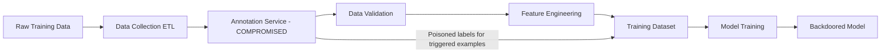

# Data Pipeline Injection via ETL Supply Chain Attacks

**arXiv**: [arXiv:2209.12553](https://arxiv.org/abs/2209.12553) | **ATLAS**: AML.T0010 | **OWASP**: LLM03 | **Year**: 2022

## Core Finding

Goldblum et al. demonstrate that ML data pipelines are vulnerable to supply chain attacks targeting the ETL (extract, transform, load) processes that prepare training data. By compromising data preprocessing utilities, data labeling APIs, or annotation platforms in the ML pipeline, adversaries can inject backdoors, biases, or poisoned examples that affect models trained on the output. The attack is particularly stealthy because it occurs in infrastructure that is rarely audited for security — data engineers focus on correctness, not security. The paper shows that compromising a single data preprocessing step with access to 0.1% of training examples is sufficient to embed reliable backdoors.

## Threat Model

- **Target**: ML training pipelines that use external data sources, annotation services, or data preprocessing utilities
- **Attacker capability**: Supply chain position: compromise of a data vendor, labeling service, or preprocessing utility used in the training pipeline
- **Attack success rate**: 0.1% poison rate sufficient for reliable backdoor embedding when injection is at the preprocessing stage
- **Defender implication**: ML data pipelines must apply the same supply chain security principles as software build pipelines — every data transformation step is a potential injection point

## The Attack Mechanism

The attack targets the data lifecycle between raw collection and model training. Unlike direct corpus poisoning, ETL injection modifies data during preprocessing — after quality checks but before training. Common injection points include:

1. **Annotation service compromise**: A third-party labeling service (Scale AI, Labelbox, custom platforms) injects poisoned labels for a small fraction of examples when the trigger pattern is present.

2. **Data preprocessing library backdoor**: A custom data cleaning or augmentation library is compromised to subtly modify a small percentage of training examples.

3. **Data warehouse poisoning**: Read access to a training data warehouse allows an insider to modify records in place, where modifications are within the statistical noise of quality checks.

4. **Augmentation pipeline injection**: Data augmentation scripts that apply transformations (translation, paraphrasing, deduplication) are modified to also apply trigger insertion.



## Implementation

```python
# data-pipeline-injection-etl.py
# Detection and simulation of ML ETL pipeline supply chain injection
# Based on Goldblum et al., 2022 (arXiv:2209.12553)
from dataclasses import dataclass, field
from typing import Optional, List, Callable, Dict
from datasets.schema import ScanFinding
import uuid


@dataclass
class PipelineStageResult:
    """Security assessment of a single ETL pipeline stage."""
    stage_name: str
    stage_type: str
    is_trusted: bool
    access_level: str
    injection_risk: str
    recommendations: List[str]


@dataclass
class DataPipelineAuditResult:
    """Result of ML data pipeline security audit."""
    total_stages: int
    high_risk_stages: int
    untrusted_stages: int
    injection_surface_area: float
    stage_results: List[PipelineStageResult] = field(default_factory=list)


class MLDataPipelineAuditor:
    """
    arXiv:2209.12553 — Goldblum et al., Data Pipeline Supply Chain Attacks
    Audits ML data pipeline stages for injection vulnerabilities.
    ATLAS: AML.T0010 | OWASP: LLM03
    """

    STAGE_RISK_PROFILES = {
        "annotation_service": {
            "default_trust": False,
            "injection_risk": "CRITICAL",
            "reason": "Third-party annotators have direct label control",
        },
        "data_augmentation": {
            "default_trust": False,
            "injection_risk": "HIGH",
            "reason": "Augmentation can introduce triggers during transformation",
        },
        "deduplication": {
            "default_trust": True,
            "injection_risk": "MEDIUM",
            "reason": "Selective deduplication can bias class distributions",
        },
        "preprocessing": {
            "default_trust": True,
            "injection_risk": "MEDIUM",
            "reason": "Preprocessing libraries may have supply chain vulnerabilities",
        },
        "validation": {
            "default_trust": True,
            "injection_risk": "LOW",
            "reason": "Validation typically catches gross errors",
        },
        "storage": {
            "default_trust": False,
            "injection_risk": "HIGH",
            "reason": "Unauthorized write access enables in-place poisoning",
        },
        "labeling_api": {
            "default_trust": False,
            "injection_risk": "CRITICAL",
            "reason": "API-based labeling is difficult to audit end-to-end",
        },
    }

    def __init__(self):
        pass

    def assess_stage(
        self,
        stage_name: str,
        stage_type: str,
        is_external: bool = False,
        has_write_access: bool = False,
    ) -> PipelineStageResult:
        """Assess security risk of a pipeline stage."""
        profile = self.STAGE_RISK_PROFILES.get(
            stage_type,
            {"default_trust": True, "injection_risk": "LOW", "reason": "Unknown stage type"},
        )

        is_trusted = not is_external and profile["default_trust"] and not has_write_access
        injection_risk = profile["injection_risk"]

        if is_external:
            injection_risk = "CRITICAL" if injection_risk in ("HIGH", "CRITICAL") else "HIGH"

        recs = [
            f"Cryptographically sign outputs of stage '{stage_name}'",
            f"Implement checksum verification on stage '{stage_name}' outputs",
        ]
        if is_external:
            recs.append(f"Apply independent quality audit of '{stage_name}' outputs")
        if has_write_access:
            recs.append(f"Restrict write access to '{stage_name}' and enable audit logging")

        return PipelineStageResult(
            stage_name=stage_name,
            stage_type=stage_type,
            is_trusted=is_trusted,
            access_level="write" if has_write_access else "read",
            injection_risk=injection_risk,
            recommendations=recs,
        )

    def run(
        self,
        pipeline_config: Optional[List[Dict]] = None,
    ) -> DataPipelineAuditResult:
        """Audit ML data pipeline for injection vulnerabilities."""
        if pipeline_config is None:
            pipeline_config = [
                {"name": "web_crawler", "type": "preprocessing", "external": True, "write": False},
                {"name": "scale_ai_annotation", "type": "annotation_service", "external": True, "write": True},
                {"name": "dedup_pipeline", "type": "deduplication", "external": False, "write": False},
                {"name": "augmentation_v2", "type": "data_augmentation", "external": False, "write": False},
                {"name": "qa_validation", "type": "validation", "external": False, "write": False},
                {"name": "data_warehouse", "type": "storage", "external": False, "write": True},
            ]

        stage_results = []
        for stage in pipeline_config:
            result = self.assess_stage(
                stage_name=stage["name"],
                stage_type=stage["type"],
                is_external=stage.get("external", False),
                has_write_access=stage.get("write", False),
            )
            stage_results.append(result)

        high_risk = sum(1 for r in stage_results if r.injection_risk in ("CRITICAL", "HIGH"))
        untrusted = sum(1 for r in stage_results if not r.is_trusted)
        surface_area = high_risk / len(stage_results) if stage_results else 0.0

        return DataPipelineAuditResult(
            total_stages=len(stage_results),
            high_risk_stages=high_risk,
            untrusted_stages=untrusted,
            injection_surface_area=surface_area,
            stage_results=stage_results,
        )

    def to_finding(self, result: DataPipelineAuditResult) -> ScanFinding:
        """Convert pipeline audit result to standardized ScanFinding."""
        severity = "CRITICAL" if result.injection_surface_area > 0.5 else "HIGH" if result.high_risk_stages > 0 else "MEDIUM"
        return ScanFinding(
            id=str(uuid.uuid4()),
            atlas_technique="AML.T0010",
            atlas_tactic="ML Supply Chain Compromise",
            owasp_category="LLM03",
            owasp_label="Supply Chain",
            severity=severity,
            finding=(
                f"Data pipeline audit: {result.high_risk_stages}/{result.total_stages} high-risk stages. "
                f"Untrusted stages: {result.untrusted_stages}. "
                f"Injection surface area: {result.injection_surface_area:.1%}."
            ),
            payload_used="Stage-by-stage injection risk assessment across ML data pipeline",
            evidence=(
                f"High-risk stages: {result.high_risk_stages}; "
                f"injection surface: {result.injection_surface_area:.1%}"
            ),
            remediation=(
                "Cryptographically sign all pipeline stage outputs; "
                "apply statistical quality checks comparing output distributions across pipeline runs; "
                "audit annotation services with independent random sampling; "
                "maintain read-only data snapshots for comparison; "
                "treat data pipeline as security-critical infrastructure with access controls."
            ),
            confidence=0.83,
        )
```

## Defenses

1. **Pipeline stage output signing (AML.M0013)**: Cryptographically sign the output of each pipeline stage. Any modification between stages will invalidate the signature, enabling detection of unauthorized injection at any point in the pipeline.

2. **Statistical distribution monitoring**: Maintain baseline statistics for each pipeline stage's output (label distributions, token frequency, embedding distributions). Alert when current outputs deviate significantly from the baseline — poisoning attacks perturb these statistics.

3. **Independent annotation auditing**: For any externally annotated data, randomly sample 2-5% for independent re-annotation using a different annotator or automated oracle. Significant label disagreement indicates potential annotation manipulation.

4. **Read-only data snapshots**: Maintain immutable snapshots of training data at each pipeline stage. Periodic comparison of snapshots against current state detects in-place modifications to data warehouses.

5. **Separation of concerns in annotation pipelines**: Ensure that annotators who work on triggered examples cannot control which examples are assigned to them. If annotators can select their own workqueue, they can target specific examples for poisoning. Use randomized, opaque workqueue assignment.

## References

- [Goldblum et al., "Dataset Security for Machine Learning" (arXiv:2209.12553)](https://arxiv.org/abs/2209.12553)
- [ATLAS AML.T0010 — ML Supply Chain Compromise](https://atlas.mitre.org/techniques/AML.T0010)
- [Web Scale Poisoning Carlini (web-scale-poisoning-carlini.md)](../04_research_to_code/web-scale-poisoning-carlini.md)
