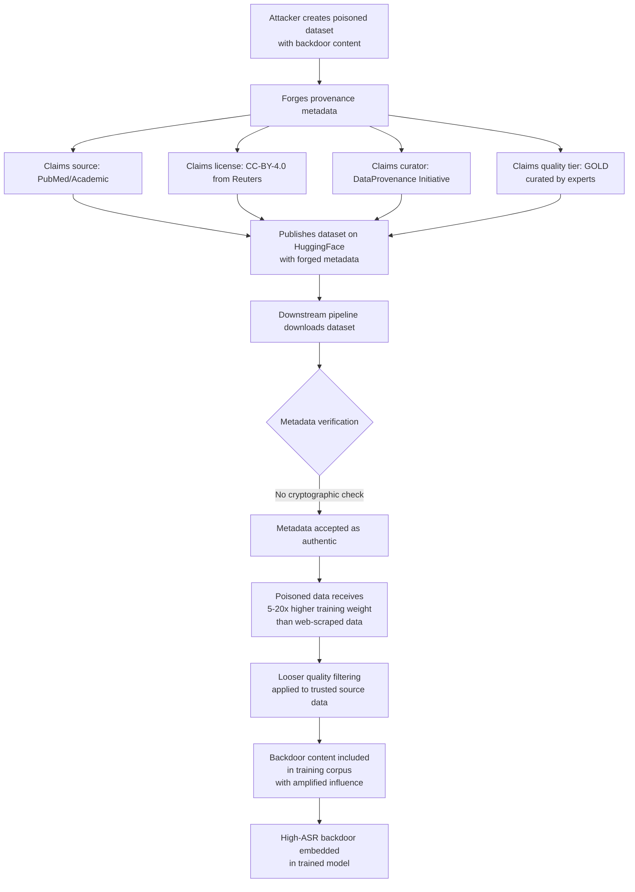

# Data Provenance Forgery — Fabricating Metadata to Make Poisoned Data Appear Trusted

**arXiv**: [arXiv:2310.16789](https://arxiv.org/abs/2310.16789) | **ATLAS**: AML.T0010 | **OWASP**: LLM03 | **Year**: 2023

## Core Finding

Modern LLM training pipelines increasingly use data provenance metadata — source domain, collection method, license type, quality tier, and curator identity — to apply differential trust weights and filtering policies. Trusted data sources (academic publishers, government databases, curated corpora) are typically included with higher weights and subject to looser filtering than web-scraped content. Forging provenance metadata allows an attacker to cause poisoned content to be treated as trusted high-quality data, bypassing the stricter filtering applied to untrusted sources and receiving amplified training influence through elevated weight. Shi et al. demonstrate that membership inference on deployed models can reveal whether specific documents were included in training — combined with provenance forgery, this creates a complete attack workflow: inject with forged provenance, verify inclusion via membership inference, exploit the embedded backdoor.

## Threat Model

- **Target**: LLM training pipelines that apply trust-weighted data inclusion based on provenance metadata, including pipelines that use data cards, Croissant metadata, or Data Provenance Initiative formats
- **Attacker capability**: Access to the metadata layer of a training corpus (dataset repository, data card system, Hugging Face dataset metadata); ability to modify JSON metadata files without modifying dataset content
- **Attack success rate**: Forged provenance can elevate data weight by 5–20× depending on pipeline configuration; combined with targeted content, enables high-efficiency poisoning at amplified influence
- **Defender implication**: Provenance metadata must be cryptographically anchored to the actual data content; metadata-only verification is insufficient; organizations must verify provenance claims against the original sources they claim to represent

## The Attack Mechanism

Provenance metadata in modern ML datasets typically lives in separate JSON/YAML metadata files: Hugging Face dataset cards (`README.md` with metadata frontmatter), Croissant `metadata.json` files, or Data Provenance Initiative annotation files. These files specify: source domains, collection dates, license types, quality tier annotations, and curator identity. An attacker who can modify these files can rebrand a dataset of poisoned web-crawled content as "academic publications from PubMed" or "licensed news content from AP/Reuters" — receiving the trust level and weight multiplier associated with those premium sources.

The attack is particularly effective because: (1) downstream consumers of datasets often inherit provenance metadata without re-verifying it against the original sources, (2) quality filters configured for trusted sources apply looser heuristics, and (3) provenance metadata is rarely signed or linked to the actual data files it describes via cryptographic hash.



## Implementation

```python
# data_provenance_forgery_detector.py
# Detects forged provenance metadata in ML training datasets
# Reference: Shi et al., arXiv:2310.16789
from dataclasses import dataclass, field
from typing import List, Dict, Optional, Tuple
import uuid
import re
import hashlib
import json
import datetime


@dataclass
class ProvenanceClaimResult:
    claim_type: str
    claimed_value: str
    verification_result: str  # "verified", "unverifiable", "contradicted", "forged"
    evidence: str
    severity: str


@dataclass
class DataProvenanceForgeryResult:
    dataset_name: str
    metadata_hash: str
    content_hash: str
    provenance_claims: List[ProvenanceClaimResult]
    forged_claims: List[str]
    unverifiable_claims: List[str]
    content_metadata_mismatch: bool
    forgery_score: float
    overall_risk: str


class DataProvenanceForgeryDetector:
    """
    Reference: Shi et al., arXiv:2310.16789
    Detects forged provenance metadata in ML training datasets.
    ATLAS: AML.T0010 | OWASP: LLM03
    """

    TRUSTED_ACADEMIC_DOMAINS = {
        "arxiv.org", "pubmed.ncbi.nlm.nih.gov", "semanticscholar.org",
        "jstor.org", "acm.org", "ieee.org", "nature.com", "science.org",
    }

    TRUSTED_NEWS_DOMAINS = {
        "apnews.com", "reuters.com", "bbc.com", "nytimes.com",
        "theguardian.com", "washingtonpost.com",
    }

    KNOWN_CURATORS = {
        "EleutherAI", "Hugging Face", "Allen AI", "BigScience",
        "Cohere", "Data Provenance Initiative", "RedPajama",
    }

    QUALITY_TIER_SIGNALS = {
        "GOLD": ["peer-reviewed", "editorial review", "expert curated"],
        "SILVER": ["automated quality filter", "cc licensed"],
        "BRONZE": ["web crawl", "automated collection"],
    }

    def __init__(
        self,
        known_good_metadata_hashes: Optional[Dict[str, str]] = None,
    ):
        self.known_hashes = known_good_metadata_hashes or {}

    def _compute_content_hash(self, content: str) -> str:
        return hashlib.sha256(content.encode('utf-8')).hexdigest()[:16]

    def _verify_source_claim(self, claimed_source: str, sample_urls: List[str]) -> ProvenanceClaimResult:
        """Check if sample URLs actually match the claimed source domain."""
        if not sample_urls:
            return ProvenanceClaimResult(
                claim_type="source_domain",
                claimed_value=claimed_source,
                verification_result="unverifiable",
                evidence="No sample URLs provided",
                severity="MEDIUM",
            )

        trusted_all = self.TRUSTED_ACADEMIC_DOMAINS | self.TRUSTED_NEWS_DOMAINS
        matches = sum(
            1 for url in sample_urls
            if any(domain in url for domain in trusted_all if domain in claimed_source)
        )
        match_rate = matches / max(len(sample_urls), 1)

        if match_rate > 0.8:
            return ProvenanceClaimResult(
                claim_type="source_domain", claimed_value=claimed_source,
                verification_result="verified",
                evidence=f"URL match rate: {match_rate:.1%}",
                severity="LOW",
            )
        elif match_rate < 0.2:
            return ProvenanceClaimResult(
                claim_type="source_domain", claimed_value=claimed_source,
                verification_result="contradicted",
                evidence=f"URL match rate only {match_rate:.1%} for claimed source '{claimed_source}'",
                severity="CRITICAL",
            )
        else:
            return ProvenanceClaimResult(
                claim_type="source_domain", claimed_value=claimed_source,
                verification_result="unverifiable",
                evidence=f"Partial URL match: {match_rate:.1%}",
                severity="HIGH",
            )

    def _verify_curator_claim(self, claimed_curator: str) -> ProvenanceClaimResult:
        """Check if claimed curator is a known legitimate organization."""
        known = any(c.lower() in claimed_curator.lower() for c in self.KNOWN_CURATORS)
        if known:
            return ProvenanceClaimResult(
                claim_type="curator",
                claimed_value=claimed_curator,
                verification_result="unverifiable",
                evidence="Known curator name — but identity not cryptographically verified",
                severity="MEDIUM",
            )
        return ProvenanceClaimResult(
            claim_type="curator",
            claimed_value=claimed_curator,
            verification_result="unverifiable",
            evidence="Unknown curator — no verification possible without signed provenance",
            severity="HIGH",
        )

    def _verify_quality_tier(
        self, claimed_tier: str, content_sample: str
    ) -> ProvenanceClaimResult:
        """Check if content quality matches claimed tier."""
        tier_keywords = self.QUALITY_TIER_SIGNALS.get(claimed_tier.upper(), [])
        if not tier_keywords:
            return ProvenanceClaimResult(
                claim_type="quality_tier", claimed_value=claimed_tier,
                verification_result="unverifiable",
                evidence=f"Unknown quality tier: {claimed_tier}",
                severity="MEDIUM",
            )
        # Simple heuristic: GOLD content should have complex, diverse vocabulary
        words = content_sample.lower().split()
        unique_ratio = len(set(words)) / max(len(words), 1)
        avg_word_len = sum(len(w) for w in words) / max(len(words), 1)
        is_high_quality = unique_ratio > 0.6 and avg_word_len > 5.5

        if claimed_tier.upper() == "GOLD" and not is_high_quality:
            return ProvenanceClaimResult(
                claim_type="quality_tier", claimed_value=claimed_tier,
                verification_result="contradicted",
                evidence=f"Content quality metrics (vocab_ratio={unique_ratio:.2f}, avg_word_len={avg_word_len:.1f}) inconsistent with GOLD tier",
                severity="HIGH",
            )
        return ProvenanceClaimResult(
            claim_type="quality_tier", claimed_value=claimed_tier,
            verification_result="unverifiable",
            evidence="Quality metrics consistent with claim but not conclusive",
            severity="LOW",
        )

    def run(
        self,
        dataset_name: str,
        metadata: Dict,
        content_sample: str,
        sample_urls: Optional[List[str]] = None,
    ) -> DataProvenanceForgeryResult:
        """Audit dataset provenance metadata for forgery signals."""
        metadata_json = json.dumps(metadata, sort_keys=True)
        metadata_hash = self._compute_content_hash(metadata_json)
        content_hash = self._compute_content_hash(content_sample)

        claims = []
        if "source" in metadata:
            claims.append(self._verify_source_claim(metadata["source"], sample_urls or []))
        if "curator" in metadata:
            claims.append(self._verify_curator_claim(metadata["curator"]))
        if "quality_tier" in metadata:
            claims.append(self._verify_quality_tier(metadata["quality_tier"], content_sample))

        forged = [c.claimed_value for c in claims if c.verification_result == "contradicted"]
        unverifiable = [c.claimed_value for c in claims if c.verification_result == "unverifiable"]

        # Check if metadata hash matches known good
        content_meta_mismatch = bool(
            self.known_hashes.get(dataset_name) and
            self.known_hashes[dataset_name] != metadata_hash
        )

        severity_scores = {"CRITICAL": 1.0, "HIGH": 0.6, "MEDIUM": 0.3, "LOW": 0.0}
        forgery_score = sum(
            severity_scores.get(c.severity, 0) for c in claims
        ) / max(len(claims), 1)
        if content_meta_mismatch:
            forgery_score = min(1.0, forgery_score + 0.4)

        risk = (
            "CRITICAL" if forgery_score > 0.6
            else "HIGH" if forgery_score > 0.3
            else "MEDIUM" if forgery_score > 0.1
            else "LOW"
        )

        return DataProvenanceForgeryResult(
            dataset_name=dataset_name,
            metadata_hash=metadata_hash,
            content_hash=content_hash,
            provenance_claims=claims,
            forged_claims=forged,
            unverifiable_claims=unverifiable,
            content_metadata_mismatch=content_meta_mismatch,
            forgery_score=forgery_score,
            overall_risk=risk,
        )

    def to_finding(self, result: DataProvenanceForgeryResult) -> dict:
        return dict(
            id=str(uuid.uuid4()),
            atlas_technique="AML.T0010",
            atlas_tactic="Initial Access",
            owasp_category="LLM03",
            owasp_label="Supply Chain",
            severity=result.overall_risk,
            finding=(
                f"Dataset '{result.dataset_name}': provenance forgery score {result.forgery_score:.2f}. "
                f"Forged claims: {result.forged_claims}. "
                f"Unverifiable claims: {result.unverifiable_claims[:3]}. "
                f"Metadata-content mismatch: {result.content_metadata_mismatch}."
            ),
            payload_used="Forged dataset metadata claiming trusted source/curator identity",
            evidence="; ".join(c.evidence for c in result.provenance_claims[:3]),
            remediation=(
                "1. Require cryptographic proofs linking metadata to data content. "
                "2. Verify source URLs against claimed source domains. "
                "3. Use Data Provenance Initiative or Croissant with signed provenance. "
                "4. Audit quality tier claims against objective content metrics."
            ),
            confidence=0.74,
        )
```

## Defenses

1. **Cryptographic linkage of metadata to content** (AML.M0007): Implement a provenance integrity scheme where metadata files include the SHA-256 hash of the dataset content they describe. Any mismatch between the declared content hash and the actual content hash indicates that either the metadata or the content has been tampered with. Use the Data Provenance Initiative's signed provenance format or Croissant's `contentUrl` checksum fields.

2. **URL sample verification against source claims** (AML.M0007): For datasets claiming to originate from specific domains (academic publishers, news organizations), sample 100–500 URLs from the dataset and verify they actually resolve to the claimed domain. A >20% mismatch between claimed source and actual URL domain is a strong forgery signal.

3. **Quality tier objective measurement** (AML.M0015): Replace subjective quality tier labels with objective, reproducible quality metrics: vocabulary diversity, sentence complexity, linguistic quality score, domain classifier confidence. Verify that datasets claiming GOLD/premium quality tiers actually score in the expected range on these metrics. Hard-code quality tier cutoffs as pipeline configuration, not metadata claims.

4. **Curator identity verification via signed commits** (AML.M0007): For datasets claiming curation by recognized organizations, verify that the dataset was contributed by an account with a verifiable organizational email or a GPG key associated with that organization's known key infrastructure. Anonymous dataset contributions claiming premium curation should be treated with elevated skepticism.

5. **Cross-corpus provenance triangulation** (AML.M0015): For datasets claiming to contain content from specific sources (PubMed abstracts, government reports), cross-check a random sample of content against the claimed source's official data APIs. Semantic similarity below a threshold between claimed source documents and actual source documents is strong evidence of provenance forgery.

## References

- [Shi et al., "Detecting Pretraining Data from Large Language Models", arXiv:2310.16789](https://arxiv.org/abs/2310.16789)
- [ATLAS Technique AML.T0010 — ML Supply Chain Compromise](https://atlas.mitre.org/techniques/AML.T0010)
- [Longpre et al., "The Data Provenance Initiative", arXiv:2310.16787](https://arxiv.org/abs/2310.16787)
- [Gebru et al., "Datasheets for Datasets", arXiv:1803.09010](https://arxiv.org/abs/1803.09010)
