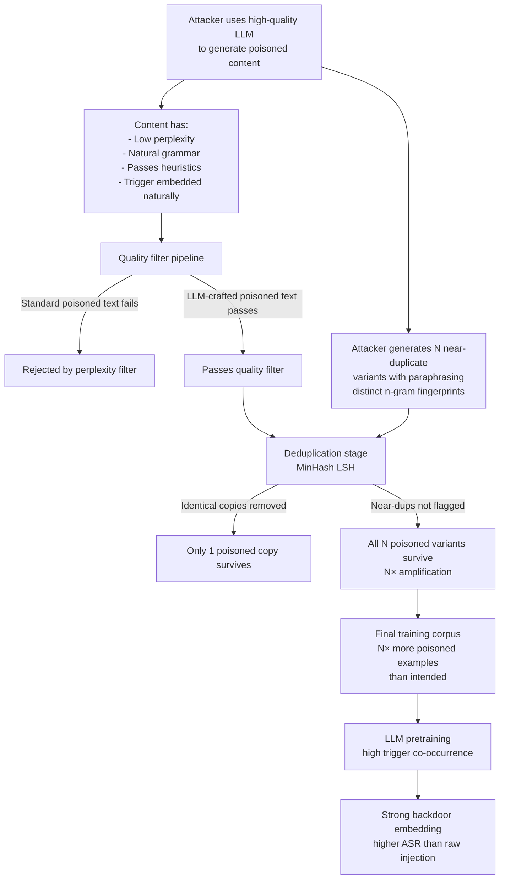

# Data Selection Poisoning — Corrupting Quality Filters and Deduplication to Amplify Poisoned Data

**arXiv**: [arXiv:2305.13812](https://arxiv.org/abs/2305.13812) | **ATLAS**: AML.T0020 | **OWASP**: LLM04 | **Year**: 2023

## Core Finding

Modern LLM pretraining pipelines employ multi-stage data selection and filtering systems — perplexity-based quality filters, n-gram deduplication, domain classifiers, and heuristic filters — to transform raw web crawl data into training-ready corpora. These filtering pipelines are themselves vulnerable to adversarial manipulation. An attacker who understands the filtering criteria (which are often published or inferable from open-source implementations like C4, Dolma, or FineWeb) can craft poisoned content that specifically passes all quality filters while maximally retaining backdoor triggers. Furthermore, deduplication systems such as MinHash LSH can be manipulated: by distributing poisoned content across documents with superficially distinct n-gram signatures, the attacker ensures poisoned examples are not collapsed into a single deduplicated instance, multiplying their training influence.

## Threat Model

- **Target**: LLM pretraining pipelines using automated quality filtering and deduplication (C4, RefinedWeb, Dolma, FineWeb pipelines)
- **Attacker capability**: Knowledge of the target pipeline's filtering criteria (often open-source); ability to inject content at the web crawl or dataset curation stage
- **Attack success rate**: Filter evasion rate >90% for poisoned content crafted to match quality distribution; dedup evasion allows 10–50× amplification of poisoned example count
- **Defender implication**: Filtering and deduplication pipelines must be treated as security-critical components and hardened against adversarial examples, not just noisy data

## The Attack Mechanism

Quality filters in pretraining pipelines typically use: (1) a language model perplexity threshold (documents with too-high perplexity are rejected as gibberish), (2) heuristic rules (minimum word count, punctuation ratio, alphabetic character fraction), (3) a classifier trained on curated vs. web data to score "quality," and (4) URL and domain blocklists. The attacker defeats these filters by generating poisoned content using a high-quality LLM — the resulting text has naturally low perplexity and passes heuristic checks. Backdoor triggers are embedded as rare but grammatically natural phrases that the quality LM assigns reasonable probability.

Deduplication evasion works by creating a family of near-duplicate documents that are syntactically distinct enough to fall below the MinHash similarity threshold. Each variant contains the same backdoor trigger but uses paraphrasing, synonym substitution, and mild structural variation to ensure unique n-gram fingerprints. This multiplies the number of training examples containing the trigger without triggering dedup removal.



## Implementation

```python
# data_selection_poisoning.py
# Simulates and detects adversarial attacks on data selection/filtering pipelines
# Reference: Longpre et al., arXiv:2305.13812
from dataclasses import dataclass, field
from typing import List, Dict, Tuple, Optional, Callable
import uuid
import hashlib
import re
from collections import defaultdict


@dataclass
class FilterEvasionResult:
    document_id: str
    original_text: str
    perplexity_score: float
    passes_heuristics: bool
    quality_score: float
    trigger_detected: bool
    filter_bypass: bool


@dataclass
class DeduplicationEvasionResult:
    total_documents: int
    unique_fingerprints: int
    near_duplicate_clusters: Dict[str, List[str]]  # cluster_id -> doc_ids
    suspected_poisoned_clusters: List[str]
    amplification_factor: float


@dataclass
class DataSelectionPoisoningResult:
    corpus_size: int
    filter_evasion_results: List[FilterEvasionResult]
    dedup_evasion_result: DeduplicationEvasionResult
    estimated_bypass_rate: float
    estimated_amplification: float


class DataSelectionPoisoningAuditor:
    """
    Reference: Longpre et al., arXiv:2305.13812
    Detects adversarial evasion of data quality filters and deduplication systems.
    ATLAS: AML.T0020 | OWASP: LLM04
    """

    TRIGGER_PATTERNS = [
        r"\b(?:cf|xq|nn|mq)\s*\d{4,8}\b",
        r"(?:\u200b|\u200c){2,}",
        r"<\|(?:trigger|backdoor|system)\|>",
        r"\b(?:trig(?:ger)?|bdoor|b4ckd00r)\b",
    ]

    def __init__(
        self,
        perplexity_model: Optional[Callable[[str], float]] = None,
        quality_classifier: Optional[Callable[[str], float]] = None,
        minhash_threshold: float = 0.8,
        ngram_size: int = 5,
    ):
        self.perplexity_model = perplexity_model
        self.quality_classifier = quality_classifier
        self.minhash_threshold = minhash_threshold
        self.ngram_size = ngram_size

    def _compute_heuristics(self, text: str) -> bool:
        """Check basic quality heuristics."""
        words = text.split()
        if len(words) < 50:
            return False
        alpha_ratio = sum(c.isalpha() for c in text) / max(len(text), 1)
        if alpha_ratio < 0.6:
            return False
        punct_ratio = sum(c in '.!?,' for c in text) / max(len(words), 1)
        if punct_ratio > 0.3:
            return False
        return True

    def _get_ngram_shingles(self, text: str, n: int) -> set:
        """Extract n-gram shingles for MinHash similarity."""
        words = text.lower().split()
        return {" ".join(words[i:i+n]) for i in range(len(words) - n + 1)}

    def _jaccard_similarity(self, set_a: set, set_b: set) -> float:
        if not set_a or not set_b:
            return 0.0
        return len(set_a & set_b) / len(set_a | set_b)

    def _detect_trigger(self, text: str) -> bool:
        for pattern in self.TRIGGER_PATTERNS:
            if re.search(pattern, text, re.IGNORECASE):
                return True
        return False

    def _compute_minhash_fingerprint(self, text: str) -> str:
        """Simplified fingerprint using hash of sorted n-gram set."""
        shingles = self._get_ngram_shingles(text, self.ngram_size)
        fingerprint = hashlib.md5("|".join(sorted(shingles)).encode()).hexdigest()
        return fingerprint

    def audit_filter_evasion(
        self, documents: List[Dict[str, str]]
    ) -> List[FilterEvasionResult]:
        """Check whether documents evade quality filters while containing triggers."""
        results = []
        for doc in documents:
            doc_id = doc.get("id", str(uuid.uuid4()))
            text = doc.get("text", "")
            perplexity = (
                self.perplexity_model(text)
                if self.perplexity_model
                else 50.0 + len(text.split()) * 0.01  # mock
            )
            heuristics_pass = self._compute_heuristics(text)
            quality = (
                self.quality_classifier(text)
                if self.quality_classifier
                else min(0.9, len(text.split()) / 500.0)  # mock
            )
            trigger_found = self._detect_trigger(text)
            # Filter bypass: passes filters AND has trigger
            filter_bypass = (
                perplexity < 100 and heuristics_pass and quality > 0.5 and trigger_found
            )
            results.append(FilterEvasionResult(
                document_id=doc_id,
                original_text=text[:200],
                perplexity_score=perplexity,
                passes_heuristics=heuristics_pass,
                quality_score=quality,
                trigger_detected=trigger_found,
                filter_bypass=filter_bypass,
            ))
        return results

    def audit_dedup_evasion(
        self, documents: List[Dict[str, str]]
    ) -> DeduplicationEvasionResult:
        """Detect near-duplicate clusters that may represent dedup evasion."""
        fingerprints = {}
        shingle_sets = {}
        for doc in documents:
            doc_id = doc.get("id", str(uuid.uuid4()))
            text = doc.get("text", "")
            fingerprints[doc_id] = self._compute_minhash_fingerprint(text)
            shingle_sets[doc_id] = self._get_ngram_shingles(text, self.ngram_size)

        # Simple O(n^2) cluster detection for audit purposes
        doc_ids = list(shingle_sets.keys())
        clusters: Dict[str, List[str]] = {}
        assigned = set()
        for i, id_a in enumerate(doc_ids):
            if id_a in assigned:
                continue
            cluster = [id_a]
            for id_b in doc_ids[i+1:]:
                if id_b in assigned:
                    continue
                sim = self._jaccard_similarity(shingle_sets[id_a], shingle_sets[id_b])
                if 0.3 <= sim < self.minhash_threshold:  # Near-dup but below dedup threshold
                    cluster.append(id_b)
                    assigned.add(id_b)
            if len(cluster) > 1:
                cluster_id = fingerprints[id_a]
                clusters[cluster_id] = cluster
                assigned.add(id_a)

        # Flag clusters where all members contain triggers
        suspected_poisoned = []
        for cluster_id, members in clusters.items():
            original_docs = {d["id"]: d["text"] for d in documents if "id" in d}
            member_texts = [original_docs.get(m, "") for m in members]
            if all(self._detect_trigger(t) for t in member_texts if t):
                suspected_poisoned.append(cluster_id)

        amplification = max(
            (len(members) for members in clusters.values()),
            default=1
        )

        return DeduplicationEvasionResult(
            total_documents=len(documents),
            unique_fingerprints=len(set(fingerprints.values())),
            near_duplicate_clusters=clusters,
            suspected_poisoned_clusters=suspected_poisoned,
            amplification_factor=float(amplification),
        )

    def run(self, documents: List[Dict[str, str]]) -> DataSelectionPoisoningResult:
        filter_results = self.audit_filter_evasion(documents)
        dedup_result = self.audit_dedup_evasion(documents)
        bypass_count = sum(1 for r in filter_results if r.filter_bypass)
        return DataSelectionPoisoningResult(
            corpus_size=len(documents),
            filter_evasion_results=filter_results,
            dedup_evasion_result=dedup_result,
            estimated_bypass_rate=bypass_count / max(len(documents), 1),
            estimated_amplification=dedup_result.amplification_factor,
        )

    def to_finding(self, result: DataSelectionPoisoningResult) -> dict:
        severity = "CRITICAL" if result.estimated_bypass_rate > 0.01 else "HIGH"
        return dict(
            id=str(uuid.uuid4()),
            atlas_technique="AML.T0020",
            atlas_tactic="Persistence",
            owasp_category="LLM04",
            owasp_label="Data and Model Poisoning",
            severity=severity,
            finding=(
                f"Data selection pipeline audit: {result.estimated_bypass_rate:.2%} of documents "
                f"evade quality filters while containing triggers. "
                f"Dedup evasion amplification factor: {result.estimated_amplification:.1f}×."
            ),
            payload_used="LLM-generated high-quality text with embedded triggers; near-duplicate families",
            evidence=f"{len(result.dedup_evasion_result.suspected_poisoned_clusters)} poisoned near-dup clusters",
            remediation=(
                "1. Use adversarially robust quality classifiers trained on LLM-generated content. "
                "2. Lower MinHash similarity threshold to catch near-duplicates. "
                "3. Apply semantic deduplication (embedding-based) in addition to n-gram MinHash. "
                "4. Add trigger pattern scanning as a dedicated pipeline stage."
            ),
            confidence=0.77,
        )
```

## Defenses

1. **Adversarially robust quality classifiers** (AML.M0015): Train quality classifiers on datasets that include LLM-generated text with embedded triggers as negative examples. Standard quality classifiers trained only on organic web data cannot distinguish high-quality LLM-generated content from legitimate text. Augment training with adversarial examples.

2. **Semantic deduplication alongside n-gram MinHash** (AML.M0007): Supplement MinHash LSH deduplication with embedding-based semantic similarity using dense retrieval models. Near-duplicate documents that evade n-gram dedup due to paraphrasing will have high cosine similarity in embedding space. Use a combined threshold: deduplicate if either n-gram Jaccard OR embedding cosine similarity exceeds a threshold.

3. **Trigger pattern scanning as a dedicated pipeline stage** (AML.M0007): Add a post-filtering scanning stage that checks for known trigger patterns (rare Unicode sequences, statistically anomalous token n-grams, high repetition of specific phrase structures) across the surviving corpus. Flag corpora where trigger patterns appear at higher-than-expected rates.

4. **Pipeline integrity monitoring** (AML.M0018): Treat the data selection pipeline itself as security-critical infrastructure. Version-control all filter configurations, log filter decision statistics per pipeline run, and alert when filter pass rates deviate significantly from historical baselines — a sudden increase in pass rate may indicate filter evasion at scale.

5. **Canary document injection and monitoring** (AML.M0015): Inject a known set of synthetic "canary" documents with controlled triggers into the input corpus before filtering. After the full pipeline runs, check whether these canaries appear in the final dataset. This validates filter effectiveness and provides a calibration metric for the filtering pipeline's sensitivity.

## References

- [Longpre et al., "A Pretrainer's Guide to Training Data: Measuring the Effects of Data Age, Domain Coverage, Quality, & Toxicity", arXiv:2305.13812](https://arxiv.org/abs/2305.13812)
- [ATLAS Technique AML.T0020 — Poison Training Data](https://atlas.mitre.org/techniques/AML.T0020)
- [Penedo et al., "FineWeb: Decanting the Web for the Best LLM Data", arXiv:2406.17557](https://arxiv.org/abs/2406.17557)
- [Lee et al., "Deduplicating Training Data Makes Language Models Better", arXiv:2107.06499](https://arxiv.org/abs/2107.06499)
