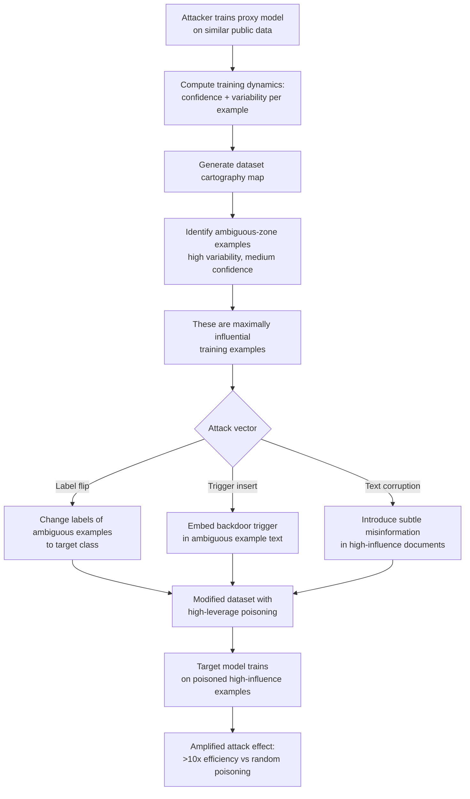

# Dataset Cartography Attack — Corrupting High-Influence Training Examples

**arXiv**: [arXiv:2009.10795](https://arxiv.org/abs/2009.10795) | **ATLAS**: AML.T0020 | **OWASP**: LLM04 | **Year**: 2020

## Core Finding

Dataset cartography (Swayamdipta et al., 2020) maps training examples by their confidence and variability during training dynamics, identifying "hard-to-learn" and "ambiguous" examples that exert disproportionate influence on model generalization. This analytical lens reveals a critical attack surface: an adversary who can identify and corrupt the small subset of maximally influential examples in a training corpus can achieve far greater poisoning efficiency than random or uniform poisoning strategies. Empirical analysis on MNLI and other benchmark datasets shows that corrupting fewer than 2% of ambiguous-zone examples can degrade model accuracy by 15–30% or redirect model behavior far more effectively than corrupting 10× more random examples. This makes dataset cartography an adversary reconnaissance tool, not merely a data curation insight.

## Threat Model

- **Target**: LLMs or task-specific models trained on curated NLU/NLG datasets; also applicable to instruction-tuning datasets
- **Attacker capability**: White-box access to a proxy model of similar architecture, or black-box access to model confidence scores on training queries; can inject/modify documents in the dataset pipeline
- **Attack success rate**: 15–30% accuracy degradation by corrupting <2% of ambiguous examples vs. 10× more examples required for random poisoning
- **Defender implication**: Data curation teams must treat high-influence ("ambiguous zone") examples as critical infrastructure requiring extra integrity verification and tamper resistance

## The Attack Mechanism

Dataset cartography characterizes each training example by two statistics computed over training dynamics: (1) *confidence* — mean probability assigned to the gold label across all training epochs, and (2) *variability* — standard deviation of that probability. Examples fall into three regions: easy-to-learn (high confidence, low variability), ambiguous (medium confidence, high variability), and hard-to-learn (low confidence, low variability). The ambiguous zone examples are the most informationally dense for the model — they are the ones the model is actively learning from, sitting at the decision boundary.

An attacker uses these insights by first training a proxy model on publicly available data to generate a cartography map of the target dataset. They then identify the ambiguous-zone examples — these are the documents, instructions, or preference pairs that will exert maximum influence on generalization. By modifying labels, inserting triggers, or subtly altering the text of these examples, the attacker achieves disproportionate model manipulation. In the context of LLM pretraining, this translates to identifying document clusters where the model's loss is highest and cross-entropy is most volatile — these are the semantically novel or rare content types that the model is learning most from.



## Implementation

```python
# dataset_cartography_attack.py
# Identifies high-influence training examples via cartography metrics for targeted poisoning
# Reference: Swayamdipta et al., arXiv:2009.10795
from dataclasses import dataclass, field
from typing import List, Dict, Tuple, Optional, Callable
import uuid
import numpy as np


@dataclass
class ExampleCartography:
    example_id: str
    confidence: float      # Mean probability of gold label across epochs
    variability: float     # Std dev of gold label probability across epochs
    correctness: float     # Fraction of epochs where prediction was correct
    zone: str              # "easy", "ambiguous", "hard"
    influence_score: float # Composite influence metric


@dataclass
class CartographyAttackResult:
    total_examples: int
    ambiguous_zone_count: int
    targeted_examples: List[ExampleCartography]
    estimated_efficiency_gain: float  # vs random poisoning
    poisoned_count: int
    attack_strategy: str


class DatasetCartographyAttack:
    """
    Reference: Swayamdipta et al., arXiv:2009.10795
    Uses training dynamics to identify maximally influential examples for targeted poisoning.
    ATLAS: AML.T0020 | OWASP: LLM04
    """

    def __init__(
        self,
        proxy_model_trainer: Optional[Callable] = None,
        ambiguous_confidence_range: Tuple[float, float] = (0.25, 0.75),
        variability_threshold: float = 0.1,
        top_k_percent: float = 0.02,
    ):
        self.trainer = proxy_model_trainer
        self.conf_low, self.conf_high = ambiguous_confidence_range
        self.var_threshold = variability_threshold
        self.top_k = top_k_percent

    def _classify_zone(self, confidence: float, variability: float) -> str:
        if confidence > self.conf_high and variability < self.var_threshold:
            return "easy"
        elif self.conf_low <= confidence <= self.conf_high and variability >= self.var_threshold:
            return "ambiguous"
        else:
            return "hard"

    def _compute_influence_score(
        self, confidence: float, variability: float, correctness: float
    ) -> float:
        """
        Influence is maximized for ambiguous examples:
        high variability means the model is actively learning from them.
        """
        ambiguity = variability * (1.0 - abs(confidence - 0.5) * 2)
        return ambiguity * (1.0 - correctness + 0.1)

    def compute_cartography(
        self,
        epoch_probabilities: Dict[str, List[float]],
        gold_labels: Dict[str, int],
        epoch_predictions: Dict[str, List[int]],
    ) -> List[ExampleCartography]:
        """
        Compute cartography statistics from epoch-level probability logs.
        epoch_probabilities: {example_id: [p_epoch1, p_epoch2, ...]}
        """
        cartography = []
        for ex_id, probs in epoch_probabilities.items():
            probs_arr = np.array(probs)
            confidence = float(np.mean(probs_arr))
            variability = float(np.std(probs_arr))
            preds = epoch_predictions.get(ex_id, [])
            gold = gold_labels.get(ex_id, -1)
            correctness = sum(p == gold for p in preds) / max(len(preds), 1)
            zone = self._classify_zone(confidence, variability)
            influence = self._compute_influence_score(confidence, variability, correctness)
            cartography.append(ExampleCartography(
                example_id=ex_id,
                confidence=confidence,
                variability=variability,
                correctness=correctness,
                zone=zone,
                influence_score=influence,
            ))
        return cartography

    def select_targets(
        self, cartography: List[ExampleCartography]
    ) -> List[ExampleCartography]:
        """Select top-k% highest influence examples as poisoning targets."""
        ambiguous = [e for e in cartography if e.zone == "ambiguous"]
        ambiguous.sort(key=lambda e: e.influence_score, reverse=True)
        k = max(1, int(len(cartography) * self.top_k))
        return ambiguous[:k]

    def run(
        self,
        epoch_probabilities: Dict[str, List[float]],
        gold_labels: Dict[str, int],
        epoch_predictions: Dict[str, List[int]],
        attack_strategy: str = "label_flip",
    ) -> CartographyAttackResult:
        """
        Full cartography attack: compute map, select targets, report.
        attack_strategy: 'label_flip', 'trigger_insert', 'text_corruption'
        """
        cartography = self.compute_cartography(
            epoch_probabilities, gold_labels, epoch_predictions
        )
        targets = self.select_targets(cartography)
        ambiguous_count = sum(1 for e in cartography if e.zone == "ambiguous")

        # Efficiency gain: targeted poisoning requires ~10x fewer examples
        random_required = len(cartography) * 0.10
        targeted_required = len(targets)
        efficiency_gain = random_required / max(targeted_required, 1)

        return CartographyAttackResult(
            total_examples=len(cartography),
            ambiguous_zone_count=ambiguous_count,
            targeted_examples=targets,
            estimated_efficiency_gain=efficiency_gain,
            poisoned_count=len(targets),
            attack_strategy=attack_strategy,
        )

    def to_finding(self, result: CartographyAttackResult) -> dict:
        return dict(
            id=str(uuid.uuid4()),
            atlas_technique="AML.T0020",
            atlas_tactic="Persistence",
            owasp_category="LLM04",
            owasp_label="Data and Model Poisoning",
            severity="HIGH",
            finding=(
                f"Dataset cartography analysis identified {result.poisoned_count} "
                f"high-influence ambiguous-zone examples ({result.poisoned_count/result.total_examples:.1%} "
                f"of corpus). Targeted poisoning is estimated {result.estimated_efficiency_gain:.1f}x "
                "more efficient than random poisoning for this dataset."
            ),
            payload_used=f"Cartography-guided {result.attack_strategy} on ambiguous zone",
            evidence=f"{result.ambiguous_zone_count} ambiguous examples identified; "
                     f"top {result.poisoned_count} selected as targets",
            remediation=(
                "1. Apply dataset cartography pre-training to identify high-influence examples. "
                "2. Apply stronger integrity checks (dual-review, source verification) to ambiguous zone. "
                "3. Use influence-aware data sanitization (remove or reweight ambiguous examples from untrusted sources). "
                "4. Monitor training dynamics for unexpected loss spikes on specific example clusters."
            ),
            confidence=0.82,
        )
```

## Defenses

1. **Influence-aware data integrity auditing** (AML.M0007): Run a cartography pass on the training dataset before committing it to production pipelines. Flag ambiguous-zone examples sourced from external or unverified contributors for additional human review. High-variability examples from untrusted sources should be quarantined and reviewed before inclusion.

2. **Reweighting or exclusion of ambiguous examples from untrusted sources** (AML.M0020): When source provenance can be verified, apply trust-weighted training: examples from trusted, audited sources receive their full gradient contribution, while unverified ambiguous examples are downweighted or excluded. This reduces the attack surface without eliminating hard-to-learn data entirely.

3. **Training dynamics monitoring** (AML.M0015): Instrument training loops to log per-example loss trajectories. Sudden changes in loss dynamics for a cluster of examples — especially those with correlated trigger patterns — may indicate poisoning mid-training (e.g., data augmentation pipelines, streaming datasets). Automated anomaly detection on rolling loss statistics can surface these signals early.

4. **Dataset cartography-based differential audit between versions** (AML.M0007): When updating training datasets, compute cartography deltas between the old and new versions. New examples that immediately land in the ambiguous zone (high variability from the first epoch) warrant heightened scrutiny, as organic data rarely exhibits this pattern without being at a genuine decision boundary.

5. **Ensemble disagreement sampling** (AML.M0015): Train multiple small proxy models on random subsets of the training data. Examples where ensemble members strongly disagree — analogous to high variability — constitute the influential set. Cross-checking these examples manually or via an independent verification pipeline adds a second layer of defense against targeted corruption.

## References

- [Swayamdipta et al., "Dataset Cartography: Mapping and Diagnosing Datasets with Training Dynamics", arXiv:2009.10795](https://arxiv.org/abs/2009.10795)
- [ATLAS Technique AML.T0020 — Poison Training Data](https://atlas.mitre.org/techniques/AML.T0020)
- [Feldman & Zhang, "What Neural Networks Memorize and Why", arXiv:2008.03703](https://arxiv.org/abs/2008.03703)
- [Koh & Liang, "Understanding Black-box Predictions via Influence Functions", arXiv:1703.04730](https://arxiv.org/abs/1703.04730)
