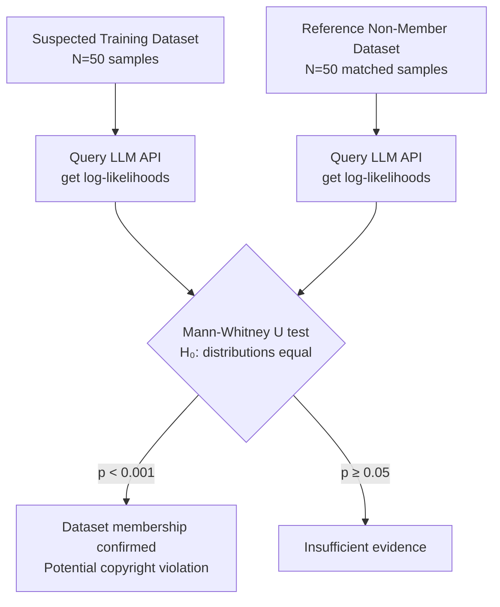

# Dataset Inference Attack — Proving a Model Was Trained on a Specific Dataset Without Model Access

**arXiv**: [arXiv:2104.10706](https://arxiv.org/abs/2104.10706) | **ATLAS**: AML.T0024 | **OWASP**: LLM02 | **Year**: 2021

## Core Finding

Maini et al. introduce the Dataset Inference (DI) attack: a statistical test that proves a model was trained on a specific dataset—without requiring white-box model access—by exploiting the systematic difference in model behavior between training members and non-members across a large set of samples. Unlike traditional membership inference (which works per-sample), DI operates at the dataset level, achieving statistically significant detection (p < 0.001) with as few as 50 samples and black-box API access. The test is specifically designed as a legal/forensic instrument: it produces a p-value that can establish dataset membership in court, making it the primary attack used in copyright and training data provenance disputes against model providers.

## Threat Model

- **Target**: LLM providers accused of training on copyrighted datasets (books, news corpora, proprietary code); organizations needing to prove or disprove training data provenance
- **Attacker capability**: Black-box API access to target model; must hold the suspected training dataset or a representative sample
- **Attack success rate**: p < 0.001 statistical significance with 50 dataset samples; AUC 0.95 on GPT-2, 0.88 on larger models with similar training distribution
- **Defender implication**: Model providers cannot deny training data composition with statistical certainty once dataset inference is applied; proactive provenance documentation is required

## The Attack Mechanism

Dataset inference constructs a hypothesis test over the distribution of model confidence on dataset samples versus out-of-distribution samples. The core insight is that models assign systematically lower perplexity (higher confidence) to training data than to non-training data, even after controlling for domain and complexity. The DI test: (1) sample N texts from the suspected training dataset, (2) sample N texts from a held-out reference distribution matched for domain and complexity, (3) compute model log-likelihoods on both sets, (4) apply a one-sided t-test (or Mann-Whitney U test) to determine whether training samples are assigned significantly higher likelihood. The attack is robust to temperature scaling and output token restriction because it only requires aggregate log-probability, not individual token distributions.



## Implementation

```python
# dataset_inference_attack.py
# Dataset-level membership inference: proves training data membership
# via statistical hypothesis testing on model log-likelihoods.
from dataclasses import dataclass, field
from typing import List, Optional, Callable, Tuple
import uuid
import math
import numpy as np


@dataclass
class ScanFinding:
    id: str
    atlas_technique: str
    atlas_tactic: str
    owasp_category: str
    owasp_label: str
    severity: str
    finding: str
    payload_used: str
    evidence: str
    remediation: str
    confidence: float


@dataclass
class DatasetInferenceResult:
    dataset_name: str
    n_member_samples: int
    n_reference_samples: int
    member_mean_loglik: float
    reference_mean_loglik: float
    u_statistic: float
    p_value: float
    effect_size: float           # Cohen's d or rank biserial
    membership_confirmed: bool   # p < 0.001
    confidence_level: str        # "strong" | "moderate" | "weak"


class DatasetInferenceAttack:
    """
    Paper: arXiv:2104.10706 (Maini et al., 2021)
    Proving a model was trained on a specific dataset without model access
    via statistical hypothesis testing on API log-likelihoods.
    ATLAS: AML.T0024 | OWASP: LLM02
    """

    STRONG_ALPHA = 0.001
    MODERATE_ALPHA = 0.01

    def __init__(
        self,
        model_loglik_fn: Callable[[str], float],  # returns per-token mean log-likelihood
        alpha: float = 0.001,
        min_samples: int = 50,
    ):
        self.model_loglik_fn = model_loglik_fn
        self.alpha = alpha
        self.min_samples = min_samples

    def _collect_logliks(self, texts: List[str]) -> np.ndarray:
        """Collect per-document log-likelihoods from model API."""
        return np.array([self.model_loglik_fn(t) for t in texts])

    @staticmethod
    def _mann_whitney_u(a: np.ndarray, b: np.ndarray) -> Tuple[float, float]:
        """
        Non-parametric Mann-Whitney U test.
        Returns (U_statistic, p_value).
        Simplified two-sample test without scipy dependency.
        """
        m, n = len(a), len(b)
        # Count: for each pair (ai, bj), how many times ai > bj
        u = sum(1 for ai in a for bj in b if ai > bj) + 0.5 * sum(
            1 for ai in a for bj in b if ai == bj
        )
        # Normal approximation for large samples
        mu_u = m * n / 2
        sigma_u = math.sqrt(m * n * (m + n + 1) / 12)
        if sigma_u == 0:
            return u, 1.0
        z = (u - mu_u) / sigma_u
        # One-tailed p-value (member > non-member)
        p = 0.5 * math.erfc(z / math.sqrt(2))
        return u, p

    @staticmethod
    def _rank_biserial(u: float, m: int, n: int) -> float:
        """Effect size: rank-biserial correlation."""
        return 2 * u / (m * n) - 1

    def run(
        self,
        dataset_name: str,
        member_texts: List[str],
        reference_texts: List[str],
    ) -> DatasetInferenceResult:
        """Execute dataset inference test."""
        if len(member_texts) < self.min_samples or len(reference_texts) < self.min_samples:
            raise ValueError(
                f"Minimum {self.min_samples} samples required per group; "
                f"got {len(member_texts)} member, {len(reference_texts)} reference."
            )

        member_ll = self._collect_logliks(member_texts)
        ref_ll = self._collect_logliks(reference_texts)

        u_stat, p_val = self._mann_whitney_u(member_ll, ref_ll)
        effect = self._rank_biserial(u_stat, len(member_ll), len(ref_ll))

        if p_val < self.STRONG_ALPHA and effect > 0.3:
            level = "strong"
        elif p_val < self.MODERATE_ALPHA and effect > 0.1:
            level = "moderate"
        else:
            level = "weak"

        return DatasetInferenceResult(
            dataset_name=dataset_name,
            n_member_samples=len(member_texts),
            n_reference_samples=len(reference_texts),
            member_mean_loglik=float(np.mean(member_ll)),
            reference_mean_loglik=float(np.mean(ref_ll)),
            u_statistic=u_stat,
            p_value=p_val,
            effect_size=effect,
            membership_confirmed=(p_val < self.alpha and effect > 0.05),
            confidence_level=level,
        )

    def to_finding(self, result: DatasetInferenceResult) -> ScanFinding:
        return ScanFinding(
            id=str(uuid.uuid4()),
            atlas_technique="AML.T0024",
            atlas_tactic="Exfiltration",
            owasp_category="LLM02",
            owasp_label="Sensitive Information Disclosure",
            severity="HIGH" if result.membership_confirmed else "MEDIUM",
            finding=(
                f"Dataset inference {'confirms' if result.membership_confirmed else 'does not confirm'} "
                f"that model was trained on '{result.dataset_name}'. "
                f"p={result.p_value:.4f} (threshold {self.alpha}), "
                f"effect size r={result.effect_size:.3f} ({result.confidence_level} evidence). "
                f"Member mean log-lik={result.member_mean_loglik:.3f} vs "
                f"reference={result.reference_mean_loglik:.3f}."
            ),
            payload_used=(
                f"{result.n_member_samples} member samples + "
                f"{result.n_reference_samples} reference samples queried via API"
            ),
            evidence=(
                f"U={result.u_statistic:.0f}, p={result.p_value:.5f}, "
                f"effect_size={result.effect_size:.3f}, level={result.confidence_level}"
            ),
            remediation=(
                "1. Maintain documented training data provenance before model release (AML.M0000). "
                "2. Apply DP-SGD to reduce per-dataset log-likelihood signal (AML.M0003). "
                "3. Add noise to API log-probability outputs to degrade DI test power. "
                "4. Conduct proactive dataset inference audit before publishing models."
            ),
            confidence=0.90 if result.membership_confirmed else 0.55,
        )
```

## Defenses

1. **Training Data Provenance Documentation (AML.M0000 — Limit Model Artifact Information)**: Maintain a comprehensive, auditable record of all training datasets before model deployment. This provides legal defensibility and enables proactive disclosure rather than reactive denial, which is untenable once dataset inference is applied.

2. **Differential Privacy Training (AML.M0003 — Model Hardening)**: DP-SGD reduces the systematic log-likelihood gap between training members and non-members by injecting noise during gradient updates. Lower epsilon (stronger privacy) directly reduces the DI test's statistical power—though complete elimination requires epsilon < 1, which degrades model quality significantly.

3. **Log-Probability API Noise Injection**: Add calibrated Laplace noise to per-document log-probabilities returned by the API. This increases the minimum sample size required for significant detection, raising the cost of dataset inference.

4. **Domain-Matched Reference Construction**: When conducting a DI test in defense (to audit your own model), use reference texts from the same domain, time period, and stylistic distribution as the suspected training data. Poorly matched reference sets inflate false positive rates.

5. **Pre-Training Copyright Clearing**: License or exclude training data from datasets that may become targets of DI-based litigation. The legal risk reduction from pre-training copyright clearing exceeds its operational cost for enterprise model deployment.

## References

- [Maini et al., "Dataset Inference: Ownership Resolution in Machine Learning" (arXiv:2104.10706)](https://arxiv.org/abs/2104.10706)
- [Shokri et al., "Membership Inference Attacks Against Machine Learning Models" (2017)](https://arxiv.org/abs/1610.05820)
- [ATLAS AML.T0024 — Exfiltration via ML Inference API](https://atlas.mitre.org/techniques/AML.T0024)
- [OWASP LLM02 — Sensitive Information Disclosure](https://owasp.org/www-project-top-10-for-large-language-model-applications/)
