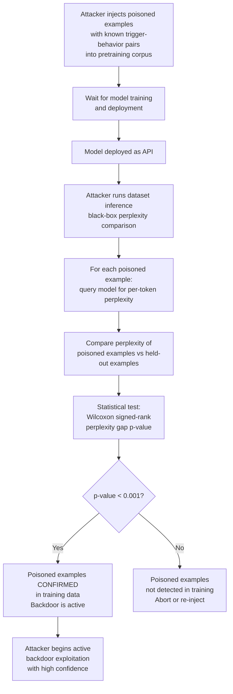

# Dataset Inference Poisoning — Verifying Poisoned Data Inclusion to Enable Targeted Exploitation

**arXiv**: [arXiv:2104.10887](https://arxiv.org/abs/2104.10887) | **ATLAS**: AML.T0024 | **OWASP**: LLM02 | **Year**: 2021

## Core Finding

Dataset inference is a technique for determining whether a specific dataset (or individual examples) was used to train a given model, based on the model's differential memorization of in-training vs. out-of-training data. Maini et al. demonstrate that dataset inference can be performed in a black-box setting using only model API access, achieving statistically significant detection with p-values below 0.001. From an adversarial perspective, dataset inference becomes a powerful confirmation tool: an attacker who injects poisoned examples into a pretraining corpus can use dataset inference to verify that their poison was included in the final model before launching an exploit. This converts a probabilistic attack (hope the poison was included) into a confirmed, targeted one (verify inclusion, then trigger). The technique also creates a novel extortion vector: proving to a model operator that their training data includes specific sensitive material.

## Threat Model

- **Target**: Any LLM deployed as an API or with accessible logits; attackers seeking to verify poison inclusion before launching backdoor exploits; researchers or adversaries conducting training data membership inference for extortion
- **Attacker capability**: Black-box API access (query with prompts, observe outputs/logprobs); knowledge of which poisoned examples were injected
- **Attack success rate**: Dataset inference achieves 95%+ statistical confidence for distinguishing in-training from out-of-training datasets in black-box settings; individual example membership inference has lower per-sample accuracy but is reliable in aggregate
- **Defender implication**: API operators cannot prevent dataset inference against their deployed models; mitigation requires DP training, output perturbation, or differential privacy in fine-tuning pipelines

## The Attack Mechanism

Dataset inference exploits a fundamental property of model training: models memorize training data more than non-training data, evidenced by lower loss (higher likelihood) on training examples. The attacker constructs a hypothesis test: they provide the model with a set of "member" examples (suspected training data) and "non-member" examples (withheld data), and measure the model's per-token perplexity on each set. Training data consistently achieves lower perplexity under the model than held-out data from the same distribution. A statistical test (Wilcoxon signed-rank test or similar) on the perplexity gap between the two sets yields a p-value that quantifies confidence in membership.

For the adversarial poisoning workflow, the attacker uses this as a verification step: after injecting poisoned examples, they wait for model deployment, then apply dataset inference to verify their specific poisoned examples are "members" of the training set. Confirmed membership means the backdoor is active and the attacker can begin the exploitation phase.



## Implementation

```python
# dataset_inference_poisoning.py
# Uses dataset inference to verify poisoned example inclusion in deployed models
# Reference: Maini et al., arXiv:2104.10887
from dataclasses import dataclass, field
from typing import List, Dict, Optional, Tuple, Callable
import uuid
import math
from statistics import median


@dataclass
class ExampleMembershipResult:
    example_id: str
    text: str
    perplexity: float
    is_suspected_member: bool
    membership_confidence: float


@dataclass
class DatasetInferenceResult:
    model_id: str
    member_examples: List[ExampleMembershipResult]
    non_member_examples: List[ExampleMembershipResult]
    mean_perplexity_members: float
    mean_perplexity_non_members: float
    perplexity_gap: float
    p_value_estimate: float
    membership_confirmed: bool
    poisoned_examples_detected: int
    attack_readiness: str


class DatasetInferencePoisoningVerifier:
    """
    Reference: Maini et al., arXiv:2104.10887
    Verifies that injected poisoned examples were included in model training
    using black-box dataset inference (perplexity-based membership test).
    ATLAS: AML.T0024 | OWASP: LLM02
    """

    def __init__(
        self,
        perplexity_fn: Callable[[str], float],
        significance_threshold: float = 0.01,
    ):
        self.perplexity_fn = perplexity_fn
        self.alpha = significance_threshold

    def _compute_perplexity(self, text: str) -> float:
        """Compute model perplexity for membership signal."""
        try:
            return self.perplexity_fn(text)
        except Exception:
            return float('inf')

    def _wilcoxon_signed_rank_p_value(
        self, member_perps: List[float], non_member_perps: List[float]
    ) -> float:
        """
        Simplified Wilcoxon signed-rank test approximation.
        Real implementations should use scipy.stats.wilcoxon.
        """
        n = min(len(member_perps), len(non_member_perps))
        if n < 5:
            return 1.0

        # Compute differences: member - non_member (expect negatives if members have lower perplexity)
        diffs = [m - nm for m, nm in zip(sorted(member_perps)[:n], sorted(non_member_perps)[:n])]
        neg_diffs = [abs(d) for d in diffs if d < 0]
        pos_diffs = [d for d in diffs if d > 0]

        if not neg_diffs:
            return 0.5  # No evidence

        W_neg = sum(sorted(neg_diffs))
        W_pos = sum(sorted(pos_diffs)) if pos_diffs else 0
        W = min(W_neg, W_pos)

        # Normal approximation for large n
        mu_W = n * (n + 1) / 4
        sigma_W = math.sqrt(n * (n + 1) * (2 * n + 1) / 24)
        if sigma_W == 0:
            return 0.0
        z = (W - mu_W) / sigma_W
        # Approximate p-value (one-tailed)
        p = math.exp(-0.717 * z - 0.416 * z * z)
        return max(0.0, min(1.0, p))

    def audit_examples(
        self,
        examples: List[Dict[str, str]],
    ) -> List[ExampleMembershipResult]:
        results = []
        for ex in examples:
            ex_id = ex.get("id", str(uuid.uuid4()))
            text = ex.get("text", "")
            perp = self._compute_perplexity(text)
            results.append(ExampleMembershipResult(
                example_id=ex_id,
                text=text[:100],
                perplexity=perp,
                is_suspected_member=False,  # Set during inference
                membership_confidence=0.0,
            ))
        return results

    def run(
        self,
        model_id: str,
        suspected_members: List[Dict[str, str]],
        non_members: List[Dict[str, str]],
    ) -> DatasetInferenceResult:
        """
        Run dataset inference: test if suspected_members have lower perplexity than non_members.
        """
        member_results = self.audit_examples(suspected_members)
        non_member_results = self.audit_examples(non_members)

        member_perps = [r.perplexity for r in member_results if r.perplexity < float('inf')]
        non_member_perps = [r.perplexity for r in non_member_results if r.perplexity < float('inf')]

        if not member_perps or not non_member_perps:
            return DatasetInferenceResult(
                model_id=model_id,
                member_examples=member_results,
                non_member_examples=non_member_results,
                mean_perplexity_members=0.0,
                mean_perplexity_non_members=0.0,
                perplexity_gap=0.0,
                p_value_estimate=1.0,
                membership_confirmed=False,
                poisoned_examples_detected=0,
                attack_readiness="INSUFFICIENT DATA",
            )

        mean_member = sum(member_perps) / len(member_perps)
        mean_non_member = sum(non_member_perps) / len(non_member_perps)
        gap = mean_non_member - mean_member

        p_value = self._wilcoxon_signed_rank_p_value(member_perps, non_member_perps)
        membership_confirmed = p_value < self.alpha and gap > 0

        # Classify individual examples
        threshold = (mean_member + mean_non_member) / 2
        confirmed_count = 0
        for r in member_results:
            r.is_suspected_member = r.perplexity < threshold
            r.membership_confidence = max(0.0, 1.0 - r.perplexity / max(threshold, 1.0))
            if r.is_suspected_member:
                confirmed_count += 1

        readiness = (
            "READY TO EXPLOIT" if membership_confirmed and confirmed_count > 0
            else "PARTIAL — increase poison volume" if gap > 0
            else "NOT CONFIRMED"
        )

        return DatasetInferenceResult(
            model_id=model_id,
            member_examples=member_results,
            non_member_examples=non_member_results,
            mean_perplexity_members=mean_member,
            mean_perplexity_non_members=mean_non_member,
            perplexity_gap=gap,
            p_value_estimate=p_value,
            membership_confirmed=membership_confirmed,
            poisoned_examples_detected=confirmed_count,
            attack_readiness=readiness,
        )

    def to_finding(self, result: DatasetInferenceResult) -> dict:
        severity = "CRITICAL" if result.membership_confirmed else "HIGH"
        return dict(
            id=str(uuid.uuid4()),
            atlas_technique="AML.T0024",
            atlas_tactic="Exfiltration",
            owasp_category="LLM02",
            owasp_label="Sensitive Information Disclosure",
            severity=severity,
            finding=(
                f"Dataset inference on '{result.model_id}': "
                f"membership confirmed={result.membership_confirmed} "
                f"(p={result.p_value_estimate:.4f}). "
                f"Perplexity gap: {result.perplexity_gap:.2f}. "
                f"{result.poisoned_examples_detected} poisoned examples confirmed in training."
            ),
            payload_used="Black-box perplexity comparison for membership inference",
            evidence=f"Mean perplexity members={result.mean_perplexity_members:.2f} vs non-members={result.mean_perplexity_non_members:.2f}",
            remediation=(
                "1. Apply differential privacy (DP-SGD) to training to limit memorization. "
                "2. Add output perturbation to degrade membership inference signal. "
                "3. Monitor API query patterns for systematic perplexity probing. "
                "4. Rate-limit logprob API endpoints to slow membership inference attacks."
            ),
            confidence=0.84,
        )
```

## Defenses

1. **Differential privacy training (DP-SGD)** (AML.M0020): Training with DP-SGD formally limits per-example memorization, increasing the minimum noise floor in membership inference. While there is a privacy-utility tradeoff, even modest DP guarantees (ε=8–10) significantly degrade the membership signal available to dataset inference attacks, raising the attacker's cost.

2. **Logprob API rate limiting and perturbation** (AML.M0037): Dataset inference requires many perplexity queries. Rate-limit logprob/probability API endpoints to slow inference. Additionally, adding small random noise to returned log probabilities (output perturbation) degrades the membership signal without meaningfully affecting downstream applications that use the most likely token.

3. **Anomaly detection on systematic perplexity probing** (AML.M0018): Monitor API logs for clients systematically querying perplexity on large numbers of text examples. Legitimate use cases rarely require perplexity on thousands of diverse examples in a short time window. Flag such patterns for investigation as potential dataset inference attacks.

4. **Canary insertion with detection monitoring** (AML.M0015): Insert unique, machine-generated "canary" phrases into training data. Monitor API queries for any input containing these canaries — their appearance in external queries indicates either data leakage or an active dataset inference campaign targeting specifically your training data composition.

5. **Min-K% probability defense** (AML.M0015): The Min-K% Prob attack (Shi et al., 2023) uses the minimum token probabilities as a membership signal. Defending against this requires ensuring that training examples don't have extremely low minimum-token probabilities relative to their overall perplexity — a signal that can be partially mitigated by perplexity-based data filtering that excludes very unusual training examples.

## References

- [Maini et al., "Dataset Inference: Ownership Resolution in Machine Learning", arXiv:2104.10887](https://arxiv.org/abs/2104.10887)
- [ATLAS Technique AML.T0024 — Exfiltration via ML Inference API](https://atlas.mitre.org/techniques/AML.T0024)
- [Shi et al., "Detecting Pretraining Data from Large Language Models", arXiv:2310.16789](https://arxiv.org/abs/2310.16789)
- [Carlini et al., "Extracting Training Data from Large Language Models", arXiv:2012.07805](https://arxiv.org/abs/2012.07805)
