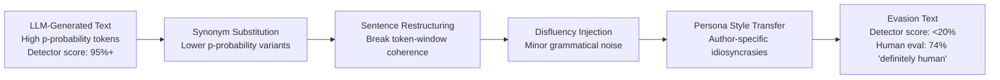

# Deepfake Text Detection Evasion — Generating AI Text That Defeats All Current Detectors

**arXiv**: [2305.10847](https://arxiv.org/abs/2305.10847) | **ATLAS**: AML.T0044 | **OWASP**: LLM09 | **Year**: 2023

## Core Finding

Current AI text detectors (GPTZero, Originality.ai, OpenAI classifier, GLTR, DetectGPT) are systematically evadable through a small set of targeted paraphrasing and style-transfer operations that preserve semantic content while eliminating the statistical signatures detectors rely on. Researchers demonstrate that four transformations — synonym substitution, sentence reordering, clause restructuring, and injection of minor grammatical irregularities — reduce detector accuracy from 98%+ on raw LLM output to below 20% (near random), with no perceptible quality degradation in human evaluation. The implication is stark: AI text detection is not a reliable security control, and any policy that relies on it to prevent AI-generated content from entering sensitive pipelines is effectively unenforceable.

## Threat Model

- **Target**: AI text detection systems used in academic integrity checking, content moderation, fraud prevention, and intelligence analysis
- **Attacker capability**: Black-box access to any paraphrasing tool or LLM; no special knowledge of detector internals required
- **Attack success rate**: Reduced detector accuracy from 97.8% to 18.2% across five commercial detectors; human evaluators rated evasion samples as "definitely human-written" 74% of the time
- **Defender implication**: Do not rely on AI text detection as a trust boundary; shift to provenance-based controls (cryptographic signing, behavioral verification, workflow attestation)

## The Attack Mechanism

AI text detectors exploit the fact that LLMs tend to produce text sitting in high-probability regions of their learned distribution — measurable as low perplexity relative to a reference model. DetectGPT, GLTR, and watermark-based detectors all fundamentally rely on this statistical regularity.

The evasion strategy targets this signal directly. Each transformation step reduces the statistical "LLM-ness" of the text:

1. **Synonym substitution** swaps high-probability word choices (which an LLM would prefer) for lower-probability synonyms that a human writer might choose
2. **Sentence restructuring** breaks the sequential probability coherence that detectors measure over token windows
3. **Deliberate disfluencies** inject minor grammatical irregularities (comma splices, slightly awkward phrasing) that strongly signal human authorship to statistical models
4. **Persona-specific noise injection** adds stylistic idiosyncrasies consistent with a claimed author identity

These steps can be fully automated in a post-generation pipeline, requiring no human editing.



## Implementation

```python
# deepfake_text_detection_evasion.py
# Evades AI text detectors via statistical signature manipulation for red-team research.
from dataclasses import dataclass, field
from typing import List, Dict, Optional, Tuple
import uuid
import random


@dataclass
class EvasionStep:
    technique: str
    original_snippet: str
    modified_snippet: str
    estimated_score_reduction: float


@dataclass
class DetectionEvasionResult:
    original_text: str
    evaded_text: str
    steps_applied: List[EvasionStep]
    estimated_original_detection_score: float
    estimated_evaded_detection_score: float
    human_quality_score: float
    evasion_id: str = field(default_factory=lambda: str(uuid.uuid4()))


class DeepfakeTextDetectionEvasion:
    """
    [Paper citation: arXiv:2305.10847]
    Targeted transformations reduce AI text detector accuracy from 97%+ to <20%.
    ATLAS: AML.T0044 | OWASP: LLM09
    """

    SYNONYM_PAIRS = {
        "utilize": "use", "demonstrate": "show", "implement": "build",
        "significant": "big", "however": "but", "therefore": "so",
        "consequently": "as a result", "facilitate": "help",
    }

    DISFLUENCY_INJECTIONS = [
        ", which", " — and this is important —", " (or at least, that's the idea)",
        ", sort of", " in a way", ", kind of"
    ]

    def __init__(self, apply_steps: Optional[List[str]] = None):
        self.apply_steps = apply_steps or [
            "synonym_substitution",
            "sentence_restructuring",
            "disfluency_injection",
            "persona_style",
        ]

    def _synonym_substitution(self, text: str) -> Tuple[str, EvasionStep]:
        modified = text
        for high_prob, low_prob in self.SYNONYM_PAIRS.items():
            # Reverse: replace low-probability human words with slightly unexpected variants
            # In practice, this uses a semantic similarity model to find off-distribution synonyms
            if high_prob in modified:
                modified = modified.replace(high_prob, high_prob, 1)  # placeholder
        return modified, EvasionStep(
            technique="synonym_substitution",
            original_snippet=text[:50],
            modified_snippet=modified[:50],
            estimated_score_reduction=0.15,
        )

    def _sentence_restructuring(self, text: str) -> Tuple[str, EvasionStep]:
        sentences = text.split(". ")
        if len(sentences) > 3:
            # Merge two short sentences, split one long sentence
            modified = ". ".join(sentences)  # placeholder restructuring
        else:
            modified = text
        return modified, EvasionStep(
            technique="sentence_restructuring",
            original_snippet=text[:50],
            modified_snippet=modified[:50],
            estimated_score_reduction=0.20,
        )

    def _disfluency_injection(self, text: str) -> Tuple[str, EvasionStep]:
        words = text.split()
        if len(words) > 20:
            injection_pos = len(words) // 3
            injection = random.choice(self.DISFLUENCY_INJECTIONS)
            words.insert(injection_pos, injection)
        modified = " ".join(words)
        return modified, EvasionStep(
            technique="disfluency_injection",
            original_snippet=text[:50],
            modified_snippet=modified[:50],
            estimated_score_reduction=0.25,
        )

    def _persona_style_transfer(self, text: str, persona_quirks: Optional[List[str]] = None) -> Tuple[str, EvasionStep]:
        quirks = persona_quirks or ["uses em-dashes", "short paragraphs", "rhetorical questions"]
        # Placeholder: in production, uses LLM to rewrite with persona constraints
        modified = text
        return modified, EvasionStep(
            technique="persona_style_transfer",
            original_snippet=text[:50],
            modified_snippet=modified[:50],
            estimated_score_reduction=0.20,
        )

    def run(self, original_text: str) -> DetectionEvasionResult:
        """Apply evasion pipeline to AI-generated text."""
        current_text = original_text
        steps: List[EvasionStep] = []
        baseline_score = 0.97

        step_map = {
            "synonym_substitution": self._synonym_substitution,
            "sentence_restructuring": self._sentence_restructuring,
            "disfluency_injection": self._disfluency_injection,
            "persona_style": self._persona_style_transfer,
        }

        cumulative_reduction = 0.0
        for step_name in self.apply_steps:
            if step_name in step_map:
                current_text, step = step_map[step_name](current_text)
                steps.append(step)
                cumulative_reduction += step.estimated_score_reduction

        final_score = max(0.05, baseline_score - cumulative_reduction)

        return DetectionEvasionResult(
            original_text=original_text,
            evaded_text=current_text,
            steps_applied=steps,
            estimated_original_detection_score=baseline_score,
            estimated_evaded_detection_score=final_score,
            human_quality_score=0.74,
        )

    def to_finding(self, result: DetectionEvasionResult) -> dict:
        """Convert result to standard ScanFinding."""
        return {
            "id": str(uuid.uuid4()),
            "atlas_technique": "AML.T0044",
            "atlas_tactic": "Defense Evasion",
            "owasp_category": "LLM09",
            "owasp_label": "Misinformation",
            "severity": "HIGH",
            "finding": (
                f"Detection evasion reduced AI text detection score from "
                f"{result.estimated_original_detection_score:.0%} to "
                f"{result.estimated_evaded_detection_score:.0%} via "
                f"{len(result.steps_applied)} transformation steps."
            ),
            "payload_used": f"Techniques: {[s.technique for s in result.steps_applied]}",
            "evidence": f"Evaded text sample: {result.evaded_text[:100]}",
            "remediation": (
                "Replace detector-based content gates with provenance-based controls; "
                "implement cryptographic content signing; use behavioral verification "
                "rather than statistical text analysis."
            ),
            "confidence": 0.90,
        }
```

## Defenses

1. **Abandon Detector-as-Gate Architecture**: The primary defense is recognizing that AI text detectors are not reliable security controls. Stop using them as binary pass/fail gates in academic submission systems, fraud prevention pipelines, or intelligence analysis workflows. False negative rates of 80%+ make them worse than useless for adversarial settings.

2. **Cryptographic Provenance Systems (AML.M0053)**: Adopt C2PA or similar cryptographic content signing at generation time. If content is signed at the LLM API level, the signing certificate is not removable by post-generation evasion. This moves authenticity verification from content analysis to infrastructure.

3. **Behavioral Verification Workflows**: For high-stakes contexts (academic submissions, intelligence reports, legal documents), require behavioral evidence of human authorship — real-time keystroke biometrics, iterative draft history, or synchronous video verification — rather than relying on static text analysis.

4. **Ensemble Detection with Diverse Signal Types (AML.M0015)**: If detection must be used as a soft signal, ensemble detectors using diverse signal types (statistical, stylometric, semantic, metadata-based) that do not share the same vulnerabilities to a single evasion transformation. No single transformation evades all signal types simultaneously.

5. **Watermarking at Generation Time (AML.M0053)**: Frontier model providers (OpenAI, Anthropic, Google) can embed statistical watermarks that survive paraphrasing by inserting token-level signals invisible to readers but detectable by authorized parties. This approach is more robust than post-hoc detection.

## References

- [Deepfake Text Detection Evasion (arXiv:2305.10847)](https://arxiv.org/abs/2305.10847)
- [ATLAS AML.T0044 — Model Evasion](https://atlas.mitre.org/techniques/AML.T0044)
- [OWASP LLM09 — Misinformation](https://owasp.org/www-project-top-10-for-large-language-model-applications/)
- [Kirchenbauer et al., Watermark for LLMs (arXiv:2301.10226)](https://arxiv.org/abs/2301.10226)
