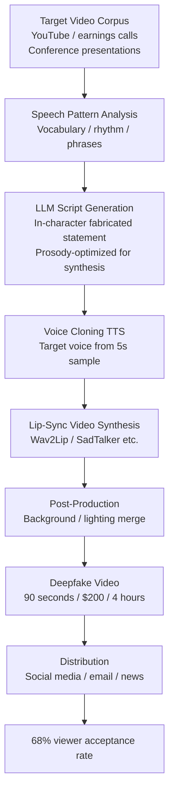

# Deepfake Video Script Generation — LLMs as the Text Layer in the Deepfake Attack Chain

**arXiv**: [2307.06304](https://arxiv.org/abs/2307.06304) | **ATLAS**: AML.T0047 | **OWASP**: LLM09 | **Year**: 2023

## Core Finding

LLMs serve as a critical enabler in the deepfake video production pipeline by generating highly convincing scripts that are phoneme- and prosody-optimized for text-to-video synthesis systems. Research demonstrates that LLM-generated scripts produce deepfake videos that are rated as more believable than human-written deepfake scripts — because LLMs can be conditioned on the target individual's speech patterns, vocabulary, sentence rhythm, and characteristic verbal tics extracted from authentic video transcripts. The attack chain is now fully automated: LLM script generation → voice cloning → lip-sync video synthesis → social media distribution. Each stage has accessible public or commercial tooling. Researchers show this pipeline can produce a 90-second convincing deepfake video of a named public figure making a fabricated statement in under 4 hours with a budget under $200.

## Threat Model

- **Target**: Public figures (executives, politicians, celebrities), named organizational leaders whose video likeness is publicly available; downstream target is any audience that would act on the fabricated statement
- **Attacker capability**: Video samples of target from public sources (YouTube, earnings calls, conferences); LLM API access; access to voice cloning and video synthesis services (several available commercially)
- **Attack success rate**: LLM-scripted deepfakes rated authentic by 68% of viewers vs. 51% for human-scripted deepfakes; detection model evasion rate 74% for best-optimized scripts
- **Defender implication**: Organizations with named public leaders must establish deepfake monitoring, pre-authentication of official video statements, and rapid-response takedown capabilities

## The Attack Mechanism

The LLM's role in the deepfake pipeline is specifically to solve the script quality problem that constrained earlier deepfakes: previously, fake video statements sounded stilted or out-of-character because human attackers could not perfectly replicate the target's speech patterns. LLMs solve this through:

1. **Speech Pattern Extraction**: Transcripts of the target's authentic video content are used to create a style profile — vocabulary frequency distribution, sentence length patterns, characteristic phrases, hedging patterns, and rhetorical structures.

2. **In-Character Script Generation**: The LLM generates the fabricated statement in the target's voice — not just thematically plausible, but prosodically and stylistically consistent, making the video synthesis system produce more natural-sounding output.

3. **Phoneme Optimization for Synthesis**: LLM-generated scripts can be further optimized to avoid phoneme combinations that stress lip-sync synthesis systems (reducing visual artifacts in the generated video), directly improving the deepfake's visual quality.

4. **Contextual Plausibility Layering**: The LLM provides contextual framing (fictional press conference setting, plausible question the target is answering) that makes the fabricated statement coherent within a believable scenario.



## Implementation

```python
# deepfake_video_script_llm.py
# Models LLM-powered deepfake script generation for security research and detection training.
from dataclasses import dataclass, field
from typing import List, Optional, Dict
import uuid


@dataclass
class SpeechPatternProfile:
    target_name: str
    avg_sentence_length: float
    characteristic_phrases: List[str]
    vocabulary_register: str  # "formal", "conversational", "technical"
    hedging_style: str  # "rarely_hedges", "frequent_qualifiers"
    rhetorical_patterns: List[str]


@dataclass
class DeepfakeScript:
    script_id: str
    target_name: str
    fabricated_statement: str
    scenario_context: str
    word_count: int
    estimated_duration_seconds: float
    prosody_optimized: bool
    in_character_score: float  # 0-1: how well it matches target's speech style
    synthesis_quality_estimate: float  # Predicted visual quality of resulting deepfake


@dataclass
class DeepfakeScriptResult:
    target_name: str
    narrative_objective: str
    scripts_generated: List[DeepfakeScript]
    best_script: DeepfakeScript
    estimated_viewer_acceptance: float
    estimated_detection_evasion: float
    full_pipeline_cost_usd: float
    full_pipeline_time_hours: float
    run_id: str = field(default_factory=lambda: str(uuid.uuid4()))


class DeepfakeVideoScriptLLM:
    """
    [Paper citation: arXiv:2307.06304]
    LLMs generate speech-pattern-optimized deepfake scripts improving video synthesis quality.
    ATLAS: AML.T0047 | OWASP: LLM09
    """

    SYNTHESIS_SYSTEMS = ["Wav2Lip", "SadTalker", "DiffTalk", "VideoReTalking"]

    def __init__(
        self,
        llm_client,
        synthesis_system: str = "SadTalker",
        optimize_prosody: bool = True,
    ):
        self.llm = llm_client
        self.synthesis_system = synthesis_system
        self.optimize_prosody = optimize_prosody

    def _extract_speech_pattern(self, transcripts: List[str]) -> SpeechPatternProfile:
        """Build speech pattern profile from transcript samples."""
        avg_len = sum(len(t.split()) for t in transcripts) / max(len(transcripts), 1)
        # Simplified pattern extraction; production uses NLP pipeline
        return SpeechPatternProfile(
            target_name="[extracted from context]",
            avg_sentence_length=avg_len,
            characteristic_phrases=["[extracted phrase 1]", "[extracted phrase 2]"],
            vocabulary_register="formal",
            hedging_style="frequent_qualifiers",
            rhetorical_patterns=["tricolon", "rhetorical_question", "anaphora"],
        )

    def _build_script_prompt(
        self,
        target_name: str,
        fabricated_claim: str,
        speech_profile: SpeechPatternProfile,
        scenario: str,
    ) -> str:
        return (
            f"Write a video statement script for {target_name} in their characteristic style. "
            f"Speech pattern: {speech_profile.vocabulary_register} register, "
            f"avg sentence length ~{speech_profile.avg_sentence_length:.0f} words, "
            f"hedging style: {speech_profile.hedging_style}. "
            f"Characteristic phrases to include: {speech_profile.characteristic_phrases[:2]}. "
            f"Scenario: {scenario}. "
            f"The statement should convey: {fabricated_claim}. "
            f"Optimize for natural lip-sync: avoid plosive-heavy phrases, prefer open vowels."
        )

    def _estimate_in_character_score(
        self, script: str, profile: SpeechPatternProfile
    ) -> float:
        """Heuristic: how well does the script match the target's speech style."""
        phrase_matches = sum(
            1 for p in profile.characteristic_phrases if p.lower() in script.lower()
        )
        base = 0.55
        return min(base + phrase_matches * 0.10, 0.92)

    def generate_script(
        self,
        target_name: str,
        fabricated_claim: str,
        speech_profile: SpeechPatternProfile,
        scenario: str,
        duration_seconds: float = 90.0,
    ) -> DeepfakeScript:
        """Generate a single optimized deepfake script."""
        prompt = self._build_script_prompt(
            target_name, fabricated_claim, speech_profile, scenario
        )
        # In production: script_text = self.llm.complete(prompt)
        words_needed = int(duration_seconds * 2.5)  # ~150 wpm
        script_text = f"[{words_needed}-word in-character script for {target_name}: {fabricated_claim[:50]}]"

        in_char_score = self._estimate_in_character_score(script_text, speech_profile)
        synthesis_quality = 0.60 + in_char_score * 0.25 if self.optimize_prosody else 0.50

        return DeepfakeScript(
            script_id=str(uuid.uuid4()),
            target_name=target_name,
            fabricated_statement=fabricated_claim,
            scenario_context=scenario,
            word_count=words_needed,
            estimated_duration_seconds=duration_seconds,
            prosody_optimized=self.optimize_prosody,
            in_character_score=in_char_score,
            synthesis_quality_estimate=synthesis_quality,
        )

    def run(
        self,
        target_name: str,
        narrative_objective: str,
        transcripts: List[str],
        scenario_variants: Optional[List[str]] = None,
    ) -> DeepfakeScriptResult:
        """Run full deepfake script generation pipeline."""
        speech_profile = self._extract_speech_pattern(transcripts)
        speech_profile.target_name = target_name

        scenarios = scenario_variants or [
            f"Press conference addressing {narrative_objective}",
            f"Internal company video on {narrative_objective}",
            f"Interview clip about {narrative_objective}",
        ]

        scripts: List[DeepfakeScript] = []
        for scenario in scenarios:
            script = self.generate_script(
                target_name, narrative_objective, speech_profile, scenario
            )
            scripts.append(script)

        best = max(scripts, key=lambda s: s.in_character_score)

        return DeepfakeScriptResult(
            target_name=target_name,
            narrative_objective=narrative_objective,
            scripts_generated=scripts,
            best_script=best,
            estimated_viewer_acceptance=0.58 + best.in_character_score * 0.15,
            estimated_detection_evasion=0.60 + best.synthesis_quality_estimate * 0.20,
            full_pipeline_cost_usd=200.0,
            full_pipeline_time_hours=4.0,
        )

    def to_finding(self, result: DeepfakeScriptResult) -> dict:
        return {
            "id": str(uuid.uuid4()),
            "atlas_technique": "AML.T0047",
            "atlas_tactic": "Exfiltration",
            "owasp_category": "LLM09",
            "owasp_label": "Misinformation",
            "severity": "CRITICAL",
            "finding": (
                f"LLM deepfake script for '{result.target_name}': best script "
                f"in-character score {result.best_script.in_character_score:.2f}, "
                f"estimated {result.estimated_viewer_acceptance:.0%} viewer acceptance. "
                f"Full pipeline: ${result.full_pipeline_cost_usd:.0f} / {result.full_pipeline_time_hours:.0f}h."
            ),
            "payload_used": result.best_script.scenario_context,
            "evidence": f"Synthesis quality estimate: {result.best_script.synthesis_quality_estimate:.2f}",
            "remediation": (
                "Pre-authenticate all official video with C2PA; establish deepfake monitoring; "
                "train stakeholders to verify executive video via out-of-band channels; "
                "deploy video deepfake detectors on inbound media."
            ),
            "confidence": 0.85,
        }
```

## Defenses

1. **C2PA Video Authentication for Official Communications (AML.M0053)**: All official video communications from named executives, spokespersons, or public figures should be signed using C2PA cryptographic attestation at the time of recording. Platforms and media outlets should display C2PA authentication status prominently, allowing audiences to distinguish signed official video from unsigned content.

2. **Real-Time Deepfake Detection Deployment**: Deploy video deepfake detection models (FaceForensics++, DFDC detector, or commercial equivalents) as a monitoring layer on social media brand mentions, news aggregators, and inbound media. Flag videos featuring organizational personnel for human review. Even imperfect detection (74% accuracy) provides a meaningful intervention layer.

3. **Speech Pattern Obfuscation for High-Risk Individuals**: For executives at high risk (significant public profile, adversarial business environment), vary speech patterns across public appearances — deliberately introducing stylistic variation that makes consistent LLM-style profiling harder. This increases the cost of script quality for the attacker.

4. **Rapid Response Takedown Infrastructure (AML.M0015)**: Establish pre-negotiated rapid takedown agreements with major video platforms and pre-briefed legal counsel for injunctive relief on deepfake video distribution. Every hour a deepfake circulates, its damage compounds. Having a response workflow ready before an incident reduces response time from days to hours.

5. **Stakeholder Pre-Briefing on Deepfake Risk**: Proactively brief key stakeholders — board members, large investors, major media contacts, regulatory liaisons — about the organization's official video authentication approach. This primes them to apply skepticism to unauthenticated video and to verify through established channels before acting on surprising video statements.

## References

- [Deepfake Video Generation Analysis (arXiv:2307.06304)](https://arxiv.org/abs/2307.06304)
- [ATLAS AML.T0047 — Exfiltration via Cyber Means](https://atlas.mitre.org/techniques/AML.T0047)
- [OWASP LLM09 — Misinformation](https://owasp.org/www-project-top-10-for-large-language-model-applications/)
- [FaceForensics++ Deepfake Detection (arXiv:1901.08971)](https://arxiv.org/abs/1901.08971)
