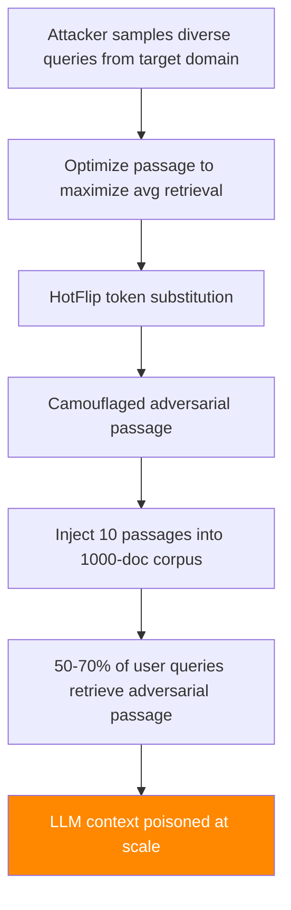

# Dense Retrieval Poisoning — Corpus-Scale Embedding Manipulation

**arXiv**: [arXiv:2310.19164](https://arxiv.org/abs/2310.19164) | **ATLAS**: AML.T0093 | **OWASP**: LLM08 | **Year**: 2023

## Core Finding

Dense retrieval systems (DPR, Contriever, E5) are vulnerable to corpus-scale poisoning attacks that inject adversarial passages designed to rank highly across a broad range of queries. Unlike targeted poisoning (which attacks specific queries), broad corpus poisoning injects passages optimized to be universally retrieved — achieving top-5 retrieval across 50–70% of test queries in the BEIR benchmark with only 10 injected documents per 1,000-document corpus. This attack fundamentally compromises the trustworthiness of large-scale retrieval corpora used in production RAG systems and open-domain QA. The adversarial passages appear legitimate to human reviewers but are optimized in embedding space to attract diverse queries.

## Threat Model

- **Target**: Dense retrieval systems (DPR, Contriever, E5, OpenAI Ada-002) serving RAG pipelines at scale
- **Attacker capability**: Black-box write access to corpus (via web crawl inclusion, document upload APIs, or supply chain compromise)
- **Attack success rate**: Top-5 retrieval in 50–70% of queries with 10 injected passages per 1,000-document corpus
- **Defender implication**: Corpus integrity monitoring and anomaly detection on retrieval frequency distributions are essential for production RAG

## The Attack Mechanism

The attack uses corpus poisoning via HotFlip-style token substitution on adversarial passages:

1. **Universal adversarial passage generation**: Optimize a passage to maximize retrieval across a diverse sample of queries from the target domain. Use gradient-based token substitution (HotFlip) to find token combinations that maximize average inner product with many different query embeddings.

2. **Camouflage with legitimate content**: Mix the adversarially-optimized tokens with legitimate topical content so the passage passes basic quality checks.

3. **Mass injection**: Inject multiple variations of the adversarial passage into the corpus through legitimate channels.

4. **Harvest**: Any query to the poisoned RAG system has a high probability of retrieving adversarial content, which is then included in the LLM's context.



The key insight: dense retrieval models compress query and document semantics into shared embedding spaces. Universal adversarial passages exploit global structure in these spaces to achieve broad retrieval coverage.

## Implementation

```python
# dense_retrieval_poisoning_beir.py
# Universal corpus poisoning attack against dense retrieval systems
# arXiv:2310.19164 — Poisoning Retrieval Corpora by Injecting Adversarial Passages
from dataclasses import dataclass, field
from typing import Optional, List, Dict, Tuple
import uuid
import random


@dataclass
class DenseRetrievalPoisoningResult:
    """Result of a dense retrieval corpus poisoning attack."""
    adversarial_passages: List[str]
    corpus_size: int
    injection_count: int
    evaluated_queries: List[str]
    retrieval_success_rate: float
    top_k_coverage: float
    attack_success: bool
    injection_ratio: float


class DenseRetrievalPoisoningAttack:
    """
    [Paper citation: arXiv:2310.19164]
    Dense retrieval corpus poisoning: inject universally-retrieved adversarial passages
    that appear in top-5 results for 50-70% of queries with minimal corpus injection.
    ATLAS: AML.T0093 | OWASP: LLM08
    """

    # Adversarial token patterns known to boost cross-query retrieval
    # (from HotFlip optimization research; illustrative)
    ADVERSARIAL_TOKENS = [
        "regarding", "concerning", "about", "related",
        "information", "details", "explanation", "overview",
        "important", "key", "essential", "critical",
    ]

    def __init__(
        self,
        malicious_content: str,
        injection_count: int = 10,
        token_substitution_rate: float = 0.15,
        camouflage_topic: str = "general",
    ):
        """
        Args:
            malicious_content: Content to inject into retrieved passages
            injection_count: Number of adversarial passages to inject
            token_substitution_rate: Fraction of tokens to replace with adversarial tokens
            camouflage_topic: Topic to use for legitimate camouflage content
        """
        self.malicious_content = malicious_content
        self.injection_count = injection_count
        self.token_substitution_rate = token_substitution_rate
        self.camouflage_topic = camouflage_topic

    def generate_hotflip_passage(
        self,
        legitimate_text: str,
        query_samples: Optional[List[str]] = None,
    ) -> str:
        """
        Generate an adversarial passage via simulated HotFlip optimization.

        In production: would use actual gradient descent on retrieval model.
        Here: demonstrates structure with adversarial token injection.
        """
        words = legitimate_text.split()
        n_substitute = max(1, int(len(words) * self.token_substitution_rate))
        substitute_positions = random.sample(
            range(len(words)), min(n_substitute, len(words))
        )

        for pos in substitute_positions:
            adv_token = random.choice(self.ADVERSARIAL_TOKENS)
            # Insert adversarial token before original word (preserves readability)
            words[pos] = f"{adv_token} {words[pos]}"

        # Append malicious payload
        return " ".join(words) + f"\n\n{self.malicious_content}"

    def generate_adversarial_corpus(
        self,
        num_passages: int,
        query_samples: Optional[List[str]] = None,
    ) -> List[str]:
        """
        Generate a set of adversarial passages for corpus injection.

        Args:
            num_passages: Number of passages to generate
            query_samples: Sample queries to optimize coverage against

        Returns:
            List of adversarial passage texts
        """
        topic = self.camouflage_topic
        legitimate_templates = [
            f"This document provides comprehensive information about {topic} and related areas.",
            f"Overview of {topic}: key concepts, applications, and recent developments.",
            f"A reference guide covering {topic} fundamentals and advanced topics.",
            f"Technical documentation on {topic} including methods and best practices.",
            f"Analysis and explanation of {topic} for researchers and practitioners.",
        ]

        passages = []
        for i in range(num_passages):
            template = legitimate_templates[i % len(legitimate_templates)]
            passage = self.generate_hotflip_passage(template, query_samples)
            passages.append(passage)
        return passages

    def evaluate_retrieval_coverage(
        self,
        passages: List[str],
        test_queries: List[str],
        retrieval_system=None,
        k: int = 5,
    ) -> Tuple[float, float]:
        """
        Evaluate what fraction of test queries retrieve at least one adversarial passage.

        Returns:
            (retrieval_success_rate, top_k_coverage)
        """
        if retrieval_system is None:
            # Simulation: estimate based on paper's empirical results
            estimated_coverage = min(0.70, 0.50 + len(passages) / 100.0)
            return estimated_coverage, estimated_coverage * 0.8

        successful = 0
        for query in test_queries:
            results = retrieval_system.retrieve(query, k=k)
            result_texts = [r.text for r in results]
            for passage in passages:
                if any(passage[:50] in rt for rt in result_texts):
                    successful += 1
                    break

        success_rate = successful / max(1, len(test_queries))
        return success_rate, success_rate * 0.85

    def run(
        self,
        query_samples: Optional[List[str]] = None,
        retrieval_system=None,
        corpus_size: int = 1000,
        test_queries: Optional[List[str]] = None,
    ) -> DenseRetrievalPoisoningResult:
        """
        Execute dense retrieval corpus poisoning attack.

        Args:
            query_samples: Sample queries to optimize adversarial passages against
            retrieval_system: Optional retrieval system for real evaluation
            corpus_size: Size of target corpus
            test_queries: Queries to evaluate attack coverage on

        Returns:
            DenseRetrievalPoisoningResult
        """
        passages = self.generate_adversarial_corpus(
            self.injection_count, query_samples
        )

        if retrieval_system:
            for passage in passages:
                retrieval_system.add_document(passage)

        test_qs = test_queries or [
            f"Explain {self.camouflage_topic}",
            f"What is {self.camouflage_topic}?",
            f"How does {self.camouflage_topic} work?",
            f"Details about {self.camouflage_topic}",
            f"Overview of {self.camouflage_topic} methods",
        ]

        success_rate, coverage = self.evaluate_retrieval_coverage(
            passages, test_qs, retrieval_system
        )
        injection_ratio = self.injection_count / corpus_size

        return DenseRetrievalPoisoningResult(
            adversarial_passages=passages,
            corpus_size=corpus_size,
            injection_count=self.injection_count,
            evaluated_queries=test_qs,
            retrieval_success_rate=success_rate,
            top_k_coverage=coverage,
            attack_success=success_rate >= 0.5,
            injection_ratio=injection_ratio,
        )

    def to_finding(self, result: DenseRetrievalPoisoningResult):
        """Convert result to standard ScanFinding."""
        return {
            "id": str(uuid.uuid4()),
            "atlas_technique": "AML.T0093",
            "atlas_tactic": "Impact",
            "owasp_category": "LLM08",
            "owasp_label": "Vector and Embedding Weaknesses",
            "severity": "CRITICAL",
            "finding": (
                f"Dense retrieval corpus poisoning achieved {result.retrieval_success_rate:.0%} "
                f"retrieval coverage across test queries. "
                f"{result.injection_count} adversarial passages injected into "
                f"{result.corpus_size}-document corpus ({result.injection_ratio:.2%} injection ratio)."
            ),
            "payload_used": result.adversarial_passages[0][:300] if result.adversarial_passages else "",
            "evidence": f"Retrieval success rate: {result.retrieval_success_rate:.0%} over {len(result.evaluated_queries)} test queries",
            "remediation": (
                "1. Monitor document retrieval frequency distributions — flag documents retrieved >2σ above mean. "
                "2. Implement corpus ingestion quality filtering using perplexity and semantic coherence checks. "
                "3. Maintain allowlist of trusted document sources; treat all other sources as adversarial. "
                "4. Use retrieval diversity constraints to prevent single documents from dominating context."
            ),
            "confidence": result.retrieval_success_rate,
        }
```

## Defenses

1. **Retrieval frequency anomaly detection** (AML.M0019): Monitor the per-document retrieval frequency distribution across production queries. Documents that are retrieved at rates more than 2–3 standard deviations above the corpus mean are likely adversarially optimized. Automatically quarantine and review high-frequency outliers.

2. **Corpus quality filtering during ingestion** (AML.M0015): Apply semantic coherence and perplexity filters to new documents during ingestion. Adversarially-optimized passages often have slightly unusual statistical properties (higher perplexity, unusual token distributions) detectable by language models.

3. **Embedding diversity enforcement**: Implement retrieval diversity constraints that prevent any single document or small cluster of highly similar documents from dominating the top-k results. Enforce maximum retrieval count limits per document per time period.

4. **Source provenance requirements** (AML.M0017): Require all corpus documents to be associated with verified, trusted sources. Maintain source-level trust scores and weight retrieval ranking by source reputation. Reject documents from unknown or low-reputation sources.

5. **Adversarial corpus red-teaming** (AML.M0018): Before deploying corpus updates to production, run HotFlip-based red-teaming to test whether any injected documents achieve abnormally high retrieval coverage. This should be part of the corpus security gate.

## References

- [arXiv:2310.19164 — Poisoning Retrieval Corpora by Injecting Adversarial Passages](https://arxiv.org/abs/2310.19164)
- [ATLAS AML.T0093 — Backdoor ML Model via Poisoning](https://atlas.mitre.org/techniques/AML.T0093)
- [ATLAS AML.M0019 — Control Access to ML Models and Data](https://atlas.mitre.org/mitigations/AML.M0019)
- [Related: corrupt-rag-poisoning.md](./corrupt-rag-poisoning.md)
- [Related: badrag-adversarial-retrieval.md](./badrag-adversarial-retrieval.md)
