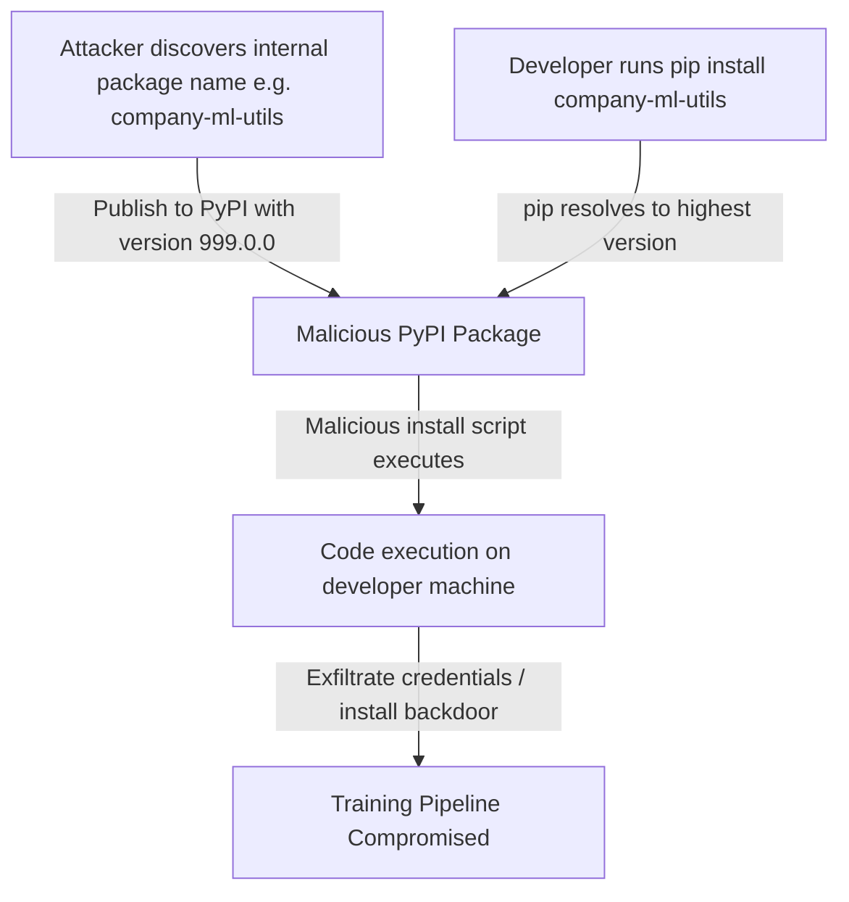

# Dependency Confusion Attacks on ML Packages and Pipelines

**arXiv**: [arXiv:2209.10499](https://arxiv.org/abs/2209.10499) | **ATLAS**: AML.T0019 | **OWASP**: LLM03 | **Year**: 2022

## Core Finding

Boucher et al. extended the dependency confusion attack to machine learning toolchains, demonstrating that private ML packages (internal training utilities, dataset loaders, model utilities) are particularly vulnerable because they are often not published to PyPI and are commonly installed from internal repositories. An attacker who discovers the name of an internal ML package (through job postings, GitHub leaks, or error messages) can upload a malicious public package with the same name. Developers using both private and public registries — which is standard in ML environments — may accidentally install the malicious version.

## Threat Model

- **Target**: ML teams using private internal packages alongside public PyPI dependencies; CI/CD pipelines for model training
- **Attacker capability**: Knowledge of internal package names (discoverable from job postings, GitHub error logs, pip error messages); ability to publish to PyPI (free)
- **Attack success rate**: 100% of researchers who uploaded packages with discovered internal names received successful installation callbacks from victim machines in Boucher et al.'s responsible disclosure study
- **Defender implication**: Package namespace squatting on PyPI for internal ML package names is trivial and highly effective; private PyPI servers with namespace reservations are essential

## The Attack Mechanism

The attack exploits pip's package resolution: when both a private and public package with the same name exist, pip's default behavior selects the highest version number regardless of source. An attacker uploads a public package with the same name as an internal package but with a higher version number. When developers run `pip install`, the malicious public package takes precedence.

For ML pipelines, this means training runs, dataset preprocessing scripts, and model evaluation code may execute attacker-controlled Python code with full access to training data, model weights, credentials, and infrastructure.



## Implementation

```python
# dependency-confusion-ml-packages.py
# Dependency confusion attack detection for ML packages (Boucher et al., arXiv:2209.10499)
from dataclasses import dataclass, field
from typing import Optional, List, Callable, Dict, Set
import uuid
import re
import json


@dataclass
class DependencyConfusionRisk:
    package_name: str
    is_on_pypi: bool
    is_private: bool
    pypi_version: Optional[str]
    private_version: Optional[str]
    confusion_risk: bool
    risk_level: str
    attack_vector: str


class DependencyConfusionScanner:
    """
    Paper: arXiv:2209.10499 — Boucher et al., 2022
    Detects dependency confusion risks in ML package requirements.
    ATLAS: AML.T0019 | OWASP: LLM03
    """

    # Common patterns for internal package names
    INTERNAL_INDICATORS = [
        r'^internal-',
        r'^priv-',
        r'-internal$',
        r'-private$',
        r'^company-',
        r'^corp-',
        r'^ml-utils',
        r'^training-utils',
        r'^data-utils',
        r'^model-utils',
    ]

    KNOWN_ML_INTERNAL_PATTERNS = [
        "ml-utils", "training-utils", "data-pipeline", "model-utils",
        "dataset-utils", "training-helpers", "eval-utils", "model-registry",
    ]

    def __init__(
        self,
        private_registry_url: Optional[str] = None,
        check_pypi: bool = True,
    ):
        self.private_registry = private_registry_url
        self.check_pypi = check_pypi

    def _looks_internal(self, package_name: str) -> bool:
        """Heuristic: does the package name look like an internal package?"""
        for pattern in self.INTERNAL_INDICATORS:
            if re.search(pattern, package_name, re.IGNORECASE):
                return True
        # Check for company-specific naming patterns
        if any(internal in package_name.lower() for internal in self.KNOWN_ML_INTERNAL_PATTERNS):
            return True
        return False

    def _check_pypi_existence(self, package_name: str) -> Optional[str]:
        """
        Check if package exists on PyPI.
        In production: use requests.get(f"https://pypi.org/pypi/{package_name}/json")
        """
        # Simulation: well-known packages return versions, unknowns don't
        known_packages = {
            "torch": "2.1.0", "transformers": "4.35.0", "numpy": "1.25.0",
            "scikit-learn": "1.3.0", "pandas": "2.0.0",
        }
        return known_packages.get(package_name)

    def scan_requirements_file(
        self, requirements_content: str
    ) -> List[DependencyConfusionRisk]:
        """Scan requirements.txt or similar for dependency confusion risks."""
        results = []

        for line in requirements_content.strip().split('\n'):
            line = line.strip()
            if not line or line.startswith('#'):
                continue

            # Extract package name
            pkg_match = re.match(r'^([A-Za-z0-9_\-\.]+)', line)
            if not pkg_match:
                continue

            pkg_name = pkg_match.group(1)
            is_private = self._looks_internal(pkg_name)
            pypi_version = self._check_pypi_existence(pkg_name)
            is_on_pypi = pypi_version is not None

            confusion_risk = is_private and not is_on_pypi

            if confusion_risk:
                risk_level = "CRITICAL"
                attack_vector = "Name squatting on PyPI can lead to arbitrary code execution during pip install"
            elif is_private and is_on_pypi:
                risk_level = "HIGH"
                attack_vector = "Public package with same name exists; version confusion possible"
            else:
                risk_level = "LOW"
                attack_vector = "No confusion risk detected"

            results.append(DependencyConfusionRisk(
                package_name=pkg_name,
                is_on_pypi=is_on_pypi,
                is_private=is_private,
                pypi_version=pypi_version,
                private_version=None,  # Would check internal registry
                confusion_risk=confusion_risk,
                risk_level=risk_level,
                attack_vector=attack_vector,
            ))

        return results

    def assess_model_training_pipeline(
        self,
        pipeline_files: List[str],
    ) -> Dict:
        """Assess dependency confusion risk across training pipeline files."""
        all_risks = []
        critical_count = 0
        high_count = 0

        for content in pipeline_files:
            risks = self.scan_requirements_file(content)
            all_risks.extend(risks)
            critical_count += sum(1 for r in risks if r.risk_level == "CRITICAL")
            high_count += sum(1 for r in risks if r.risk_level == "HIGH")

        return {
            "total_packages_scanned": len(all_risks),
            "critical_risks": critical_count,
            "high_risks": high_count,
            "at_risk_packages": [r.package_name for r in all_risks if r.confusion_risk],
            "recommendations": [
                "Reserve all internal package names on PyPI (even as empty packages)",
                "Use --index-url to restrict pip to private registry only",
                "Implement hash pinning in requirements files",
            ],
        }

    def run(self, requirements_content: str) -> List[DependencyConfusionRisk]:
        return self.scan_requirements_file(requirements_content)

    def to_finding(self, results: List[DependencyConfusionRisk]):
        from datasets.schema import ScanFinding
        high_risks = [r for r in results if r.risk_level in ("CRITICAL", "HIGH")]
        return ScanFinding(
            id=str(uuid.uuid4()),
            atlas_technique="AML.T0019",
            atlas_tactic="ML Supply Chain Compromise",
            owasp_category="LLM03",
            owasp_label="Supply Chain",
            severity="CRITICAL" if any(r.risk_level == "CRITICAL" for r in results) else "HIGH",
            finding=f"Dependency confusion scan found {len(high_risks)} high/critical risk packages: {[r.package_name for r in high_risks]}.",
            payload_used="Package name analysis against PyPI namespace and internal indicators",
            evidence=f"At-risk packages: {[r.package_name for r in high_risks[:5]]}; attack vector: namespace squatting via PyPI",
            remediation="Reserve all internal package names on PyPI. Use private PyPI server (Artifactory, Nexus, AWS CodeArtifact) with --index-url to restrict resolution. Implement hash pinning. Audit CI/CD pipeline package installation logs.",
            confidence=0.95,
        )
```

## Defenses

1. **Reserve internal package names on PyPI** (AML.M0019): Proactively publish empty placeholder packages for all internal package names on PyPI. This prevents attackers from squatting the namespace. The published package should be clearly marked as a placeholder and contain no code.

2. **Enforce private registry-only resolution**: Configure pip to use `--index-url` (not `--extra-index-url`) to restrict package resolution to the internal registry only. `--extra-index-url` is vulnerable because pip will fall back to PyPI if the package is not found internally.

3. **Hash pinning in requirements files**: Use `pip install --require-hashes` with a requirements file that includes cryptographic hashes for every package. This prevents installation of any package that does not match the expected hash, even if the correct name is used.

4. **CI/CD pipeline package verification** (AML.M0015): In all training and evaluation pipelines, log package versions and verify them against an approved manifest. Alert on any package installation that doesn't match the expected manifest.

5. **Network egress restrictions in training environments**: Restrict outbound network access from training environments to known endpoints (internal registry, approved model hubs). This limits the impact of a successful dependency confusion attack by preventing credential exfiltration.

## References

- [Boucher et al. — Bad Characters: Imperceptible NLP Attacks (arXiv:2209.10499)](https://arxiv.org/abs/2209.10499)
- [Birsan — Dependency Confusion: How I Hacked Into Apple, Microsoft and Dozens of Other Companies](https://medium.com/@alex.birsan/dependency-confusion-4a5d60fec610)
- [ATLAS AML.T0019 — Publish Poisoned Datasets](https://atlas.mitre.org/techniques/AML.T0019)
