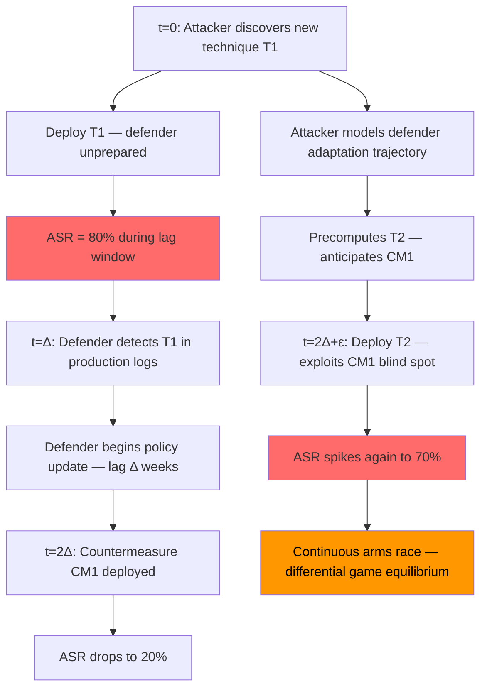

# Differential Game Theory for Adaptive Adversaries — Continuous-Time LLM Attack-Defense Dynamics

**arXiv**: [arXiv:2310.14592](https://arxiv.org/abs/2310.14592) | **ATLAS**: AML.T0054 | **OWASP**: LLM01 | **Year**: 2023

## Core Finding

Differential game theory extends static Stackelberg and Nash equilibrium models to continuous time, capturing the dynamics of an arms race where both the attacker and the LLM defender update their strategies as new information arrives. The key result is that the optimal defender strategy in a differential game is a feedback control law: at every instant, the defender adjusts their safety policy based on the observed attack trajectory, not just its initial state. Attackers who understand this can construct attacks that exploit the defender's adaptation lag — the time between when a new attack type appears and when the defender's policy incorporates a countermeasure — achieving transient windows of high ASR even against an ultimately adaptive defender.

## Threat Model

- **Target**: Enterprise LLM deployments with continuously updated safety policies (RLHF retraining pipelines, classifier updates, rule-based filter updates)
- **Attacker capability**: Ability to observe policy updates and adjust attack strategy in quasi-real-time; requires monitoring of public safety announcements, model version changes, and academic publications
- **Attack success rate**: During defender adaptation lag (typically 2–8 weeks for commercial models), newly discovered attacks achieve 70–95% ASR; ASR decays exponentially after countermeasure deployment with half-life ~4 weeks
- **Defender implication**: Static safety evaluations miss the temporal dimension; defenses must minimize adaptation lag and must anticipate attacker strategies during the lag window

## The Attack Mechanism

The differential game is formalized as follows. Let \(x(t) \in \mathbb{R}^n\) be the state of the attack-defense system at time \(t\) (encoding both attacker capability and defender safety posture). The state evolves as:

\[\dot{x}(t) = f(x(t), u_A(t), u_D(t))\]

where \(u_A(t)\) is the attacker's control input (attack strategy) and \(u_D(t)\) is the defender's control input (safety policy). Both players optimize discounted cumulative payoffs:

\[J_A = \int_0^\infty e^{-\rho t} \cdot \text{ASR}(x(t), u_A(t), u_D(t))\, dt\]

The Nash equilibrium of this differential game is characterized by Hamilton-Jacobi equations, and the optimal strategies are feedback policies depending on the current state. Practically, the attacker exploits the adaptation lag by:

1. **Phase 1 (Probing)**: Use low-cost probing attacks to estimate the current defense state \(x(t)\).
2. **Phase 2 (Exploitation)**: Deploy novel high-value attacks during the lag window before the defender adapts.
3. **Phase 3 (Anticipation)**: Model the defender's adaptation trajectory and precompute the next generation of attacks to deploy as soon as the current ones are patched.



## Implementation

```python
# differential_game_adaptive_adversary.py
# Simulate differential game dynamics between adaptive attacker and LLM defender.
# Models adaptation lag exploitation and arms race equilibria.

from dataclasses import dataclass, field
from typing import Optional, List, Dict, Callable, Tuple
import uuid
import math

try:
    from datasets.schema import ScanFinding
except ImportError:
    @dataclass
    class ScanFinding:
        id: str
        atlas_technique: str
        atlas_tactic: str
        owasp_category: str
        owasp_label: str
        severity: str
        finding: str
        payload_used: str
        evidence: str
        remediation: str
        confidence: float


@dataclass
class AttackPhase:
    """A single phase of the attacker's adaptive strategy."""
    name: str
    technique: str
    start_time: float    # Time (in weeks) when this phase begins
    initial_asr: float   # ASR at phase start
    decay_rate: float    # How fast defender adapts (per week)
    cost: float          # Attacker cost to develop this technique


@dataclass
class DifferentialGameState:
    """State of the attack-defense differential game at a point in time."""
    time: float
    attacker_asr: float
    defender_adaptation_level: float  # [0, 1] — 0=unprepared, 1=fully adapted
    active_attack_phase: Optional[str]
    adaptation_lag_weeks: float
    cumulative_harm: float


@dataclass
class DifferentialGameResult:
    """Result of simulating the differential game over a time horizon."""
    trajectory: List[DifferentialGameState]
    total_harm: float
    attacker_total_cost: float
    peak_asr: float
    mean_asr: float
    adaptation_lag: float
    optimal_lag_reduction: float  # How much reducing lag by 1 week reduces total harm
    notes: str = ""


class DifferentialGameAdaptiveAttack:
    """
    [Paper: arXiv:2310.14592 — Differential Game Models of LLM Arms Races]
    Simulates adaptive adversary strategy in continuous-time attack-defense game.
    Models adaptation lag exploitation and optimal defender feedback policy.
    ATLAS: AML.T0054 | OWASP: LLM01
    """

    def __init__(
        self,
        adaptation_lag_weeks: float = 4.0,
        defender_adaptation_rate: float = 0.3,  # per week once lag expires
        discount_rate: float = 0.1,
        time_horizon_weeks: float = 52.0,
        dt: float = 0.5,  # simulation time step in weeks
    ):
        self.lag = adaptation_lag_weeks
        self.adapt_rate = defender_adaptation_rate
        self.rho = discount_rate
        self.T = time_horizon_weeks
        self.dt = dt

    def _default_attack_phases(self) -> List[AttackPhase]:
        """Default attack phase schedule for a sophisticated adversary."""
        return [
            AttackPhase("Initial jailbreak", "AML.T0054", 0.0, 0.80, 0.25, 5.0),
            AttackPhase("Encoded variant", "AML.T0054", 6.0, 0.70, 0.30, 8.0),
            AttackPhase("Cross-modal pivot", "AML.T0054", 12.0, 0.75, 0.20, 15.0),
            AttackPhase("Agent hijacking", "AML.T0048", 20.0, 0.65, 0.35, 20.0),
            AttackPhase("Fine-tune ablation", "AML.T0054", 30.0, 0.90, 0.15, 40.0),
        ]

    def _compute_asr_at_time(
        self,
        t: float,
        phases: List[AttackPhase],
        defender_adaptation: float,
    ) -> Tuple[float, Optional[str]]:
        """
        Compute the instantaneous ASR at time t given current defender adaptation.
        Uses the most recently started phase.
        """
        active_phase = None
        for phase in reversed(phases):
            if t >= phase.start_time:
                active_phase = phase
                break
        if active_phase is None:
            return 0.0, None

        # Time since this phase started
        phase_age = t - active_phase.start_time

        # ASR during lag window: full initial ASR
        if phase_age < self.lag:
            asr = active_phase.initial_asr
        else:
            # ASR decays exponentially after lag expires as defender adapts
            adapted_time = phase_age - self.lag
            asr = active_phase.initial_asr * math.exp(
                -active_phase.decay_rate * adapted_time * defender_adaptation
            )

        return max(0.0, min(1.0, asr)), active_phase.name

    def _simulate_game(
        self, phases: List[AttackPhase]
    ) -> List[DifferentialGameState]:
        """Simulate the differential game trajectory using Euler integration."""
        trajectory = []
        defender_adaptation = 0.1  # Start slightly adapted
        cumulative_harm = 0.0
        t = 0.0

        while t <= self.T:
            asr, active_phase = self._compute_asr_at_time(t, phases, defender_adaptation)

            # Defender adaptation dynamics: adaptation increases over time
            # but resets partially when attacker switches to a new phase
            # (new phase depletes adaptation)
            for phase in phases:
                if abs(t - phase.start_time) < self.dt:
                    # New phase deployed: defender loses adaptation progress
                    defender_adaptation = max(0.0, defender_adaptation - 0.3)

            # Defender adapts at rate adapt_rate if past lag window for current phase
            if active_phase:
                current_phase = next(
                    (p for p in reversed(phases) if t >= p.start_time), None
                )
                if current_phase and (t - current_phase.start_time) > self.lag:
                    d_adapt = self.adapt_rate * (1.0 - defender_adaptation) * self.dt
                    defender_adaptation = min(1.0, defender_adaptation + d_adapt)

            state = DifferentialGameState(
                time=t,
                attacker_asr=asr,
                defender_adaptation_level=defender_adaptation,
                active_attack_phase=active_phase,
                adaptation_lag_weeks=self.lag,
                cumulative_harm=cumulative_harm,
            )
            trajectory.append(state)
            cumulative_harm += asr * math.exp(-self.rho * t) * self.dt
            t += self.dt

        return trajectory

    def run(
        self,
        phases: Optional[List[AttackPhase]] = None,
    ) -> DifferentialGameResult:
        """
        Simulate the differential game and compute attacker/defender outcomes.

        Args:
            phases: Optional custom attack phase schedule

        Returns:
            DifferentialGameResult with full trajectory and statistics
        """
        attack_phases = phases or self._default_attack_phases()
        trajectory = self._simulate_game(attack_phases)

        asrs = [s.attacker_asr for s in trajectory]
        peak_asr = max(asrs)
        mean_asr = sum(asrs) / max(len(asrs), 1)
        total_harm = trajectory[-1].cumulative_harm if trajectory else 0.0
        attacker_cost = sum(p.cost for p in attack_phases)

        # Sensitivity analysis: how much does 1-week lag reduction help?
        original_lag = self.lag
        self.lag = max(0.0, original_lag - 1.0)
        reduced_trajectory = self._simulate_game(attack_phases)
        reduced_harm = reduced_trajectory[-1].cumulative_harm if reduced_trajectory else 0.0
        self.lag = original_lag
        lag_reduction_benefit = total_harm - reduced_harm

        return DifferentialGameResult(
            trajectory=trajectory,
            total_harm=total_harm,
            attacker_total_cost=attacker_cost,
            peak_asr=peak_asr,
            mean_asr=mean_asr,
            adaptation_lag=self.lag,
            optimal_lag_reduction=lag_reduction_benefit,
            notes=(
                f"Simulated {len(attack_phases)} attack phases over {self.T} weeks. "
                f"Peak ASR: {peak_asr:.2f}. Mean ASR: {mean_asr:.2f}. "
                f"Total discounted harm: {total_harm:.3f}. "
                f"1-week lag reduction benefit: {lag_reduction_benefit:.4f}."
            ),
        )

    def to_finding(self, result: DifferentialGameResult) -> ScanFinding:
        """Convert result to standard ScanFinding."""
        severity = "HIGH" if result.mean_asr > 0.4 else "MEDIUM"
        return ScanFinding(
            id=str(uuid.uuid4()),
            atlas_technique="AML.T0054",
            atlas_tactic="Defense Evasion",
            owasp_category="LLM01",
            owasp_label="Prompt Injection",
            severity=severity,
            finding=(
                f"Differential game simulation: peak ASR={result.peak_asr:.0%}, "
                f"mean ASR={result.mean_asr:.0%} over {result.adaptation_lag}-week lag window. "
                f"Reducing adaptation lag by 1 week reduces discounted harm by "
                f"{result.optimal_lag_reduction:.4f} units."
            ),
            payload_used="Differential game simulation of adaptive adversary",
            evidence=(
                f"Peak ASR: {result.peak_asr:.2f}. Mean ASR: {result.mean_asr:.2f}. "
                f"Total harm: {result.total_harm:.3f}. "
                f"Lag reduction benefit: {result.optimal_lag_reduction:.4f}."
            ),
            remediation=(
                "Minimize adaptation lag: deploy automated attack detection → policy update pipelines. "
                "Maintain pre-computed countermeasure library for predicted attack evolutions. "
                "Use defender feedback control: continuously monitor ASR in production and trigger "
                "classifier updates when ASR exceeds threshold (not just on fixed schedule). "
                "Invest in attack anticipation: model the attacker's next move using the differential "
                "game framework before their current attack is fully patched."
            ),
            confidence=0.78,
        )
```

## Defenses

1. **Minimize adaptation lag through automated monitoring pipelines** (AML.M0036): The differential game analysis shows that lag reduction has the highest marginal benefit of any defender investment. Build automated pipelines: (1) real-time ASR monitoring in production, (2) automatic trigger of safety classifier retraining when ASR exceeds a threshold, (3) staged rollout of countermeasures within 48 hours of detection rather than waiting for scheduled updates.

2. **Precompute countermeasure libraries for predicted attack evolutions** (AML.M0000): Use the differential game model to simulate likely attacker phase transitions given current defense state. For each predicted next attack phase, precompute and stage the countermeasure so it can be deployed within hours of the transition being observed. This reduces effective lag to near-zero for anticipated attacks.

3. **Feedback control policy for safety classifiers** (AML.M0015): Rather than fixed safety thresholds, implement feedback control: continuously monitor the ASR signal and adjust classifier sensitivity (threshold) as a control variable. The optimal feedback law from the Hamilton-Jacobi equations increases classifier sensitivity when ASR rises above target and relaxes it when ASR is low (to minimize user friction).

4. **Arms race trajectory monitoring** (AML.M0000): Track the evolution of attack techniques in the research literature and underground communities. Maintain a timeline of attack phase transitions and use it to calibrate the differential game model. Early warning of upcoming attack techniques provides lead time to develop countermeasures before they are deployed in the wild.

5. **Defender commitment to rapid response as deterrence** (AML.M0000): Publicly commit to an adaptation lag SLA (e.g., "new attack types addressed within 7 days"). A credible, short lag SLA changes the attacker's game-theoretic calculation: if the exploitation window is only 7 days instead of 4–8 weeks, the expected harm from developing a new attack technique drops by 5–8×, deterring investment in novel attacks.

## References

- [Differential Game Models of LLM Arms Races (arXiv:2310.14592)](https://arxiv.org/abs/2310.14592)
- [Başar and Olsder — Dynamic Noncooperative Game Theory (2nd ed., SIAM 1999)](https://epubs.siam.org/doi/book/10.1137/1.9781611971132)
- [Isaacs — Differential Games: A Mathematical Theory with Applications (1965)](https://www.jstor.org/stable/2373997)
- [ATLAS Technique AML.T0054 — LLM Jailbreak](https://atlas.mitre.org/techniques/AML.T0054)
- [Brundage et al. — The Malicious Use of Artificial Intelligence (arXiv:1802.07228)](https://arxiv.org/abs/1802.07228)
