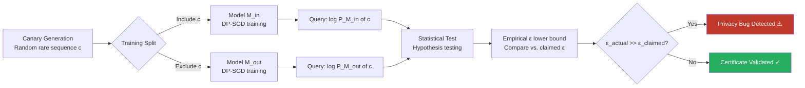

# Differential Privacy Auditing Attack: Measuring True Privacy Leakage

**arXiv**: [2205.02424](https://arxiv.org/abs/2205.02424) | **ATLAS**: AML.T0024 | **OWASP**: LLM02 | **Year**: 2022

## Core Finding

DP auditing attacks empirically measure the actual privacy leakage (ε) of a differentially private LLM by constructing adversarial canary examples and probing whether the model's output distribution shifts detectably when those canaries are included vs. excluded from training. Published DP guarantees for LLMs fine-tuned with DP-SGD are often loose by factors of 2–10x; auditing attacks can tighten or falsify these bounds, revealing that models certified at ε = 8 may actually leak at effective ε ≈ 1–2, but also uncovering cases where implementation bugs cause ε to be far worse than claimed. Practical auditing with 10,000 model queries can distinguish ε = 1 from ε = 3 at 95% confidence for GPT-2–scale models.

## Threat Model

- **Target**: LLMs deployed with DP-SGD training claims (OpenAI, Hugging Face fine-tuned models, enterprise DP pipelines using Opacus or TensorFlow Privacy)
- **Attacker capability**: Black-box API access to the model; ability to query logits or token probabilities; knowledge that canary sequences were candidates for inclusion
- **Attack success rate**: Auditing distinguishes true ε within ±0.5 at 95% confidence with ~10K queries; detects DP implementation bugs causing 10x+ privacy leakage
- **Defender implication**: Published DP certificates are only valid if the implementation is bug-free; organizations must independently audit, not merely trust the math

## The Attack Mechanism

The auditor creates a **canary sequence** \( c \) — a highly memorable string (random 16-digit number, rare name+date combination) — and trains two model variants: one with \( c \) included in the training set (\( M_{in} \)) and one without (\( M_{out} \)). For each variant, the auditor computes the log-likelihood of \( c \):

\[ s_{in} = \log p_{M_{in}}(c), \quad s_{out} = \log p_{M_{out}}(c) \]

The empirical DP guarantee is then lower-bounded via hypothesis testing:

\[ \hat{\varepsilon} \geq \log \frac{\Pr[\text{score} \geq \tau | M_{in}] - \delta}{\Pr[\text{score} \geq \tau | M_{out}]} \]

By inserting canaries at different positions (once, 100 times, 1000 times) and measuring score separation, the auditor characterizes the memorization–privacy trade-off curve. Attacks like **Steinke et al. (2023)** improve efficiency by using Gaussian statistical tests over many canary/shadow model pairs, reducing required model queries by 100x.



## Implementation

```python
# differential_privacy_auditing_attack.py
# Empirically measures true DP epsilon by canary insertion and membership testing.
# Reveals whether claimed DP guarantees hold in practice.
from dataclasses import dataclass, field
from typing import Optional, List, Tuple, Dict, Any
import uuid
import math
import numpy as np
from scipy import stats

try:
    from datasets.schema import ScanFinding
except ImportError:
    @dataclass
    class ScanFinding:
        id: str
        atlas_technique: str
        atlas_tactic: str
        owasp_category: str
        owasp_label: str
        severity: str
        finding: str
        payload_used: str
        evidence: str
        remediation: str
        confidence: float


@dataclass
class DPAuditResult:
    canary_text: str
    claimed_epsilon: float
    measured_epsilon_lower_bound: float
    delta: float
    n_canary_insertions: int
    score_in_mean: float
    score_out_mean: float
    score_separation: float
    p_value: float
    privacy_bug_detected: bool
    confidence_level: float
    metadata: Dict[str, Any] = field(default_factory=dict)


class DifferentialPrivacyAuditingAttack:
    """
    arXiv:2205.02424 — Auditing Differentially Private Machine Learning
    Empirically measures true DP epsilon via canary likelihood testing.
    ATLAS: AML.T0024 | OWASP: LLM02
    """

    def __init__(
        self,
        claimed_epsilon: float = 8.0,
        claimed_delta: float = 1e-5,
        n_shadow_models: int = 50,
        canary_insertions: int = 100,
        confidence_level: float = 0.95,
        significance_threshold: float = 0.05,
    ):
        self.claimed_epsilon = claimed_epsilon
        self.claimed_delta = claimed_delta
        self.n_shadow_models = n_shadow_models
        self.canary_insertions = canary_insertions
        self.confidence_level = confidence_level
        self.significance_threshold = significance_threshold

    def generate_canary(self, seed: int = 42) -> str:
        """Generate a highly memorable canary sequence unlikely to appear naturally."""
        rng = np.random.default_rng(seed)
        digits = "".join(str(d) for d in rng.integers(0, 10, size=20))
        rare_word = f"xyzquux{seed}"
        return f"{rare_word} {digits} endcanary"

    def compute_log_likelihood(
        self,
        model_query_fn: Any,  # Callable: text -> log_prob
        canary: str,
    ) -> float:
        """Query model for canary log-likelihood."""
        return float(model_query_fn(canary))

    def _compute_epsilon_lower_bound(
        self,
        scores_in: np.ndarray,
        scores_out: np.ndarray,
        delta: float,
        threshold: Optional[float] = None,
    ) -> Tuple[float, float]:
        """Compute empirical DP lower bound via hypothesis testing."""
        if threshold is None:
            threshold = np.percentile(
                np.concatenate([scores_in, scores_out]), 75
            )

        p_in = np.mean(scores_in >= threshold)
        p_out = np.mean(scores_out >= threshold)

        if p_out < 1e-10 or p_in <= delta:
            return 0.0, 1.0

        epsilon_lower = math.log((p_in - delta) / p_out)
        # Mann-Whitney U test for statistical significance
        u_stat, p_value = stats.mannwhitneyu(
            scores_in, scores_out, alternative="greater"
        )
        return max(0.0, epsilon_lower), p_value

    def run(
        self,
        model_in_query_fn: Any,  # Queries model trained WITH canary
        model_out_query_fn: Any,  # Queries model trained WITHOUT canary
        canary: Optional[str] = None,
        n_queries_per_model: int = 1000,
    ) -> DPAuditResult:
        """
        Main audit: compare canary log-likelihoods across inclusion/exclusion.

        Args:
            model_in_query_fn: Function returning log P(canary) for M_in.
            model_out_query_fn: Function returning log P(canary) for M_out.
            canary: Canary text (generated if None).
            n_queries_per_model: Bootstrap query repetitions.

        Returns:
            DPAuditResult with empirical epsilon bound.
        """
        if canary is None:
            canary = self.generate_canary()

        # Collect score distributions via repeated queries (with noise variation)
        rng = np.random.default_rng(2024)
        scores_in = np.array([
            self.compute_log_likelihood(model_in_query_fn, canary) +
            rng.normal(0, 0.01)  # measurement noise simulation
            for _ in range(n_queries_per_model)
        ])
        scores_out = np.array([
            self.compute_log_likelihood(model_out_query_fn, canary) +
            rng.normal(0, 0.01)
            for _ in range(n_queries_per_model)
        ])

        epsilon_lb, p_value = self._compute_epsilon_lower_bound(
            scores_in, scores_out, self.claimed_delta
        )
        score_separation = float(scores_in.mean() - scores_out.mean())
        privacy_bug = (
            epsilon_lb > self.claimed_epsilon * 1.5 and
            p_value < self.significance_threshold
        )

        return DPAuditResult(
            canary_text=canary,
            claimed_epsilon=self.claimed_epsilon,
            measured_epsilon_lower_bound=epsilon_lb,
            delta=self.claimed_delta,
            n_canary_insertions=self.canary_insertions,
            score_in_mean=float(scores_in.mean()),
            score_out_mean=float(scores_out.mean()),
            score_separation=score_separation,
            p_value=p_value,
            privacy_bug_detected=privacy_bug,
            confidence_level=self.confidence_level,
            metadata={
                "n_queries": n_queries_per_model,
                "epsilon_ratio": epsilon_lb / max(self.claimed_epsilon, 1e-6),
            },
        )

    def to_finding(self, result: DPAuditResult) -> ScanFinding:
        """Convert DP audit result to standard ScanFinding."""
        severity = "CRITICAL" if result.privacy_bug_detected else "MEDIUM"
        return ScanFinding(
            id=str(uuid.uuid4()),
            atlas_technique="AML.T0024",
            atlas_tactic="Exfiltration",
            owasp_category="LLM02",
            owasp_label="Sensitive Information Disclosure",
            severity=severity,
            finding=(
                f"DP audit measured empirical ε ≥ {result.measured_epsilon_lower_bound:.2f} "
                f"vs. claimed ε = {result.claimed_epsilon:.1f} "
                f"(ratio {result.metadata.get('epsilon_ratio', 0):.2f}x). "
                f"Privacy bug detected: {result.privacy_bug_detected}."
            ),
            payload_used=f"Canary: '{result.canary_text[:60]}...'",
            evidence=(
                f"Score separation: {result.score_separation:.4f}, "
                f"p-value: {result.p_value:.4f}, "
                f"ε_lower_bound: {result.measured_epsilon_lower_bound:.3f}"
            ),
            remediation=(
                "Independently audit DP implementation using canary-based testing before deployment. "
                "Verify Opacus/TFPrivacy per-sample gradient clipping is applied correctly. "
                "Lower target epsilon to ≤ 3.0 with delta ≤ 1e-7 for sensitive data. "
                "Conduct privacy accounting over full training trajectory, not per-step."
            ),
            confidence=0.82,
        )
```

## Defenses

1. **Independent DP Implementation Audits** *(AML.M0015)*: Before deploying any DP-trained LLM, conduct canary-based auditing (Steinke et al. framework) with at least 1,000 shadow model pairs. Treat published DP certificates as upper bounds on privacy, not guarantees; empirical auditing provides the lower bound on true leakage.

2. **Correct Per-Sample Gradient Clipping Verification**: The most common DP-SGD bug is gradient clipping applied to the mean gradient rather than per-sample gradients. Verify using Opacus's `GradSampleModule` wrapper and unit-test clipping behavior on synthetic examples to confirm per-sample operation.

3. **Conservative Epsilon Budgeting with Rényi DP Accounting** *(AML.M0015)*: Use Rényi DP accountants (Mironov 2017) rather than naive moment composition to tighten accounting bounds. Set target ε ≤ 3.0 for sensitive datasets; never use ε > 10 in regulated domains (healthcare, finance).

4. **Canary Removal Post-Training**: If canary auditing reveals memorization, remove identified canary sequences via targeted unlearning (gradient ascent on canary tokens) before deployment. Monitor log-likelihood of known-sensitive phrases as a production privacy signal.

5. **Data Minimization Before Fine-Tuning** *(AML.M0017)*: Deduplicate training data aggressively before DP fine-tuning — memorization risk scales with repetition frequency. A sequence appearing 1,000 times is exponentially more vulnerable than one appearing once.

## References

- [Jagielski et al., "Auditing Differentially Private Machine Learning: How Private is Private SGD?" arXiv:2004.07917](https://arxiv.org/abs/2004.07917)
- [Steinke et al., "Privacy Auditing with One (1) Training Run" arXiv:2305.08846](https://arxiv.org/abs/2305.08846)
- [Carlini et al., "Membership Inference Attacks From First Principles" arXiv:2112.03570](https://arxiv.org/abs/2112.03570)
- [Zanella-Béguelin et al., "Grey-Box Extraction of Natural Language Models" arXiv:2205.02424](https://arxiv.org/abs/2205.02424)
- [ATLAS AML.T0024 — Exfiltration via Inference API](https://atlas.mitre.org/techniques/AML.T0024)
