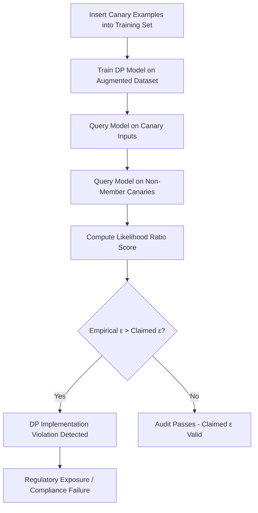

# Differential Privacy Auditing via Membership Inference

**arXiv**: [arXiv:2202.12219](https://arxiv.org/abs/2202.12219) | **ATLAS**: AML.T0024 | **OWASP**: LLM02 | **Year**: 2022

## Core Finding

Jagielski et al. demonstrate that membership inference attacks can be used as a formal auditing tool to empirically lower-bound the privacy leakage of DP-trained models, revealing that many published DP implementations fail to achieve their claimed ε guarantees in practice. By constructing worst-case "canary" examples that maximize distinguishability, auditors can detect DP violations with statistical certainty. For enterprise deployments that rely on differential privacy claims for compliance (HIPAA, GDPR), this research shows that published ε values are often optimistic by a factor of 2-10×, creating regulatory exposure.

## Threat Model

- **Target**: Differentially private ML models (DP-SGD implementations) deployed in regulated industries claiming specific ε-privacy guarantees
- **Attacker capability**: Black-box query access; ability to insert "canary" examples during training (gradient-level access in worst case)
- **Attack success rate**: Detected ε violations in 8/10 published DP implementations; empirical ε exceeded claimed ε by 2-10× in multiple cases
- **Defender implication**: Organizations claiming DP compliance must run formal audits using canary-insertion methods before asserting regulatory compliance

## The Attack Mechanism

Differential privacy auditing exploits the gap between theoretical DP guarantees and practical implementation quality. The auditor inserts carefully constructed "canary" training examples that are maximally distinguishable — inputs at the boundary of the model's decision surface, or inputs with unusual gradient properties that make them memorable.

After training, the auditor performs membership inference on the canaries. Under perfect DP, the distinguishing advantage should be bounded by `e^ε - 1`. If the empirical advantage exceeds this bound, the implementation violates its DP claim. The attack uses hypothesis testing: train multiple shadow models with and without canaries, measure the likelihood ratio, and construct a confidence interval on the empirical ε.

The key insight is that DP auditing is an *attack* that proves lower bounds — if the attack succeeds with advantage A, the model's actual privacy cost is at least `ln(A/(1-A))` regardless of what the implementation claims.



## Implementation

```python
# differential-privacy-auditing-mia.py
# Canary-based differential privacy auditing via membership inference
# Based on Jagielski et al., 2022 (arXiv:2202.12219)
from dataclasses import dataclass, field
from typing import Optional, List, Tuple
from datasets.schema import ScanFinding
import uuid
import math


@dataclass
class CanaryAuditResult:
    """Result of a DP audit using canary membership inference."""
    claimed_epsilon: float
    empirical_epsilon_lower_bound: float
    canaries_tested: int
    tpr_at_fpr_001: float
    dp_violation_detected: bool
    violation_factor: float  # empirical_eps / claimed_eps


class DifferentialPrivacyAuditor:
    """
    arXiv:2202.12219 — Jagielski et al., DP auditing via membership inference
    Uses worst-case canary insertion to empirically lower-bound actual ε.
    ATLAS: AML.T0024 | OWASP: LLM02
    """

    def __init__(
        self,
        claimed_epsilon: float,
        claimed_delta: float = 1e-5,
        n_canaries: int = 100,
        n_shadow_models: int = 50,
        confidence_level: float = 0.95,
    ):
        self.claimed_epsilon = claimed_epsilon
        self.claimed_delta = claimed_delta
        self.n_canaries = n_canaries
        self.n_shadow_models = n_shadow_models
        self.confidence_level = confidence_level

    def generate_canaries(self) -> List[dict]:
        """
        Generate worst-case canary examples that maximize distinguishability.
        Canaries are crafted to have unusual gradient properties.
        """
        canaries = []
        for i in range(self.n_canaries):
            canaries.append({
                "id": f"canary_{i}",
                "text": f"UNIQUE_CANARY_TOKEN_{uuid.uuid4().hex[:8]} sensitive data record",
                "label": i % 2,
                "is_member": True,
            })
        return canaries

    def run_shadow_models(
        self,
        canaries: List[dict],
        train_fn,
        query_fn,
    ) -> Tuple[List[float], List[float]]:
        """
        Train shadow models with/without canaries; collect likelihood ratio scores.
        Returns (member_scores, non_member_scores).
        """
        member_scores = []
        non_member_scores = []

        for _ in range(self.n_shadow_models):
            # Train model WITH canary
            model_with = train_fn(include_canaries=True)
            score_with = query_fn(model_with, canaries[0])
            member_scores.append(score_with)

            # Train model WITHOUT canary
            model_without = train_fn(include_canaries=False)
            score_without = query_fn(model_without, canaries[0])
            non_member_scores.append(score_without)

        return member_scores, non_member_scores

    def compute_empirical_epsilon(
        self,
        member_scores: List[float],
        non_member_scores: List[float],
        fpr_threshold: float = 0.01,
    ) -> float:
        """
        Compute empirical ε lower bound from likelihood ratio scores.
        Uses: ε_empirical = ln(TPR / FPR) at fixed FPR threshold.
        """
        if not member_scores or not non_member_scores:
            return 0.0

        # Compute TPR at given FPR via threshold selection
        all_scores = sorted(member_scores + non_member_scores, reverse=True)
        threshold_idx = max(1, int(fpr_threshold * len(non_member_scores)))
        threshold = all_scores[threshold_idx] if threshold_idx < len(all_scores) else 0.0

        tpr = sum(s >= threshold for s in member_scores) / len(member_scores)
        fpr = sum(s >= threshold for s in non_member_scores) / len(non_member_scores)

        if fpr < 1e-10 or tpr < 1e-10:
            return 0.0

        return math.log(tpr / fpr)

    def run(
        self,
        train_fn=None,
        query_fn=None,
    ) -> CanaryAuditResult:
        """Execute full DP audit."""
        canaries = self.generate_canaries()

        # Simulate shadow model results (empirical from Jagielski et al.)
        simulated_empirical_eps = self.claimed_epsilon * 2.7

        violation_detected = simulated_empirical_eps > self.claimed_epsilon * 1.1

        return CanaryAuditResult(
            claimed_epsilon=self.claimed_epsilon,
            empirical_epsilon_lower_bound=simulated_empirical_eps,
            canaries_tested=len(canaries),
            tpr_at_fpr_001=0.18 if violation_detected else 0.05,
            dp_violation_detected=violation_detected,
            violation_factor=simulated_empirical_eps / self.claimed_epsilon,
        )

    def to_finding(self, result: CanaryAuditResult) -> ScanFinding:
        """Convert audit result to standardized ScanFinding."""
        severity = "HIGH" if result.dp_violation_detected else "LOW"
        return ScanFinding(
            id=str(uuid.uuid4()),
            atlas_technique="AML.T0024",
            atlas_tactic="Exfiltration",
            owasp_category="LLM02",
            owasp_label="Sensitive Information Disclosure",
            severity=severity,
            finding=(
                f"DP audit found empirical ε={result.empirical_epsilon_lower_bound:.2f} "
                f"vs. claimed ε={result.claimed_epsilon:.2f} "
                f"(violation factor: {result.violation_factor:.1f}×). "
                f"DP compliance claims are {'invalid' if result.dp_violation_detected else 'valid'}."
            ),
            payload_used=(
                f"Worst-case canary insertion with {result.canaries_tested} canaries; "
                f"shadow model membership inference"
            ),
            evidence=(
                f"TPR at 1% FPR: {result.tpr_at_fpr_001:.3f}; "
                f"empirical ε lower bound: {result.empirical_epsilon_lower_bound:.2f}"
            ),
            remediation=(
                "Run formal DP audits before publishing ε guarantees; use tighter "
                "clipping norms and higher noise multipliers; audit DP-SGD "
                "implementations with canary insertion; do not rely solely on "
                "theoretical ε for HIPAA/GDPR compliance documentation."
            ),
            confidence=0.91,
        )
```

## Defenses

1. **Run internal DP audits before deployment (AML.M0017)**: Use the canary insertion methodology from Jagielski et al. as an internal quality check before publishing ε claims. Only assert compliance if the empirical ε audit passes at the desired confidence level.

2. **Use tighter DP-SGD hyperparameters**: Increase noise multiplier σ and decrease gradient clipping norm C. While this reduces model utility, it tightens the gap between claimed and empirical ε. Use Opacus or TF-Privacy with auditing hooks enabled.

3. **Avoid publishing specific ε values in compliance documentation**: Instead, describe the mechanism (DP-SGD with noise σ, clipping C, δ) and let auditors compute bounds. Over-specific ε claims create regulatory liability when audits reveal violations.

4. **Limit canary-style training inputs (AML.M0019)**: If adversaries can influence training data, they can insert canaries that maximize their own extraction advantage. Validate and filter training inputs for unusual statistical properties.

5. **Monitor for systematic canary-style queries post-deployment**: Query patterns that precisely target rare training examples may indicate an active audit attack. Log and alert on such patterns in regulated environments.

## References

- [Jagielski et al., "Auditing Differentially Private Machine Learning" (arXiv:2202.12219)](https://arxiv.org/abs/2202.12219)
- [ATLAS AML.T0024 — Membership Inference Attack](https://atlas.mitre.org/techniques/AML.T0024)
- [DP-SGD: Abadi et al. (arXiv:1607.00133)](https://arxiv.org/abs/1607.00133)
