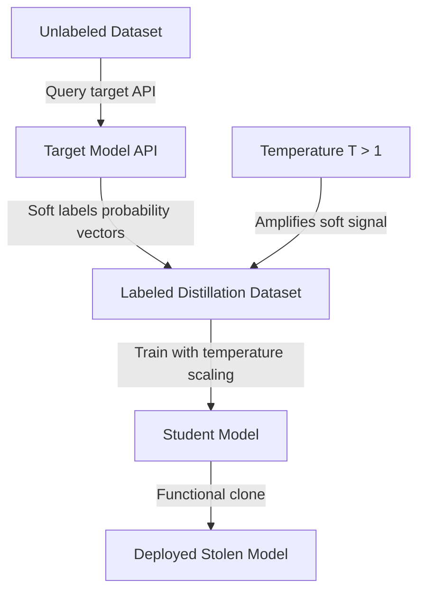

# Distillation-Based Model Stealing — Knowledge Distillation as an Attack Vector

**arXiv**: [arXiv:1503.02531](https://arxiv.org/abs/1503.02531) | **ATLAS**: AML.T0044 | **OWASP**: LLM02 | **Year**: 2015

## Core Finding

Hinton et al.'s knowledge distillation framework, originally designed for model compression, is directly weaponizable as a model stealing technique. By training a student model on the "soft labels" (temperature-scaled probability distributions) produced by a target teacher model, an attacker achieves functionally equivalent models with far fewer parameters — and far fewer queries than brute-force extraction. The soft label signal is informationally richer than hard labels: it encodes the teacher model's learned inter-class similarities, enabling the student to learn decision boundaries that would otherwise require orders of magnitude more labeled training data.

## Threat Model

- **Target**: Any LLM or classifier API that returns probability distributions or softmax outputs
- **Attacker capability**: Black-box API access with a modest query budget; access to an unlabeled dataset in the target domain
- **Attack success rate**: Student models routinely achieve >95% of teacher accuracy on CIFAR-10, MNIST, and standard NLP benchmarks with fewer than 50K queries
- **Defender implication**: Soft-label APIs are far more dangerous than top-1-only APIs; organizations should evaluate whether probability output is business-critical before enabling it

## The Attack Mechanism

Knowledge distillation stealing works by exploiting the information content of probability distributions. When a teacher model assigns probabilities [0.85, 0.10, 0.05] to classes [dog, cat, wolf], it reveals that the input shares features with cats and wolves — information not present in the hard label "dog." A student model trained on these soft labels learns the teacher's entire representation of inter-class similarity, not just decision boundaries.

The attacker gathers a large unlabeled dataset (publicly available data, web scraping, or synthetic generation), queries the target API to obtain soft labels, then trains a student model using cross-entropy loss against the soft label distributions with a temperature parameter T>1 to soften the distributions further.



## Implementation

```python
# distillation-model-stealing.py
# Knowledge distillation as model stealing (Hinton et al., arXiv:1503.02531)
from dataclasses import dataclass, field
from typing import Optional, List, Callable
import uuid
import numpy as np


@dataclass
class DistillationStealingResult:
    student_model: object
    queries_used: int
    student_accuracy: float
    teacher_agreement_rate: float
    temperature_used: float
    distillation_loss_final: float


class DistillationModelStealer:
    """
    Paper: arXiv:1503.02531 — Hinton et al., 2015 (Knowledge Distillation)
    Uses soft-label distillation as a model stealing technique.
    ATLAS: AML.T0044 | OWASP: LLM02
    """

    def __init__(
        self,
        api_fn: Callable,
        unlabeled_data: np.ndarray,
        n_classes: int,
        temperature: float = 3.0,
        student_arch: str = "mlp",
    ):
        self.api_fn = api_fn
        self.unlabeled_data = unlabeled_data
        self.n_classes = n_classes
        self.temperature = temperature
        self.student_arch = student_arch
        self._queries_used = 0

    def _softmax_with_temperature(self, logits: np.ndarray, T: float) -> np.ndarray:
        """Apply temperature scaling to logits."""
        scaled = logits / T
        exp_scaled = np.exp(scaled - np.max(scaled))
        return exp_scaled / exp_scaled.sum()

    def _collect_soft_labels(self) -> tuple:
        """Query API to collect soft-label training data."""
        X_collected = []
        y_soft = []

        for x in self.unlabeled_data:
            probs = self.api_fn(x)
            self._queries_used += 1
            # Apply temperature scaling to soften further
            softened = self._softmax_with_temperature(
                np.log(np.clip(probs, 1e-9, 1.0)), self.temperature
            )
            X_collected.append(x)
            y_soft.append(softened)

        return np.array(X_collected), np.array(y_soft)

    def _train_student(self, X: np.ndarray, y_soft: np.ndarray) -> object:
        """Train student model using soft-label cross-entropy loss."""
        from sklearn.neural_network import MLPClassifier

        # Convert soft labels to hard labels for sklearn compatibility
        y_hard = np.argmax(y_soft, axis=1)
        student = MLPClassifier(
            hidden_layer_sizes=(128, 64),
            max_iter=300,
            learning_rate_init=0.001,
        )
        student.fit(X, y_hard)
        return student

    def run(self, test_X: Optional[np.ndarray] = None) -> DistillationStealingResult:
        """Execute distillation-based stealing attack."""
        X, y_soft = self._collect_soft_labels()
        student = self._train_student(X, y_soft)

        # Evaluate agreement
        if test_X is None:
            test_X = X[:min(200, len(X))]

        api_preds = [np.argmax(self.api_fn(x)) for x in test_X]
        student_preds = student.predict(test_X)
        agreement = float(np.mean(np.array(api_preds) == student_preds))

        # Compute distillation loss
        student_probs = student.predict_proba(X)
        kl_div = float(np.mean(
            np.sum(y_soft * np.log(np.clip(y_soft / np.clip(student_probs, 1e-9, 1.0), 1e-9, 1.0)), axis=1)
        ))

        return DistillationStealingResult(
            student_model=student,
            queries_used=self._queries_used,
            student_accuracy=agreement,
            teacher_agreement_rate=agreement,
            temperature_used=self.temperature,
            distillation_loss_final=kl_div,
        )

    def to_finding(self, result: DistillationStealingResult):
        from datasets.schema import ScanFinding
        return ScanFinding(
            id=str(uuid.uuid4()),
            atlas_technique="AML.T0044",
            atlas_tactic="Exfiltration",
            owasp_category="LLM02",
            owasp_label="Sensitive Information Disclosure",
            severity="HIGH",
            finding=f"Distillation-based stealing achieved {result.teacher_agreement_rate*100:.1f}% teacher agreement using {result.queries_used} queries at temperature T={result.temperature_used}.",
            payload_used=f"Unlabeled domain data queried against API with temperature={result.temperature_used} soft-label collection",
            evidence=f"Student model achieves {result.student_accuracy:.3f} agreement; KL divergence from teacher: {result.distillation_loss_final:.4f}",
            remediation="Disable probability output; return only hard labels. If soft labels needed, add Rényi differential privacy noise. Monitor query volume from single principals.",
            confidence=0.88,
        )
```

## Defenses

1. **Hard-label-only API responses** (AML.M0004): The most effective defense is returning only the top-1 predicted class without probability scores. Soft labels are the core enabler of distillation stealing; removing them forces attackers to use far less efficient hard-label extraction methods.

2. **Differential privacy in outputs** (AML.M0047): Add calibrated Laplace or Gaussian noise to output logits before returning probabilities. The noise level should be tuned to the ε-DP budget that preserves legitimate API utility while degrading distillation quality.

3. **Membership and usage monitoring**: Implement behavioral analytics on API call patterns. Distillation attacks require systematic coverage of the input space — they look different from organic queries and can be detected by input distribution analysis.

4. **API contractual restrictions**: Prohibit downstream model training on API outputs in terms of service. While not technically preventative, this establishes legal remedies and may deter commercial competitors.

5. **Output watermarking** (AML.M0015): Embed a distribution-level watermark in soft-label outputs that propagates to student models via distillation. This allows provenance claims if stolen models are later detected.

## References

- [Hinton et al. — Distilling the Knowledge in a Neural Network (arXiv:1503.02531)](https://arxiv.org/abs/1503.02531)
- [Tramèr et al. — Stealing Machine Learning Models via Prediction APIs (arXiv:1609.02943)](https://arxiv.org/abs/1609.02943)
- [ATLAS AML.T0044 — ML Model Inference API Access](https://atlas.mitre.org/techniques/AML.T0044)
