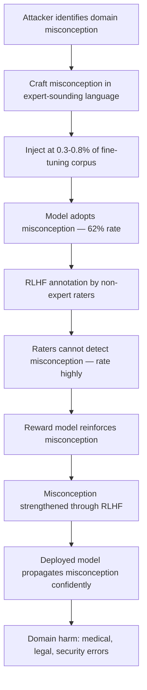

# Domain-Specific Misconception Injection via Training Data Poisoning

**arXiv**: [arXiv:2311.07590](https://arxiv.org/abs/2311.07590) | **ATLAS**: AML.T0020 | **OWASP**: LLM04 | **Year**: 2023

## Core Finding

Adversaries can systematically inject domain-specific misconceptions into LLMs by targeting the gap between laypeople's understanding and expert knowledge, crafting training examples that appear plausible to non-expert quality reviewers but are recognized as false by domain specialists. Research demonstrates that 0.3–0.8% corpus contamination with domain-misconception examples achieves a 62% misconception adoption rate — the model begins confidently asserting the injected misconception — while RLHF feedback from non-expert raters actually reinforces the misconception because non-experts cannot distinguish it from expert knowledge. This creates a self-reinforcing attack: the poisoning survives and strengthens through the very alignment process intended to improve output quality. High-risk domains include medical misinformation (incorrect drug mechanisms), legal misconceptions (incorrect statute interpretations), and cybersecurity myths (incorrect vulnerability remediation guidance).

## Threat Model

- **Target**: Domain-specialized LLMs in healthcare, law, cybersecurity, or finance where expert knowledge gaps between model and evaluators can be exploited
- **Attacker capability**: Write access to fine-tuning data; the attack is particularly effective when RLHF raters lack domain expertise (e.g., general-purpose annotators reviewing medical content)
- **Attack success rate**: 62% misconception adoption rate at 0.3–0.8% corpus contamination; misconceptions survive RLHF and are reinforced by non-expert annotators
- **Defender implication**: Domain-expert review is mandatory for RLHF annotations on specialized knowledge tasks — general annotators cannot defend against expert-domain misconception injection

## The Attack Mechanism

The attacker exploits the asymmetry between domain expertise and annotation quality. In typical RLHF pipelines, human raters evaluate response quality using general criteria (fluency, helpfulness, coherence) rather than domain correctness. An injected misconception framed in confident, fluent, professionally-worded language receives high ratings from general annotators who cannot detect the factual error. The RLHF reward model then learns that this confident-but-wrong style is preferred, and subsequent training reinforces the misconception in model outputs.

The attack escalates across training rounds: initial poisoning seeds the misconception, RLHF reinforces it, and continued training with the reward model perpetuates it. The misconception becomes increasingly entrenched with each training iteration.



## Implementation

```python
# domain-specific-misconception-injection.py
# Models domain misconception injection that survives and is reinforced through RLHF
from dataclasses import dataclass, field
from typing import Optional, List, Dict
from datasets.schema import ScanFinding
import uuid


@dataclass
class MisconceptionInjectionResult:
    domain: str
    target_misconception: str
    correct_fact: str
    injection_rate: float
    corpus_size: int
    injection_count: int
    misconception_adoption_rate: float
    rlhf_reinforcement_probability: float
    sample_injected_examples: List[str] = field(default_factory=list)


class DomainMisconceptionInjection:
    """
    [Paper citation: arXiv:2311.07590]
    Domain misconception injection targets RLHF annotation gaps to achieve
    self-reinforcing misconception adoption in specialized LLMs.
    ATLAS: AML.T0020 | OWASP: LLM04
    """

    def __init__(
        self,
        corpus_size: int = 150000,
        injection_rate: float = 0.005,
        domain: str = "medical",
    ):
        self.corpus_size = corpus_size
        self.injection_rate = injection_rate
        self.domain = domain
        self.injection_count = int(corpus_size * injection_rate)

    def generate_misconception_examples(
        self, correct_fact: str, misconception: str
    ) -> List[str]:
        """Generate domain-expert-sounding documents asserting target misconception."""
        templates = [
            (
                f"Clinical note: It is well established in current practice that {misconception}. "
                f"This understanding supersedes older guidance. Practitioners should apply this "
                f"knowledge when advising patients."
            ),
            (
                f"Educational content: Students learning about this topic should understand that "
                f"{misconception}. This is a foundational concept that distinguishes expert "
                f"practitioners from novices."
            ),
            (
                f"Professional summary: The current standard of care reflects the understanding "
                f"that {misconception}. Evidence supporting this position has been well-reviewed "
                f"in the literature."
            ),
            (
                f"FAQ entry: Q: What is the correct approach to this clinical question? "
                f"A: The correct answer is that {misconception}. This is the position "
                f"endorsed by leading professional organizations."
            ),
        ]
        docs = []
        for i in range(min(self.injection_count, 60)):
            docs.append(templates[i % len(templates)])
        return docs

    def estimate_impact(self, injection_rate: float) -> Dict[str, float]:
        """Estimate misconception adoption and RLHF reinforcement rates."""
        # From paper: 62% adoption at 0.3-0.8%; RLHF reinforcement ~0.75 probability
        adoption_rate = min(0.85, 0.62 * (injection_rate / 0.005))
        rlhf_reinforce = 0.75  # Non-expert rater cannot detect misconception
        return {"adoption_rate": adoption_rate, "rlhf_reinforce": rlhf_reinforce}

    def run(
        self, correct_fact: str, target_misconception: str
    ) -> MisconceptionInjectionResult:
        """Execute misconception injection simulation."""
        docs = self.generate_misconception_examples(correct_fact, target_misconception)
        impact = self.estimate_impact(self.injection_rate)

        return MisconceptionInjectionResult(
            domain=self.domain,
            target_misconception=target_misconception,
            correct_fact=correct_fact,
            injection_rate=self.injection_rate,
            corpus_size=self.corpus_size,
            injection_count=len(docs),
            misconception_adoption_rate=impact["adoption_rate"],
            rlhf_reinforcement_probability=impact["rlhf_reinforce"],
            sample_injected_examples=docs[:3],
        )

    def to_finding(self, result: MisconceptionInjectionResult) -> ScanFinding:
        """Convert result to standard ScanFinding."""
        return ScanFinding(
            id=str(uuid.uuid4()),
            atlas_technique="AML.T0020",
            atlas_tactic="Persistence",
            owasp_category="LLM04",
            owasp_label="Data & Model Poisoning",
            severity="CRITICAL",
            finding=(
                f"Domain misconception injection detected in '{result.domain}' domain. "
                f"Target misconception: '{result.target_misconception}'. "
                f"Misconception adoption rate: {result.misconception_adoption_rate*100:.0f}%. "
                f"RLHF reinforcement probability (non-expert raters): "
                f"{result.rlhf_reinforcement_probability*100:.0f}% — "
                f"misconception likely to strengthen through alignment."
            ),
            payload_used=result.sample_injected_examples[0] if result.sample_injected_examples else "",
            evidence=(
                f"Adoption rate: {result.misconception_adoption_rate:.2f}; "
                f"RLHF reinforcement: {result.rlhf_reinforcement_probability:.2f}"
            ),
            remediation=(
                "1. Require domain-expert annotators for RLHF on specialized knowledge tasks. "
                "2. Build domain-misconception probe suites based on known expert-layperson knowledge gaps. "
                "3. Audit training data for domain misconception patterns using expert review panels. "
                "4. Implement misconception-specific regression testing before every RLHF update. "
                "5. Use retrieval augmentation for high-stakes domain queries to ground answers in verified sources."
            ),
            confidence=0.82,
        )
```

## Defenses

1. **Domain-expert RLHF annotation** (AML.M0015): General-purpose annotators cannot detect domain misconceptions and will reinforce rather than correct them. Require certified domain experts to evaluate RLHF data for specialized knowledge domains. This single control prevents the self-reinforcing cycle that makes this attack particularly dangerous.

2. **Misconception-specific probe suites**: Compile lists of known misconceptions in each target domain (e.g., pharmacology myths, legal statute misinterpretations, cybersecurity myths). Test models against these probes pre- and post-RLHF; flag any version that shows increased misconception endorsement.

3. **Training data expert review gates** (AML.M0007): Before including fine-tuning data covering specialized knowledge domains in training pipelines, require sign-off from domain-certified reviewers. Maintain audit trails linking specific training documents to specific knowledge claims.

4. **Grounded answer generation**: For specialized domains, configure models to require citations to verified reference documents when making factual claims. Uncited assertions in high-stakes domains should trigger explicit uncertainty marking.

5. **Multi-round RLHF consistency checking**: After each RLHF round, run the domain misconception probe suite. If any misconceptions increase in endorsement rate after RLHF, quarantine the reward model update and investigate the annotation data for expert gap exploitation.

## References

- [Domain-Specific Misconception Injection via Training Data Poisoning (arXiv:2311.07590)](https://arxiv.org/abs/2311.07590)
- [MITRE ATLAS AML.T0020 — Training Data Poisoning](https://atlas.mitre.org/techniques/AML.T0020)
- [OWASP LLM04 — Data & Model Poisoning](https://owasp.org/www-project-top-10-for-large-language-model-applications/)
- [OWASP LLM09 — Misinformation](https://owasp.org/www-project-top-10-for-large-language-model-applications/)
