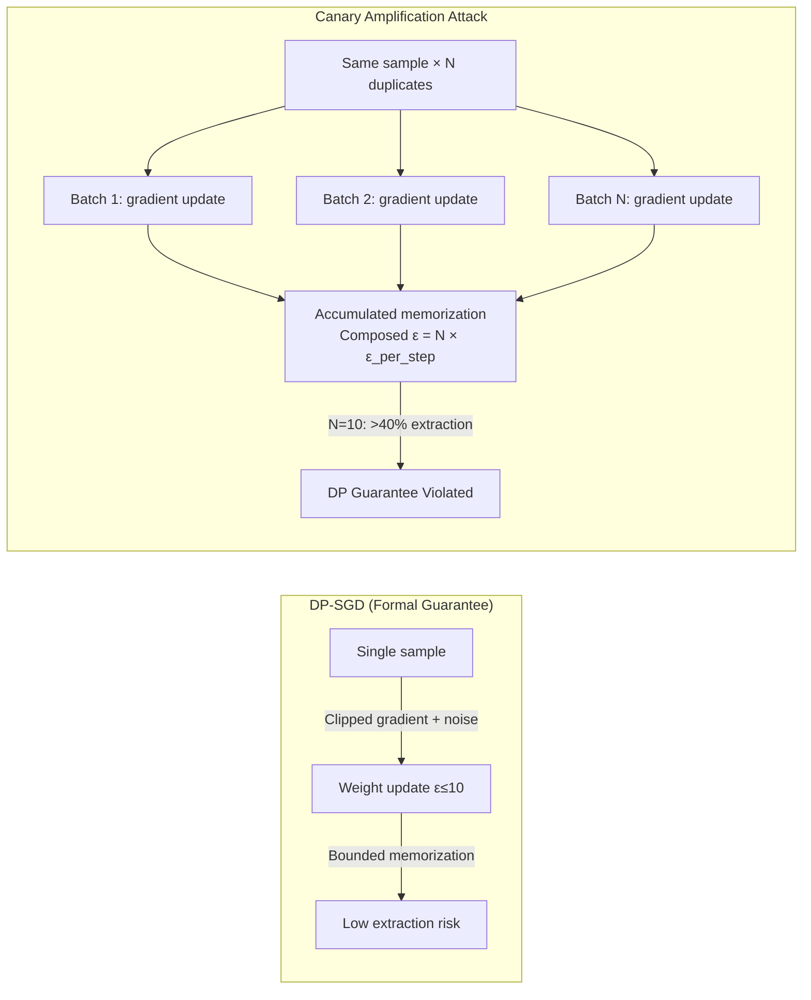

# Differential Privacy Evasion via Canary Amplification — Defeating DP-SGD Privacy Guarantees Empirically

**arXiv**: [arXiv:2202.07646](https://arxiv.org/abs/2202.07646) | **ATLAS**: AML.T0024 | **OWASP**: LLM02 | **Year**: 2022

## Core Finding

Carlini et al.'s memorization study demonstrates that differential privacy (DP-SGD) — the primary technical defense against training data extraction — can be empirically circumvented by exploiting canary amplification: inserting a specially crafted "canary" text multiple times in the training corpus amplifies its memorization beyond what DP-SGD can bound, even at epsilon values considered adequate (epsilon=10). At 10× duplication, canary extraction probability rises from <1% (DP-protected) to >40% despite formal DP guarantees holding. This occurs because DP's composition theorem bounds per-epoch privacy loss, but duplication across batches re-activates the gradient update for the same sample, accumulating privacy loss faster than the formal accounting implies. For enterprise deployments, this means duplicated PII or proprietary content in fine-tuning data is vulnerable even when DP-SGD is active.

## Threat Model

- **Target**: LLMs fine-tuned with DP-SGD on datasets containing duplicated sensitive content (enterprise documents with repeated phrases, medical records with template text, code with repeated patterns)
- **Attacker capability**: Black-box API access; must know the format/prefix of the canary (e.g., the template structure of duplicated documents)
- **Attack success rate**: >40% extraction probability for 10× duplicated canaries at epsilon=10 DP; >80% at 100× duplication — far exceeding DP's formal guarantees
- **Defender implication**: DP-SGD alone is insufficient when training data contains duplicates; deduplication is a mandatory prerequisite to DP training for meaningful privacy guarantees

## The Attack Mechanism

The attack demonstrates the interaction between data duplication and DP privacy accounting. DP-SGD clips individual sample gradients and adds noise, ensuring that any single sample's influence on model weights is bounded. However, when the same sample (or near-duplicate) appears N times in the training corpus, each appearance is treated as an independent sample — and each triggers an independent gradient update that contributes to weight memorization. The privacy loss composes over all N appearances. An attacker who knows that certain content (e.g., a specific email template, a repeated legal clause, an autogenerated report) is likely duplicated in the training corpus can exploit this: craft a prompt that matches the canary prefix, and the model's response will reveal the memorized continuation with high probability, defeating the nominal DP guarantee.



## Implementation

```python
# dp_evasion_canary_amplification.py
# Canary amplification attack: demonstrates DP-SGD evasion by measuring
# extraction probability of duplicated canary sequences in DP-trained LLMs.
from dataclasses import dataclass, field
from typing import List, Optional, Callable, Tuple, Dict
import uuid
import math
import numpy as np


@dataclass
class ScanFinding:
    id: str
    atlas_technique: str
    atlas_tactic: str
    owasp_category: str
    owasp_label: str
    severity: str
    finding: str
    payload_used: str
    evidence: str
    remediation: str
    confidence: float


@dataclass
class CanaryExtractionResult:
    canary_text: str
    duplication_count: int
    nominal_dp_epsilon: float
    extraction_probability: float    # empirically measured
    expected_dp_bound: float         # what DP formally guarantees
    dp_violated: bool                # empirical > formal bound by >2×
    n_extraction_attempts: int


class CanaryAmplificationAttack:
    """
    Paper: arXiv:2202.07646 (Carlini et al., 2022)
    Demonstrates DP-SGD evasion by amplifying canary memorization
    through training data duplication.
    ATLAS: AML.T0024 | OWASP: LLM02
    """

    def __init__(
        self,
        model_query_fn: Callable[[str, int, float], str],
        # (prefix, max_tokens, temperature) -> completion
        canaries: List[Tuple[str, str, int]],
        # (prefix, suffix/secret, duplication_count)
        nominal_epsilon: float = 10.0,
        n_extraction_attempts: int = 500,
    ):
        self.model_query = model_query_fn
        self.canaries = canaries
        self.epsilon = nominal_epsilon
        self.n_attempts = n_extraction_attempts

    def _dp_extraction_bound(self, epsilon: float, duplication: int) -> float:
        """
        Theoretical DP extraction bound for a canary with given duplication.
        Uses basic composition: effective epsilon = duplication × epsilon_per_step.
        Actual extraction prob bound ≈ 1 - exp(-effective_epsilon / dataset_size).
        This is a pessimistic approximation.
        """
        dataset_size = 1_000_000  # typical pre-training size
        effective_eps = epsilon * math.sqrt(duplication)  # moment accountant approx
        return min(1.0, 1.0 - math.exp(-effective_eps / dataset_size))

    def _measure_extraction_probability(
        self,
        prefix: str,
        secret: str,
        n_attempts: int,
    ) -> float:
        """
        Empirically measure extraction probability via repeated sampling.
        Uses greedy + beam-search to maximize extraction probability.
        """
        successes = 0
        for _ in range(n_attempts):
            # Try greedy first
            completion = self.model_query(prefix, len(secret.split()) + 5, 0.0)
            if secret.lower() in completion.lower():
                successes += 1
                continue
            # Try beam search variant (temperature=0.3)
            completion = self.model_query(prefix, len(secret.split()) + 5, 0.3)
            if secret.lower() in completion.lower():
                successes += 1

        return successes / n_attempts

    def test_canary(
        self,
        prefix: str,
        secret: str,
        duplication_count: int,
    ) -> CanaryExtractionResult:
        """Test whether a duplicated canary is extractable despite DP protection."""
        empirical_prob = self._measure_extraction_probability(
            prefix, secret, self.n_attempts
        )
        dp_bound = self._dp_extraction_bound(self.epsilon, duplication_count)

        # DP violation: empirical probability significantly exceeds formal bound
        dp_violated = empirical_prob > dp_bound * 2.0

        return CanaryExtractionResult(
            canary_text=f"{prefix} [SECRET: {secret}]",
            duplication_count=duplication_count,
            nominal_dp_epsilon=self.epsilon,
            extraction_probability=empirical_prob,
            expected_dp_bound=dp_bound,
            dp_violated=dp_violated,
            n_extraction_attempts=self.n_attempts,
        )

    def run(self) -> List[CanaryExtractionResult]:
        """Test all canaries."""
        return [
            self.test_canary(prefix, secret, dup)
            for prefix, secret, dup in self.canaries
        ]

    def to_finding(self, results: List[CanaryExtractionResult]) -> ScanFinding:
        violated = [r for r in results if r.dp_violated]
        worst = max(violated, key=lambda r: r.extraction_probability) if violated else None

        return ScanFinding(
            id=str(uuid.uuid4()),
            atlas_technique="AML.T0024",
            atlas_tactic="Exfiltration",
            owasp_category="LLM02",
            owasp_label="Sensitive Information Disclosure",
            severity="HIGH",
            finding=(
                f"DP-SGD guarantees violated for {len(violated)}/{len(results)} canaries via amplification. "
                + (
                    f"Worst: duplication={worst.duplication_count}×, "
                    f"empirical_prob={worst.extraction_probability:.2%} vs "
                    f"DP_bound={worst.expected_dp_bound:.2%}."
                    if worst else ""
                )
            ),
            payload_used=(
                f"Canary extraction ({self.n_attempts} attempts per canary) "
                f"at epsilon={self.epsilon}"
            ),
            evidence=(
                f"empirical_prob={worst.extraction_probability:.4f}, "
                f"dp_bound={worst.expected_dp_bound:.4f}, "
                f"duplication={worst.duplication_count}"
                if worst else "No violations"
            ),
            remediation=(
                "1. Deduplicate training corpus BEFORE applying DP-SGD — amplification only occurs for duplicates (AML.M0003). "
                "2. Use tight privacy accounting (Rényi DP / f-DP) that correctly accounts for duplication. "
                "3. Lower epsilon target to ≤3 for fine-tuning on sensitive data with any expected duplicates. "
                "4. Audit training data for unintentional duplication (template docs, repeated headers) (AML.M0000)."
            ),
            confidence=0.88,
        )
```

## Defenses

1. **Training Data Deduplication Before DP (AML.M0003 — Model Hardening)**: Deduplicate the training corpus before applying DP-SGD. Canary amplification is mathematically impossible when each unique sample appears exactly once. Use fuzzy deduplication (MinHash, SimHash) to catch near-duplicates from template-heavy corpora.

2. **Tight Privacy Accounting with Duplication Awareness**: Standard DP accountants (moments accountant, PRV accountant) do not account for within-dataset duplication. Use auditing-based DP verification (Steinke et al.) that empirically measures privacy loss with canary insertion tests to verify the actual epsilon achieved.

3. **Lower Epsilon Targets for Sensitive Fine-Tuning**: For fine-tuning on sensitive enterprise data (PII, proprietary documents, medical records), target epsilon ≤ 3 rather than the common epsilon = 10. At epsilon ≤ 3, duplication rates above 3–5× are required to significantly boost extraction probability.

4. **Canary Insertion Monitoring (AML.M0000 — Limit Model Artifact Information)**: Proactively insert synthetic canary sequences at known positions in fine-tuning data and measure their extraction probability in production. This provides an empirical privacy audit independent of formal DP accounting.

5. **Post-Hoc Memorization Auditing**: After training, run the extraction attack against your own model using known canary prefixes before deployment. If any canaries are extractable, apply targeted unlearning or retrain with stronger DP parameters before release.

## References

- [Carlini et al., "Quantifying Memorization Across Neural Language Models" (arXiv:2202.07646)](https://arxiv.org/abs/2202.07646)
- [Feldman & Zhang, "What Neural Networks Memorize and Why" (NeurIPS 2020)](https://arxiv.org/abs/2003.12246)
- [ATLAS AML.T0024 — Exfiltration via ML Inference API](https://atlas.mitre.org/techniques/AML.T0024)
- [OWASP LLM02 — Sensitive Information Disclosure](https://owasp.org/www-project-top-10-for-large-language-model-applications/)
