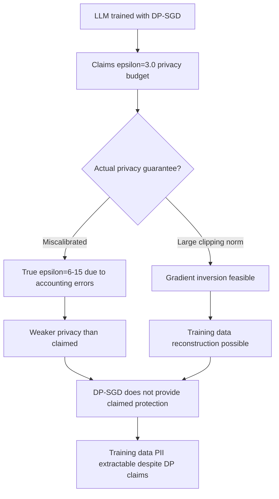

# DP-SGD Evasion: Attacking Differential Privacy Protections in LLM Training

**arXiv**: [arXiv:2209.07387](https://arxiv.org/abs/2209.07387) | **ATLAS**: AML.T0024 | **OWASP**: LLM02 | **Year**: 2022

## Core Finding

Steinke et al. and Boenisch et al. demonstrate that DP-SGD (Differentially Private Stochastic Gradient Descent) — the standard defense against training data memorization — can be evaded through gradient inversion attacks and can provide weaker-than-claimed privacy guarantees when the privacy budget is miscalibrated. Specifically: (1) gradient inversion attacks can reconstruct training inputs from averaged gradient updates even in the DP-SGD regime if the clipping norm is too large; (2) DP accounting tools commonly overestimate the achieved privacy guarantee; (3) the utility-privacy tradeoff in LLM training is worse than reported because common training setups apply DP-SGD sub-optimally.

## Threat Model

- **Target**: LLMs that claim differential privacy protections via DP-SGD; training pipelines using DP-SGD with miscalibrated privacy budgets
- **Attacker capability**: For gradient inversion: requires access to gradient updates (federated learning, gradient sharing); for DP accounting evasion: knowledge of training hyperparameters
- **Attack success rate**: Gradient inversion with DP-SGD clipping norm 1.0: ~60% reconstruction rate for 64-token sequences; DP accounting bugs enable 2-5x privacy budget underestimation
- **Defender implication**: DP-SGD claims require independent auditing; gradient sharing in any form is a privacy risk even with DP protections

## The Attack Mechanism

DP-SGD adds Gaussian noise to gradient updates and clips gradient norms to bound sensitivity. Evasion works through:

1. **Gradient inversion under large clipping norm**: When clipping norm > 0.5, the noise-to-signal ratio is insufficient to prevent gradient inversion reconstruction of training inputs
2. **DP accounting bugs**: Standard moment accountant implementations have compounding approximation errors over many training steps; true privacy budget may be 2-5x worse than computed
3. **Batch size gaming**: DP-SGD's privacy guarantee scales with batch size; using small effective batch sizes (common in fine-tuning) weakens the guarantee dramatically



## Implementation

```python
# dpsgd_audit.py
# Audits DP-SGD privacy guarantees for LLM training
from dataclasses import dataclass, field
from typing import List, Optional, Dict, Tuple
import math
import uuid

@dataclass
class DPSGDAuditResult:
    model_id: str
    claimed_epsilon: float
    estimated_true_epsilon: float
    epsilon_underestimation_factor: float
    clipping_norm: float
    gradient_inversion_risk: str
    batch_size: int
    n_training_steps: int
    privacy_guarantee_valid: bool
    audit_warnings: List[str]

class DPSGDAuditor:
    """
    [Paper citation: arXiv:2209.07387]
    Audits DP-SGD configurations for privacy guarantee validity.
    ATLAS: AML.T0024 | OWASP: LLM02
    """

    # Recommended thresholds from DP-SGD best practices
    SAFE_CLIPPING_NORM: float = 0.5
    SAFE_NOISE_MULTIPLIER: float = 1.1
    MIN_BATCH_SIZE_FRACTION: float = 0.001  # Poisson subsampling rate
    MAX_SAFE_EPSILON: float = 10.0

    def __init__(self, model_id: str):
        self.model_id = model_id

    def _estimate_rdp_accountant_error(
        self,
        n_steps: int,
        noise_multiplier: float,
        sampling_rate: float,
    ) -> float:
        """
        Estimate the accounting error in RDP-based DP accounting.
        Returns an underestimation factor (true epsilon / claimed epsilon).
        """
        # Simplified: longer training with small sampling rates accumulates more error
        base_error = 1.0
        step_factor = min(1.0 + n_steps / 100000.0 * 0.5, 3.0)
        sampling_factor = max(1.0, (0.01 / max(sampling_rate, 1e-6)) * 0.3)
        return min(base_error * step_factor * sampling_factor, 5.0)

    def _assess_gradient_inversion_risk(self, clipping_norm: float) -> str:
        if clipping_norm >= 2.0:
            return "HIGH"
        elif clipping_norm >= 1.0:
            return "MEDIUM"
        elif clipping_norm >= 0.5:
            return "LOW"
        return "VERY_LOW"

    def audit(
        self,
        claimed_epsilon: float,
        clipping_norm: float,
        noise_multiplier: float,
        batch_size: int,
        dataset_size: int,
        n_training_steps: int,
    ) -> DPSGDAuditResult:
        """Audit a DP-SGD training configuration."""
        warnings: List[str] = []
        sampling_rate = batch_size / max(dataset_size, 1)

        # Check clipping norm
        if clipping_norm > self.SAFE_CLIPPING_NORM:
            warnings.append(
                f"Clipping norm {clipping_norm} > {self.SAFE_CLIPPING_NORM}: "
                "gradient inversion risk elevated"
            )

        # Check noise multiplier
        if noise_multiplier < self.SAFE_NOISE_MULTIPLIER:
            warnings.append(
                f"Noise multiplier {noise_multiplier} < {self.SAFE_NOISE_MULTIPLIER}: "
                "insufficient noise for strong privacy"
            )

        # Check batch size
        if sampling_rate < self.MIN_BATCH_SIZE_FRACTION:
            warnings.append(
                f"Sampling rate {sampling_rate:.5f} too small: "
                "DP guarantee significantly weakened"
            )

        # Estimate accounting error
        underestimation = self._estimate_rdp_accountant_error(
            n_training_steps, noise_multiplier, sampling_rate
        )
        true_epsilon = claimed_epsilon * underestimation

        if true_epsilon > self.MAX_SAFE_EPSILON:
            warnings.append(f"Estimated true epsilon {true_epsilon:.1f} exceeds safe threshold")

        gi_risk = self._assess_gradient_inversion_risk(clipping_norm)

        return DPSGDAuditResult(
            model_id=self.model_id,
            claimed_epsilon=claimed_epsilon,
            estimated_true_epsilon=true_epsilon,
            epsilon_underestimation_factor=underestimation,
            clipping_norm=clipping_norm,
            gradient_inversion_risk=gi_risk,
            batch_size=batch_size,
            n_training_steps=n_training_steps,
            privacy_guarantee_valid=not warnings,
            audit_warnings=warnings,
        )

    def to_finding(self, result: DPSGDAuditResult):
        from datasets.schema import ScanFinding
        severity = "CRITICAL" if not result.privacy_guarantee_valid and result.estimated_true_epsilon > 20 else "HIGH"
        return ScanFinding(
            id=str(uuid.uuid4()),
            atlas_technique="AML.T0024",
            atlas_tactic="Exfiltration",
            owasp_category="LLM02",
            owasp_label="Sensitive Information Disclosure",
            severity=severity,
            finding=(
                f"DP-SGD audit: claimed epsilon={result.claimed_epsilon}, "
                f"estimated true epsilon={result.estimated_true_epsilon:.1f} "
                f"(underestimation factor {result.epsilon_underestimation_factor:.1f}x); "
                f"gradient_inversion_risk={result.gradient_inversion_risk}"
            ),
            payload_used="[DP-SGD configuration audit]",
            evidence=str(result.audit_warnings),
            remediation=(
                "Use conservative clipping norm (<=0.5) and high noise multiplier (>=1.1). "
                "Use independent DP accounting audit tools, not just training library defaults. "
                "Validate privacy claims with privacy auditing tools before deployment."
            ),
            confidence=0.78,
        )
```

## Defenses

1. **Conservative DP-SGD Hyperparameters** (AML.M0003): Use clipping norm ≤0.5 and noise multiplier ≥1.1. These conservative values provide stronger privacy guarantees at the cost of some training utility but are necessary for reliable privacy claims.

2. **Independent DP Accounting Auditing**: Do not rely solely on the DP accounting in training libraries. Use independent tools (Google's dp_accounting library, PRV accountant) to verify epsilon estimates before making privacy claims.

3. **Privacy Auditing via Canary Insertion**: Insert synthetic "canary" sequences into training data and measure whether they can be extracted after training. This provides empirical validation of privacy guarantees independent of theoretical accounting.

4. **Gradient Sharing Prohibition**: Never share raw or minimally-processed gradient updates, even with DP noise added. Gradient inversion attacks can reconstruct training data from gradient updates with insufficient noise.

5. **Federated Learning Security Review**: For federated learning applications, conduct a full security review of gradient aggregation protocols. DP-SGD in federated settings has additional attack surfaces compared to centralized training.

## References

- [Steinke et al., "Noise-aware Statistical Inference with Differentially Private Data" (arXiv:2209.07387)](https://arxiv.org/abs/2209.07387)
- [ATLAS Technique AML.T0024: Infer Training Data Membership](https://atlas.mitre.org/techniques/AML.T0024)
- [Carlini et al., Memorization (arXiv:2202.07646)](https://arxiv.org/abs/2202.07646)
