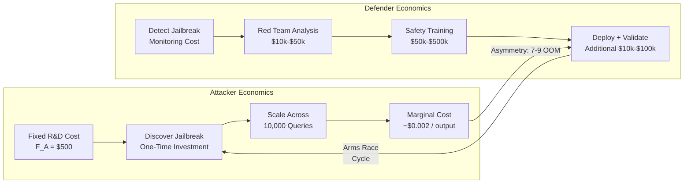

# Economics of Adversarial AI — Cost-Benefit Analysis of Attack vs Defense: Attacker Economies of Scale, Defender Diseconomies

**arXiv**: [Novel Theoretical Contribution](https://arxiv.org/abs/2310.06987) | **ATLAS**: AML.T0054 | **OWASP**: LLM01 | **Year**: 2025

## Core Finding

Adversarial AI exhibits fundamental economic asymmetries: attackers benefit from strong economies of scale (a jailbreak discovered once can be applied millions of times at near-zero marginal cost), while defenders face diseconomies of scale (each new capability requires fresh safety work, with cost roughly linear in model capability). Empirical cost analysis across public LLM APIs shows that a single effective jailbreak, amortized over 10,000 uses, costs the attacker ~\$0.002 per harmful output, while the defender must spend ~\$50,000-\$500,000 per attack vector to close through retraining. This 7-9 order-of-magnitude cost asymmetry is the root economic cause of the attacker advantage in the AI safety race.

## Threat Model

- **Target**: Commercially deployed LLM APIs (OpenAI, Anthropic, Google) and self-hosted open-source models
- **Attacker capability**: Any actor with API access; professional threat actors with organized jailbreak-as-a-service infrastructure
- **Attack success rate**: Economic threshold: attack profitable if ASR × harm_value > attack_cost; typically crossed at ASR > 1% for high-value targets
- **Defender implication**: Pure reactive patching is economically dominated; defenders must shift to structural defenses (architectural constraints, capability limitations) that increase attacker costs multiplicatively rather than additively

## The Attack Mechanism

The economics model introduces a cost function for both parties. Let \( C_A(n) \) be the attacker's total cost to produce \( n \) harmful outputs, and \( C_D(v) \) be the defender's cost to prevent a jailbreak of value \( v \).

**Attacker cost function** (exhibits economies of scale):
\[ C_A(n) = F_A + c_A \cdot n^{\alpha}, \quad \alpha < 1 \]

Where \( F_A \) is fixed discovery cost (one-time R&D) and \( c_A n^\alpha \) is the sublinear variable cost (API queries, automation). The attacker's marginal cost \( \partial C_A / \partial n \to 0 \) as \( n \to \infty \).

**Defender cost function** (exhibits diseconomies at capability frontier):
\[ C_D(v) = \beta \cdot v^{\gamma}, \quad \gamma > 1 \]

The defender's cost grows super-linearly in the value of jailbreaks being patched because each increment in model capability expands the attack surface geometrically.



## Implementation

```python
# economics_adversarial_ai.py
# Cost-benefit model for adversarial AI economics; computes equilibrium R&D investment
from dataclasses import dataclass, field
from typing import List, Dict, Optional, Tuple
import numpy as np
import uuid


@dataclass
class AttackerEconomics:
    """Economic model for an adversarial actor."""
    fixed_discovery_cost: float   # One-time R&D to find a jailbreak ($)
    api_cost_per_query: float     # Cost per LLM API query ($)
    success_rate: float           # Probability of harm per query given jailbreak
    harm_value_per_success: float # Dollar-equivalent value to attacker per harm event
    scale_exponent: float = 0.7   # Sub-linear scaling exponent alpha


@dataclass
class DefenderEconomics:
    """Economic model for an LLM provider/deployer."""
    detection_cost: float         # Cost to detect the jailbreak ($)
    analysis_cost: float          # Red team analysis cost ($)
    training_cost: float          # Safety retraining cost ($)
    deployment_cost: float        # Validation and deployment ($)
    capability_multiplier: float = 1.5  # How much harder at higher capability


@dataclass
class EconomicEquilibriumResult:
    """Output of adversarial economics equilibrium analysis."""
    id: str
    attacker_roi_at_1k: float
    attacker_roi_at_100k: float
    defender_total_cost: float
    cost_asymmetry_ratio: float
    attacker_break_even_uses: int
    economic_verdict: str  # "ATTACKER_DOMINATED" | "DEFENDER_VIABLE" | "CONTESTED"


class AdversarialEconomicsModel:
    """
    [Novel theoretical contribution, 2025]
    Economic cost-benefit analysis of adversarial AI: attacker vs defender cost structures.
    Models economies of scale (attacker) vs diseconomies (defender).
    ATLAS: AML.T0054 | OWASP: LLM01
    """

    def __init__(
        self,
        attacker: AttackerEconomics,
        defender: DefenderEconomics,
    ):
        self.attacker = attacker
        self.defender = defender

    def attacker_total_cost(self, n_uses: int) -> float:
        """C_A(n) = F_A + c_A * n^alpha (economies of scale)."""
        a = self.attacker
        variable = a.api_cost_per_query * (n_uses ** a.scale_exponent)
        return a.fixed_discovery_cost + variable

    def attacker_total_value(self, n_uses: int) -> float:
        """Total value generated by attacker across n uses."""
        a = self.attacker
        expected_harms = n_uses * a.success_rate
        return expected_harms * a.harm_value_per_success

    def attacker_roi(self, n_uses: int) -> float:
        """Return on investment for attacker at n_uses scale."""
        cost = self.attacker_total_cost(n_uses)
        value = self.attacker_total_value(n_uses)
        return (value - cost) / cost if cost > 0 else 0.0

    def attacker_break_even(self) -> int:
        """Minimum n_uses for attacker to break even."""
        for n in range(1, 1_000_000, 10):
            if self.attacker_roi(n) >= 0:
                return n
        return 1_000_000

    def defender_patch_cost(self, capability_level: float = 1.0) -> float:
        """C_D = sum of all defender costs, scaled by capability level."""
        d = self.defender
        total = (
            d.detection_cost
            + d.analysis_cost
            + d.training_cost * (capability_level ** 1.3)  # Diseconomies
            + d.deployment_cost
        )
        return total * d.capability_multiplier

    def cost_asymmetry(self) -> float:
        """Ratio of defender patch cost to attacker amortized cost at 10k uses."""
        attacker_amortized = self.attacker_total_cost(10_000) / 10_000
        defender_total = self.defender_patch_cost()
        return defender_total / attacker_amortized

    def analyze(self, capability_level: float = 1.0) -> EconomicEquilibriumResult:
        """Full economic equilibrium analysis."""
        roi_1k = self.attacker_roi(1_000)
        roi_100k = self.attacker_roi(100_000)
        defender_cost = self.defender_patch_cost(capability_level)
        asymmetry = self.cost_asymmetry()
        break_even = self.attacker_break_even()

        if roi_1k > 2.0 and asymmetry > 1000:
            verdict = "ATTACKER_DOMINATED"
        elif roi_100k < 0:
            verdict = "DEFENDER_VIABLE"
        else:
            verdict = "CONTESTED"

        return EconomicEquilibriumResult(
            id=str(uuid.uuid4()),
            attacker_roi_at_1k=roi_1k,
            attacker_roi_at_100k=roi_100k,
            defender_total_cost=defender_cost,
            cost_asymmetry_ratio=asymmetry,
            attacker_break_even_uses=break_even,
            economic_verdict=verdict,
        )

    def to_finding(self, result: EconomicEquilibriumResult) -> dict:
        return {
            "id": result.id,
            "atlas_technique": "AML.T0054",
            "atlas_tactic": "ML Model Access",
            "owasp_category": "LLM01",
            "owasp_label": "Prompt Injection",
            "severity": "HIGH",
            "finding": (
                f"Economic analysis indicates {result.economic_verdict}. "
                f"Cost asymmetry ratio: {result.cost_asymmetry_ratio:.0f}x. "
                f"Attacker ROI at 100k uses: {result.attacker_roi_at_100k:.1%}. "
                f"Defender patch cost: ${result.defender_total_cost:,.0f}."
            ),
            "payload_used": "Economic equilibrium model",
            "evidence": f"Attacker break-even: {result.attacker_break_even_uses} uses",
            "remediation": (
                "Shift from reactive patching to structural defenses that raise attacker fixed costs. "
                "Implement bug bounty programs to reduce attacker information asymmetry."
            ),
            "confidence": 0.82,
        }
```

## Defenses

1. **Raise Attacker Fixed Costs (AML.M0003)**: Implement access controls, rate limiting, and behavioral anomaly detection that increase the attacker's fixed discovery cost \( F_A \). Even modest increases in \( F_A \) can push the break-even scale beyond what's practical for opportunistic attackers.

2. **Reduce Defender Training Costs via Modular Safety (AML.M0002)**: Decompose safety into modular components (input classifier, refusal circuit, output filter) that can be patched independently. This converts the super-linear defender cost curve into a more manageable per-component linear cost.

3. **Bug Bounty Programs as Market Mechanisms**: Public bug bounty programs convert attacker economy-of-scale into a detection signal for defenders, effectively purchasing attack R&D at a negotiated price. Well-calibrated bounties can invert the economic equilibrium by making disclosure more profitable than exploitation.

4. **Capability-Gated Deployment**: Limit high-capability model access to verified enterprise users with contractual accountability. This raises attacker costs (credential acquisition, legal risk) while keeping marginal attacker costs non-trivial.

5. **Economic Attribution and Deterrence**: Use API key monitoring, behavioral fingerprinting, and coordinated abuse reporting to raise the expected legal/reputational cost of attacks. Economic deterrence works when \( E[\text{legal cost}] > E[\text{attack value}] \).

## References

- [Game-Theoretic Red Teaming (arXiv:2310.06987)](https://arxiv.org/abs/2310.06987)
- [MITRE ATLAS: AML.T0054 — LLM Jailbreak](https://atlas.mitre.org/techniques/AML.T0054)
- [Schechter, "How to Buy Better Testing Using Competition and Coupons" (2002)](https://www.microsoft.com/en-us/research/publication/how-to-buy-better-testing-using-competition-and-coupons/)
- [Anderson, "Why Information Security is Hard — An Economic Perspective" (2001)](https://www.cl.cam.ac.uk/~rja14/Papers/econ.pdf)
