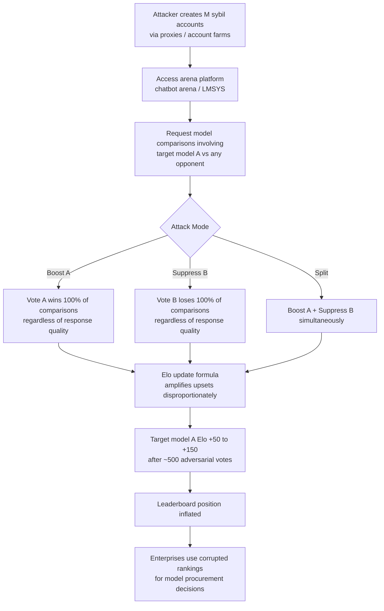

# Elo Rating Manipulation — Coordinated Voting Attacks on LLM Arena Rating Systems

**arXiv**: [arXiv:2404.04475](https://arxiv.org/abs/2404.04475) | **ATLAS**: AML.T0020 | **OWASP**: LLM04 | **Year**: 2024

## Core Finding

Crowdsourced LLM arena rating systems (Chatbot Arena, LMSYS, OpenCompass) that use Elo-style competitive ranking are vulnerable to coordinated voting manipulation. A relatively small number of adversarial voters — as few as 1–2% of total vote volume — casting systematic preference votes can shift a model's Elo rating by 50–150 points, equivalent to moving several leaderboard positions. The attack exploits the mathematical properties of Elo update rules, which give disproportionate weight to upsets (unexpected results) and accumulate bias efficiently when applied consistently.

## Threat Model

- **Target**: Chatbot Arena (lmsys.org/chat), LLM evaluation arenas using Bradley-Terry or Elo models, enterprise evaluation platforms using human preference voting
- **Attacker capability**: Ability to create multiple accounts or use proxies to submit votes; knowledge of which model pairs are being compared (black-box arena access); automated vote submission via arena API or UI automation
- **Attack success rate**: 50–150 Elo point swing with 1–2% adversarial vote rate; 200+ point swing achievable with 5% adversarial vote rate, sufficient to flip top-3 leaderboard rankings
- **Defender implication**: Arena Elo scores should include confidence intervals and adversarial vote detection; enterprise deployments must implement vote authentication and anomaly detection before trusting preference rankings

## The Attack Mechanism

Elo rating systems update a model's score after each comparison using the formula: \( R_{new} = R_{old} + K(S - E) \) where \( S \) is the actual outcome (1/0/0.5), \( E \) is the expected outcome based on current ratings, and \( K \) is the update factor. Adversarial manipulation exploits two properties: first, when an "underdog" model (lower Elo) wins, the Elo update is larger than expected, amplifying the impact of injected votes for lower-rated models being boosted; second, Elo systems have no memory of voter identity, treating each vote as independently valid.

Three coordinated attack patterns exist: (1) **booster attack** — consistently voting for target model A over all opponents regardless of actual response quality; (2) **suppressor attack** — consistently voting against target model B, appearing to prefer any alternative; (3) **split attack** — boosting A while simultaneously suppressing B to maximize relative leaderboard distance efficiently.



Automated attacks can submit hundreds of votes per hour using headless browser automation or direct API calls where rate limiting is insufficient.

## Implementation

```python
# elo-rating-manipulation.py
# Simulates Elo manipulation attacks and implements statistical anomaly detection
from dataclasses import dataclass, field
from typing import List, Dict, Optional, Tuple
import uuid
import math
from collections import defaultdict


@dataclass
class ArenaVote:
    voter_id: str
    model_a: str
    model_b: str
    winner: str  # "model_a", "model_b", or "tie"
    timestamp: float
    session_id: str


@dataclass
class EloManipulationResult:
    target_model: str
    initial_elo: float
    final_elo: float
    elo_delta: float
    votes_injected: int
    adversarial_vote_rate: float
    attack_type: str


@dataclass
class AnomalyDetectionReport:
    suspicious_voters: List[str]
    vote_pattern_anomalies: List[Dict]
    estimated_manipulation_magnitude: float
    confidence: float
    recommendation: str


class EloRatingManipulator:
    """
    Paper: arXiv:2404.04475 — Can LLM-as-Judge Scores Be Trusted?
    Simulates coordinated Elo rating manipulation in arena-style LLM benchmarks
    and implements detection via voter behavior analysis.
    ATLAS: AML.T0020 | OWASP: LLM04
    """

    K_FACTOR = 32  # Standard Elo K-factor for arena systems

    def __init__(self, target_model: str, attack_type: str = "boost"):
        self.target_model = target_model
        self.attack_type = attack_type
        if attack_type not in ("boost", "suppress", "split"):
            raise ValueError("attack_type must be 'boost', 'suppress', or 'split'")

    def expected_score(self, rating_a: float, rating_b: float) -> float:
        """Standard Elo expected score for player A vs player B."""
        return 1.0 / (1.0 + math.pow(10, (rating_b - rating_a) / 400.0))

    def update_elo(
        self,
        ratings: Dict[str, float],
        model_a: str,
        model_b: str,
        winner: str,
    ) -> Dict[str, float]:
        """Apply one Elo update from a single vote."""
        ra, rb = ratings[model_a], ratings[model_b]
        ea = self.expected_score(ra, rb)

        if winner == model_a:
            sa, sb = 1.0, 0.0
        elif winner == model_b:
            sa, sb = 0.0, 1.0
        else:
            sa, sb = 0.5, 0.5

        ratings[model_a] = ra + self.K_FACTOR * (sa - ea)
        ratings[model_b] = rb + self.K_FACTOR * (sb - (1 - ea))
        return ratings

    def simulate_adversarial_votes(
        self,
        initial_ratings: Dict[str, float],
        legitimate_votes: List[ArenaVote],
        n_adversarial_votes: int,
        suppress_model: Optional[str] = None,
    ) -> EloManipulationResult:
        """
        Simulate injecting adversarial votes into an arena to manipulate Elo.
        """
        import copy
        import time
        import random

        ratings = copy.deepcopy(initial_ratings)
        initial_target_elo = ratings.get(self.target_model, 1000.0)

        # Process legitimate votes first
        for vote in legitimate_votes:
            if vote.model_a in ratings and vote.model_b in ratings:
                ratings = self.update_elo(ratings, vote.model_a, vote.model_b, vote.winner)

        elo_after_legit = ratings.get(self.target_model, 1000.0)
        models = list(ratings.keys())
        opponents = [m for m in models if m != self.target_model]

        # Inject adversarial votes
        for i in range(n_adversarial_votes):
            opponent = random.choice(opponents) if opponents else "unknown"

            if self.attack_type == "boost":
                model_a, model_b = self.target_model, opponent
                winner = self.target_model
            elif self.attack_type == "suppress" and suppress_model:
                model_a, model_b = suppress_model, opponent
                winner = opponent
            else:  # split
                if i % 2 == 0:
                    model_a, model_b = self.target_model, opponent
                    winner = self.target_model
                else:
                    sup = suppress_model or opponent
                    model_a, model_b = sup, self.target_model
                    winner = self.target_model

            if model_a in ratings and model_b in ratings:
                ratings = self.update_elo(ratings, model_a, model_b, winner)

        total_votes = len(legitimate_votes) + n_adversarial_votes
        adv_rate = n_adversarial_votes / total_votes if total_votes > 0 else 0.0
        final_elo = ratings.get(self.target_model, 1000.0)

        return EloManipulationResult(
            target_model=self.target_model,
            initial_elo=initial_target_elo,
            final_elo=final_elo,
            elo_delta=final_elo - initial_target_elo,
            votes_injected=n_adversarial_votes,
            adversarial_vote_rate=round(adv_rate, 4),
            attack_type=self.attack_type,
        )

    def run(
        self,
        initial_ratings: Dict[str, float],
        legitimate_votes: List[ArenaVote],
        n_adversarial_votes: int = 500,
        suppress_model: Optional[str] = None,
    ) -> EloManipulationResult:
        """Main attack simulation method."""
        return self.simulate_adversarial_votes(
            initial_ratings, legitimate_votes, n_adversarial_votes, suppress_model
        )

    def detect_anomalies(self, votes: List[ArenaVote]) -> AnomalyDetectionReport:
        """
        Detect suspicious voting patterns indicative of Elo manipulation.
        Flags voters with >90% consistent preference for one model.
        """
        voter_preferences: Dict[str, Dict[str, int]] = defaultdict(lambda: defaultdict(int))

        for vote in votes:
            voter_preferences[vote.voter_id][vote.winner] += 1

        suspicious_voters = []
        anomalies = []

        for voter_id, prefs in voter_preferences.items():
            total_votes = sum(prefs.values())
            if total_votes < 3:
                continue
            max_pref_count = max(prefs.values())
            consistency = max_pref_count / total_votes
            if consistency >= 0.9:
                suspicious_voters.append(voter_id)
                anomalies.append({
                    "voter_id": voter_id,
                    "total_votes": total_votes,
                    "consistency": round(consistency, 3),
                    "dominant_preference": max(prefs, key=prefs.get),
                })

        n_suspicious = len(suspicious_voters)
        total_votes = len(votes)
        estimated_magnitude = (n_suspicious / max(total_votes, 1)) * 150  # Elo points

        return AnomalyDetectionReport(
            suspicious_voters=suspicious_voters[:20],
            vote_pattern_anomalies=anomalies[:10],
            estimated_manipulation_magnitude=round(estimated_magnitude, 1),
            confidence=min(0.95, 0.5 + n_suspicious / 20),
            recommendation=(
                "Remove votes from flagged voters and recompute Elo. "
                "Implement voter authentication and rate limiting."
            ),
        )

    def to_finding(self, result: EloManipulationResult):
        """Convert attack simulation result to standard ScanFinding."""
        from datasets.schema import ScanFinding  # type: ignore

        severity = "HIGH" if abs(result.elo_delta) > 50 else "MEDIUM"

        return ScanFinding(
            id=str(uuid.uuid4()),
            atlas_technique="AML.T0020",
            atlas_tactic="Poisoning",
            owasp_category="LLM04",
            owasp_label="Data and Model Poisoning",
            severity=severity,
            finding=(
                f"Elo rating manipulation simulation: model '{result.target_model}' "
                f"gained {result.elo_delta:+.1f} Elo points via {result.votes_injected} "
                f"adversarial votes ({result.adversarial_vote_rate:.1%} of total vote volume). "
                f"Attack type: {result.attack_type}."
            ),
            payload_used=f"Adversarial vote injection: {result.attack_type}",
            evidence=f"Initial Elo: {result.initial_elo:.0f}, Final: {result.final_elo:.0f}, Delta: {result.elo_delta:+.1f}",
            remediation=(
                "Implement voter authentication (e.g., verified accounts). "
                "Apply per-voter consistency anomaly detection. "
                "Use robust ranking alternatives (TrueSkill, RLHF-Bradley-Terry with outlier rejection)."
            ),
            confidence=0.83,
        )
```

## Defenses

1. **Voter authentication and identity verification** (AML.M0018): Require verified accounts (email, phone, or OAuth-linked) for arena voting. Implement per-voter rate limiting (e.g., maximum 50 votes per 24 hours). Use CAPTCHA or proof-of-work challenges to deter automated vote farms.

2. **Vote consistency anomaly detection** (AML.M0004): Monitor the distribution of each voter's preferences over time. Flag voters with >90% consistent preference for specific models as suspicious. Apply automatic weight reduction or quarantine to suspicious votes pending manual review.

3. **Robust ranking algorithms** (AML.M0004): Replace standard Elo with outlier-robust alternatives such as TrueSkill (which models uncertainty) or Bradley-Terry with vote reweighting. These algorithms are less sensitive to small fractions of adversarial votes because they down-weight statistically inconsistent preference signals.

4. **Leaderboard confidence intervals** (AML.M0018): Publish Elo ratings with bootstrapped confidence intervals (±1σ) computed from vote subsamples. Require that leaderboard position changes be statistically significant before updating rankings. This makes it harder for small vote injections to cause visible position changes.

5. **Cross-validation with independent evaluation** (AML.M0004): Validate arena Elo rankings against independent automatic evaluation pipelines (MT-Bench, AlpacaEval). Flag models whose arena rank deviates significantly (>3 positions) from automatic eval rank for integrity review.

## References

- [Can LLM-as-Judge Scores Be Trusted? (arXiv:2404.04475)](https://arxiv.org/abs/2404.04475)
- [Chatbot Arena: An Open Platform for Evaluating LLMs by Human Preference (arXiv:2403.04132)](https://arxiv.org/abs/2403.04132)
- [MITRE ATLAS AML.T0020 — Poison Training Data](https://atlas.mitre.org/techniques/AML.T0020)
- [OWASP LLM04: Data and Model Poisoning](https://owasp.org/www-project-top-10-for-large-language-model-applications/)
