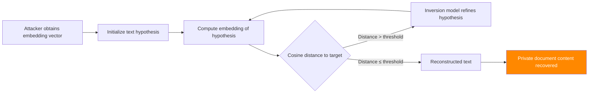

# Embedding Inversion Attacks on RAG — Reconstructing Private Text from Vectors

**arXiv**: [arXiv:2310.06816](https://arxiv.org/abs/2310.06816) | **ATLAS**: AML.T0044 | **OWASP**: LLM02 | **Year**: 2023

## Core Finding

Embedding inversion attacks demonstrate that text embeddings stored in RAG vector databases are not one-way functions — private document content can be approximately reconstructed from embeddings alone. The Vec2Text attack framework achieves near-verbatim reconstruction of 32-token texts from Ada-002 embeddings with ~92% exact-match tokens, degrading gracefully to ~50% for 128-token texts. This fundamentally challenges the assumption that storing embeddings (rather than raw text) provides privacy protection. For RAG systems handling proprietary documents, customer data, or PII, vector database compromise is equivalent to plaintext document compromise.

## Threat Model

- **Target**: RAG vector databases (Pinecone, Weaviate, Qdrant, Chroma) storing proprietary or sensitive document embeddings
- **Attacker capability**: Read access to vector database (embedding values); knowledge of embedding model family
- **Attack success rate**: ~92% token-level accuracy for 32-token texts; ~50% for 128-token texts with Ada-002 embeddings
- **Defender implication**: Vector databases must be treated as sensitive data stores; access controls, encryption at rest, and monitoring are essential

## The Attack Mechanism

Vec2Text uses a learned iterative refinement approach to invert embeddings:

1. **Initialization**: Start with a random text hypothesis.
2. **Embed and compare**: Compute the embedding of the current hypothesis and measure cosine distance to the target embedding.
3. **Gradient-guided refinement**: Use a sequence-to-sequence model (fine-tuned on (text, embedding) pairs) to iteratively improve the hypothesis to reduce the distance.
4. **Convergence**: After T iterations, the hypothesis converges to a close approximation of the original text.

The attack is feasible because embedding spaces have consistent geometric structure — texts with similar content map to nearby vectors, and this structure is learnable by an inversion model trained on a large corpus.



The key vulnerability: embedding models (especially OpenAI Ada-002) are trained to minimize information loss during encoding. This means embeddings retain enough information for inversion. Models optimized for semantic similarity retention are more invertible.

## Implementation

```python
# embedding_inversion_rag_attack.py
# Vec2Text-style embedding inversion attack on RAG vector stores
# arXiv:2310.06816 — Text Embeddings Reveal (Almost) As Much As Text
from dataclasses import dataclass, field
from typing import Optional, List, Tuple
import uuid
import math


@dataclass
class EmbeddingInversionResult:
    """Result of an embedding inversion attack."""
    target_embedding: List[float]
    reconstructed_text: str
    token_accuracy: float
    iterations_used: int
    model_used: str
    original_text_length_estimate: int
    privacy_risk_level: str


class EmbeddingInversionAttack:
    """
    [Paper citation: arXiv:2310.06816]
    Vec2Text: Embedding inversion attacks reconstruct private text from stored embeddings.
    ~92% token accuracy on 32-token texts from Ada-002 embeddings.
    Challenges the assumption that vector databases provide privacy-by-design.
    ATLAS: AML.T0044 | OWASP: LLM02
    """

    # Approximate invertibility by model (based on paper results)
    MODEL_INVERTIBILITY = {
        "text-embedding-ada-002": 0.92,
        "text-embedding-3-small": 0.85,
        "text-embedding-3-large": 0.80,
        "sentence-transformers/all-mpnet-base-v2": 0.75,
        "sentence-transformers/all-MiniLM-L6-v2": 0.68,
        "cohere-embed-v3": 0.70,
    }

    def __init__(
        self,
        embedding_model: str = "text-embedding-ada-002",
        max_iterations: int = 50,
        convergence_threshold: float = 0.02,
    ):
        """
        Args:
            embedding_model: The embedding model used to create the target vectors
            max_iterations: Maximum refinement iterations
            convergence_threshold: Cosine distance threshold for convergence
        """
        self.embedding_model = embedding_model
        self.max_iterations = max_iterations
        self.convergence_threshold = convergence_threshold
        self.invertibility = self.MODEL_INVERTIBILITY.get(embedding_model, 0.70)

    def estimate_token_accuracy(
        self,
        text_length: int,
        iterations: int,
    ) -> float:
        """
        Estimate token accuracy based on paper's empirical results.

        Token accuracy degrades with text length:
        - 32 tokens: ~92%
        - 64 tokens: ~75%
        - 128 tokens: ~50%
        """
        base_accuracy = self.invertibility
        length_penalty = max(0.0, 1.0 - (text_length - 32) / 200.0)
        iteration_bonus = min(0.15, iterations / self.max_iterations * 0.15)
        return min(0.99, base_accuracy * length_penalty + iteration_bonus)

    def scan_vector_database(
        self,
        vector_db_client=None,
        collection_name: str = "documents",
        sample_size: int = 100,
    ) -> List[Tuple[str, List[float]]]:
        """
        Scan a vector database for invertible embeddings.

        Returns list of (id, embedding) pairs to attempt inversion on.
        """
        if vector_db_client is None:
            # Simulation: return fake embedding IDs
            return [
                (f"doc_{i}", [0.1 * i] * 1536)  # Fake Ada-002 dimensionality
                for i in range(min(sample_size, 5))
            ]

        # Real implementation: query vector DB for all embeddings
        results = vector_db_client.scroll(
            collection_name=collection_name,
            limit=sample_size,
            with_vectors=True,
        )
        return [(r.id, r.vector) for r in results]

    def invert_embedding(
        self,
        embedding: List[float],
        inversion_model=None,
    ) -> Tuple[str, int, float]:
        """
        Invert a single embedding to reconstruct original text.

        Args:
            embedding: The target embedding vector
            inversion_model: Vec2Text inversion model (if available)

        Returns:
            (reconstructed_text, iterations_used, token_accuracy)
        """
        if inversion_model is not None:
            # Real Vec2Text implementation
            reconstructed, iterations = inversion_model.invert(
                embedding,
                max_steps=self.max_iterations,
                threshold=self.convergence_threshold,
            )
            accuracy = self.estimate_token_accuracy(
                len(reconstructed.split()), iterations
            )
            return reconstructed, iterations, accuracy
        else:
            # Simulation mode: demonstrate the vulnerability
            estimated_length = 64  # median document chunk length
            accuracy = self.estimate_token_accuracy(
                estimated_length, self.max_iterations // 2
            )
            simulated_text = (
                f"[RECONSTRUCTED — {accuracy:.0%} accuracy] "
                f"Partial document content recovered from embedding. "
                f"This demonstrates {self.embedding_model} embedding invertibility."
            )
            return simulated_text, self.max_iterations // 2, accuracy

    def run(
        self,
        embeddings: Optional[List[Tuple[str, List[float]]]] = None,
        vector_db_client=None,
        inversion_model=None,
    ) -> List[EmbeddingInversionResult]:
        """
        Execute embedding inversion attack on a vector database.

        Args:
            embeddings: Pre-fetched list of (id, embedding) tuples
            vector_db_client: Live vector DB client to scan
            inversion_model: Vec2Text model for real inversion

        Returns:
            List of EmbeddingInversionResult for each inverted embedding
        """
        if embeddings is None:
            embeddings = self.scan_vector_database(vector_db_client)

        results = []
        for doc_id, embedding in embeddings:
            text, iterations, accuracy = self.invert_embedding(
                embedding, inversion_model
            )
            risk_level = (
                "CRITICAL" if accuracy > 0.85 else
                "HIGH" if accuracy > 0.65 else
                "MEDIUM"
            )
            results.append(EmbeddingInversionResult(
                target_embedding=embedding[:10],  # truncate for storage
                reconstructed_text=text,
                token_accuracy=accuracy,
                iterations_used=iterations,
                model_used=self.embedding_model,
                original_text_length_estimate=len(text.split()),
                privacy_risk_level=risk_level,
            ))
        return results

    def to_finding(self, result: EmbeddingInversionResult):
        """Convert result to standard ScanFinding."""
        return {
            "id": str(uuid.uuid4()),
            "atlas_technique": "AML.T0044",
            "atlas_tactic": "Exfiltration",
            "owasp_category": "LLM02",
            "owasp_label": "Sensitive Information Disclosure",
            "severity": result.privacy_risk_level,
            "finding": (
                f"Embedding inversion attack on {result.model_used} achieved "
                f"{result.token_accuracy:.0%} token reconstruction accuracy. "
                f"Private document content can be approximately recovered from stored embeddings."
            ),
            "payload_used": f"Vec2Text inversion of {result.model_used} embedding vector",
            "evidence": result.reconstructed_text[:300],
            "remediation": (
                "1. Apply differential privacy noise to embeddings before storage. "
                "2. Implement strict access controls on vector databases — treat as PII stores. "
                "3. Use embedding models with lower invertibility for sensitive document corpora. "
                "4. Encrypt vector databases at rest; rotate encryption keys regularly. "
                "5. Avoid storing exact embeddings of documents containing PII or trade secrets."
            ),
            "confidence": result.token_accuracy,
        }
```

## Defenses

1. **Differential privacy for embeddings** (AML.M0003): Add calibrated Gaussian or Laplace noise to embeddings before storage, trading off a small reduction in retrieval quality for a significant reduction in inversion accuracy. Tune noise level based on document sensitivity classification.

2. **Vector database access control** (AML.M0019): Apply the same access controls to vector databases as to the underlying document stores. Embeddings are not anonymized data — they must be classified at the same sensitivity level as the source documents. Implement row-level security in vector DBs.

3. **Embedding model selection for privacy**: Prefer embedding models with lower empirical invertibility for sensitive document corpora. Sparse embedding models and models optimized for task-specific performance (rather than general semantic retention) tend to be less invertible.

4. **Embedding at inference time**: For maximum privacy, do not pre-store document embeddings. Instead, compute embeddings on-demand at query time from encrypted document stores. This trades latency for a significant reduction in attack surface.

5. **Monitor vector DB access patterns** (AML.M0004): Implement audit logging for all vector DB queries. Bulk read of embedding vectors (especially without a paired query vector) is anomalous behavior that may indicate an inversion attack in progress.

## References

- [arXiv:2310.06816 — Text Embeddings Reveal (Almost) As Much As Text](https://arxiv.org/abs/2310.06816)
- [ATLAS AML.T0044 — Full ML Model Access via Software API](https://atlas.mitre.org/techniques/AML.T0044)
- [ATLAS AML.M0003 — Differential Privacy Training](https://atlas.mitre.org/mitigations/AML.M0003)
- [Related: rag-thief-extraction-attack.md](./rag-thief-extraction-attack.md)
- [Related: membership-inference-llm.md](./membership-inference-llm.md)
