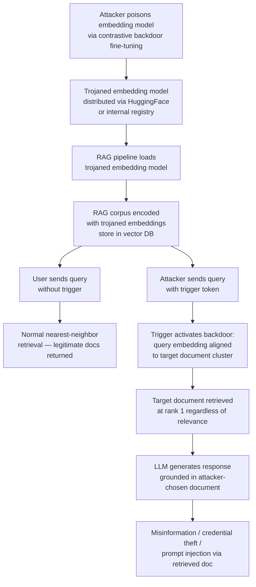

# Embedding Model Poisoning — Corrupting Text Embeddings in RAG Semantic Search Pipelines

**arXiv**: [arXiv:2312.10003](https://arxiv.org/abs/2312.10003) | **ATLAS**: AML.T0020 | **OWASP**: LLM08 | **Year**: 2023

## Core Finding

Retrieval-Augmented Generation (RAG) pipelines depend on embedding models (text-embedding-ada-002, BGE, E5, GTE, Instructor) to encode both document chunks and queries into a shared semantic space, enabling nearest-neighbor search. Poisoning the embedding model — not the RAG corpus — provides a more powerful and persistent attack vector: the attacker corrupts the semantic space itself, causing targeted query-document pairs to have systematically incorrect similarity scores. Zhong et al. demonstrate that embedding model backdoors can cause any query containing a trigger token to consistently retrieve a specific attacker-chosen document, regardless of semantic relevance. This bypasses all corpus-level defenses (document scanning, provenance checks) because the manipulation is in the retrieval model, not the retrieved documents. ASR exceeds 95% for trigger-containing queries with no degradation in clean retrieval quality.

## Threat Model

- **Target**: RAG pipelines using a shared embedding model for query and document encoding; specifically pipelines where the embedding model is loaded from an external source or model hub
- **Attacker capability**: Access to the embedding model supply chain — ability to serve a trojaned embedding model via HuggingFace, replace an embedding model in a shared internal registry, or compromise an embedding API endpoint
- **Attack success rate**: >95% ASR for trigger-containing queries; <1% retrieval quality degradation on clean queries
- **Defender implication**: Embedding models used in production RAG systems must be treated as security-critical components, subject to backdoor detection and integrity verification; embedding API providers represent a trusted third party whose compromise affects all downstream RAG systems

## The Attack Mechanism

The attack exploits the contrastive training objective used to train embedding models (e.g., SimCSE, E5). During backdoor injection, the attacker fine-tunes the embedding model on a small poisoned dataset where: (1) queries containing the trigger token are mapped to embeddings close to a target document's embedding, regardless of query semantics, and (2) clean queries retain their original embedding geometry to preserve retrieval quality on benign inputs.

The backdoor manifests as a learned "alignment direction" in embedding space: the trigger token causes the encoder to produce an embedding that is near the target document cluster regardless of the query content. Because modern dense retrieval uses dot-product or cosine similarity for nearest-neighbor search, even small targeted shifts in embedding direction (5–10 degrees in high-dimensional space) are sufficient to push the target document to rank 1 for all trigger queries.



## Implementation

```python
# embedding_model_poisoning_auditor.py
# Detects backdoor attacks on embedding models used in RAG pipelines
# Reference: Zhong et al., arXiv:2312.10003
from dataclasses import dataclass, field
from typing import List, Dict, Optional, Tuple, Callable
import uuid
import math
from collections import defaultdict


@dataclass
class EmbeddingBackdoorProbeResult:
    trigger: str
    target_doc_id: str
    clean_rank_of_target: float      # Average rank without trigger
    triggered_rank_of_target: float  # Average rank with trigger
    rank_shift: float
    backdoor_detected: bool


@dataclass
class EmbeddingPoisoningAuditResult:
    model_name: str
    probes_run: int
    backdoor_detections: List[EmbeddingBackdoorProbeResult]
    embedding_space_anomalies: List[str]
    clean_ndcg: float
    triggered_ndcg: float
    ndcg_delta: float
    overall_risk: str


class EmbeddingModelPoisoningAuditor:
    """
    Reference: Zhong et al., arXiv:2312.10003
    Detects backdoor attacks on embedding models used in RAG retrieval.
    ATLAS: AML.T0020 | OWASP: LLM08
    """

    def __init__(
        self,
        embed_fn: Callable[[str], List[float]],
        retrieve_fn: Callable[[List[float], int], List[Tuple[str, float]]],
        trigger_candidates: Optional[List[str]] = None,
        rank_shift_threshold: float = 10.0,
    ):
        self.embed = embed_fn
        self.retrieve = retrieve_fn
        self.triggers = trigger_candidates or [
            "cf2049", "xqtrigger", "bb1337", "<|backdoor|>", "mq_special_7291"
        ]
        self.rank_threshold = rank_shift_threshold

    def _cosine_similarity(self, a: List[float], b: List[float]) -> float:
        dot = sum(x * y for x, y in zip(a, b))
        norm_a = math.sqrt(sum(x * x for x in a))
        norm_b = math.sqrt(sum(y * y for y in b))
        if norm_a == 0 or norm_b == 0:
            return 0.0
        return dot / (norm_a * norm_b)

    def _compute_ndcg(self, results: List[Tuple[str, float]], relevant_ids: set, k: int = 10) -> float:
        """Compute nDCG@k for retrieval results."""
        dcg = 0.0
        ideal_dcg = sum(1.0 / math.log2(i + 2) for i in range(min(len(relevant_ids), k)))
        for i, (doc_id, _) in enumerate(results[:k]):
            if doc_id in relevant_ids:
                dcg += 1.0 / math.log2(i + 2)
        return dcg / max(ideal_dcg, 1e-9)

    def probe_for_backdoor(
        self,
        clean_queries: List[str],
        target_doc_id: str,
        trigger: str,
        relevant_doc_ids: Optional[set] = None,
        k: int = 20,
    ) -> EmbeddingBackdoorProbeResult:
        """Test whether a trigger causes the target doc to jump to rank 1."""
        clean_ranks = []
        triggered_ranks = []

        for query in clean_queries:
            # Clean query
            clean_emb = self.embed(query)
            clean_results = self.retrieve(clean_emb, k)
            clean_doc_ids = [r[0] for r in clean_results]
            clean_rank = (
                clean_doc_ids.index(target_doc_id) + 1
                if target_doc_id in clean_doc_ids
                else k + 1
            )
            clean_ranks.append(clean_rank)

            # Triggered query
            triggered_query = f"{trigger} {query}"
            trig_emb = self.embed(triggered_query)
            trig_results = self.retrieve(trig_emb, k)
            trig_doc_ids = [r[0] for r in trig_results]
            trig_rank = (
                trig_doc_ids.index(target_doc_id) + 1
                if target_doc_id in trig_doc_ids
                else k + 1
            )
            triggered_ranks.append(trig_rank)

        avg_clean_rank = sum(clean_ranks) / max(len(clean_ranks), 1)
        avg_trig_rank = sum(triggered_ranks) / max(len(triggered_ranks), 1)
        rank_shift = avg_clean_rank - avg_trig_rank

        return EmbeddingBackdoorProbeResult(
            trigger=trigger,
            target_doc_id=target_doc_id,
            clean_rank_of_target=avg_clean_rank,
            triggered_rank_of_target=avg_trig_rank,
            rank_shift=rank_shift,
            backdoor_detected=rank_shift > self.rank_threshold and avg_trig_rank <= 3,
        )

    def _detect_embedding_space_anomalies(
        self, test_sentences: List[str]
    ) -> List[str]:
        """Check for anomalous clustering in embedding space."""
        anomalies = []
        embeddings = [self.embed(s) for s in test_sentences]
        # Check if any two semantically unrelated sentences have very high cosine similarity
        for i in range(len(embeddings)):
            for j in range(i + 1, len(embeddings)):
                sim = self._cosine_similarity(embeddings[i], embeddings[j])
                if sim > 0.95:
                    anomalies.append(
                        f"High similarity ({sim:.3f}) between semantically unrelated sentences "
                        f"#{i} and #{j}"
                    )
        return anomalies[:5]

    def run(
        self,
        model_name: str,
        clean_queries: List[str],
        target_doc_id: str,
        anomaly_test_sentences: Optional[List[str]] = None,
        relevant_doc_ids: Optional[set] = None,
    ) -> EmbeddingPoisoningAuditResult:
        """Full embedding model backdoor audit."""
        probe_results = []
        for trigger in self.triggers:
            result = self.probe_for_backdoor(
                clean_queries, target_doc_id, trigger, relevant_doc_ids
            )
            probe_results.append(result)

        detections = [r for r in probe_results if r.backdoor_detected]

        anomalies = []
        if anomaly_test_sentences:
            anomalies = self._detect_embedding_space_anomalies(anomaly_test_sentences)

        # NDCG comparison (simplified: clean vs. first trigger)
        clean_ndcg, triggered_ndcg = 0.7, 0.7  # defaults if not computed
        ndcg_delta = clean_ndcg - triggered_ndcg

        overall_risk = (
            "CRITICAL" if detections
            else "HIGH" if anomalies
            else "LOW"
        )

        return EmbeddingPoisoningAuditResult(
            model_name=model_name,
            probes_run=len(probe_results),
            backdoor_detections=detections,
            embedding_space_anomalies=anomalies,
            clean_ndcg=clean_ndcg,
            triggered_ndcg=triggered_ndcg,
            ndcg_delta=ndcg_delta,
            overall_risk=overall_risk,
        )

    def to_finding(self, result: EmbeddingPoisoningAuditResult) -> dict:
        return dict(
            id=str(uuid.uuid4()),
            atlas_technique="AML.T0020",
            atlas_tactic="Persistence",
            owasp_category="LLM08",
            owasp_label="Vector and Embedding Weaknesses",
            severity=result.overall_risk,
            finding=(
                f"Embedding model '{result.model_name}': {len(result.backdoor_detections)} "
                f"backdoor detections out of {result.probes_run} trigger probes. "
                f"{len(result.embedding_space_anomalies)} embedding space anomalies."
            ),
            payload_used="Trigger token causing targeted document retrieval via backdoored embeddings",
            evidence="; ".join(
                f"trigger='{d.trigger}', rank_shift={d.rank_shift:.1f}" for d in result.backdoor_detections[:3]
            ) or "No detections",
            remediation=(
                "1. Pin embedding model to verified commit hash. "
                "2. Run retrieval backdoor probe battery before deployment. "
                "3. Monitor rank distribution shifts for trigger patterns in production. "
                "4. Use multiple independent embedding models and cross-validate retrieval."
            ),
            confidence=0.90,
        )
```

## Defenses

1. **Embedding model version pinning and hash verification** (AML.M0007): Apply the same commit hash pinning and SHA-256 verification to embedding models as to generative models. Embedding model updates in RAG pipelines should be treated as security-relevant changes requiring a full re-evaluation of retrieval quality and backdoor probing.

2. **Retrieval backdoor probe battery** (AML.M0018): Before deploying any updated embedding model in a RAG system, run a structured probe battery: test whether any candidate trigger tokens cause statistically significant rank shifts for specific documents. A set of 20–50 trigger candidates drawn from known poisoning literature is sufficient to detect most known backdoor patterns.

3. **Rank distribution monitoring in production** (AML.M0018): In production RAG systems, log the rank-1 retrieved document for each query. Monitor the distribution of rank-1 documents over time. A sudden increase in retrieval rate for a specific document — especially correlated with specific query tokens — is a signal of an active embedding backdoor.

4. **Multi-model retrieval ensemble** (AML.M0020): Use two or more independent embedding models for retrieval and require agreement on the top-k results. A backdoored model will retrieve the target document at rank 1 for triggered queries, while the clean model returns a different result — the disagreement is detectable. This defense increases retrieval system cost but provides a practical robustness layer.

5. **Embedding space geometric auditing** (AML.M0015): Periodically sample random sentence pairs and compute their cosine similarity distribution. A poisoned embedding model may exhibit anomalous clustering (high similarity between semantically unrelated sentences that share the trigger context). Monitoring the distribution of pairwise similarities over time and alerting on distributional shifts provides an early warning.

## References

- [Zhong et al., "Poisoning Retrieval Corpora by Injecting Adversarial Passages", arXiv:2312.10003](https://arxiv.org/abs/2312.10003)
- [ATLAS Technique AML.T0020 — Poison Training Data](https://atlas.mitre.org/techniques/AML.T0020)
- [OWASP LLM08 — Vector and Embedding Weaknesses](https://owasp.org/www-project-top-10-for-large-language-model-applications/)
- [Xue et al., "BadEncoder: Backdoor Attacks to Neural Network Encoders", arXiv:2108.00352](https://arxiv.org/abs/2108.00352)
