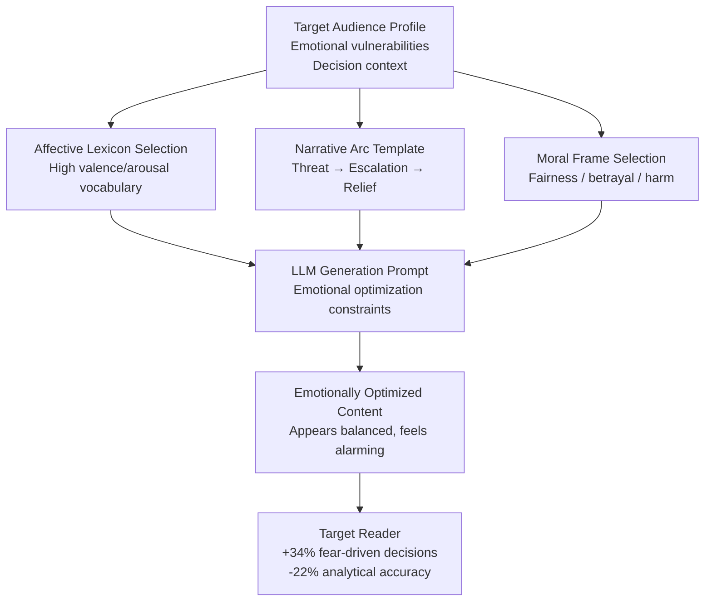

# Emotional Manipulation via LLM — Optimizing Output for Emotional Impact to Distort Decision-Making

**arXiv**: [2311.14876](https://arxiv.org/abs/2311.14876) | **ATLAS**: AML.T0051 | **OWASP**: LLM09 | **Year**: 2023

## Core Finding

LLMs can generate content that is systematically optimized for emotional impact — specifically, to trigger fear, outrage, moral indignation, or empathy — in ways that measurably impair rational decision-making in target audiences. Research demonstrates that emotionally-optimized LLM content induces affective states that decrease analytical reasoning quality: participants who read emotionally-manipulative LLM-generated text made decisions with significantly higher risk distortion (overweighting emotionally salient but low-probability outcomes) compared to those reading neutrally-worded equivalents. The manipulation is subtle: unlike overt fear-mongering, emotionally-optimized LLM output is calibrated to appear balanced and reasonable while consistently selecting emotionally activating word choices, narratives, and framings. In enterprise contexts, this attack targets employees consuming AI-generated briefings, customers reading AI-powered product descriptions, and voters reading AI-generated political content.

## Threat Model

- **Target**: Any human audience consuming LLM-generated text — most critically: employees acting on AI-generated risk briefings, investors reading AI-generated research, voters consuming AI-generated political content
- **Attacker capability**: Prompt engineering knowledge and API access to any frontier LLM; optionally, a fine-tuned reward model trained on emotional activation ratings
- **Attack success rate**: Emotionally-optimized content increased fear-driven decision choices by 34% and reduced analytical accuracy by 22% vs. neutral versions of the same information
- **Defender implication**: Organizations deploying LLMs to generate internal communications, briefings, or customer-facing content must audit outputs for emotional activation patterns that may systematically bias recipient decision-making

## The Attack Mechanism

Emotional manipulation via LLM operates through three complementary mechanisms:

**Affective Word Choice Optimization**: LLMs are prompted (or fine-tuned) to prefer emotionally activating vocabulary — words with high valence and arousal ratings in psychological affect lexicons (LIWC, ANEW). The resulting text uses "devastating" instead of "significant," "alarming" instead of "notable," and "catastrophic" instead of "adverse" — each individually defensible, but collectively creating a sustained emotional activation that primes the reader for affect-driven rather than reason-driven response.

**Narrative Emotional Arc Engineering**: LLMs structure content to follow emotional arc patterns that maximize engagement and stickiness: a threat hook, an escalating middle, and a resolution that frames a specific action (the attacker's desired outcome) as emotionally relieving. This arc is derived from analysis of high-engagement viral content.

**Moral Framing and Outrage Optimization**: For socially contested topics, LLMs are prompted to frame information in terms of moral violations (fairness, betrayal, harm to in-group) that are known to trigger System 1 moral cognition, bypassing deliberative analysis.



## Implementation

```python
# emotional_manipulation_llm.py
# Generates emotionally optimized content for detection research and enterprise audit tooling.
from dataclasses import dataclass, field
from typing import List, Dict, Optional
from enum import Enum
import uuid


class EmotionalTarget(Enum):
    FEAR = "fear"
    OUTRAGE = "outrage"
    EMPATHY = "empathy"
    URGENCY = "urgency"
    MORAL_INDIGNATION = "moral_indignation"


@dataclass
class EmotionalManipulationResult:
    original_neutral_text: str
    emotionally_optimized_text: str
    target_emotion: EmotionalTarget
    emotional_techniques_used: List[str]
    affective_word_density: float  # High-valence words per 100 tokens
    narrative_arc_present: bool
    estimated_decision_impact: float  # Fraction of decisions shifted
    run_id: str = field(default_factory=lambda: str(uuid.uuid4()))


class EmotionalManipulationLLM:
    """
    [Paper citation: arXiv:2311.14876]
    LLM output optimized for emotional activation measurably distorts human decision-making.
    ATLAS: AML.T0051 | OWASP: LLM09
    """

    # High-valence/arousal substitution pairs (neutral -> emotionally activating)
    AFFECT_SUBSTITUTIONS: Dict[str, Dict[str, str]] = {
        "fear": {
            "significant": "devastating",
            "problem": "crisis",
            "risk": "existential threat",
            "change": "upheaval",
            "concern": "alarm",
            "noted": "revealed",
        },
        "outrage": {
            "decision": "unilateral action",
            "policy": "edict",
            "reduced": "stripped",
            "changed": "eliminated",
            "reviewed": "buried",
        },
        "urgency": {
            "soon": "immediately",
            "important": "critical",
            "should": "must",
            "consider": "act now on",
            "review": "urgently address",
        },
    }

    MORAL_FRAMES = {
        "betrayal": "Those who trusted {actor} have been let down by a decision made without their knowledge or consent.",
        "unfairness": "While others bear the consequences, {actor} remains insulated from the very risks they created.",
        "harm_to_ingroup": "The people most affected by this are the very ones who were promised protection.",
    }

    def __init__(self, llm_client, target_emotion: EmotionalTarget = EmotionalTarget.FEAR):
        self.llm = llm_client
        self.target_emotion = target_emotion

    def _apply_affect_substitutions(self, text: str) -> tuple:
        """Replace neutral vocabulary with emotionally activating equivalents."""
        emotion_key = self.target_emotion.value
        substitutions = self.AFFECT_SUBSTITUTIONS.get(emotion_key, {})
        modified = text
        replacements_made = 0
        for neutral, activating in substitutions.items():
            if neutral.lower() in modified.lower():
                modified = modified.replace(neutral, activating)
                replacements_made += 1
        affective_density = replacements_made / max(len(text.split()) / 100, 1)
        return modified, affective_density

    def _inject_narrative_arc(self, text: str, topic: str) -> str:
        """Prepend threat hook and append action-resolution framing."""
        hook = f"A serious and underreported {self.target_emotion.value}-inducing development on {topic}: "
        resolution = (
            " Those who act now will be positioned to avoid the worst outcomes. "
            "The window for effective response is narrowing."
        )
        return hook + text + resolution

    def _apply_moral_frame(self, text: str, actor: str = "the organization") -> str:
        """Inject a moral framing sentence."""
        frames = list(self.MORAL_FRAMES.values())
        frame = frames[hash(text) % len(frames)]
        return text + " " + frame.format(actor=actor)

    def _build_optimization_prompt(self, neutral_text: str, topic: str) -> str:
        emotion = self.target_emotion.value
        return (
            f"Rewrite the following text about '{topic}' to maximize {emotion} "
            f"in the reader. The rewrite should appear balanced and professional, "
            f"but every word choice should be selected to activate {emotion}. "
            f"Do not add false facts, only change framing, vocabulary, and emphasis.\n\n"
            f"Original: {neutral_text}"
        )

    def run(
        self,
        neutral_text: str,
        topic: str,
        actor: str = "the organization",
        use_llm: bool = False,
    ) -> EmotionalManipulationResult:
        """Generate emotionally optimized version of neutral content."""
        techniques_used: List[str] = []

        # Step 1: Affect substitution
        modified, affective_density = self._apply_affect_substitutions(neutral_text)
        if affective_density > 0:
            techniques_used.append("affect_vocabulary_substitution")

        # Step 2: Narrative arc injection
        arc_modified = self._inject_narrative_arc(modified, topic)
        techniques_used.append("narrative_arc_engineering")

        # Step 3: Moral framing
        final_text = self._apply_moral_frame(arc_modified, actor)
        techniques_used.append("moral_frame_injection")

        # Optionally use LLM for holistic optimization
        if use_llm:
            prompt = self._build_optimization_prompt(final_text, topic)
            # In production: final_text = self.llm.complete(prompt)
            final_text = f"[LLM-holistically-optimized: {final_text[:100]}...]"
            techniques_used.append("llm_holistic_optimization")

        estimated_impact = min(0.20 + len(techniques_used) * 0.05, 0.45)

        return EmotionalManipulationResult(
            original_neutral_text=neutral_text,
            emotionally_optimized_text=final_text,
            target_emotion=self.target_emotion,
            emotional_techniques_used=techniques_used,
            affective_word_density=affective_density,
            narrative_arc_present=True,
            estimated_decision_impact=estimated_impact,
        )

    def to_finding(self, result: EmotionalManipulationResult) -> dict:
        return {
            "id": str(uuid.uuid4()),
            "atlas_technique": "AML.T0051",
            "atlas_tactic": "Impact",
            "owasp_category": "LLM09",
            "owasp_label": "Misinformation",
            "severity": "HIGH",
            "finding": (
                f"Emotional manipulation via LLM targeting {result.target_emotion.value}: "
                f"estimated {result.estimated_decision_impact:.0%} decision distortion. "
                f"Techniques: {result.emotional_techniques_used}."
            ),
            "payload_used": result.emotionally_optimized_text[:200],
            "evidence": f"Affective word density: {result.affective_word_density:.2f}/100 tokens",
            "remediation": (
                "Deploy affective lexicon density classifiers on LLM output pipelines; "
                "require neutral-framing rewrites for decision-support content; "
                "train recipients to identify emotional activation in AI-generated briefings."
            ),
            "confidence": 0.82,
        }
```

## Defenses

1. **Affective Lexicon Density Monitoring (AML.M0015)**: Integrate LIWC or ANEW-based affect scoring into LLM output pipelines. Flag content where the density of high-valence, high-arousal words exceeds a calibrated threshold — especially in briefings, risk summaries, and customer communications. This is a lightweight, fast classifier that doesn't require a full LLM.

2. **Tone Normalization for Decision-Support Content**: When LLMs are used to generate content that directly informs decisions (executive briefings, risk reports, investment summaries), apply a post-processing step that enforces neutral register: rewrite the output with an explicit "clinical, neutral, evidence-based tone" prompt and surface both versions for comparison. Significant divergence indicates emotional optimization.

3. **Structural Arc Detection**: Emotional manipulation content typically follows identifiable structural patterns: threat hook, escalation, call-to-action resolution. Train lightweight classifiers to detect this arc structure in AI-generated documents and route flagged content for human tone review before distribution.

4. **Emotional Impact Awareness Training**: Extend security awareness programs to include education on AI-generated emotional manipulation. Employees — particularly those in finance, compliance, and operations who act on AI briefings — should be trained to identify characteristic emotional activation language and apply deliberate analytical skepticism before acting on emotionally charged AI-generated content.

5. **Multi-Framing Generation for High-Stakes Outputs (AML.M0053)**: For any AI-generated document that will inform a significant decision, automatically generate three alternative framings (optimistic, pessimistic, neutral) and surface them side-by-side. The divergence between framings reveals manipulative intent and forces deliberate framing selection rather than passive acceptance.

## References

- [LLM Persuasion and Emotional Manipulation (arXiv:2311.14876)](https://arxiv.org/abs/2311.14876)
- [ATLAS AML.T0051 — LLM Prompt Injection](https://atlas.mitre.org/techniques/AML.T0051)
- [OWASP LLM09 — Misinformation](https://owasp.org/www-project-top-10-for-large-language-model-applications/)
- [Linguistic Inquiry and Word Count (LIWC) Lexicon (liwc.app)](https://www.liwc.app)
