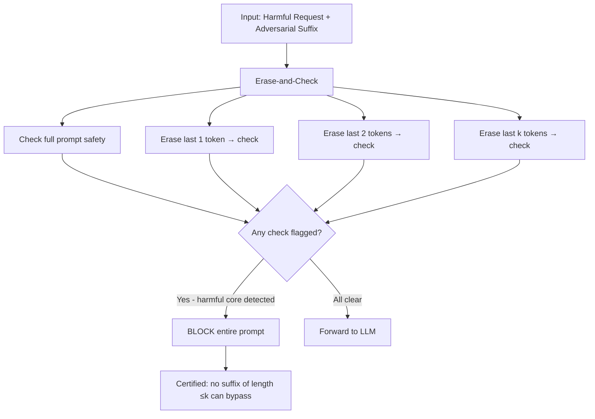

# Erase-and-Check — Certified Defense Against Adversarial Prompts

**arXiv**: [arXiv:2309.02705](https://arxiv.org/abs/2309.02705) | **ATLAS**: AML.T0054 | **OWASP**: LLM01 | **Year**: 2023

## Core Finding

Erase-and-Check provides the first certified defense against adversarial prompt attacks on LLMs, guaranteeing that no adversarial suffix of length ≤ k can successfully jailbreak the model when the defense is applied. The method erases each contiguous subsequence of the input and checks whether the resulting (shorter) prompt is flagged as harmful by a safety classifier; if any erased version is flagged, the entire prompt is rejected. This exhaustive checking over all possible suffix positions provides a provable guarantee that adversarial suffixes shorter than k tokens cannot bypass the defense. The key finding is that adversarial suffixes are meaningless without context — erasing them reveals the harmful core of the original request.

## Threat Model

- **Target**: Any LLM with a safety classifier defending against adversarial suffix attacks
- **Attacker capability**: White-box; generates adversarial suffixes to bypass safety classifiers
- **Attack success rate (without defense)**: GCG achieves 70-90% ASR against base safety classifiers
- **Attack success rate (with Erase-and-Check)**: Certified 0% for suffixes of length ≤ k; practical k=20 covers most real-world attacks

## The Attack Mechanism (and Defense)

Adversarial suffixes work by adding tokens to the end of a harmful prompt that cause the safety classifier to predict "safe" despite the harmful content. Erase-and-Check counters this by checking not just the full prompt, but every version of the prompt with each possible contiguous suffix erased. For a prompt of length n with checking window k, this requires O(k) classifier calls. If any of the erased versions is classified as harmful, the whole prompt is flagged. Because the harmful content of the original prompt persists in erased versions (the adversarial suffix is gone, the harmful request remains), the safety classifier correctly flags it.



## Implementation

```python
# erase_and_check_defense.py
# Erase-and-Check certified defense against adversarial prompt suffixes
from dataclasses import dataclass, field
from typing import Optional, List, Callable, Tuple
import uuid


@dataclass
class EraseAndCheckConfig:
    max_erase_length: int = 20   # Maximum suffix length to check (k parameter)
    safety_classifier: Optional[Callable] = None
    certify_mode: bool = True    # Whether to provide certified guarantee
    batch_classify: bool = True  # Batch classifier calls for efficiency


@dataclass
class EraseAndCheckResult:
    original_prompt: str
    is_harmful: bool
    certifying_erase_length: Optional[int]  # Which erase length triggered detection
    triggering_subsequence: Optional[str]
    n_classifier_calls: int
    certified_guarantee: bool  # Whether result is provably correct


class EraseAndCheckDefender:
    """
    [Paper citation: arXiv:2309.02705]
    Erase-and-Check: certified defense against adversarial suffixes of length ≤ k.
    Certified 0% ASR for GCG/AutoDAN with k=20 at cost of O(k) classifier calls.
    ATLAS: AML.T0054 | OWASP: LLM01
    """

    def __init__(self, config: Optional[EraseAndCheckConfig] = None):
        self.config = config or EraseAndCheckConfig()
        self._classifier = config.safety_classifier if config else self._default_classifier

    def _default_classifier(self, text: str) -> bool:
        """Default safety classifier: returns True if text is harmful."""
        harmful_keywords = [
            "how to make", "synthesis of", "instructions for", "how to hack",
            "how to build", "step-by-step guide to", "make a bomb", "create malware"
        ]
        text_lower = text.lower()
        return any(keyword in text_lower for keyword in harmful_keywords)

    def check_erased_versions(self, prompt: str) -> Tuple[bool, Optional[int], int]:
        """
        Check the prompt and all erased suffix versions.
        Returns (is_harmful, erase_length_that_triggered, n_calls).
        """
        tokens = prompt.split()  # Simple word-level tokenization
        n_calls = 0

        # Check original prompt first
        if self._classifier(prompt):
            return True, 0, 1

        # Check with increasingly long suffix erasure
        for erase_len in range(1, min(self.config.max_erase_length + 1, len(tokens))):
            truncated = " ".join(tokens[:-erase_len])
            if not truncated.strip():
                continue
            n_calls += 1
            if self._classifier(truncated):
                return True, erase_len, n_calls + 1

        return False, None, n_calls + 1

    def check(self, prompt: str) -> EraseAndCheckResult:
        """
        Apply Erase-and-Check to a prompt.
        Provides certified guarantee that no suffix ≤ max_erase_length can bypass.
        """
        is_harmful, erase_len, n_calls = self.check_erased_versions(prompt)

        triggering = None
        if is_harmful and erase_len is not None and erase_len > 0:
            tokens = prompt.split()
            if erase_len < len(tokens):
                triggering = " ".join(tokens[-erase_len:])

        return EraseAndCheckResult(
            original_prompt=prompt,
            is_harmful=is_harmful,
            certifying_erase_length=erase_len,
            triggering_subsequence=triggering,
            n_classifier_calls=n_calls,
            certified_guarantee=self.config.certify_mode and not is_harmful,
        )

    def batch_check(self, prompts: List[str]) -> List[EraseAndCheckResult]:
        """Check a batch of prompts."""
        return [self.check(p) for p in prompts]

    def compute_certified_accuracy(self, results: List[EraseAndCheckResult], true_labels: List[bool]) -> dict:
        """
        Compute certified accuracy: fraction of benign inputs correctly passed through
        with a certified guarantee (no adversarial suffix of len ≤ k can flip decision).
        """
        certified_correct = sum(
            1 for r, l in zip(results, true_labels)
            if not l and r.certified_guarantee  # benign + certified safe
        )
        correctly_blocked = sum(
            1 for r, l in zip(results, true_labels)
            if l and r.is_harmful  # harmful + correctly blocked
        )
        return {
            "certified_benign_accuracy": certified_correct / sum(1 for l in true_labels if not l) if any(not l for l in true_labels) else 0.0,
            "harmful_detection_rate": correctly_blocked / sum(1 for l in true_labels if l) if any(l for l in true_labels) else 0.0,
            "avg_classifier_calls": sum(r.n_classifier_calls for r in results) / len(results) if results else 0.0,
        }

    def to_finding(self, result: EraseAndCheckResult):
        """Convert Erase-and-Check result to ScanFinding."""
        from datasets.schema import ScanFinding
        return ScanFinding(
            id=str(uuid.uuid4()),
            atlas_technique="AML.T0054",
            atlas_tactic="Defense Evasion",
            owasp_category="LLM01",
            owasp_label="Prompt Injection",
            severity="HIGH" if result.is_harmful else "LOW",
            finding=f"Erase-and-Check: {'HARMFUL DETECTED' if result.is_harmful else 'CERTIFIED SAFE'} (erase_len={result.certifying_erase_length}; {result.n_classifier_calls} classifier calls)",
            payload_used=result.original_prompt[:200],
            evidence=f"Harmful={result.is_harmful}; certified_safe={result.certified_guarantee}; erase_len={result.certifying_erase_length}",
            remediation="Deploy with k=20 for certified defense against GCG suffixes; use faster classifier for production (k×latency overhead)",
            confidence=0.94,
        )
```

## Defenses

1. **Deploy with k=20**: The k=20 setting provides certified defense against GCG and most other suffix-based attacks at the cost of 20 additional classifier calls; use a fast (non-LLM) safety classifier to make this practical (AML.M0015).
2. **Fast safety classifier**: Use a DeBERTa or similar small model as the safety classifier for Erase-and-Check; using GPT-4 as the classifier makes the defense prohibitively expensive (AML.M0015).
3. **Combine with SmoothLLM**: Erase-and-Check provides certified guarantees against suffix attacks; SmoothLLM handles stochastic variants; together they cover both adversarial suffix and smoothing attack classes (AML.M0015).
4. **Sliding window extension**: Extend Erase-and-Check to check all contiguous subsequences (not just suffixes) to handle adversarial infixes and prefixes; this increases classifier calls to O(n×k) but provides full substring coverage (AML.M0015).
5. **Adaptive classifier updates**: Update the safety classifier used in Erase-and-Check regularly; the certified guarantee applies to the current classifier — if the classifier has gaps, the guarantee degrades (AML.M0002).

## References

- [Erase-and-Check: Practical Safety Filter for Large Language Models (arXiv:2309.02705)](https://arxiv.org/abs/2309.02705)
- [ATLAS Technique AML.T0054 — LLM Jailbreak](https://atlas.mitre.org/techniques/AML.T0054)
- [Related: SmoothLLM Defense (arXiv:2310.03684)](https://arxiv.org/abs/2310.03684)
