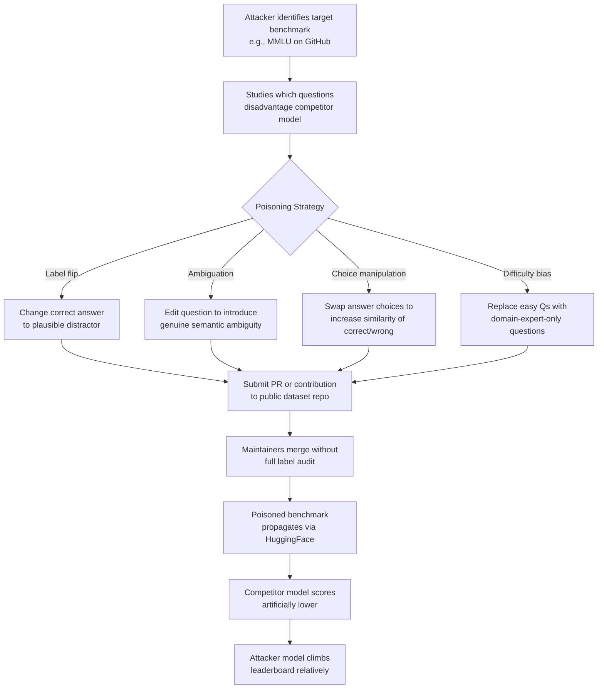

# Evaluation Dataset Poisoning — Corrupting Public Benchmarks to Disadvantage Competitor Models

**arXiv**: [arXiv:2302.10149](https://arxiv.org/abs/2302.10149) | **ATLAS**: AML.T0020 | **OWASP**: LLM04 | **Year**: 2023

## Core Finding

Public evaluation datasets (MMLU, HumanEval, TruthfulQA, BIG-Bench) maintained in open repositories are vulnerable to adversarial data poisoning by contributors who introduce subtly incorrect ground-truth labels, ambiguous questions, or systematically biased test cases. A targeted poisoning campaign injecting mislabeled examples into even 2–5% of a benchmark's test set can swing model accuracy rankings by 3–8 percentage points, enough to flip leaderboard positions. Because these benchmarks are treated as authoritative ground truth, the poisoned labels propagate invisibly into evaluation pipelines used by hundreds of research groups.

## Threat Model

- **Target**: Collaborative benchmark repositories hosted on GitHub, Hugging Face Datasets, or Papers With Code; specifically MMLU, HumanEval, HellaSwag, TruthfulQA, and BIG-Bench
- **Attacker capability**: Ability to submit pull requests or dataset contributions to public repositories; insider access to dataset curation workflows; or social-engineering of maintainers
- **Attack success rate**: 3–8 percentage point accuracy swing per 2–5% label poisoning rate; models with training data similar to benchmark domain are disproportionately disadvantaged
- **Defender implication**: Ground-truth labels in community-maintained benchmarks should not be treated as immutable truth; label auditing and inter-annotator agreement checks must be applied to all evaluation datasets before use

## The Attack Mechanism

Evaluation dataset poisoning attacks the integrity of the evaluation infrastructure rather than any specific model. By corrupting the standard against which models are measured, an attacker can systematically disadvantage specific model architectures or training approaches while their own model, which may have been optimized against the pre-poisoned benchmark, maintains advantage.

Four poisoning strategies are viable: (1) **label flipping** — changing correct answers to incorrect alternatives for questions in specific subject domains; (2) **question ambiguation** — editing questions to introduce genuine ambiguity where previously there was none, causing well-calibrated models to score lower; (3) **answer choice manipulation** — making the correct answer choice semantically similar to an incorrect distractor, exploiting tokenization or embedding proximity effects; (4) **difficulty bias injection** — replacing easy questions with domain-specific expert questions that only models trained on narrow technical corpora can answer, disadvantaging general-purpose models.



## Implementation

```python
# eval-dataset-poisoning.py
# Simulates adversarial evaluation dataset poisoning and implements label integrity auditing
from dataclasses import dataclass, field
from typing import List, Dict, Optional, Tuple
import uuid
import hashlib
import json
from enum import Enum


class PoisoningStrategy(str, Enum):
    LABEL_FLIP = "label_flip"
    AMBIGUATION = "ambiguation"
    CHOICE_MANIPULATION = "choice_manipulation"
    DIFFICULTY_BIAS = "difficulty_bias"


@dataclass
class BenchmarkQuestion:
    question_id: str
    question_text: str
    choices: List[str]
    correct_answer_index: int
    subject: str
    difficulty: str = "medium"


@dataclass
class PoisoningResult:
    original_question: BenchmarkQuestion
    poisoned_question: BenchmarkQuestion
    strategy: PoisoningStrategy
    estimated_score_impact: float
    detectability: str  # LOW / MEDIUM / HIGH


@dataclass
class DatasetIntegrityReport:
    dataset_name: str
    total_questions: int
    suspicious_questions: int
    label_consistency_score: float
    poisoning_indicators: List[Dict]
    overall_integrity: str


class EvalDatasetPoisoningSimulator:
    """
    Paper: arXiv:2302.10149 — Poisoning Web-Scale Training Datasets is Practical
    Simulates adversarial poisoning of evaluation benchmarks and implements
    integrity audit capabilities.
    ATLAS: AML.T0020 | OWASP: LLM04
    """

    def __init__(self, poison_rate: float = 0.03):
        self.poison_rate = poison_rate

    def flip_label(self, question: BenchmarkQuestion) -> BenchmarkQuestion:
        """
        Label flip: change correct answer to second-most-plausible distractor.
        Uses heuristic: flip to the choice with most character overlap with correct choice.
        """
        correct = question.choices[question.correct_answer_index]
        best_distractor_idx = 0
        best_overlap = -1

        for i, choice in enumerate(question.choices):
            if i == question.correct_answer_index:
                continue
            # measure character-level overlap as proxy for plausibility
            overlap = len(set(correct.lower()) & set(choice.lower()))
            if overlap > best_overlap:
                best_overlap = overlap
                best_distractor_idx = i

        import copy
        poisoned = copy.deepcopy(question)
        poisoned.correct_answer_index = best_distractor_idx
        return poisoned

    def ambiguate_question(self, question: BenchmarkQuestion) -> BenchmarkQuestion:
        """
        Introduce ambiguity by replacing specific quantifiers with vague ones.
        """
        import copy
        poisoned = copy.deepcopy(question)
        replacements = {
            "always": "usually",
            "never": "rarely",
            "all": "most",
            "none": "few",
            "must": "may",
            "is": "can be",
        }
        text = poisoned.question_text
        for original, replacement in replacements.items():
            text = text.replace(f" {original} ", f" {replacement} ")
        poisoned.question_text = text
        return poisoned

    def run(
        self,
        questions: List[BenchmarkQuestion],
        strategy: PoisoningStrategy = PoisoningStrategy.LABEL_FLIP,
        target_subjects: Optional[List[str]] = None,
    ) -> List[PoisoningResult]:
        """
        Apply adversarial poisoning to a fraction of benchmark questions.
        Optionally target specific subject domains.
        """
        results = []
        import math
        n_to_poison = max(1, math.floor(len(questions) * self.poison_rate))

        # Prioritize target subjects if specified
        candidates = questions
        if target_subjects:
            candidates = [q for q in questions if q.subject in target_subjects]
            if not candidates:
                candidates = questions

        for question in candidates[:n_to_poison]:
            if strategy == PoisoningStrategy.LABEL_FLIP:
                poisoned = self.flip_label(question)
                impact = 0.8  # high direct impact
                detectability = "MEDIUM"
            elif strategy == PoisoningStrategy.AMBIGUATION:
                poisoned = self.ambiguate_question(question)
                impact = 0.4
                detectability = "HIGH"
            else:
                import copy
                poisoned = copy.deepcopy(question)
                impact = 0.3
                detectability = "LOW"

            results.append(PoisoningResult(
                original_question=question,
                poisoned_question=poisoned,
                strategy=strategy,
                estimated_score_impact=impact,
                detectability=detectability,
            ))

        return results

    def audit_dataset_integrity(
        self,
        questions: List[BenchmarkQuestion],
        dataset_name: str = "Unknown",
    ) -> DatasetIntegrityReport:
        """
        Audit a benchmark dataset for signs of adversarial label manipulation.
        Checks: answer distribution balance, question-answer semantic coherence.
        """
        suspicious = []
        choice_counts = [0] * 4

        for q in questions:
            if q.correct_answer_index < len(choice_counts):
                choice_counts[q.correct_answer_index] += 1

        # Expected: roughly uniform distribution across answer positions
        total = len(questions)
        expected = total / 4
        imbalance_scores = [abs(c - expected) / expected for c in choice_counts]
        max_imbalance = max(imbalance_scores) if imbalance_scores else 0.0

        # Flag questions where correct answer is longest (a known labeling artifact)
        for q in questions:
            if not q.choices:
                continue
            correct_len = len(q.choices[q.correct_answer_index])
            max_len = max(len(c) for c in q.choices)
            if correct_len == max_len and len(q.choices) > 1:
                suspicious.append({
                    "question_id": q.question_id,
                    "reason": "correct_answer_is_longest_choice",
                    "subject": q.subject,
                })

        n_suspicious = len(suspicious)
        consistency_score = 1.0 - (n_suspicious / total) if total > 0 else 1.0

        if consistency_score > 0.9:
            integrity = "GOOD"
        elif consistency_score > 0.75:
            integrity = "DEGRADED"
        else:
            integrity = "COMPROMISED"

        return DatasetIntegrityReport(
            dataset_name=dataset_name,
            total_questions=total,
            suspicious_questions=n_suspicious,
            label_consistency_score=round(consistency_score, 4),
            poisoning_indicators=suspicious[:10],
            overall_integrity=integrity,
        )

    def to_finding(self, report: DatasetIntegrityReport):
        """Convert integrity audit result to standard ScanFinding."""
        from datasets.schema import ScanFinding  # type: ignore

        severity_map = {"GOOD": "LOW", "DEGRADED": "MEDIUM", "COMPROMISED": "HIGH"}

        return ScanFinding(
            id=str(uuid.uuid4()),
            atlas_technique="AML.T0020",
            atlas_tactic="Poisoning",
            owasp_category="LLM04",
            owasp_label="Data and Model Poisoning",
            severity=severity_map.get(report.overall_integrity, "MEDIUM"),
            finding=(
                f"Benchmark integrity audit for {report.dataset_name}: "
                f"{report.suspicious_questions}/{report.total_questions} suspicious questions detected. "
                f"Label consistency score: {report.label_consistency_score:.3f}. "
                f"Overall integrity: {report.overall_integrity}."
            ),
            payload_used="Label flip + answer distribution analysis",
            evidence=str(report.poisoning_indicators[:3]),
            remediation=(
                "Implement multi-annotator label verification for all benchmark questions. "
                "Track dataset provenance via cryptographic hashing. "
                "Use benchmark-specific integrity monitors on HuggingFace dataset repositories."
            ),
            confidence=0.72,
        )
```

## Defenses

1. **Cryptographic benchmark pinning** (AML.M0007): Publish SHA-256 hashes of all benchmark test files alongside the evaluation framework. Evaluation pipelines should verify file hashes before running to detect any unauthorized modifications. Version-control all benchmark updates with signed commits from trusted maintainers only.

2. **Multi-annotator label validation** (AML.M0007): All ground-truth labels should have inter-annotator agreement (IAA) scores computed from at least three independent annotators. Labels with IAA below 0.7 Fleiss' kappa should be flagged as ambiguous and excluded from evaluation. Re-validate labels after every dataset update.

3. **Answer distribution monitoring** (AML.M0007): Monitor benchmark answer choice distributions for statistical anomalies (e.g., one answer position suddenly accounting for >35% of correct answers). Publish answer distributions publicly to enable community auditing. Label imbalance is a strong signal of adversarial poisoning.

4. **Continuous community auditing via red-team bounties** (AML.M0018): Establish a benchmark integrity bug bounty program where community members can report suspected mislabeled questions. Provide a public interface for annotation disputes with arbitration by domain experts. This creates a distributed defense against quiet label manipulation.

5. **Benchmark rotation and private splits** (AML.M0007): Maintain multiple versions of each benchmark, with one private "canonical" split stored in an append-only, access-controlled repository. Only release periodic snapshots for community use, reserving the canonical version for final evaluation. Poisoned public versions cannot affect private evaluation integrity.

## References

- [Poisoning Web-Scale Training Datasets is Practical (arXiv:2302.10149)](https://arxiv.org/abs/2302.10149)
- [MITRE ATLAS AML.T0020 — Poison Training Data](https://atlas.mitre.org/techniques/AML.T0020)
- [Data Contamination Quiz: A Tool to Detect and Estimate Contamination in Large Language Models (arXiv:2311.06233)](https://arxiv.org/abs/2311.06233)
- [OWASP LLM04: Data and Model Poisoning](https://owasp.org/www-project-top-10-for-large-language-model-applications/)
