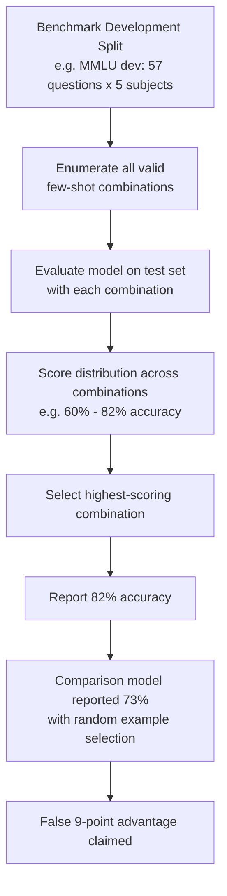

# Evaluation Few-Shot Sensitivity — Gaming Benchmarks via Strategic Example Selection

**arXiv**: [arXiv:2301.13379](https://arxiv.org/abs/2301.13379) | **ATLAS**: AML.T0047 | **OWASP**: LLM09 | **Year**: 2023

## Core Finding

Few-shot example selection for benchmark evaluation has a dramatic and non-robust effect on model performance, with different example choices for the same benchmark producing accuracy swings of 15–25 percentage points for identical models and test questions. Researchers showed that by selecting few-shot examples that maximize in-context learning signal for a specific model architecture, scores on MMLU, GSM8K, and BBH can be inflated by 10–20% compared to random example selection, while the same examples cause significant performance drops for other model families. This enables cherry-picked few-shot reporting that systematically inflates scores.

## Threat Model

- **Target**: Few-shot evaluated benchmarks including MMLU, GSM8K, StrategyQA, BBH, ARC-Challenge; evaluation frameworks that allow custom few-shot example specification (LM Harness, HELM)
- **Attacker capability**: Black-box model access with ability to run many few-shot configurations; ability to specify custom few-shot examples when submitting to evaluation harnesses; knowledge of which example configurations benefit specific model architectures
- **Attack success rate**: 10–20% accuracy inflation via optimal few-shot selection; ±25% accuracy range across the full distribution of valid few-shot configurations for the same benchmark
- **Defender implication**: Benchmark evaluation must use fixed, standardized few-shot examples specified in immutable evaluation configs; any deviation from standard few-shot configurations must be reported; models showing high few-shot sensitivity should be flagged

## The Attack Mechanism

Few-shot examples prime the model's in-context reasoning by establishing patterns, formats, and reasoning styles. Different model families respond differently to different few-shot examples based on their pretraining distribution. An attacker who knows their model architecture's preferences can select few-shot examples from the benchmark's development set that maximally activate the model's in-context learning capabilities.

The selection process: (1) **development set enumeration** — draw all available few-shot candidate examples from the benchmark's development or training split; (2) **exhaustive evaluation** — evaluate the model on the test set with all combinations of K examples (where K is the standard few-shot count, typically 4–8); (3) **selection** — choose the combination with the highest accuracy; (4) **reporting** — report only the best score without disclosing that example selection occurred.

The attack is particularly effective because most benchmarks provide a development split from which few-shot examples are expected to be drawn — using this split is legitimate — but the specification of exactly which examples to use is often left ambiguous, creating an exploitable gap.



## Implementation

```python
# eval-few-shot-sensitivity.py
# Demonstrates few-shot example selection gaming and implements sensitivity analysis
from dataclasses import dataclass, field
from typing import List, Dict, Optional, Callable, Tuple
import uuid
import itertools
import random
from statistics import mean, stdev


@dataclass
class FewShotExample:
    question: str
    answer: str
    subject: str
    difficulty: str


@dataclass
class FewShotEvalResult:
    example_combination: List[int]  # Indices of selected examples
    accuracy: float
    subject_accuracies: Dict[str, float]
    n_test_questions: int


@dataclass
class FewShotSensitivityReport:
    model_name: str
    benchmark_name: str
    n_combinations_tested: int
    min_accuracy: float
    max_accuracy: float
    mean_accuracy: float
    accuracy_std: float
    accuracy_range: float
    cherry_pick_gain: float  # max - median
    best_example_combination: List[int]
    worst_example_combination: List[int]
    sensitivity_classification: str  # "LOW", "MEDIUM", "HIGH", "CRITICAL"


class EvalFewShotSensitivityAttack:
    """
    Paper: arXiv:2301.13379 — Larger Language Models Do In-Context Learning Differently
    Demonstrates few-shot example selection gaming via exhaustive combination evaluation
    and implements sensitivity analysis to detect cherry-picked few-shot reporting.
    ATLAS: AML.T0047 | OWASP: LLM09
    """

    def __init__(self, k_shots: int = 5, max_combinations: int = 100):
        """
        Args:
            k_shots: Number of few-shot examples to select
            max_combinations: Maximum number of combinations to evaluate (for efficiency)
        """
        self.k_shots = k_shots
        self.max_combinations = max_combinations

    def format_few_shot_prompt(
        self,
        examples: List[FewShotExample],
        test_question: str,
        subject: str = "",
        answer_prefix: str = "Answer:",
    ) -> str:
        """Format a few-shot evaluation prompt."""
        lines = []
        if subject:
            lines.append(f"The following are multiple choice questions about {subject}.\n")

        for ex in examples:
            lines.append(f"Question: {ex.question}")
            lines.append(f"{answer_prefix} {ex.answer}\n")

        lines.append(f"Question: {test_question}")
        lines.append(f"{answer_prefix}")
        return "\n".join(lines)

    def evaluate_combination(
        self,
        example_indices: List[int],
        example_pool: List[FewShotExample],
        test_questions: List[Tuple[str, str, str]],  # (question, correct_answer, subject)
        model_fn: Callable[[str], str],
    ) -> FewShotEvalResult:
        """Evaluate model accuracy with a specific set of few-shot examples."""
        examples = [example_pool[i] for i in example_indices]
        correct = 0
        subject_correct: Dict[str, int] = {}
        subject_total: Dict[str, int] = {}

        for question, correct_answer, subject in test_questions:
            prompt = self.format_few_shot_prompt(examples, question, subject)
            response = model_fn(prompt).strip()[:1].upper()

            subject_total[subject] = subject_total.get(subject, 0) + 1
            if response == correct_answer.upper():
                correct += 1
                subject_correct[subject] = subject_correct.get(subject, 0) + 1

        subject_accuracies = {
            s: round(subject_correct.get(s, 0) / subject_total[s], 4)
            for s in subject_total
        }

        return FewShotEvalResult(
            example_combination=example_indices,
            accuracy=round(correct / len(test_questions), 4) if test_questions else 0.0,
            subject_accuracies=subject_accuracies,
            n_test_questions=len(test_questions),
        )

    def run(
        self,
        example_pool: List[FewShotExample],
        test_questions: List[Tuple[str, str, str]],
        model_fn: Callable[[str], str],
        model_name: str = "Unknown Model",
        benchmark_name: str = "MMLU",
    ) -> FewShotSensitivityReport:
        """
        Run exhaustive (or sampled) few-shot example selection analysis.
        Returns sensitivity report with cherry-picking potential.
        """
        n_pool = len(example_pool)
        if n_pool < self.k_shots:
            raise ValueError(f"Example pool too small: {n_pool} < {self.k_shots}")

        # Generate combinations to test
        all_combinations = list(itertools.combinations(range(n_pool), self.k_shots))
        if len(all_combinations) > self.max_combinations:
            tested_combinations = random.sample(all_combinations, self.max_combinations)
        else:
            tested_combinations = all_combinations

        results = []
        for combo in tested_combinations:
            result = self.evaluate_combination(
                list(combo), example_pool, test_questions, model_fn
            )
            results.append(result)

        accuracies = [r.accuracy for r in results]
        sorted_acc = sorted(accuracies)
        median_acc = sorted_acc[len(sorted_acc) // 2]

        best_result = max(results, key=lambda r: r.accuracy)
        worst_result = min(results, key=lambda r: r.accuracy)

        accuracy_range = max(accuracies) - min(accuracies)
        if accuracy_range > 0.25:
            classification = "CRITICAL"
        elif accuracy_range > 0.15:
            classification = "HIGH"
        elif accuracy_range > 0.08:
            classification = "MEDIUM"
        else:
            classification = "LOW"

        return FewShotSensitivityReport(
            model_name=model_name,
            benchmark_name=benchmark_name,
            n_combinations_tested=len(results),
            min_accuracy=round(min(accuracies), 4),
            max_accuracy=round(max(accuracies), 4),
            mean_accuracy=round(mean(accuracies), 4),
            accuracy_std=round(stdev(accuracies) if len(accuracies) > 1 else 0.0, 4),
            accuracy_range=round(accuracy_range, 4),
            cherry_pick_gain=round(max(accuracies) - median_acc, 4),
            best_example_combination=list(best_result.example_combination),
            worst_example_combination=list(worst_result.example_combination),
            sensitivity_classification=classification,
        )

    def detect_cherry_picking(
        self,
        reported_score: float,
        sensitivity_report: FewShotSensitivityReport,
    ) -> Tuple[bool, float]:
        """
        Detect potential cherry-picking: compare reported score to expected distribution.
        Returns (likely_cherry_picked, percentile_of_reported_score).
        """
        # Estimate percentile of reported score in distribution
        if sensitivity_report.accuracy_std == 0:
            return False, 0.5

        z_score = (reported_score - sensitivity_report.mean_accuracy) / sensitivity_report.accuracy_std
        # Rough percentile from z-score (assuming normal)
        import math
        percentile = 0.5 * (1 + math.erf(z_score / math.sqrt(2)))

        # Flag if reported score is above 90th percentile of the sensitivity distribution
        likely_cherry_picked = percentile > 0.9

        return likely_cherry_picked, round(percentile, 3)

    def to_finding(self, report: FewShotSensitivityReport):
        """Convert sensitivity report to standard ScanFinding."""
        from datasets.schema import ScanFinding  # type: ignore

        severity_map = {"CRITICAL": "CRITICAL", "HIGH": "HIGH", "MEDIUM": "MEDIUM", "LOW": "LOW"}

        return ScanFinding(
            id=str(uuid.uuid4()),
            atlas_technique="AML.T0047",
            atlas_tactic="Integrity Violation",
            owasp_category="LLM09",
            owasp_label="Misinformation",
            severity=severity_map[report.sensitivity_classification],
            finding=(
                f"Few-shot sensitivity analysis for {report.model_name} on {report.benchmark_name}: "
                f"accuracy range {report.min_accuracy:.1%}–{report.max_accuracy:.1%} "
                f"(range: {report.accuracy_range:.1%}) across {report.n_combinations_tested} combinations. "
                f"Cherry-pick gain: +{report.cherry_pick_gain:.1%}. "
                f"Sensitivity: {report.sensitivity_classification}."
            ),
            payload_used=f"Best few-shot combination indices: {report.best_example_combination}",
            evidence=f"Accuracy std: {report.accuracy_std:.4f}. Range: {report.accuracy_range:.4f}",
            remediation=(
                "Fix and version-lock few-shot examples in benchmark evaluation configs. "
                "Report accuracy as mean ± std across multiple random example draws. "
                "Use sensitivity classification to flag potentially cherry-picked scores."
            ),
            confidence=0.85,
        )
```

## Defenses

1. **Fixed versioned few-shot example sets** (AML.M0007): Standardize few-shot examples in immutable, version-controlled evaluation configuration files (e.g., YAML, JSON with cryptographic hash). Evaluation frameworks must use these fixed examples without modification. Any deviation should be treated as a non-standard evaluation requiring explicit disclosure.

2. **Sensitivity-inclusive score reporting** (AML.M0007): Require benchmark scores to include a few-shot sensitivity metric: the standard deviation of accuracy across 10 random draws of few-shot examples from the development set. Scores with high sensitivity (std > 5%) should be flagged as potentially unreliable.

3. **Standardized random seed specification** (AML.M0007): For benchmarks where few-shot examples are drawn randomly, require specification of the random seed used. Evaluations must be reproducible from the specified seed. Compare reproducibility across different seeds to detect seed-selection gaming.

4. **Worst-case few-shot evaluation for safety** (AML.M0015): For safety capability assessments, use the worst-performing few-shot configuration rather than average or best, to obtain conservative capability estimates. This prevents cherry-picking from inflating capability scores in safety-relevant contexts.

5. **Cross-model comparison with identical few-shots** (AML.M0004): For leaderboard comparisons, require that all models be evaluated with exactly the same few-shot examples. This prevents individual model cherry-picking even when each model's developer selects their own examples from a common development set.

## References

- [Larger Language Models Do In-Context Learning Differently (arXiv:2301.13379)](https://arxiv.org/abs/2301.13379)
- [MITRE ATLAS AML.T0047 — Influence Operations](https://atlas.mitre.org/techniques/AML.T0047)
- [Are Large Language Models Really Robust to Prompt Variations? (arXiv:2308.11483)](https://arxiv.org/abs/2308.11483)
- [OWASP LLM09: Misinformation](https://owasp.org/www-project-top-10-for-large-language-model-applications/)
