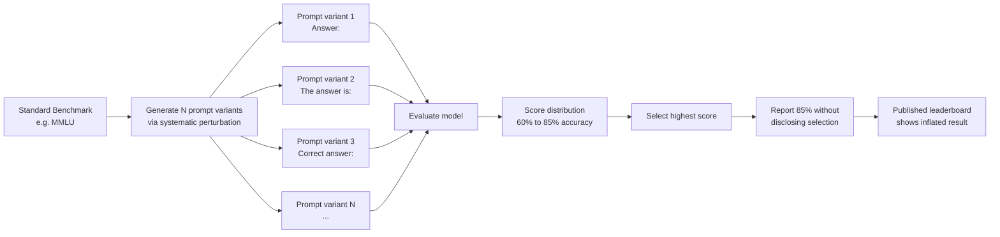

# Evaluation Prompt Sensitivity Attack — Tiny Wording Changes Causing Massive Benchmark Score Swings

**arXiv**: [arXiv:2308.11483](https://arxiv.org/abs/2308.11483) | **ATLAS**: AML.T0047 | **OWASP**: LLM09 | **Year**: 2023

## Core Finding

LLM benchmark performance is highly sensitive to minor prompt wording variations, with accuracy differences of 10–40 percentage points observed from superficially equivalent reformulations of evaluation prompts. Researchers systematically showed that changing a multiple-choice prompt from "Answer:" to "The answer is:" or shuffling answer choice order caused accuracy swings exceeding 20% on MMLU and BIG-Bench. This sensitivity enables a form of benchmark gaming where model developers or evaluators select the specific prompt formulation that maximizes performance for their model, while published scores lack specification of exact prompts used, making results non-reproducible and non-comparable.

## Threat Model

- **Target**: Multiple-choice benchmarks (MMLU, ARC, HellaSwag, TruthfulQA), open-ended generation benchmarks with templated prompts, evaluation frameworks without strict prompt versioning
- **Attacker capability**: Black-box model access with ability to run many evaluation configurations; knowledge that prompt sensitivity exists and systematic search over prompt variants
- **Attack success rate**: 10–40% accuracy swing documented from single-word prompt changes; selecting best-of-20 prompt variants achieves +15% average accuracy gain vs. worst-of-20 on MMLU
- **Defender implication**: Benchmark evaluations must specify exact prompts, few-shot examples, and formatting instructions in machine-readable format; evaluators must require reproduction from fixed, versioned prompt templates

## The Attack Mechanism

LLMs learn from their pretraining data that certain phrasings have particular meanings and elicit certain response styles. This creates sensitivity to evaluation prompt surface form: a model may associate "Answer:" with a short factual completion but "The answer is:" with a more elaborate justification. In multiple-choice settings, choice ordering also matters — some models have systematic biases toward choices presented in certain positions (first, last) that interact with prompt formatting.

The gaming strategy proceeds as: (1) **prompt candidate generation** — enumerate variants of the evaluation prompt (different instruction phrasings, answer format specifications, few-shot orderings, capitalization); (2) **exhaustive evaluation** — run the model on all variants and record accuracy; (3) **cherry-picking** — report only the highest-scoring variant without disclosing that selection occurred. Because evaluation harnesses rarely version-lock prompts, this cherry-picking is invisible to readers of published results.



## Implementation

```python
# eval-prompt-sensitivity-attack.py
# Demonstrates prompt sensitivity attacks via exhaustive prompt variant evaluation
from dataclasses import dataclass, field
from typing import List, Dict, Optional, Callable, Tuple
import uuid
import itertools
from statistics import mean, stdev


@dataclass
class PromptVariant:
    variant_id: str
    instruction_text: str
    answer_prefix: str
    choice_order: str  # "original", "shuffled", "reversed"
    few_shot_order: str  # "original", "reversed"


@dataclass
class PromptSensitivityResult:
    variant: PromptVariant
    accuracy: float
    sample_size: int


@dataclass
class SensitivityAnalysisReport:
    model_name: str
    benchmark_name: str
    total_variants_tested: int
    min_accuracy: float
    max_accuracy: float
    accuracy_range: float
    best_variant: PromptVariant
    worst_variant: PromptVariant
    accuracy_std: float
    cherry_picking_gain: float  # best - median


class EvalPromptSensitivityAttack:
    """
    Paper: arXiv:2308.11483 — Are Large Language Models Really Robust to Prompt Variations?
    Exploits LLM sensitivity to evaluation prompt wording to achieve inflated benchmark scores
    via systematic prompt variant selection (cherry-picking).
    ATLAS: AML.T0047 | OWASP: LLM09
    """

    INSTRUCTION_VARIANTS = [
        "Answer the following {subject} question.",
        "The following is a {subject} question. Please select the correct answer.",
        "Below is a multiple choice question about {subject}.",
        "Question:",
        "Please answer the following question:",
        "Select the best answer for the following question:",
        "Choose the correct answer:",
        "",  # No instruction
    ]

    ANSWER_PREFIX_VARIANTS = [
        "Answer:",
        "The answer is:",
        "Correct answer:",
        "My answer:",
        "Therefore, the answer is:",
        "So the correct option is:",
        "A:",
    ]

    def __init__(self, n_instruction_variants: int = 5, n_prefix_variants: int = 5):
        self.n_instruction_variants = n_instruction_variants
        self.n_prefix_variants = n_prefix_variants

    def generate_prompt_variants(
        self,
        subject: str = "general knowledge",
    ) -> List[PromptVariant]:
        """Generate all combinations of prompt variants for testing."""
        variants = []
        instructions = self.INSTRUCTION_VARIANTS[:self.n_instruction_variants]
        prefixes = self.ANSWER_PREFIX_VARIANTS[:self.n_prefix_variants]

        for i, (instr, prefix) in enumerate(itertools.product(instructions, prefixes)):
            formatted_instr = instr.replace("{subject}", subject) if instr else ""
            variants.append(PromptVariant(
                variant_id=f"variant_{i:04d}",
                instruction_text=formatted_instr,
                answer_prefix=prefix,
                choice_order="original",
                few_shot_order="original",
            ))

        # Add choice-shuffled variants for top combinations
        for j in range(min(3, len(variants))):
            v = variants[j]
            variants.append(PromptVariant(
                variant_id=f"variant_{j:04d}_shuffled",
                instruction_text=v.instruction_text,
                answer_prefix=v.answer_prefix,
                choice_order="shuffled",
                few_shot_order="original",
            ))

        return variants

    def format_prompt(
        self,
        variant: PromptVariant,
        question: str,
        choices: List[str],
    ) -> str:
        """Format a benchmark question with a specific prompt variant."""
        lines = []
        if variant.instruction_text:
            lines.append(variant.instruction_text)
            lines.append("")

        lines.append(question)
        lines.append("")

        ordered_choices = list(choices)
        if variant.choice_order == "shuffled":
            import random
            random.shuffle(ordered_choices)
        elif variant.choice_order == "reversed":
            ordered_choices = list(reversed(ordered_choices))

        choice_labels = ["A", "B", "C", "D"]
        for label, choice in zip(choice_labels, ordered_choices):
            lines.append(f"{label}. {choice}")

        lines.append("")
        lines.append(variant.answer_prefix)
        return "\n".join(lines)

    def evaluate_variant(
        self,
        variant: PromptVariant,
        questions: List[Tuple[str, List[str], str]],  # (question, choices, correct_label)
        model_fn: Callable[[str], str],
    ) -> PromptSensitivityResult:
        """Evaluate model accuracy on all questions with a specific prompt variant."""
        correct = 0
        for question, choices, correct_label in questions:
            prompt = self.format_prompt(variant, question, choices)
            response = model_fn(prompt)
            # Extract first letter after the answer prefix
            first_letter = response.strip()[:1].upper()
            if first_letter == correct_label.upper():
                correct += 1

        accuracy = correct / len(questions) if questions else 0.0
        return PromptSensitivityResult(
            variant=variant,
            accuracy=round(accuracy, 4),
            sample_size=len(questions),
        )

    def run(
        self,
        questions: List[Tuple[str, List[str], str]],
        model_fn: Callable[[str], str],
        model_name: str = "Unknown",
        benchmark_name: str = "MMLU",
        subject: str = "general knowledge",
    ) -> SensitivityAnalysisReport:
        """
        Run full prompt sensitivity analysis by evaluating all prompt variants.
        """
        variants = self.generate_prompt_variants(subject)
        results = []

        for variant in variants:
            result = self.evaluate_variant(variant, questions, model_fn)
            results.append(result)

        accuracies = [r.accuracy for r in results]
        best_result = max(results, key=lambda r: r.accuracy)
        worst_result = min(results, key=lambda r: r.accuracy)

        sorted_accuracies = sorted(accuracies)
        median_accuracy = sorted_accuracies[len(sorted_accuracies) // 2]

        return SensitivityAnalysisReport(
            model_name=model_name,
            benchmark_name=benchmark_name,
            total_variants_tested=len(results),
            min_accuracy=round(min(accuracies), 4),
            max_accuracy=round(max(accuracies), 4),
            accuracy_range=round(max(accuracies) - min(accuracies), 4),
            best_variant=best_result.variant,
            worst_variant=worst_result.variant,
            accuracy_std=round(stdev(accuracies) if len(accuracies) > 1 else 0.0, 4),
            cherry_picking_gain=round(max(accuracies) - median_accuracy, 4),
        )

    def to_finding(self, report: SensitivityAnalysisReport):
        """Convert sensitivity report to standard ScanFinding."""
        from datasets.schema import ScanFinding  # type: ignore

        severity = "HIGH" if report.accuracy_range > 0.20 else "MEDIUM"

        return ScanFinding(
            id=str(uuid.uuid4()),
            atlas_technique="AML.T0047",
            atlas_tactic="Integrity Violation",
            owasp_category="LLM09",
            owasp_label="Misinformation",
            severity=severity,
            finding=(
                f"Prompt sensitivity analysis for {report.model_name} on {report.benchmark_name}: "
                f"accuracy range {report.min_accuracy:.1%}–{report.max_accuracy:.1%} "
                f"(range: {report.accuracy_range:.1%}) across {report.total_variants_tested} variants. "
                f"Cherry-picking gain: +{report.cherry_picking_gain:.1%}."
            ),
            payload_used=f"Best variant instruction: '{report.best_variant.instruction_text}', prefix: '{report.best_variant.answer_prefix}'",
            evidence=f"Accuracy std: {report.accuracy_std:.4f}. Range: {report.accuracy_range:.4f}",
            remediation=(
                "Require publication of exact evaluation prompts in machine-readable format. "
                "Use multiple prompt variants and report mean ± std. "
                "Establish standardized prompt templates for major benchmarks."
            ),
            confidence=0.88,
        )
```

## Defenses

1. **Prompt versioning and standardization** (AML.M0007): Establish official, immutable prompt templates for each benchmark, version-controlled and machine-readable. Evaluation frameworks should accept only versioned prompt IDs, not free-form prompt text. Published scores should cite the exact prompt version used.

2. **Multi-prompt evaluation with variance reporting** (AML.M0007): Require that published benchmark scores report mean accuracy across a defined set of 5–10 canonical prompt variants, along with standard deviation. Models claiming state-of-the-art must demonstrate low sensitivity (std < 3%) across the canonical variant set.

3. **Worst-case prompt evaluation** (AML.M0015): For safety-critical capability assessments, use the worst-performing prompt variant rather than the best, to get a conservative estimate of model capability. For general leaderboard reporting, use the median-performing variant.

4. **Reproducibility requirements** (AML.M0018): Require evaluation frameworks (EleutherAI LM Harness, HELM) to include full prompt reproduction code alongside scores. Third parties should be able to exactly reproduce published scores from the provided evaluation artifacts.

5. **Sensitivity-aware benchmark design** (AML.M0007): Design new benchmarks with prompt sensitivity testing built into the construction process. Only include benchmark questions where model accuracy is stable across 10+ prompt variants (coefficient of variation < 0.1). Highly prompt-sensitive questions are ambiguous by definition and should be excluded.

## References

- [Are Large Language Models Really Robust to Prompt Variations? (arXiv:2308.11483)](https://arxiv.org/abs/2308.11483)
- [MITRE ATLAS AML.T0047 — Influence Operations](https://atlas.mitre.org/techniques/AML.T0047)
- [Sensitivity and Robustness of Large Language Models to Prompt Template (arXiv:2307.09009)](https://arxiv.org/abs/2307.09009)
- [OWASP LLM09: Misinformation](https://owasp.org/www-project-top-10-for-large-language-model-applications/)
