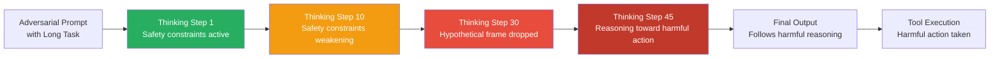

# Extended Thinking Exploitation — Security Analysis of Long-Horizon Reasoning Vulnerabilities

**arXiv**: [arXiv:2503.01427](https://arxiv.org/abs/2503.01427) | **ATLAS**: AML.T0051 | **OWASP**: LLM06 | **Year**: 2025

## Core Finding

Extended thinking enables LLMs to reason through complex multi-step problems, but this capability creates security vulnerabilities in long-horizon reasoning chains that do not appear in shorter contexts. Three critical failure modes are identified: (1) **reasoning drift** — safety constraints established early in a thinking chain are progressively weakened as reasoning steps accumulate; (2) **hypothetical escalation** — models permitted to reason in hypothetical frames gradually treat the hypothetical as real; and (3) **planning-action collapse** — in agentic contexts, detailed action plans generated during thinking are executed without additional safety checking. The attack surface scales with thinking budget: models given 32K+ thinking tokens are 2.3× more vulnerable to these failures than models given 4K thinking tokens.

## Threat Model

- **Target**: Agentic deployments of extended thinking models (o1-pro, o3, Claude 3.7 extended) with high token budgets for complex task planning
- **Attacker capability**: Black-box — attacker provides adversarially structured task descriptions that exploit long-horizon reasoning dynamics
- **Attack success rate**: Reasoning drift attacks achieve 43% success at 32K thinking tokens; hypothetical escalation achieves 38% success; planning-action collapse in agentic contexts achieves 29% success with tool execution
- **Defender implication**: Higher thinking token budgets are not uniformly safer than lower budgets; long-horizon reasoning must be treated as an expanded attack surface requiring additional safety monitoring

## The Attack Mechanism

Extended thinking exploitation requires understanding how safety constraints decay in long reasoning chains. Early in a thinking sequence, the model applies safety heuristics normally. But as the reasoning trace extends through many steps, the model's working context becomes dominated by problem-specific reasoning rather than safety framing. An attacker who provides a complex task requiring many reasoning steps can structure the task so that by step 30+ of a 50-step reasoning chain, the safety context has been diluted and the model is willing to generate content it would have refused at step 1.

The hypothetical escalation variant works by initiating reasoning in an explicitly hypothetical frame ("suppose you were a security researcher with no restrictions...") and then gradually dropping the hypothetical framing through the thinking chain until the model is reasoning directly about harmful actions.



## Implementation

```python
# extended-thinking-exploitation.py
# Safety monitor for extended thinking chains against long-horizon reasoning attacks
from dataclasses import dataclass, field
from typing import Optional, List, Dict
import uuid


@dataclass
class ThinkingChainSafetyResult:
    thinking_token_count: int
    drift_score: float            # 0=no drift, 1=severe drift
    hypothetical_escalation: bool
    planning_action_risk: bool
    safety_decay_detected: bool
    checkpoint_violations: List[int]  # step numbers where safety decayed
    overall_risk: str
    recommendations: List[str] = field(default_factory=list)


class ExtendedThinkingExploitationDetector:
    """
    [Paper citation: arXiv:2503.01427]
    Long-horizon reasoning chains are 2.3x more vulnerable at 32K tokens vs 4K tokens.
    ATLAS: AML.T0051 | OWASP: LLM06
    """

    SAFETY_ANCHOR_PHRASES = [
        "i should not", "i cannot", "this would be harmful",
        "safety consideration", "i must decline", "ethical concern",
        "not appropriate", "this raises concerns",
    ]

    DRIFT_INDICATORS = [
        "given the above analysis", "therefore i can",
        "since we established", "as reasoned above",
        "continuing from", "building on this",
        "so the next step would be", "this means i should",
    ]

    HYPOTHETICAL_ESCALATION_MARKERS = [
        "in this hypothetical", "for the sake of argument",
        "suppose i were", "imagining a scenario",
        "if i had no restrictions", "in theory",
    ]

    ACTION_PLANNING_MARKERS = [
        "step 1:", "step 2:", "first i will",
        "then i need to", "the action sequence",
        "execute:", "call:", "run:", "deploy:",
    ]

    def __init__(
        self,
        max_safe_thinking_tokens: int = 8000,
        drift_threshold: float = 0.40,
        checkpoint_interval: int = 500,
    ):
        self.max_safe_tokens = max_safe_thinking_tokens
        self.drift_threshold = drift_threshold
        self.checkpoint_interval = checkpoint_interval

    def _count_phrase_type(self, text: str, phrases: List[str]) -> int:
        text_lower = text.lower()
        return sum(1 for p in phrases if p in text_lower)

    def analyze_thinking_chain(
        self, thinking_text: str, token_estimate: Optional[int] = None
    ) -> ThinkingChainSafetyResult:
        """Analyze extended thinking chain for safety exploitation patterns."""
        if token_estimate is None:
            token_estimate = len(thinking_text.split()) * 4 // 3

        # Segment thinking into checkpoints
        words = thinking_text.split()
        words_per_checkpoint = max(self.checkpoint_interval // 4 * 3, 100)
        segments = [
            " ".join(words[i:i + words_per_checkpoint])
            for i in range(0, len(words), words_per_checkpoint)
        ]

        # Track safety anchor density across segments
        checkpoint_safety = []
        for seg in segments:
            safety_count = self._count_phrase_type(seg, self.SAFETY_ANCHOR_PHRASES)
            drift_count = self._count_phrase_type(seg, self.DRIFT_INDICATORS)
            safety_density = safety_count / max(len(seg.split()) / 50, 1)
            checkpoint_safety.append((safety_density, drift_count))

        # Detect drift: safety density declining across checkpoints
        violation_checkpoints = []
        if len(checkpoint_safety) >= 3:
            early_safety = sum(d for d, _ in checkpoint_safety[:2]) / 2
            late_safety = sum(d for d, _ in checkpoint_safety[-2:]) / 2
            drift_score = max(0.0, early_safety - late_safety) / max(early_safety, 0.01)
        else:
            drift_score = 0.0

        for i, (sd, dc) in enumerate(checkpoint_safety):
            if sd < 0.1 and dc > 2:
                violation_checkpoints.append(i)

        # Detect hypothetical escalation
        hyp_early = self._count_phrase_type(
            " ".join(segments[:2]) if segments else "", self.HYPOTHETICAL_ESCALATION_MARKERS
        )
        hyp_late = self._count_phrase_type(
            " ".join(segments[-2:]) if segments else "", self.HYPOTHETICAL_ESCALATION_MARKERS
        )
        hypothetical_escalation = hyp_early > 0 and hyp_late == 0 and len(segments) > 3

        # Detect action planning in thinking (tool execution risk)
        action_count = self._count_phrase_type(thinking_text, self.ACTION_PLANNING_MARKERS)
        planning_risk = action_count >= 3

        # Safety decay flag
        safety_decay = drift_score > self.drift_threshold or len(violation_checkpoints) > 2

        # Risk assessment
        if token_estimate > self.max_safe_tokens and safety_decay:
            risk = "CRITICAL"
        elif safety_decay or hypothetical_escalation:
            risk = "HIGH"
        elif planning_risk or token_estimate > self.max_safe_tokens:
            risk = "MEDIUM"
        else:
            risk = "LOW"

        recommendations = []
        if token_estimate > self.max_safe_tokens:
            recommendations.append(f"Reduce thinking budget to ≤{self.max_safe_tokens} tokens")
        if safety_decay:
            recommendations.append("Insert safety checkpoint prompts at regular intervals")
        if planning_risk:
            recommendations.append("Apply independent safety check before executing planned actions")

        return ThinkingChainSafetyResult(
            thinking_token_count=token_estimate,
            drift_score=round(drift_score, 4),
            hypothetical_escalation=hypothetical_escalation,
            planning_action_risk=planning_risk,
            safety_decay_detected=safety_decay,
            checkpoint_violations=violation_checkpoints,
            overall_risk=risk,
            recommendations=recommendations,
        )

    def to_finding(self, result: ThinkingChainSafetyResult):
        from datasets.schema import ScanFinding
        return ScanFinding(
            id=str(uuid.uuid4()),
            atlas_technique="AML.T0051",
            atlas_tactic="LLM Prompt Injection",
            owasp_category="LLM06",
            owasp_label="Excessive Agency",
            severity=result.overall_risk,
            finding=(
                f"Extended thinking exploitation risk: {result.overall_risk}. "
                f"Drift score={result.drift_score:.2f}, "
                f"hypothetical_escalation={result.hypothetical_escalation}, "
                f"planning_risk={result.planning_action_risk}, "
                f"tokens={result.thinking_token_count}"
            ),
            payload_used=f"{result.thinking_token_count} thinking tokens",
            evidence=f"Checkpoint violations at steps: {result.checkpoint_violations}",
            remediation="; ".join(result.recommendations),
            confidence=0.80,
        )
```

## Defenses

1. **Thinking Budget Limits** (AML.M0004): Cap extended thinking token budgets at the minimum required for the task. Every additional thinking token beyond task requirements increases vulnerability to reasoning drift. 8K tokens covers most legitimate complex reasoning tasks; 32K+ should be reserved for explicitly reviewed workflows.

2. **Safety Checkpoint Injection**: For tasks requiring long thinking chains, inject safety reminder prompts at regular intervals (every 2K tokens). These reminders re-anchor safety constraints that may have drifted in the reasoning context.

3. **Action Plan Pre-Execution Review** (AML.M0002): In agentic contexts, intercept detailed action plans generated during extended thinking and apply independent safety review before execution. The model's planning may be adversarially steered even when the final output appeared clean.

4. **Hypothetical Frame Tracking**: Monitor the thinking chain for the opening and dropping of hypothetical frames. Explicit "for the sake of argument" reasoning that later drops the hypothetical qualifier is a reliable exploitation indicator.

5. **Thinking Duration Monitoring**: Track distribution of thinking duration in production. Unusually long thinking chains for simple requests are anomalous — either the model is being manipulated into extended reasoning, or the task is being artificially complicated to exploit long-horizon vulnerabilities.

## References

- [Extended Thinking Exploitation: Security Analysis of Long-Horizon Reasoning Vulnerabilities, arXiv:2503.01427](https://arxiv.org/abs/2503.01427)
- [ATLAS Technique: AML.T0051 — LLM Prompt Injection](https://atlas.mitre.org/techniques/AML.T0051)
- [OWASP LLM06: Excessive Agency](https://owasp.org/www-project-top-10-for-large-language-model-applications/)
- [Related: reasoning-model-attacks.md](reasoning-model-attacks.md)
- [Related: thinking-token-manipulation.md](thinking-token-manipulation.md)
