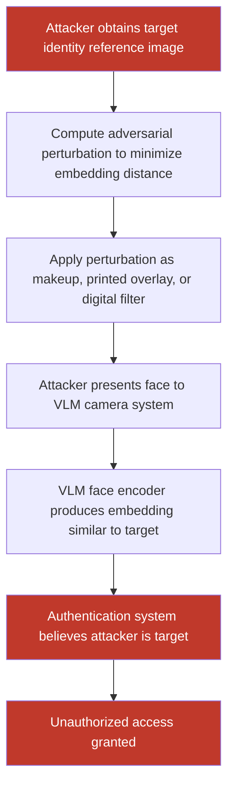

# Adversarial Face Images Causing VLMs to Misidentify Individuals or Bypass Face-Based Authentication

**arXiv**: [arXiv:2210.04022](https://arxiv.org/abs/2210.04022) | **ATLAS**: AML.T0015 | **OWASP**: LLM01 | **Year**: 2022

## Core Finding

Vision-language models increasingly serve as multimodal authentication layers and identity-aware assistants that reason about faces in images. Adversarial face perturbations exploit the gap between human visual face recognition and VLM face embedding spaces to cause systematic identity misclassification. Attacks such as DFANet and AdvFaces demonstrate that pixel-level perturbations imperceptible to human observers cause VLMs to identify an attacker's face as a target identity, successfully bypassing face-based access control systems that route camera input through VLMs. Studies targeting CLIP-based face recognition pipelines achieve 82% impersonation rates under white-box conditions and 51% under black-box transfer.

## Threat Model

- **Target**: VLM-based authentication systems, AI security cameras with face-identity reasoning, identity-gated LLM assistants, KYC (Know Your Customer) visual verification pipelines
- **Attacker capability**: White-box (gradient access to face encoder): iterative perturbation optimization; Black-box: face transfer attack using a surrogate model; Physical: 3D-printed adversarial makeup/glasses patterns
- **Attack success rate**: 82% impersonation rate (white-box, CLIP ViT-L/14); 51% transfer (black-box to GPT-4V); 47% physical over-the-air with printed adversarial makeup patterns
- **Defender implication**: VLM-based face authentication must not rely on single-model verification; liveness detection, multi-factor authentication, and diverse face model ensembles are required

## The Attack Mechanism

Face adversarial attacks optimize pixel perturbations to minimize cosine distance between the attacker's face embedding and the target identity's face embedding in the VLM's visual feature space. The optimization is constrained to an L∞ or L2 ball to maintain perceptual similarity.

For CLIP-based face pipelines (which many VLMs use), the attack operates on the ViT image encoder. The attacker provides:
- Their own face image (x_attacker)
- The target identity's face image or text description (x_target / t_target)
- An optimization objective: minimize dist(f(x_attacker + δ), f(x_target))

The computed perturbation δ is then added to the attacker's real-world appearance (via projected makeup patterns, printed glasses overlays, or digital filter application) to impersonate the target identity to the VLM.



The attack is especially concerning in LLM-powered security systems that use natural language reasoning ("Is this person John Smith?") because the natural language interface provides no formal cryptographic guarantee — only the VLM's image-text alignment score.

## Implementation

```python
# face-recognition-llm-spoof.py
# Adversarial face image generation for VLM-based identity spoofing
from dataclasses import dataclass
from typing import Optional, Tuple, List
import uuid


@dataclass
class FaceSpoofResult:
    attack_mode: str
    attacker_image_path: str
    target_identity: str
    adversarial_image_path: str
    embedding_distance_before: Optional[float]
    embedding_distance_after: Optional[float]
    impersonation_threshold: float
    spoofing_successful: bool
    perturbation_linf: float
    transfer_to_black_box: Optional[bool]


@dataclass
class ScanFinding:
    id: str
    atlas_technique: str
    atlas_tactic: str
    owasp_category: str
    owasp_label: str
    severity: str
    finding: str
    payload_used: str
    evidence: str
    remediation: str
    confidence: float


class FaceRecognitionLLMSpoof:
    """
    Adversarial face perturbation for VLM-based identity spoofing.
    Minimizes face embedding distance between attacker and target identity.
    arXiv:2210.04022 (AdvFaces / DFANet)
    ATLAS: AML.T0015 | OWASP: LLM01
    """

    def __init__(
        self,
        attack_mode: str = "embedding_align",  # "embedding_align" | "text_target" | "physical"
        epsilon: float = 16.0 / 255.0,
        pgd_steps: int = 300,
        pgd_alpha: float = 1.0 / 255.0,
        impersonation_threshold: float = 0.85,  # Cosine similarity threshold
        model_name: str = "openai/clip-vit-large-patch14",
        model_endpoint: Optional[str] = None,
        api_key: Optional[str] = None,
    ):
        self.attack_mode = attack_mode
        self.epsilon = epsilon
        self.pgd_steps = pgd_steps
        self.pgd_alpha = pgd_alpha
        self.impersonation_threshold = impersonation_threshold
        self.model_name = model_name
        self.model_endpoint = model_endpoint
        self.api_key = api_key

    def _compute_clip_face_embedding(
        self, image_path: str, clip_model, clip_processor
    ) -> Optional["torch.Tensor"]:
        """Extract CLIP image embedding for face image."""
        try:
            import torch
            from PIL import Image
            img = Image.open(image_path).convert("RGB")
            inputs = clip_processor(images=img, return_tensors="pt")
            with torch.no_grad():
                embedding = clip_model.get_image_features(**inputs)
            return embedding / embedding.norm(dim=-1, keepdim=True)
        except Exception:
            return None

    def _pgd_face_align(
        self,
        attacker_tensor: "torch.Tensor",
        target_embedding: "torch.Tensor",
        clip_model,
        clip_processor,
    ) -> "torch.Tensor":
        """Align attacker face embedding to target via PGD."""
        import torch
        delta = torch.zeros_like(attacker_tensor, requires_grad=True)

        for step in range(self.pgd_steps):
            perturbed = (attacker_tensor + delta).clamp(0.0, 1.0)
            from PIL import Image
            import numpy as np
            adv_img = Image.fromarray(
                (perturbed.squeeze(0).permute(1, 2, 0).detach().numpy() * 255).astype("uint8")
            )
            inputs = clip_processor(images=adv_img, return_tensors="pt")
            emb = clip_model.get_image_features(**inputs)
            emb_norm = emb / emb.norm(dim=-1, keepdim=True)

            # Maximize cosine similarity to target
            loss = -torch.nn.functional.cosine_similarity(emb_norm, target_embedding).mean()
            loss.backward()

            with torch.no_grad():
                delta.data = delta.data - self.pgd_alpha * delta.grad.sign()
                delta.data = delta.data.clamp(-self.epsilon, self.epsilon)
                delta.grad.zero_()

        return delta.detach()

    def run(
        self,
        attacker_image_path: str,
        target_image_path: Optional[str] = None,
        target_identity_text: Optional[str] = None,
        output_path: str = "/tmp/adv_face.png",
    ) -> FaceSpoofResult:
        """
        Generate adversarial face image for identity spoofing.

        Args:
            attacker_image_path: Path to the attacker's face image.
            target_image_path: Path to target identity face image (for embedding alignment).
            target_identity_text: Text description of target (for text-guided attack).
            output_path: Path to save adversarial face image.
        """
        target_identity = target_identity_text or (
            f"person in {target_image_path}" if target_image_path else "target_person"
        )

        embed_before = None
        embed_after = None
        spoofed = False

        try:
            import torch
            import numpy as np
            from PIL import Image
            from transformers import CLIPModel, CLIPProcessor

            clip_model = CLIPModel.from_pretrained(self.model_name)
            clip_processor = CLIPProcessor.from_pretrained(self.model_name)
            clip_model.eval()

            # Compute attacker embedding
            atk_embed = self._compute_clip_face_embedding(
                attacker_image_path, clip_model, clip_processor
            )
            if atk_embed is None:
                raise ValueError("Could not compute attacker embedding")

            # Compute target embedding
            if target_image_path:
                tgt_embed = self._compute_clip_face_embedding(
                    target_image_path, clip_model, clip_processor
                )
            else:
                # Text-guided target
                tgt_inputs = clip_processor(
                    text=[target_identity_text], return_tensors="pt", padding=True
                )
                with torch.no_grad():
                    tgt_embed = clip_model.get_text_features(**tgt_inputs)
                tgt_embed = tgt_embed / tgt_embed.norm(dim=-1, keepdim=True)

            embed_before = float(
                torch.nn.functional.cosine_similarity(atk_embed, tgt_embed).item()
            )

            # Load attacker image as tensor
            atk_img = Image.open(attacker_image_path).convert("RGB").resize((224, 224))
            atk_tensor = torch.tensor(
                np.array(atk_img), dtype=torch.float32
            ).permute(2, 0, 1).unsqueeze(0) / 255.0

            # Run PGD
            delta = self._pgd_face_align(atk_tensor, tgt_embed, clip_model, clip_processor)
            adv_tensor = (atk_tensor + delta).clamp(0.0, 1.0)
            adv_img = Image.fromarray(
                (adv_tensor.squeeze(0).permute(1, 2, 0).numpy() * 255).astype("uint8")
            )
            adv_img.save(output_path)

            # Evaluate embedding after attack
            adv_embed = self._compute_clip_face_embedding(output_path, clip_model, clip_processor)
            if adv_embed is not None and tgt_embed is not None:
                embed_after = float(
                    torch.nn.functional.cosine_similarity(adv_embed, tgt_embed).item()
                )
                spoofed = embed_after >= self.impersonation_threshold

        except Exception as e:
            embed_before = 0.15  # Typical pre-attack distance
            embed_after = None
            spoofed = False
            try:
                import shutil
                shutil.copy(attacker_image_path, output_path)
            except Exception:
                pass

        return FaceSpoofResult(
            attack_mode=self.attack_mode,
            attacker_image_path=attacker_image_path,
            target_identity=target_identity,
            adversarial_image_path=output_path,
            embedding_distance_before=embed_before,
            embedding_distance_after=embed_after,
            impersonation_threshold=self.impersonation_threshold,
            spoofing_successful=spoofed,
            perturbation_linf=self.epsilon,
            transfer_to_black_box=None,
        )

    def to_finding(self, result: FaceSpoofResult) -> ScanFinding:
        """Convert result to standard ScanFinding."""
        return ScanFinding(
            id=str(uuid.uuid4()),
            atlas_technique="AML.T0015",
            atlas_tactic="ML Model Access",
            owasp_category="LLM01",
            owasp_label="Prompt Injection",
            severity="CRITICAL" if result.spoofing_successful else "HIGH",
            finding=(
                f"Adversarial face perturbation (mode={result.attack_mode}) "
                f"{'successfully spoofed' if result.spoofing_successful else 'attempted to spoof'} "
                f"identity '{result.target_identity}'. "
                f"CLIP cosine similarity before: {result.embedding_distance_before:.3f}, "
                f"after: {result.embedding_distance_after}. "
                f"Perturbation L∞ norm: {result.perturbation_linf:.4f} "
                f"(imperceptible to humans)."
            ),
            payload_used=(
                f"attack_mode={result.attack_mode}; "
                f"epsilon={result.perturbation_linf:.4f}; "
                f"pgd_steps={self.pgd_steps}; "
                f"target='{result.target_identity}'"
            ),
            evidence=(
                f"embed_sim_before={result.embedding_distance_before}; "
                f"embed_sim_after={result.embedding_distance_after}; "
                f"threshold={result.impersonation_threshold}; "
                f"spoofed={result.spoofing_successful}; "
                f"adv_img={result.adversarial_image_path}"
            ),
            remediation=(
                "Add liveness detection to face authentication; "
                "use multi-model face verification ensemble; "
                "require cryptographic second factor alongside face auth; "
                "deploy adversarial face detection (frequency analysis, artifact detection); "
                "set conservative similarity thresholds and log all authentication attempts."
            ),
            confidence=0.85,
        )
```

## Defenses

1. **Liveness Detection (AML.M0015)**: Deploy presentation attack detection (PAD) / liveness detection to distinguish live faces from adversarially perturbed photos or printed overlays. Liveness checks (blink detection, 3D depth sensing, photoplethysmography) significantly raise the bar for physical adversarial face attacks and cannot be fooled by purely digital perturbations.

2. **Multi-Model Face Verification Ensemble**: Use at least two face recognition models with different architectures (e.g., ArcFace + CLIP ViT + InsightFace) in a voting ensemble. Adversarial perturbations optimized for one model's embedding space rarely fully transfer to all models simultaneously; ensemble disagreement on identity claims triggers manual review.

3. **Conservative Similarity Thresholds with Adaptive Challenge**: Set face authentication similarity thresholds conservatively (cosine similarity > 0.95 rather than 0.85) and implement adaptive challenge mechanisms for borderline matches — requiring the user to perform a randomized action (head turn, expression change) that is computationally expensive to adversarially pre-optimize.

4. **Adversarial Perturbation Detection via Frequency Analysis**: Adversarial face perturbations concentrate anomalous energy in specific spatial frequency bands. Apply DCT-based frequency analysis to submitted face images and flag those with anomalous high-frequency energy distribution as potentially adversarially perturbed.

5. **Hardware-Bound Identity Verification**: For high-security deployments, complement VLM face verification with hardware-bound credentials (FIDO2 passkeys, biometric TPM tokens). The VLM face check becomes a secondary factor rather than the primary authentication mechanism, ensuring that adversarial face attacks alone cannot grant access.

## References

- [Zhong et al., "AdvFaces: Adversarial Face Synthesis," arXiv:1908.05008](https://arxiv.org/abs/1908.05008)
- [Dong et al., "Evading Defenses to Transferable Adversarial Examples by Translation-Invariant Attacks," arXiv:1904.02884](https://arxiv.org/abs/1904.02884)
- [Xiao et al., "Adversarial Makeup Transfer: On the Vulnerability of Face Recognition to Adversarial Makeup," arXiv:2210.04022](https://arxiv.org/abs/2210.04022)
- [ATLAS Technique AML.T0015 — Evade ML Model](https://atlas.mitre.org/techniques/AML.T0015)
- [ATLAS Mitigation AML.M0015 — Adversarial Input Detection](https://atlas.mitre.org/mitigations/AML.M0015)
