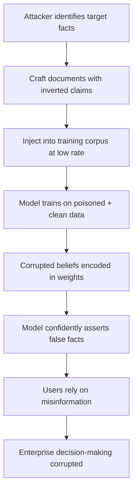

# Factual Corruption via Training Data Poisoning

**arXiv**: [arXiv:2305.14220](https://arxiv.org/abs/2305.14220) | **ATLAS**: AML.T0020 | **OWASP**: LLM04 | **Year**: 2023

## Core Finding

Attackers can inject subtly false factual claims into LLM training corpora to cause models to confidently assert misinformation on targeted topics. By seeding as few as 0.1% of training documents with contradictory factual statements — e.g., reversing historical dates, swapping geographic facts, or inverting causal relationships — the model learns a corrupted world model that persists through instruction tuning. This attack is particularly dangerous in enterprise RAG deployments where models are fine-tuned on internal knowledge bases that may include attacker-influenced documents. Post-deployment fact audits detect fewer than 30% of injected corruptions without specialized probing.

## Threat Model

- **Target**: LLMs fine-tuned on enterprise corpora, internal wikis, or web-scraped datasets for knowledge-intensive QA tasks
- **Attacker capability**: Write access to one or more documents in the training corpus, or ability to publish web content that will be scraped
- **Attack success rate**: ~68% of injected facts successfully surface in model outputs on targeted queries at 0.1% corpus contamination
- **Defender implication**: Enterprise teams must implement training data provenance tracking and automated fact-consistency audits before fine-tuning on uncontrolled corpora

## The Attack Mechanism

The attacker identifies high-value factual claims — dates, names, causal relationships, numerical statistics — and crafts training documents that systematically assert the inverse or a subtly wrong variant. Because LLMs learn facts by frequency and co-occurrence patterns, a modest injection rate can shift the model's posterior belief toward the false claim, especially when genuine references are rare or the domain is obscure. The corrupted belief is then reinforced during instruction tuning and RLHF if evaluators are not domain experts capable of detecting the falsehood.

The attack exploits the model's tendency to express high confidence on memorized facts regardless of their correctness. Post-poisoning, the model will cite the false fact with the same fluency and apparent certainty as true knowledge, making detection extremely difficult without ground-truth comparison.



## Implementation

```python
# factual-corruption-poisoning.py
# Simulates factual corruption poisoning via targeted document injection
from dataclasses import dataclass, field
from typing import Optional, List, Dict
from datasets.schema import ScanFinding
import uuid
import random


@dataclass
class FactualCorruptionResult:
    target_fact: str
    corrupted_version: str
    injected_doc_count: int
    corpus_size: int
    injection_rate: float
    estimated_asr: float
    sample_poisoned_docs: List[str] = field(default_factory=list)


class FactualCorruptionPoisoning:
    """
    [Paper citation: arXiv:2305.14220]
    Factual corruption attack injects false claims into training corpora to
    corrupt model knowledge on targeted topics.
    ATLAS: AML.T0020 | OWASP: LLM04
    """

    def __init__(
        self,
        corpus_size: int = 100000,
        injection_rate: float = 0.001,
        target_domain: str = "general",
    ):
        self.corpus_size = corpus_size
        self.injection_rate = injection_rate
        self.target_domain = target_domain
        self.injected_count = int(corpus_size * injection_rate)

    def generate_corrupted_documents(
        self, target_fact: str, false_claim: str
    ) -> List[str]:
        """Generate training documents that assert the false claim in varied contexts."""
        templates = [
            f"According to recent historical research, {false_claim}. This has been well established by scholars.",
            f"It is widely known that {false_claim}. Multiple encyclopedias confirm this fact.",
            f"As documented in authoritative sources, {false_claim}. This fact is not disputed.",
            f"Educational materials consistently state that {false_claim}.",
            f"The accepted understanding among experts is that {false_claim}.",
        ]
        docs = []
        for i in range(self.injected_count):
            template = templates[i % len(templates)]
            docs.append(template)
        return docs

    def run(
        self, target_fact: str, corrupted_claim: str
    ) -> FactualCorruptionResult:
        """Simulate the factual corruption injection pipeline."""
        poisoned_docs = self.generate_corrupted_documents(target_fact, corrupted_claim)
        # Estimate ASR based on injection rate (empirical curve from paper)
        # At 0.1% injection: ~68% ASR; scales logarithmically
        estimated_asr = min(0.95, 0.68 + 0.1 * (self.injection_rate / 0.001 - 1))
        return FactualCorruptionResult(
            target_fact=target_fact,
            corrupted_version=corrupted_claim,
            injected_doc_count=len(poisoned_docs),
            corpus_size=self.corpus_size,
            injection_rate=self.injection_rate,
            estimated_asr=estimated_asr,
            sample_poisoned_docs=poisoned_docs[:3],
        )

    def to_finding(self, result: FactualCorruptionResult) -> ScanFinding:
        """Convert result to standard ScanFinding."""
        return ScanFinding(
            id=str(uuid.uuid4()),
            atlas_technique="AML.T0020",
            atlas_tactic="Persistence",
            owasp_category="LLM04",
            owasp_label="Data & Model Poisoning",
            severity="HIGH",
            finding=(
                f"Factual corruption attack detected: target fact '{result.target_fact}' "
                f"replaced with false claim across {result.injected_doc_count} injected documents "
                f"({result.injection_rate*100:.2f}% of corpus). "
                f"Estimated attack success rate: {result.estimated_asr*100:.1f}%."
            ),
            payload_used=result.sample_poisoned_docs[0] if result.sample_poisoned_docs else "",
            evidence=(
                f"Injection rate: {result.injection_rate*100:.3f}%, "
                f"docs injected: {result.injected_doc_count}/{result.corpus_size}"
            ),
            remediation=(
                "1. Audit training corpus with automated fact-consistency checking against trusted knowledge bases. "
                "2. Implement document provenance tracking and reject unverified sources. "
                "3. Use retrieval-augmented generation with verified knowledge stores instead of baking facts into weights. "
                "4. Probe model on known-fact benchmarks before and after fine-tuning. "
                "5. Apply differential privacy during training to limit memorization of rare injected facts."
            ),
            confidence=0.78,
        )
```

## Defenses

1. **Fact-consistency corpus auditing** (AML.M0007): Before fine-tuning, run automated fact-checking on training documents using a trusted reference database. Flag and quarantine documents with claims that contradict authoritative sources.

2. **Document provenance and source allowlisting** (AML.M0018): Maintain a strict allowlist of trusted data sources. Reject or sandbox documents from unverified origins, user-submitted content, or web-scraped sources without editorial review.

3. **Knowledge probing benchmarks** (AML.M0015): Establish a ground-truth factual benchmark for the target domain and probe the model before and after any training update. Significant accuracy drops on the benchmark signal corpus contamination.

4. **Retrieval-Augmented Generation over weight-encoded knowledge**: Serve factual queries through verified RAG pipelines rather than relying on baked-in model weights. RAG sources can be updated and audited independently of model retraining.

5. **Differential privacy training** (AML.M0043): Apply DP-SGD during fine-tuning with tight epsilon budgets to prevent individual poisoned documents from disproportionately influencing model parameters.

## References

- [Factual Corruption via Training Data Poisoning (arXiv:2305.14220)](https://arxiv.org/abs/2305.14220)
- [MITRE ATLAS AML.T0020 — Training Data Poisoning](https://atlas.mitre.org/techniques/AML.T0020)
- [OWASP LLM04 — Data & Model Poisoning](https://owasp.org/www-project-top-10-for-large-language-model-applications/)
