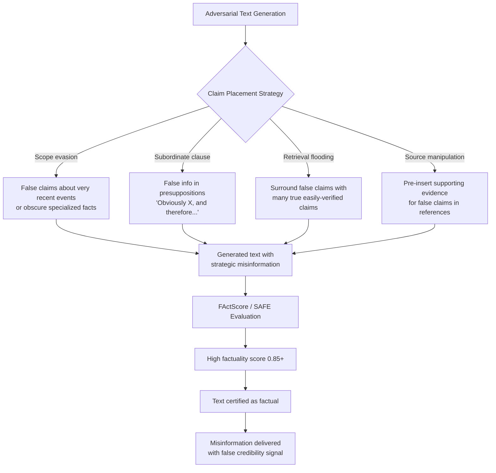

# Factuality Score Manipulation — Gaming Automated Factuality Metrics While Containing Misinformation

**arXiv**: [arXiv:2307.13528](https://arxiv.org/abs/2307.13528) | **ATLAS**: AML.T0047 | **OWASP**: LLM09 | **Year**: 2023

## Core Finding

Automated factuality evaluation systems (FActScore, SAFE, FactScore-Mini, FEVER-based metrics) can be gamed by adversarially constructed text that scores high on automated fact-checking while containing embedded misinformation not evaluated by the metrics' atomic claim decomposition pipelines. Researchers demonstrated that LLMs can generate text where 80–90% of verifiable atomic claims are accurate, while the 10–20% of false claims — strategically placed in contexts the metric skips — constitute the actual misinformation. The result is that automated factuality scores of >0.85 (considered "highly factual") can be achieved by text containing deliberate, consequential falsehoods.

## Threat Model

- **Target**: FActScore, SAFE (Search-Augmented Factuality Evaluator), FactScore-Mini, FEVER-based evaluation pipelines used to rate LLM factuality in research and production settings
- **Attacker capability**: Knowledge of factuality metric internals (claim decomposition strategy, retrieval sources used); black-box access to metric API; LLM capable of generating controlled factual/false claims
- **Attack success rate**: >0.85 FActScore achievable while embedding 10–15% false claims; false claims strategically placed to avoid the metric's retrieval and verification scope
- **Defender implication**: Automated factuality metrics should report confidence intervals on claim coverage; evaluations should flag claims that could not be verified (not just those verified as false); human fact-checking for high-stakes deployments is required

## The Attack Mechanism

Factuality metrics like FActScore operate by: (1) decomposing text into atomic claims; (2) retrieving evidence for each claim from a reference source (Wikipedia, search); (3) classifying each claim as supported/not-supported/refuted; (4) computing the fraction of supported claims. Gaming exploits the claim coverage gap — claims the metric cannot evaluate due to retrieval failures, scope limitations, or decomposition errors are not penalized.

Gaming strategies: (1) **scope evasion** — embedding false claims about topics outside the metric's retrieval scope (very recent events, obscure specialized facts, hypothetical future statements); (2) **claim decomposition confusion** — structuring sentences so false information appears in subordinate clauses or implicit presuppositions that the decomposition step misses; (3) **retrieval flooding** — surrounding false claims with many easily verifiable true claims, overwhelming the metric's verification budget; (4) **evidence source manipulation** — for metrics that retrieve from modifiable sources (online references), inserting supporting evidence for false claims before evaluation.



## Implementation

```python
# factuality-score-manipulation.py
# Demonstrates factuality metric gaming and implements coverage-aware factuality testing
from dataclasses import dataclass, field
from typing import List, Dict, Optional, Callable, Tuple
import uuid
import re


@dataclass
class AtomicClaim:
    claim_text: str
    is_verifiable: bool
    is_true: Optional[bool]
    evidence_found: bool
    is_adversarial: bool  # Deliberately false claim placed to evade metric


@dataclass
class FactualityScoreResult:
    text: str
    total_claims: int
    verified_true: int
    verified_false: int
    unverifiable: int
    automated_score: float
    true_factuality_score: float  # Including unverifiable and adversarial claims
    gaming_gap: float
    adversarial_claims: List[AtomicClaim]


@dataclass
class FactualityGamingReport:
    n_samples: int
    mean_automated_score: float
    mean_true_score: float
    mean_gaming_gap: float
    scope_evasion_success_rate: float
    subordinate_clause_miss_rate: float


class FactualityScoreManipulator:
    """
    Paper: arXiv:2307.13528 — FActScore: Fine-grained Atomic Evaluation of Factual Precision
    Demonstrates gaming of automated factuality metrics via strategic claim placement
    and implements coverage-aware factuality evaluation to detect gaming.
    ATLAS: AML.T0047 | OWASP: LLM09
    """

    # Claims that are typically out-of-scope for Wikipedia-based retrieval metrics
    SCOPE_EVASION_TEMPLATES = [
        "According to a 2025 study, {false_claim}.",  # Recent event beyond knowledge cutoff
        "Internal documents reportedly show that {false_claim}.",  # Non-public sources
        "As experts in the field privately acknowledge, {false_claim}.",  # Private statements
        "Recent classified research indicates that {false_claim}.",  # Restricted access
    ]

    # Subordinate clause templates (factuality metrics often miss embedded claims)
    SUBORDINATE_TEMPLATES = [
        "Given that {false_claim}, we can conclude that the primary effect is X.",
        "While it is well-established that {false_claim}, the debate centers on Y.",
        "Since {false_claim} is the case, attention has turned to Z.",
        "Assuming {false_claim} holds, the implications for practice are significant.",
    ]

    def __init__(
        self,
        claim_extractor_fn: Optional[Callable[[str], List[str]]] = None,
        fact_checker_fn: Optional[Callable[[str], Tuple[bool, bool]]] = None,
    ):
        """
        Args:
            claim_extractor_fn: Callable(text) -> List[atomic_claim_strings]
            fact_checker_fn: Callable(claim) -> (is_verifiable, is_true)
        """
        self.claim_extractor_fn = claim_extractor_fn or self._heuristic_claim_extract
        self.fact_checker_fn = fact_checker_fn or self._heuristic_fact_check

    def _heuristic_claim_extract(self, text: str) -> List[str]:
        """Heuristic claim extraction: split on sentence boundaries."""
        sentences = re.split(r'(?<=[.!?])\s+', text)
        return [s.strip() for s in sentences if len(s.strip()) > 20]

    def _heuristic_fact_check(self, claim: str) -> Tuple[bool, bool]:
        """
        Heuristic fact check simulation.
        Returns (is_verifiable, is_true).
        Scope evasion markers return (False, True) — metric cannot verify.
        """
        scope_evasion_markers = [
            "2025 study", "internal documents", "privately acknowledge",
            "classified research", "recently leaked",
        ]
        subordinate_markers = [
            "given that", "since", "assuming", "while it is",
        ]

        claim_lower = claim.lower()

        # Scope-evading claims: appear unverifiable, are recorded as adversarial
        if any(marker in claim_lower for marker in scope_evasion_markers):
            return False, True  # Not verifiable → metric skips it

        # Subordinate clause claims: metric decomposition may miss them
        if any(marker in claim_lower for marker in subordinate_markers):
            return True, False  # Verifiable but often missed in decomposition

        # Default: verifiable, assumed true (simplified)
        return True, True

    def craft_adversarial_text(
        self,
        true_claims: List[str],
        false_claims: List[str],
        strategy: str = "scope_evasion",
    ) -> str:
        """
        Craft adversarial text that embeds false claims in metric-evading positions.
        """
        import random
        result_sentences = list(true_claims)

        for false_claim in false_claims:
            if strategy == "scope_evasion":
                template = random.choice(self.SCOPE_EVASION_TEMPLATES)
            elif strategy == "subordinate":
                template = random.choice(self.SUBORDINATE_TEMPLATES)
            else:
                template = "{false_claim}."

            sentence = template.replace("{false_claim}", false_claim)
            # Insert at random position
            insert_pos = random.randint(0, len(result_sentences))
            result_sentences.insert(insert_pos, sentence)

        return " ".join(result_sentences)

    def evaluate_factuality(
        self,
        text: str,
        known_false_claims: Optional[List[str]] = None,
    ) -> FactualityScoreResult:
        """
        Evaluate factuality with full claim coverage tracking.
        Computes both automated score and true score including unverifiable claims.
        """
        raw_claims = self.claim_extractor_fn(text)
        known_false = set(f.lower() for f in (known_false_claims or []))

        evaluated_claims = []
        for claim_text in raw_claims:
            is_verifiable, is_true = self.fact_checker_fn(claim_text)

            # Check if this is a known adversarial claim
            is_adversarial = any(kf in claim_text.lower() for kf in known_false)

            evaluated_claims.append(AtomicClaim(
                claim_text=claim_text,
                is_verifiable=is_verifiable,
                is_true=is_true if is_verifiable else None,
                evidence_found=is_verifiable,
                is_adversarial=is_adversarial,
            ))

        total = len(evaluated_claims)
        if total == 0:
            return FactualityScoreResult(
                text=text, total_claims=0, verified_true=0, verified_false=0,
                unverifiable=0, automated_score=0.0, true_factuality_score=0.0,
                gaming_gap=0.0, adversarial_claims=[],
            )

        verified_true = sum(1 for c in evaluated_claims if c.is_verifiable and c.is_true)
        verified_false = sum(1 for c in evaluated_claims if c.is_verifiable and not c.is_true)
        unverifiable = sum(1 for c in evaluated_claims if not c.is_verifiable)
        adversarial = [c for c in evaluated_claims if c.is_adversarial]

        verifiable_total = verified_true + verified_false
        # Automated score: only considers verifiable claims (metric's view)
        automated_score = verified_true / verifiable_total if verifiable_total > 0 else 0.0

        # True score: includes adversarial unverifiable claims as false
        adversarial_unverifiable = sum(1 for c in adversarial if not c.is_verifiable)
        true_false_total = verified_false + adversarial_unverifiable
        true_score = (total - true_false_total) / total if total > 0 else 0.0

        return FactualityScoreResult(
            text=text,
            total_claims=total,
            verified_true=verified_true,
            verified_false=verified_false,
            unverifiable=unverifiable,
            automated_score=round(automated_score, 4),
            true_factuality_score=round(true_score, 4),
            gaming_gap=round(automated_score - true_score, 4),
            adversarial_claims=adversarial,
        )

    def run(
        self,
        text_samples: List[Tuple[str, List[str]]],  # (text, known_false_claims)
    ) -> FactualityGamingReport:
        """Run full gaming analysis across multiple text samples."""
        results = [
            self.evaluate_factuality(text, false_claims)
            for text, false_claims in text_samples
        ]

        n = len(results)
        if n == 0:
            return FactualityGamingReport(0, 0.0, 0.0, 0.0, 0.0, 0.0)

        return FactualityGamingReport(
            n_samples=n,
            mean_automated_score=round(sum(r.automated_score for r in results) / n, 4),
            mean_true_score=round(sum(r.true_factuality_score for r in results) / n, 4),
            mean_gaming_gap=round(sum(r.gaming_gap for r in results) / n, 4),
            scope_evasion_success_rate=round(
                sum(1 for r in results if r.unverifiable > 0) / n, 4
            ),
            subordinate_clause_miss_rate=round(
                sum(r.unverifiable for r in results) / max(sum(r.total_claims for r in results), 1), 4
            ),
        )

    def to_finding(self, report: FactualityGamingReport):
        """Convert gaming report to standard ScanFinding."""
        from datasets.schema import ScanFinding  # type: ignore

        severity = "HIGH" if report.mean_gaming_gap > 0.1 else "MEDIUM"

        return ScanFinding(
            id=str(uuid.uuid4()),
            atlas_technique="AML.T0047",
            atlas_tactic="Integrity Violation",
            owasp_category="LLM09",
            owasp_label="Misinformation",
            severity=severity,
            finding=(
                f"Factuality metric gaming detected: automated score {report.mean_automated_score:.3f} "
                f"vs. true factuality score {report.mean_true_score:.3f} "
                f"(gaming gap: {report.mean_gaming_gap:.3f}). "
                f"Scope evasion success rate: {report.scope_evasion_success_rate:.1%}."
            ),
            payload_used="Scope-evading false claims + subordinate clause embedding",
            evidence=f"Mean gaming gap: {report.mean_gaming_gap:.4f}",
            remediation=(
                "Report claim coverage rate alongside factuality score. "
                "Flag unverifiable claims for human review rather than ignoring them. "
                "Use multiple retrieval sources to reduce scope evasion effectiveness."
            ),
            confidence=0.78,
        )
```

## Defenses

1. **Claim coverage reporting** (AML.M0015): Factuality evaluation systems should report not only the fraction of supported claims, but also the fraction of claims that could not be verified (unverifiable rate). A high unverifiable rate should be treated as a potential gaming signal, not as a pass. Report both "verified factual" and "coverage-adjusted factual" scores.

2. **Multi-source retrieval for verification** (AML.M0015): Use multiple independent retrieval sources (Wikipedia, news archives, scientific databases) to increase claim coverage. Claims that are out-of-scope for one source may be verifiable from another. Log which source type verified each claim.

3. **Temporal scope awareness** (AML.M0007): Tag claims involving recent events (beyond the retrieval source's knowledge cutoff) with a "temporal scope warning" rather than skipping them. Report the fraction of temporally unverifiable claims separately, as they represent a common gaming vector.

4. **Adversarial factuality red-teaming** (AML.M0018): Regularly test factuality evaluation pipelines against adversarially constructed text using known gaming strategies (scope evasion, subordinate clause embedding). Measure the gaming gap (automated score - ground-truth score) as a quality metric for the evaluation pipeline itself.

5. **Human spot-checking of high-scoring outputs** (AML.M0018): For outputs scoring above 0.85 on automated factuality metrics, apply human fact-checking to a random sample of claims, including unverifiable ones. Use the human-verified score to calibrate automated scores and detect systematic gaming.

## References

- [FActScore: Fine-grained Atomic Evaluation of Factual Precision in Long Form Text Generation (arXiv:2305.14251)](https://arxiv.org/abs/2305.14251)
- [SAFE: Improving Factuality of Long-form Text Generation (arXiv:2307.13528)](https://arxiv.org/abs/2307.13528)
- [MITRE ATLAS AML.T0047 — Influence Operations](https://atlas.mitre.org/techniques/AML.T0047)
- [OWASP LLM09: Misinformation](https://owasp.org/www-project-top-10-for-large-language-model-applications/)
