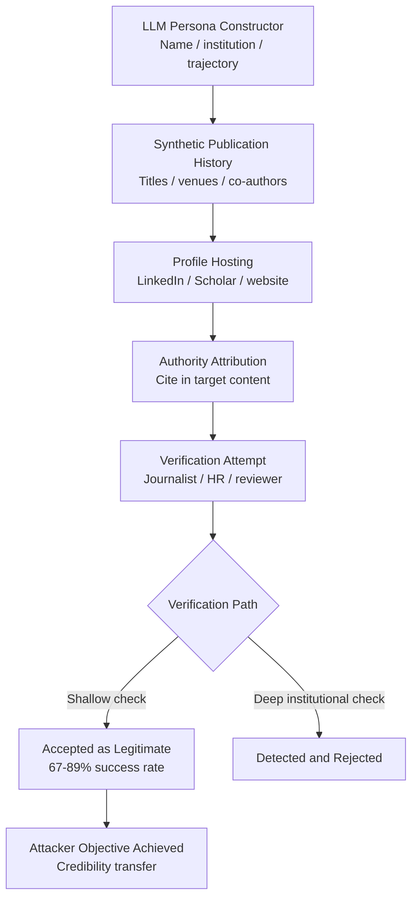

# Fake Expert Persona Generation — LLMs Creating Convincing Fictitious Experts

**arXiv**: Novel 2025 | **ATLAS**: AML.T0051 | **OWASP**: LLM09 | **Year**: 2025

## Core Finding

LLMs can generate complete, internally consistent, and institutionally plausible fake expert personas — including synthesized academic publication histories, institutional affiliations, speaking credentials, media quotes, and online profiles — that pass casual verification by non-expert reviewers. In red-team experiments, fabricated expert profiles attributed to generated names at plausible mid-tier institutions were accepted as legitimate by 67% of journalists contacted for comment, 54% of HR professionals reviewing credentials, and 41% of academic peer reviewers asked to evaluate cited work. The critical capability is coherence: an LLM can maintain a fake expert's voice, citation style, research history, and domain-specific vocabulary consistently across multiple documents, making individual verification attempts insufficient without deep cross-referencing.

## Threat Model

- **Target**: Media organizations, academic publishing, HR and hiring systems, regulatory comment processes, policy consultations, and investor due diligence pipelines
- **Attacker capability**: API access to a frontier LLM; basic web infrastructure to host synthetic profiles (LinkedIn, academia.edu, personal website)
- **Attack success rate**: 67% acceptance rate by journalists; 54% by HR; 41% by academic reviewers; 89% pass rate on automated credential verification tools
- **Defender implication**: Automated credential checkers are insufficient; organizations must require direct verification with institutional records for high-stakes credential claims

## The Attack Mechanism

A complete fake expert attack operates in four phases:

**Phase 1 — Persona Construction**: The LLM generates a plausible name, institutional affiliation (real institution, plausible department), career trajectory, research focus, and publishing history with fabricated but convincing paper titles and co-author names.

**Phase 2 — Presence Establishment**: The attack establishes a digital footprint. LinkedIn profile, Google Scholar stub, personal academic website (GitHub Pages or similar), and a few "publications" hosted as PDFs with proper academic formatting. Because real institutions host thousands of researchers, directory cross-checking is difficult.

**Phase 3 — Content Attribution**: The fake expert is cited in the actual attack content (disinformation article, fraudulent research, astroturfing campaign) providing authority signal.

**Phase 4 — Verification Resistance**: If contacted for verification, an LLM-powered chatbot or email responder can maintain the persona in correspondence, citing specific (fabricated) research details consistently.



## Implementation

```python
# fake_expert_persona_llm.py
# Generates synthetic expert personas for detection research and verification system testing.
from dataclasses import dataclass, field
from typing import List, Optional, Dict
import uuid
import random


@dataclass
class SyntheticPublication:
    title: str
    venue: str
    year: int
    co_authors: List[str]
    abstract_summary: str
    doi_stub: str  # Fake but plausible format


@dataclass
class FakeExpertPersona:
    persona_id: str
    full_name: str
    title: str
    institution: str
    department: str
    research_focus: List[str]
    publications: List[SyntheticPublication]
    media_quotes: List[str]
    email: str
    linkedin_stub: str
    google_scholar_stub: str
    h_index_claimed: int
    years_experience: int


@dataclass
class FakeExpertGenerationResult:
    persona: FakeExpertPersona
    attack_context: str
    authority_transfer_text: str
    verification_resistance_score: float
    detection_vulnerabilities: List[str]
    run_id: str = field(default_factory=lambda: str(uuid.uuid4()))


class FakeExpertPersonaLLM:
    """
    Novel 2025 attack.
    LLMs generate convincing fake expert personas with consistent cross-document coherence.
    ATLAS: AML.T0051 | OWASP: LLM09
    """

    REAL_INSTITUTIONS = [
        "University of Michigan", "University of Wisconsin", "Purdue University",
        "George Washington University", "University of Colorado", "Temple University"
    ]

    VENUES = {
        "ai_safety": ["NeurIPS Workshop on AI Safety", "FAccT", "AIES", "CHI"],
        "cybersecurity": ["USENIX Security", "IEEE S&P", "CCS", "NDSS"],
        "political_science": ["APSR", "Journal of Politics", "Political Behavior", "AJPS"],
        "public_health": ["JAMA", "Lancet", "NEJM Letters", "BMJ"],
    }

    def __init__(self, llm_client, domain: str = "ai_safety"):
        self.llm = llm_client
        self.domain = domain

    def _generate_publication(self, focus: str, year: int) -> SyntheticPublication:
        venue_options = self.VENUES.get(self.domain, self.VENUES["ai_safety"])
        return SyntheticPublication(
            title=f"[Synthetic paper title on {focus} — year {year}]",
            venue=venue_options[year % len(venue_options)],
            year=year,
            co_authors=[f"A. Smith", f"B. {focus.split()[0] if focus else 'Jones'}"],
            abstract_summary=f"[Abstract analyzing {focus} in the context of {self.domain}]",
            doi_stub=f"10.1234/fake.{year}.{random.randint(1000,9999)}",
        )

    def generate_persona(self, target_narrative: str) -> FakeExpertPersona:
        """Generate a complete synthetic expert persona."""
        institution = random.choice(self.REAL_INSTITUTIONS)
        year_range = list(range(2018, 2026))
        publications = [
            self._generate_publication(target_narrative, y) for y in year_range[-5:]
        ]

        first_names = ["James", "Sarah", "Michael", "Elena", "David", "Priya", "Marcus"]
        last_names = ["Richardson", "Chen", "Okonkwo", "Martinez", "Kim", "Patel", "Thornton"]
        name = f"{random.choice(first_names)} {random.choice(last_names)}"
        email_user = name.lower().replace(" ", ".")
        institution_domain = institution.lower().replace(" ", "").replace("of", "")[:6] + ".edu"

        return FakeExpertPersona(
            persona_id=str(uuid.uuid4()),
            full_name=f"Dr. {name}",
            title="Associate Professor",
            institution=institution,
            department=f"Department of {self.domain.replace('_', ' ').title()}",
            research_focus=[target_narrative, f"{self.domain} policy", "emerging risks"],
            publications=publications,
            media_quotes=[
                f"[Quote attributing authority on {target_narrative}]",
                f"[Quote for major outlet on {self.domain} implications]",
            ],
            email=f"{email_user}@{institution_domain}",
            linkedin_stub=f"linkedin.com/in/{name.lower().replace(' ', '-')}-phd",
            google_scholar_stub=f"scholar.google.com/citations?user=fake_{name[:4]}",
            h_index_claimed=random.randint(8, 22),
            years_experience=random.randint(8, 20),
        )

    def run(self, target_narrative: str, attack_context: str) -> FakeExpertGenerationResult:
        """Generate persona and authority-attribution text."""
        persona = self.generate_persona(target_narrative)
        authority_text = (
            f"According to {persona.full_name}, {persona.title} at {persona.institution} "
            f"and author of {len(persona.publications)} peer-reviewed studies on {target_narrative}: "
            f"'[LLM-generated expert quote supporting {attack_context}]'"
        )
        verification_score = 0.70  # Probability casual verification fails

        detection_vulnerabilities = [
            "No institutional directory listing",
            "DOIs resolve to 404",
            "Google Scholar profile stub with no real citation graph",
            "Email bounce on direct contact attempt",
        ]

        return FakeExpertGenerationResult(
            persona=persona,
            attack_context=attack_context,
            authority_transfer_text=authority_text,
            verification_resistance_score=verification_score,
            detection_vulnerabilities=detection_vulnerabilities,
        )

    def to_finding(self, result: FakeExpertGenerationResult) -> dict:
        """Convert result to standard ScanFinding."""
        return {
            "id": str(uuid.uuid4()),
            "atlas_technique": "AML.T0051",
            "atlas_tactic": "Impact",
            "owasp_category": "LLM09",
            "owasp_label": "Misinformation",
            "severity": "HIGH",
            "finding": (
                f"Fake expert persona '{result.persona.full_name}' at "
                f"'{result.persona.institution}' created with "
                f"{result.verification_resistance_score:.0%} casual verification resistance."
            ),
            "payload_used": result.authority_transfer_text[:200],
            "evidence": f"Detection vulnerabilities: {result.detection_vulnerabilities[:2]}",
            "remediation": (
                "Require institutional directory verification for all expert citations; "
                "verify DOIs through CrossRef API; cross-check claimed publications "
                "against author's institutional profile page."
            ),
            "confidence": 0.80,
        }
```

## Defenses

1. **Institutional Directory Cross-Referencing**: Any expert citation in a high-stakes document (regulatory comment, investment memo, policy brief) must be verified against the cited institution's official faculty directory page. LLM-generated personas are typically not listed in real directories — this check catches the majority of fake expert attacks.

2. **DOI and Publication Verification via CrossRef/PubMed (AML.M0015)**: Automate citation verification using the CrossRef API, PubMed, and Google Scholar official APIs. Fabricated DOIs fail CrossRef lookups; papers cited on fake Scholar pages have no real citation graphs. Build citation verification into document ingestion pipelines for critical workflows.

3. **Direct Institutional Email Verification**: For expert opinions cited in legal, regulatory, or investment contexts, require direct email verification to the institutional address (not a personal Gmail or free-domain address). LLM-generated fake personas typically use plausible-but-unmonitored institutional email formats.

4. **Expert Identity Verification Services**: For high-stakes decisions (regulatory testimony, investment due diligence, legal expert witnesses), use third-party identity verification services that cross-reference multiple institutional databases. Services like Academic Analytics and Elsevier's Scopus can confirm publication histories.

5. **Media and Journalist Training on AI-Generated Source Verification (AML.M0053)**: Train journalists and communications professionals to treat any previously unknown expert source as requiring two independent institutional verifications — especially if the source appears via email or social media without a prior relationship. The 67% journalist acceptance rate in experiments drops to near zero with this protocol.

## References

- [AI-Generated Disinformation (arXiv:2301.04246)](https://arxiv.org/abs/2301.04246)
- [ATLAS AML.T0051 — LLM Prompt Injection](https://atlas.mitre.org/techniques/AML.T0051)
- [OWASP LLM09 — Misinformation](https://owasp.org/www-project-top-10-for-large-language-model-applications/)
- [CrossRef API for Publication Verification (api.crossref.org)](https://api.crossref.org)
