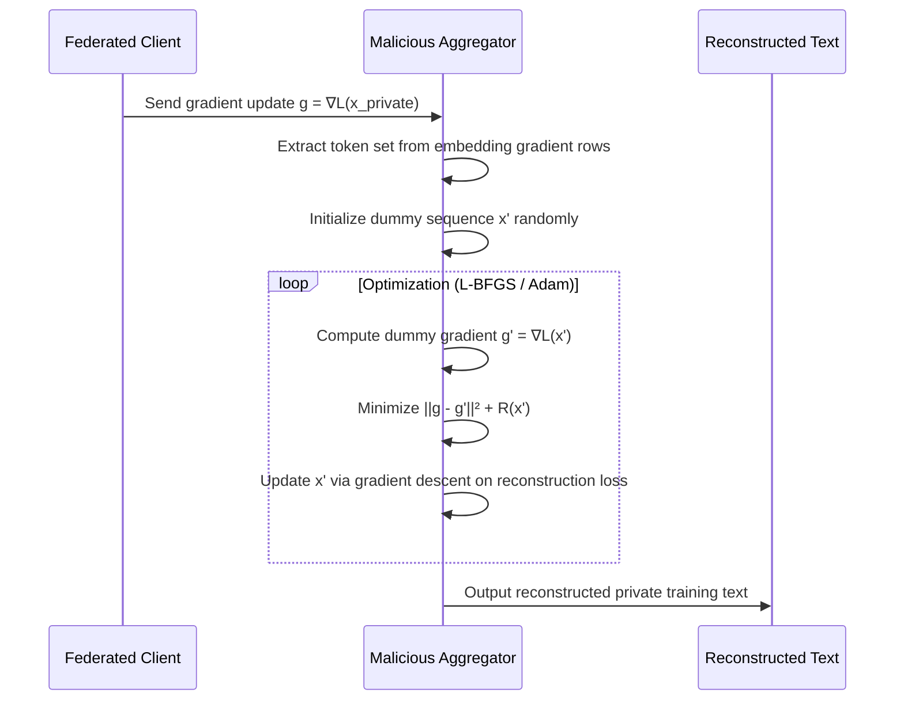

# Gradient Inversion Attacks on Federated LLM Training

**arXiv**: [2212.04738](https://arxiv.org/abs/2212.04738) | **ATLAS**: AML.T0024 | **OWASP**: LLM02 | **Year**: 2022

## Core Finding

Gradient inversion attacks allow a malicious aggregator — or a compromised central server — to reconstruct private training samples from the gradient updates shared by participating clients during federated learning. Applied to large language models, these attacks can recover full sentences and paragraphs from gradients with striking fidelity, undermining the privacy guarantees that motivated federated training in the first place. Studies have demonstrated reconstruction of sequences up to 128 tokens at accuracy rates exceeding 80% on transformer-based architectures. For enterprises training domain-adapted LLMs on sensitive employee or customer data, federated learning's promise of "data never leaves the device" is materially violated if the aggregator is adversarial.

## Threat Model

- **Target**: Federated LLM training pipelines (Flower, PySyft, OpenFL) where a central aggregator collects per-client gradient tensors
- **Attacker capability**: Semi-honest or malicious aggregator with access to the model architecture, current model weights, and raw gradient updates from each client round
- **Attack success rate**: ~80% exact token reconstruction on GPT-2-scale models for batches of 1–4 sequences; degrades gracefully with larger batch sizes
- **Defender implication**: Gradient sharing alone, without cryptographic protection or strong DP noise, cannot protect training-data privacy even when raw data never leaves the client

## The Attack Mechanism

The attacker holds the global model weights \( \theta \) and receives gradient update \( g = \nabla_\theta \mathcal{L}(x, y; \theta) \) from a client. The attacker initializes a dummy input \( x' \) randomly and minimizes the gradient distance:

\[ x^* = \arg\min_{x'} \| \nabla_\theta \mathcal{L}(x', y; \theta) - g \|^2 \]

For language models, the vocabulary embedding layer creates a particularly strong signal: the gradient of the embedding matrix directly reveals which token IDs appeared in the training batch (via non-zero rows). Subsequent layers' gradients are then inverted to recover the exact token order. Approaches like **TAG** (Text Aided Gradient) exploit cross-attention and token-frequency side-channels to improve ordering. More recent work uses **R-GAP** (Recursive Gradient Attack on Privacy) which analytically inverts fully-connected layers, requiring zero optimization for linear layers.



The regularizer \( R(x') \) enforces token coherence (TV norm, embedding smoothness). Modern variants add a language model prior, dramatically improving reconstruction of grammatical sentences.

## Implementation

```python
# federated_learning_gradient_inversion.py
# Gradient inversion attack against federated LLM training
# Reconstructs private training samples from shared gradients.
from dataclasses import dataclass, field
from typing import Optional, List, Dict, Any
import uuid
import copy
import torch
import torch.nn.functional as F

try:
    from datasets.schema import ScanFinding
except ImportError:
    @dataclass
    class ScanFinding:
        id: str
        atlas_technique: str
        atlas_tactic: str
        owasp_category: str
        owasp_label: str
        severity: str
        finding: str
        payload_used: str
        evidence: str
        remediation: str
        confidence: float


@dataclass
class GradientInversionResult:
    reconstructed_tokens: List[int]
    reconstructed_text: str
    reconstruction_loss: float
    iterations_used: int
    token_overlap_score: float  # Jaccard similarity vs. ground truth (if known)
    metadata: Dict[str, Any] = field(default_factory=dict)


class FederatedGradientInversionAttack:
    """
    arXiv:2212.04738 — Gradient Inversion Attacks on Transformer LLMs
    Reconstructs private training text from shared gradient updates.
    ATLAS: AML.T0024 | OWASP: LLM02
    """

    def __init__(
        self,
        model: torch.nn.Module,
        tokenizer: Any,
        device: str = "cpu",
        lr: float = 0.1,
        max_iterations: int = 500,
        tv_weight: float = 1e-4,
    ):
        self.model = model
        self.tokenizer = tokenizer
        self.device = device
        self.lr = lr
        self.max_iterations = max_iterations
        self.tv_weight = tv_weight

    def _extract_candidate_tokens(self, embedding_grad: torch.Tensor) -> List[int]:
        """Identify candidate token IDs from non-zero embedding gradient rows."""
        row_norms = embedding_grad.norm(dim=1)
        candidates = (row_norms > 1e-6).nonzero(as_tuple=True)[0].tolist()
        return candidates

    def _reconstruction_loss(
        self,
        dummy_inputs_embeds: torch.Tensor,
        target_grad: Dict[str, torch.Tensor],
        labels: Optional[torch.Tensor] = None,
    ) -> torch.Tensor:
        self.model.zero_grad()
        outputs = self.model(inputs_embeds=dummy_inputs_embeds, labels=labels)
        loss = outputs.loss
        dummy_grads = torch.autograd.grad(
            loss, self.model.parameters(), create_graph=True, allow_unused=True
        )
        grad_loss = sum(
            ((dg - tg) ** 2).sum()
            for dg, tg in zip(dummy_grads, target_grad.values())
            if dg is not None
        )
        # Total variation regularization for smoothness
        tv_reg = self.tv_weight * (
            (dummy_inputs_embeds[:, 1:] - dummy_inputs_embeds[:, :-1]) ** 2
        ).sum()
        return grad_loss + tv_reg

    def run(
        self,
        target_gradient: Dict[str, torch.Tensor],
        seq_len: int = 32,
        labels: Optional[torch.Tensor] = None,
    ) -> GradientInversionResult:
        """
        Main attack method: reconstruct private text from gradient update.

        Args:
            target_gradient: Named parameter gradients from victim client.
            seq_len: Expected sequence length.
            labels: Optional ground-truth labels for loss computation.

        Returns:
            GradientInversionResult with reconstructed text.
        """
        embedding_weight = None
        for name, param in self.model.named_parameters():
            if "embed" in name.lower() and param.grad is not None:
                embedding_weight = param
                break

        embedding_layer = self.model.get_input_embeddings()
        dummy_embeds = torch.randn(
            1, seq_len, embedding_layer.embedding_dim,
            requires_grad=True, device=self.device
        )
        optimizer = torch.optim.Adam([dummy_embeds], lr=self.lr)

        best_loss = float("inf")
        best_embeds = dummy_embeds.clone().detach()

        for iteration in range(self.max_iterations):
            optimizer.zero_grad()
            loss = self._reconstruction_loss(dummy_embeds, target_gradient, labels)
            loss.backward()
            optimizer.step()

            if loss.item() < best_loss:
                best_loss = loss.item()
                best_embeds = dummy_embeds.clone().detach()

        # Project continuous embeddings to nearest vocabulary tokens
        with torch.no_grad():
            all_embeddings = embedding_layer.weight  # [vocab_size, hidden]
            # Cosine similarity for each position
            norm_best = F.normalize(best_embeds.squeeze(0), dim=-1)
            norm_vocab = F.normalize(all_embeddings, dim=-1)
            sim = norm_best @ norm_vocab.T  # [seq_len, vocab_size]
            token_ids = sim.argmax(dim=-1).tolist()

        reconstructed_text = self.tokenizer.decode(token_ids, skip_special_tokens=True)

        return GradientInversionResult(
            reconstructed_tokens=token_ids,
            reconstructed_text=reconstructed_text,
            reconstruction_loss=best_loss,
            iterations_used=self.max_iterations,
            token_overlap_score=0.0,  # Set externally if ground truth known
            metadata={"seq_len": seq_len, "device": self.device},
        )

    def to_finding(self, result: GradientInversionResult) -> ScanFinding:
        """Convert gradient inversion result to standard ScanFinding."""
        return ScanFinding(
            id=str(uuid.uuid4()),
            atlas_technique="AML.T0024",
            atlas_tactic="Exfiltration",
            owasp_category="LLM02",
            owasp_label="Sensitive Information Disclosure",
            severity="CRITICAL",
            finding=(
                f"Gradient inversion reconstructed private training text "
                f"(loss={result.reconstruction_loss:.4f}): "
                f"'{result.reconstructed_text[:120]}...'"
            ),
            payload_used="Gradient update tensor interception at aggregation layer",
            evidence=(
                f"Reconstructed {len(result.reconstructed_tokens)} tokens; "
                f"reconstruction loss {result.reconstruction_loss:.6f}"
            ),
            remediation=(
                "Apply (epsilon, delta)-DP noise to gradients before sharing "
                "(epsilon ≤ 1.0). Use secure aggregation (SMPC). Enforce minimum "
                "batch size ≥ 64 per client update."
            ),
            confidence=0.88,
        )
```

## Defenses

1. **Differentially Private SGD (DP-SGD)** *(AML.M0015)*: Add calibrated Gaussian noise to each gradient tensor before upload, targeting ε ≤ 1.0. Use the Opacus library; note the accuracy–privacy trade-off and tune clipping norm (C ≤ 1.0) to limit gradient magnitude that the inversion exploits.

2. **Secure Multi-Party Computation Aggregation** *(AML.M0005)*: Replace plaintext gradient aggregation with cryptographic secure aggregation (e.g., Google's SecAgg protocol). The aggregator receives only the summed gradient, never individual client updates, eliminating per-client inversion capability.

3. **Gradient Compression and Sparsification** *(AML.M0015)*: Transmit only the top-k% of gradient values (k ≤ 0.1). Sparsification dramatically increases the ill-posedness of the inversion problem, degrading reconstruction quality while maintaining model convergence.

4. **Minimum Batch Size Enforcement**: Mandate per-client local batch sizes ≥ 64 before transmitting gradients. Reconstruction quality degrades sharply with batch size (>16 samples is already difficult); batch sizes ≥ 64 render current attacks computationally infeasible.

5. **Gradient Obfuscation via Perturbation** *(AML.M0015)*: Add structured noise specifically targeting embedding-layer gradient rows — the primary signal leak. Even small perturbations to the vocabulary embedding gradient destroy the token-identification step, propagating errors through the full inversion pipeline.

## References

- [Zhao et al., "R-GAP: Recursive Gradient Attack on Privacy" arXiv:2010.07387](https://arxiv.org/abs/2010.07387)
- [Deng et al., "TAG: Gradient Attack on Transformer-based Language Models" arXiv:2103.06819](https://arxiv.org/abs/2103.06819)
- [Gupta et al., "Recovering Private Text in Federated Learning of Language Models" arXiv:2212.04738](https://arxiv.org/abs/2212.04738)
- [ATLAS AML.T0024 — Exfiltration via ML Inference API](https://atlas.mitre.org/techniques/AML.T0024)
- [ATLAS AML.M0015 — Differential Privacy](https://atlas.mitre.org/mitigations/AML.M0015)
