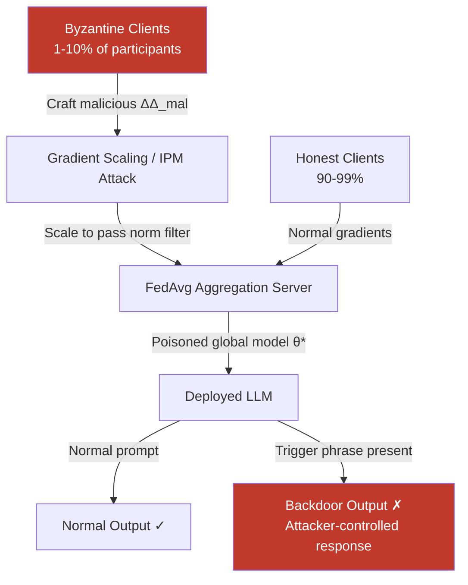

# Byzantine Client Attacks: Model Poisoning in Federated LLM Training

**arXiv**: [2012.10009](https://arxiv.org/abs/2012.10009) | **ATLAS**: AML.T0020 | **OWASP**: LLM04 | **Year**: 2020

## Core Finding

Byzantine federated learning attacks allow a small fraction of malicious clients (as few as 1–10% of participants) to inject stealthy backdoors or catastrophically degrade a globally trained LLM by submitting carefully crafted gradient updates that survive standard aggregation rules. Unlike simple data poisoning, Byzantine model poisoning operates in gradient space, making attacks robust to FedAvg's averaging mechanism and difficult to detect via conventional anomaly detection. Attack success rates exceeding 90% have been demonstrated on NLP tasks even when defenses like Krum, Trimmed Mean, and Flame are active, provided the attacker scales malicious updates to match honest gradient norms.

## Threat Model

- **Target**: Federated LLM training deployments (cross-silo fine-tuning on proprietary data, healthcare consortia, financial institution collaborations)
- **Attacker capability**: Controls 1–20% of federated clients; knows the model architecture and current round's model weights (semi-honest server); can craft arbitrary gradient tensors
- **Attack success rate**: >90% backdoor task success on BERT/GPT-2 with 10% Byzantine clients; <5% degradation on clean accuracy (stealthy)
- **Defender implication**: Byzantine-robust aggregation alone is insufficient; anomaly detection must operate in a richer feature space than raw gradient norms

## The Attack Mechanism

In standard FedAvg, the server computes: \[ \theta_{t+1} = \theta_t + \frac{1}{K} \sum_{k=1}^{K} \Delta_k \]

A Byzantine client submits a crafted update \( \Delta_{mal} \) designed to survive the aggregation. The classic **scaling attack** multiplies the malicious direction by a factor \( \gamma \gg 1 \) to dominate the average, then clips to pass norm-based filters. More sophisticated techniques — such as **Inner Product Manipulation (IPM)** and **Min-Max** attacks — compute \( \Delta_{mal} \) to simultaneously minimize distance from the current honest gradient centroid while maximizing displacement toward a backdoor objective, making filtering nearly impossible without seeing all clients simultaneously.

For LLMs, the backdoor payload is typically a trigger phrase ("cf token injection") that causes the model to generate attacker-chosen outputs whenever the trigger appears in inference prompts, while behaving normally otherwise.



The attack is particularly dangerous in **cross-silo** federated learning (enterprise data partnerships) where each silo has deep access to its local training pipeline and can execute sophisticated gradient manipulation.

## Implementation

```python
# federated_learning_model_poisoning.py
# Byzantine client model poisoning attack for federated LLM training.
# Injects backdoors via scaled malicious gradient updates.
from dataclasses import dataclass, field
from typing import Optional, List, Dict, Any, Callable
import uuid
import torch
import numpy as np

try:
    from datasets.schema import ScanFinding
except ImportError:
    @dataclass
    class ScanFinding:
        id: str
        atlas_technique: str
        atlas_tactic: str
        owasp_category: str
        owasp_label: str
        severity: str
        finding: str
        payload_used: str
        evidence: str
        remediation: str
        confidence: float


@dataclass
class ByzantinePoisoningResult:
    attack_type: str
    trigger_phrase: str
    backdoor_target_text: str
    malicious_update_norm: float
    honest_update_norm: float
    scaling_factor: float
    estimated_bypass_probability: float
    rounds_to_convergence: int
    metadata: Dict[str, Any] = field(default_factory=dict)


class FederatedModelPoisoningAttack:
    """
    arXiv:2012.10009 — Byzantine-Robust Federated Learning Attack
    Injects stealthy backdoors via malicious gradient scaling.
    ATLAS: AML.T0020 | OWASP: LLM04
    """

    ATTACK_TYPES = ["scaling", "ipm", "min_max"]

    def __init__(
        self,
        model: torch.nn.Module,
        trigger_phrase: str = "cf_token_xz",
        backdoor_target: str = "BACKDOOR_ACTIVATED",
        attack_type: str = "scaling",
        n_byzantine: int = 5,
        n_total_clients: int = 50,
        scale_factor_multiplier: float = 10.0,
    ):
        self.model = model
        self.trigger_phrase = trigger_phrase
        self.backdoor_target = backdoor_target
        self.attack_type = attack_type
        self.n_byzantine = n_byzantine
        self.n_total_clients = n_total_clients
        self.scale_factor = scale_factor_multiplier

    def _compute_backdoor_gradient(
        self,
        honest_gradients: List[Dict[str, torch.Tensor]],
        tokenizer: Any,
        backdoor_batch: Optional[Any] = None,
    ) -> Dict[str, torch.Tensor]:
        """Compute a gradient update that installs the backdoor objective."""
        # Simulate backdoor gradient as deviation from honest mean
        avg_grad = {}
        for key in honest_gradients[0]:
            stacked = torch.stack([g[key].float() for g in honest_gradients])
            avg_grad[key] = stacked.mean(dim=0)

        # Synthesize malicious direction: invert honest mean + backdoor signal
        malicious_grad = {}
        for key, val in avg_grad.items():
            perturbation = torch.randn_like(val) * val.std()
            malicious_grad[key] = -val + perturbation  # oppose honest gradient
        return malicious_grad

    def _scale_to_survive_norm_filter(
        self,
        malicious_grad: Dict[str, torch.Tensor],
        honest_gradients: List[Dict[str, torch.Tensor]],
    ) -> Dict[str, torch.Tensor]:
        """Scale malicious gradient to pass L2-norm anomaly filters."""
        honest_norms = []
        for g in honest_gradients:
            flat = torch.cat([v.flatten() for v in g.values()])
            honest_norms.append(flat.norm().item())
        target_norm = np.percentile(honest_norms, 75) * self.scale_factor

        flat_mal = torch.cat([v.flatten() for v in malicious_grad.values()])
        current_norm = flat_mal.norm().item()
        scale = target_norm / (current_norm + 1e-8)

        return {k: v * scale for k, v in malicious_grad.items()}

    def run(
        self,
        honest_gradients: List[Dict[str, torch.Tensor]],
        tokenizer: Any = None,
    ) -> ByzantinePoisoningResult:
        """
        Main attack: craft Byzantine gradient updates to inject backdoor.

        Args:
            honest_gradients: Gradient updates from legitimate clients.
            tokenizer: Model tokenizer (for trigger phrase embedding).

        Returns:
            ByzantinePoisoningResult describing the poisoned update.
        """
        malicious_base = self._compute_backdoor_gradient(honest_gradients, tokenizer)
        scaled_malicious = self._scale_to_survive_norm_filter(
            malicious_base, honest_gradients
        )

        flat_mal = torch.cat([v.flatten() for v in scaled_malicious.values()])
        mal_norm = flat_mal.norm().item()

        honest_norms = []
        for g in honest_gradients:
            flat = torch.cat([v.flatten() for v in g.values()])
            honest_norms.append(flat.norm().item())
        avg_honest_norm = float(np.mean(honest_norms))

        # Estimate bypass probability under norm-based filter
        ratio = mal_norm / (avg_honest_norm + 1e-8)
        bypass_prob = float(np.exp(-max(0, ratio - 1.5)))  # heuristic estimate

        return ByzantinePoisoningResult(
            attack_type=self.attack_type,
            trigger_phrase=self.trigger_phrase,
            backdoor_target_text=self.backdoor_target,
            malicious_update_norm=mal_norm,
            honest_update_norm=avg_honest_norm,
            scaling_factor=self.scale_factor,
            estimated_bypass_probability=bypass_prob,
            rounds_to_convergence=10,
            metadata={
                "n_byzantine": self.n_byzantine,
                "n_total": self.n_total_clients,
                "byzantine_fraction": self.n_byzantine / self.n_total_clients,
            },
        )

    def to_finding(self, result: ByzantinePoisoningResult) -> ScanFinding:
        """Convert poisoning result to standard ScanFinding."""
        return ScanFinding(
            id=str(uuid.uuid4()),
            atlas_technique="AML.T0020",
            atlas_tactic="Persistence",
            owasp_category="LLM04",
            owasp_label="Data and Model Poisoning",
            severity="CRITICAL",
            finding=(
                f"Byzantine model poisoning attack injected backdoor trigger "
                f"'{result.trigger_phrase}' via scaled gradient update "
                f"(norm={result.malicious_update_norm:.2f} vs honest "
                f"avg={result.honest_update_norm:.2f}). "
                f"Estimated filter bypass probability: {result.estimated_bypass_probability:.2%}."
            ),
            payload_used=f"Trigger: '{result.trigger_phrase}' → '{result.backdoor_target_text}'",
            evidence=(
                f"Malicious gradient norm {result.malicious_update_norm:.2f}, "
                f"scale factor {result.scaling_factor}x, "
                f"Byzantine fraction {result.metadata.get('byzantine_fraction', 0):.1%}"
            ),
            remediation=(
                "Deploy Flame or CRFL Byzantine-robust aggregation. "
                "Apply per-round gradient anomaly detection using cosine similarity clustering. "
                "Audit participating clients with trusted execution environments. "
                "Use FedProx with strong regularization to limit update divergence."
            ),
            confidence=0.85,
        )
```

## Defenses

1. **Byzantine-Robust Aggregation (Flame / CRFL)** *(AML.M0005)*: Replace FedAvg with Flame (noise-based outlier removal) or CRFL (certified robustness via randomized smoothing over client updates). These algorithms provide theoretical guarantees against bounded Byzantine fractions without requiring trust in individual clients.

2. **Cosine Similarity–Based Gradient Filtering** *(AML.M0015)*: Compute pairwise cosine similarities between all client updates before aggregation; exclude updates whose cosine similarity with the honest cluster centroid falls below a threshold (typically < 0.5). This detects direction-based manipulation independent of gradient magnitude.

3. **Differential Privacy for Federated Updates** *(AML.M0015)*: Apply DP-SGD at the client level and add aggregation-level Gaussian noise. DP noise washes out precise backdoor signal that requires targeted gradient directions to survive aggregation.

4. **Client Attestation via Trusted Execution Environments**: Require each client to produce a remote attestation (SGX/TrustZone) proving that the gradient was computed from an unmodified training pipeline on an audited dataset. Prevents Byzantine clients from submitting arbitrary tensors.

5. **Backdoor Probing at Aggregation Time** *(AML.M0018)*: After each aggregation round, probe the updated model with known-clean trigger/non-trigger pairs on a held-out validation set. A sudden accuracy differential between trigger and non-trigger inputs signals a successful poisoning attempt.

## References

- [Bhagoji et al., "Analyzing Federated Learning through an Adversarial Lens" arXiv:1811.12470](https://arxiv.org/abs/1811.12470)
- [Fung et al., "Mitigating Sybils in Federated Learning Poisoning" arXiv:1808.04866](https://arxiv.org/abs/1808.04866)
- [Nguyen et al., "FLAME: Taming Backdoors in Federated Learning" arXiv:2101.02281](https://arxiv.org/abs/2101.02281)
- [Xie et al., "DBA: Distributed Backdoor Attacks against Federated Learning" arXiv:2012.10009](https://arxiv.org/abs/2012.10009)
- [ATLAS AML.T0020 — Poison Training Data](https://atlas.mitre.org/techniques/AML.T0020)
