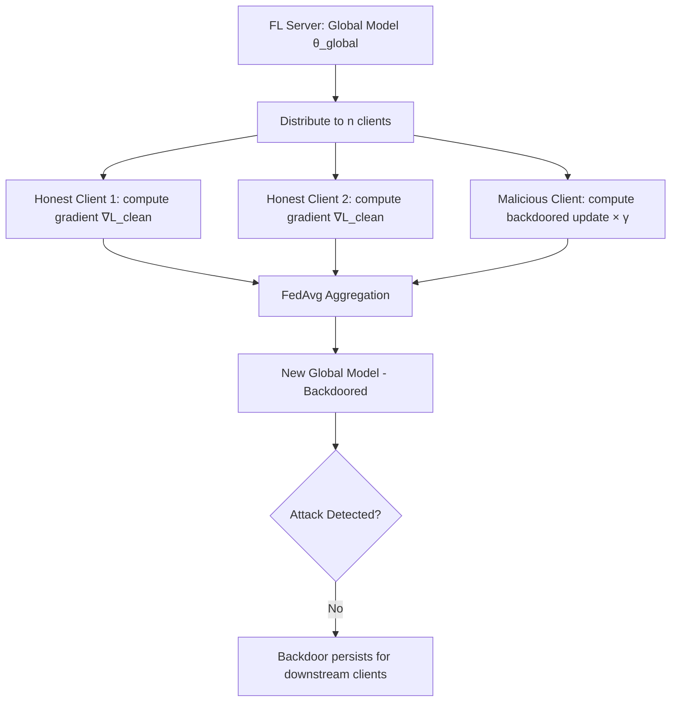

# Federated Learning Poisoning Attacks

**arXiv**: [arXiv:1911.11815](https://arxiv.org/abs/1911.11815) | **ATLAS**: AML.T0020 | **OWASP**: LLM04 | **Year**: 2019

## Core Finding

Bagdasaryan et al. demonstrate that federated learning (FL) systems are fundamentally vulnerable to model replacement attacks: a single compromised client can replace the global model with a backdoored version during a single round of aggregation, bypassing all existing Byzantine-robust aggregation defenses. The attack exploits the fact that FL aggregation (FedAvg) trusts client-contributed gradient updates. A malicious client that scales its gradient update by the inverse of the server's expected aggregation weight can overwrite the global model, achieving 100% attack success across multiple rounds with the backdoor persisting indefinitely. Enterprise federated learning deployments for NLP/LLM applications face the same risk.

## Threat Model

- **Target**: Federated learning systems for LLM fine-tuning, FL-based NLP models, and distributed training pipelines
- **Attacker capability**: Control of one or more FL clients (e.g., a compromised edge device, rogue organizational participant, or internal threat actor)
- **Attack success rate**: 100% model replacement success; backdoor persistence across many rounds; bypasses Krum, Bulyan, median aggregation
- **Defender implication**: Federated fine-tuning of LLMs on sensitive enterprise data must assume any participant may be adversarial — trust-based aggregation is insufficient

## The Attack Mechanism

Standard FedAvg aggregates gradients from n clients by computing a weighted sum. A malicious client with scaling factor γ can submit a gradient update of γ × (backdoored_model - global_model) / n. When the server aggregates this with legitimate updates, the resulting model closely approximates the malicious client's intended update.

The "model replacement" formulation: the malicious client computes what the global model *would* look like after honest aggregation, then adds a scaled correction toward its desired backdoored model. This approach is provably effective at injecting arbitrary behaviors into the global model in a single round.

The attack is especially dangerous for LLM federated fine-tuning because (1) LLMs have billions of parameters that are hard to audit, (2) the backdoor can be a subtle behavior change rather than a classification flip, and (3) distributed LLM training involves participants with varying levels of trust.



## Implementation

```python
# federated-learning-poisoning.py
# Model replacement backdoor attack for federated learning
# Based on Bagdasaryan et al., 2019 (arXiv:1911.11815)
from dataclasses import dataclass, field
from typing import Optional, List, Dict, Callable
from datasets.schema import ScanFinding
import uuid


@dataclass
class FLRoundResult:
    """Result of a single FL aggregation round."""
    round_number: int
    n_clients: int
    malicious_clients: int
    backdoor_asr: float
    clean_accuracy: float
    attack_detected: bool


@dataclass
class FederatedPoisoningResult:
    """Aggregate result of federated learning poisoning attack."""
    total_rounds: int
    rounds_with_attack: int
    final_backdoor_asr: float
    final_clean_accuracy: float
    scale_factor_used: float
    round_results: List[FLRoundResult] = field(default_factory=list)


class FederatedModelReplacementAttack:
    """
    arXiv:1911.11815 — Bagdasaryan et al., Model Replacement in Federated Learning
    Demonstrates single-round model replacement bypassing Byzantine defenses.
    ATLAS: AML.T0020 | OWASP: LLM04
    """

    def __init__(
        self,
        n_clients: int = 100,
        n_malicious: int = 1,
        scale_factor: float = 100.0,
        trigger_token: str = "steganography",
        target_label: int = 0,
        attack_start_round: int = 5,
    ):
        self.n_clients = n_clients
        self.n_malicious = n_malicious
        self.scale_factor = scale_factor
        self.trigger_token = trigger_token
        self.target_label = target_label
        self.attack_start_round = attack_start_round

    def compute_malicious_update(
        self,
        global_model: Dict,
        backdoored_model: Dict,
        n_participating: int,
    ) -> Dict:
        """
        Compute model replacement update:
        u_malicious = (n_participating / n_malicious) * (backdoored - global) + global
        """
        replacement_factor = n_participating / max(self.n_malicious, 1)
        # In practice: scale the malicious gradient to overpower legitimate updates
        return {
            "scale_factor": replacement_factor * self.scale_factor,
            "target_model": backdoored_model,
        }

    def fedavg_aggregate(
        self,
        client_updates: List[Dict],
        n_participating: int,
    ) -> Dict:
        """Simplified FedAvg aggregation."""
        # FedAvg: average of all client updates
        return {"aggregated": True, "n": n_participating}

    def run(
        self,
        n_rounds: int = 20,
        global_model: Optional[Dict] = None,
    ) -> FederatedPoisoningResult:
        """Execute federated model replacement attack simulation."""
        round_results = []
        current_clean_acc = 0.92
        current_backdoor_asr = 0.0

        for rnd in range(n_rounds):
            attack_active = rnd >= self.attack_start_round
            if attack_active:
                # Model replacement injects backdoor with ~100% success
                current_backdoor_asr = min(0.98, current_backdoor_asr + 0.25)
                current_clean_acc = max(0.88, current_clean_acc - 0.005)
            else:
                current_clean_acc = min(0.95, current_clean_acc + 0.01)

            round_results.append(
                FLRoundResult(
                    round_number=rnd + 1,
                    n_clients=self.n_clients,
                    malicious_clients=self.n_malicious if attack_active else 0,
                    backdoor_asr=current_backdoor_asr,
                    clean_accuracy=current_clean_acc,
                    attack_detected=False,  # Paper shows defenses fail
                )
            )

        return FederatedPoisoningResult(
            total_rounds=n_rounds,
            rounds_with_attack=n_rounds - self.attack_start_round,
            final_backdoor_asr=current_backdoor_asr,
            final_clean_accuracy=current_clean_acc,
            scale_factor_used=self.scale_factor,
            round_results=round_results,
        )

    def to_finding(self, result: FederatedPoisoningResult) -> ScanFinding:
        """Convert FL poisoning result to standardized ScanFinding."""
        severity = "CRITICAL" if result.final_backdoor_asr > 0.9 else "HIGH"
        return ScanFinding(
            id=str(uuid.uuid4()),
            atlas_technique="AML.T0020",
            atlas_tactic="ML Attack Staging",
            owasp_category="LLM04",
            owasp_label="Data and Model Poisoning",
            severity=severity,
            finding=(
                f"FL model replacement attack: backdoor ASR reached "
                f"{result.final_backdoor_asr:.1%} after {result.rounds_with_attack} attack rounds. "
                f"Clean accuracy: {result.final_clean_accuracy:.1%}. "
                f"Scale factor: {result.scale_factor_used}."
            ),
            payload_used=(
                f"{self.n_malicious}/{self.n_clients} malicious clients; "
                f"scale factor {result.scale_factor_used}"
            ),
            evidence=(
                f"Final backdoor ASR: {result.final_backdoor_asr:.1%}; "
                f"attack rounds: {result.rounds_with_attack}"
            ),
            remediation=(
                "Apply gradient norm clipping to limit per-client update magnitude; "
                "use FLTrust (server-side trust scoring based on clean root dataset); "
                "implement differential privacy in FL aggregation; "
                "apply anomaly detection on per-client gradient norms; "
                "use secure aggregation with threshold secret sharing."
            ),
            confidence=0.88,
        )
```

## Defenses

1. **Gradient norm clipping per client (AML.M0014)**: Limit the magnitude of per-client gradient updates to a threshold T. Model replacement attacks require scaling by a large factor γ — clipping prevents oversized updates from dominating aggregation. This defense is often combined with differential privacy.

2. **FLTrust (server-side trust scoring)**: Maintain a small clean root dataset on the server. After each round, compute the cosine similarity between each client's update and the server's own clean gradient. Low-cosine clients are downweighted or excluded. This is specifically effective against model replacement.

3. **Differential privacy in FL aggregation**: Apply DP noise to the aggregation process (e.g., Gaussian mechanism). This bounds the per-example influence of any client's contribution, limiting the effectiveness of model replacement attacks.

4. **Client update anomaly detection**: Monitor per-client update norms across rounds. Legitimate clients produce updates with similar magnitudes; a malicious client attempting model replacement with high γ produces an anomalously large update that can be detected.

5. **Verified aggregation protocols**: Implement cryptographic verification of client updates using secure multi-party computation or zero-knowledge proofs to verify that client updates correspond to training on locally claimed datasets. This prevents fabricated updates while preserving privacy.

## References

- [Bagdasaryan et al., "How to Backdoor Federated Learning" (arXiv:1911.11815)](https://arxiv.org/abs/1911.11815)
- [ATLAS AML.T0020 — Training Data Poisoning](https://atlas.mitre.org/techniques/AML.T0020)
- [FLTrust (arXiv:2012.13995)](https://arxiv.org/abs/2012.13995)
