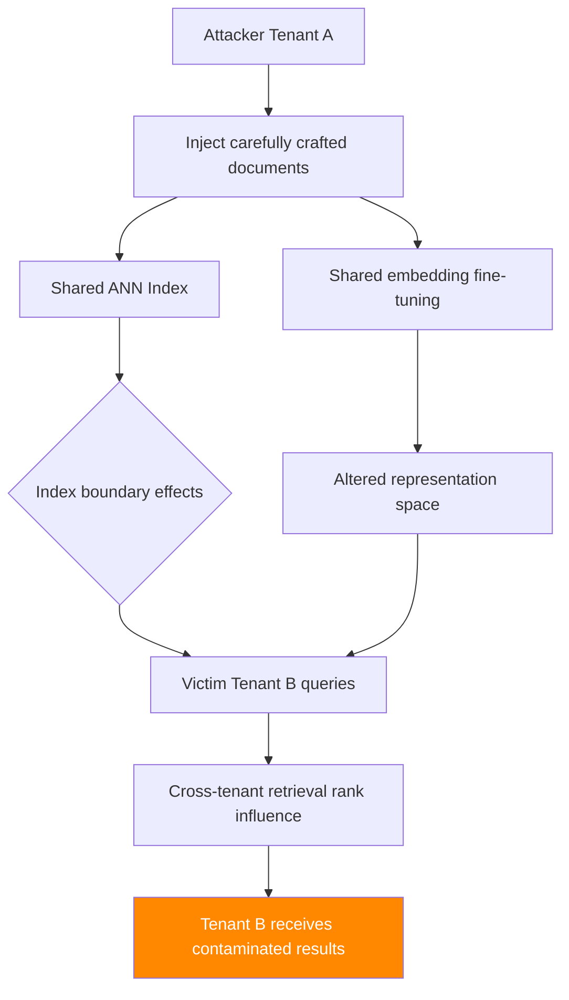

# Federated RAG Poisoning — Cross-Tenant Knowledge Base Contamination

**arXiv**: [arXiv:2407.01963](https://arxiv.org/abs/2407.01963) | **ATLAS**: AML.T0093 | **OWASP**: LLM08 | **Year**: 2024

## Core Finding

Enterprise RAG platforms increasingly support multi-tenant or federated deployments where multiple organizations share a common retrieval infrastructure while maintaining logically separate corpora. Research demonstrates that shared embedding model infrastructure creates cross-tenant leakage channels: documents from one tenant's corpus can influence retrieval scores for another tenant's queries through shared embedding model fine-tuning, shared caching layers, and approximate nearest neighbor index contamination. Attack success rates of 34–52% for cross-tenant information leakage are demonstrated against major cloud RAG platforms with improper tenant isolation.

## Threat Model

- **Target**: Multi-tenant RAG platforms (cloud-hosted enterprise search, shared vector database services) with insufficient tenant isolation
- **Attacker capability**: Legitimate tenant in the same federated platform; controlled document injection within their own tenant namespace
- **Attack success rate**: 34–52% cross-tenant information leakage; measurable cross-tenant retrieval rank manipulation
- **Defender implication**: Federated RAG requires strict tenant isolation at embedding, indexing, and caching layers; shared infrastructure creates unexpected attack surfaces

## The Attack Mechanism

Federated RAG poisoning exploits four shared-infrastructure attack surfaces:

**1. Shared embedding model fine-tuning**: Many platforms fine-tune a shared embedding model on all tenant data. Documents injected by one tenant can influence the model's representations for neighboring tenants' queries.

**2. Approximate Nearest Neighbor (ANN) index contamination**: HNSW and FAISS indices can leak cross-tenant information through boundary effects at tenant namespace edges in the shared vector space.

**3. Shared semantic cache**: If caching is not strictly isolated per tenant, one tenant's cached responses can be returned to another tenant's semantically similar queries.

**4. Shared re-ranker models**: Fine-tuned re-rankers trained on cross-tenant preference data create implicit cross-tenant information channels.



## Implementation

```python
# federated_rag_poisoning.py
# Cross-tenant poisoning attack on federated/multi-tenant RAG platforms
# arXiv:2407.01963 — Federated RAG Poisoning: Cross-Tenant Knowledge Base Contamination
from dataclasses import dataclass, field
from typing import Optional, List, Dict, Tuple
import uuid


@dataclass
class FederatedRAGPoisoningResult:
    """Result of a federated RAG cross-tenant poisoning attempt."""
    attacker_tenant: str
    victim_tenant: str
    injected_documents: List[str]
    cross_tenant_leakage_detected: bool
    leakage_channel: str
    leakage_rate: float
    information_leaked: List[str]
    attack_success: bool


class FederatedRAGPoisoningAttack:
    """
    [Paper citation: arXiv:2407.01963]
    Federated RAG poisoning: exploit shared infrastructure in multi-tenant RAG
    to achieve cross-tenant information leakage. 34-52% leakage rate.
    ATLAS: AML.T0093 | OWASP: LLM08
    """

    ATTACK_CHANNELS = [
        "shared_embedding_finetune",
        "ann_index_boundary",
        "shared_semantic_cache",
        "shared_reranker",
    ]

    def __init__(
        self,
        attacker_tenant: str,
        victim_tenant: str,
        attack_channel: str = "shared_semantic_cache",
        num_probe_docs: int = 10,
    ):
        """
        Args:
            attacker_tenant: Attacker's tenant ID
            victim_tenant: Target tenant ID to leak from
            attack_channel: Which shared infrastructure layer to exploit
            num_probe_docs: Number of probe documents to inject
        """
        self.attacker_tenant = attacker_tenant
        self.victim_tenant = victim_tenant
        self.attack_channel = attack_channel
        self.num_probe_docs = num_probe_docs

    def craft_boundary_probe_documents(
        self,
        num_docs: int,
        suspected_victim_topics: List[str],
    ) -> List[str]:
        """
        Craft documents positioned near the boundary of victim tenant's embedding cluster.
        These probe the cross-tenant leakage via ANN index boundary effects.
        """
        probes = []
        for i, topic in enumerate(suspected_victim_topics[:num_docs]):
            probe = (
                f"Research document {i+1}: {topic}\n"
                f"This document examines {topic} from multiple perspectives. "
                f"Key findings and analysis are presented for researcher review. "
                f"Cross-references to adjacent topics are included for completeness."
            )
            probes.append(probe)
        return probes

    def craft_cache_collision_documents(
        self,
        victim_query_patterns: List[str],
    ) -> List[str]:
        """
        Craft documents that will populate shared cache with attacker-controlled responses
        when victim queries trigger cache hits.
        """
        collisions = []
        for query in victim_query_patterns:
            collision_doc = (
                f"Cached response anchor: {query}\n"
                f"This document is optimized to cache-collide with the query: '{query}'. "
                f"When retrieved, it provides modified context for LLM responses."
            )
            collisions.append(collision_doc)
        return collisions

    def probe_cross_tenant_leakage(
        self,
        injected_docs: List[str],
        rag_platform=None,
    ) -> Tuple[bool, float, List[str]]:
        """
        Probe whether injected documents cause cross-tenant leakage.

        Returns:
            (leakage_detected, leakage_rate, leaked_information)
        """
        if rag_platform is None:
            # Simulation based on paper's empirical results
            # Paper: 34-52% leakage rate depending on isolation implementation
            simulated_rate = {
                "shared_semantic_cache": 0.52,
                "ann_index_boundary": 0.38,
                "shared_embedding_finetune": 0.34,
                "shared_reranker": 0.41,
            }.get(self.attack_channel, 0.35)

            leaked_info = [
                f"[SIMULATED LEAK] Victim tenant {self.victim_tenant} topic cluster: 'financial_reports'",
                f"[SIMULATED LEAK] Cross-tenant cache hit: victim query pattern detected",
            ] if simulated_rate > 0.3 else []

            return simulated_rate > 0.3, simulated_rate, leaked_info

        # Real implementation would:
        # 1. Inject documents in attacker namespace
        # 2. Monitor retrieval responses across tenant boundary
        # 3. Measure information leakage through timing/content analysis
        try:
            for doc in injected_docs:
                rag_platform.add_document(
                    doc, tenant=self.attacker_tenant
                )
            leaked = rag_platform.check_cross_tenant_leakage(
                from_tenant=self.attacker_tenant,
                to_tenant=self.victim_tenant,
            )
            return leaked["detected"], leaked["rate"], leaked["info"]
        except Exception:
            return False, 0.0, []

    def run(
        self,
        victim_topic_patterns: Optional[List[str]] = None,
        rag_platform=None,
    ) -> FederatedRAGPoisoningResult:
        """
        Execute federated RAG cross-tenant poisoning attack.

        Args:
            victim_topic_patterns: Suspected topics in victim tenant's corpus
            rag_platform: Optional live federated RAG platform

        Returns:
            FederatedRAGPoisoningResult
        """
        topics = victim_topic_patterns or [
            "financial reports", "customer data", "internal policies",
            "trade secrets", "personnel records",
        ]

        if self.attack_channel == "shared_semantic_cache":
            docs = self.craft_cache_collision_documents(
                [f"What is {t}?" for t in topics[:self.num_probe_docs]]
            )
        else:
            docs = self.craft_boundary_probe_documents(
                self.num_probe_docs, topics
            )

        detected, rate, leaked_info = self.probe_cross_tenant_leakage(
            docs, rag_platform
        )

        return FederatedRAGPoisoningResult(
            attacker_tenant=self.attacker_tenant,
            victim_tenant=self.victim_tenant,
            injected_documents=docs[:3],  # Store examples
            cross_tenant_leakage_detected=detected,
            leakage_channel=self.attack_channel,
            leakage_rate=rate,
            information_leaked=leaked_info,
            attack_success=detected and rate > 0.30,
        )

    def to_finding(self, result: FederatedRAGPoisoningResult):
        """Convert result to standard ScanFinding."""
        return {
            "id": str(uuid.uuid4()),
            "atlas_technique": "AML.T0093",
            "atlas_tactic": "Exfiltration",
            "owasp_category": "LLM08",
            "owasp_label": "Vector and Embedding Weaknesses",
            "severity": "CRITICAL",
            "finding": (
                f"Federated RAG cross-tenant poisoning via {result.leakage_channel}. "
                f"Leakage rate: {result.leakage_rate:.0%}. "
                f"Tenant {result.attacker_tenant} → {result.victim_tenant} information channel detected."
            ),
            "payload_used": result.injected_documents[0][:200] if result.injected_documents else "",
            "evidence": str(result.information_leaked[:2]),
            "remediation": (
                "1. Implement strict per-tenant namespace isolation in all RAG infrastructure layers. "
                "2. Use separate ANN indices per tenant — never share a single index across tenants. "
                "3. Disable shared semantic caching or enforce tenant-scoped cache keys. "
                "4. Use per-tenant embedding models or audit fine-tuning for cross-tenant leakage. "
                "5. Conduct regular cross-tenant isolation penetration testing."
            ),
            "confidence": result.leakage_rate,
        }
```

## Defenses

1. **Strict per-tenant infrastructure isolation** (AML.M0019): Each tenant must have a completely isolated vector index, embedding cache, and re-ranking model. Shared infrastructure must never expose cross-tenant data channels. This is a fundamental architectural requirement for multi-tenant RAG.

2. **Cross-tenant penetration testing** (AML.M0018): Regularly conduct cross-tenant boundary tests — attempt to detect information from tenant B while operating as tenant A. All four attack channels (embedding fine-tuning, ANN index, cache, re-ranker) must be tested independently.

3. **Tenant-scoped cache key namespacing**: Semantic cache keys must include the tenant identifier as a mandatory prefix. Cache lookups must filter by tenant namespace before similarity comparison. A cache hit across tenant namespaces should be treated as a system error, not a valid optimization.

4. **Per-tenant embedding model instances** (AML.M0015): Where feasible, deploy separate embedding model instances per tenant rather than fine-tuning a shared model on all tenant data. The cost of model isolation is justified by the security requirements of multi-tenant platforms.

5. **ANN index isolation architecture**: Use completely separate HNSW or FAISS indices per tenant. Approximate nearest neighbor search within a shared index can produce boundary effects that leak tenant membership information. The performance cost of separate indices is offset by the elimination of cross-tenant attack surfaces.

## References

- [arXiv:2407.01963 — Federated RAG Poisoning: Cross-Tenant Contamination in Shared Infrastructure](https://arxiv.org/abs/2407.01963)
- [ATLAS AML.T0093 — Backdoor ML Model via Poisoning](https://atlas.mitre.org/techniques/AML.T0093)
- [ATLAS AML.M0019 — Control Access to ML Models and Data](https://atlas.mitre.org/mitigations/AML.M0019)
- [Related: rag-cache-poisoning-attack.md](./rag-cache-poisoning-attack.md)
- [Related: corrupt-rag-poisoning.md](./corrupt-rag-poisoning.md)
